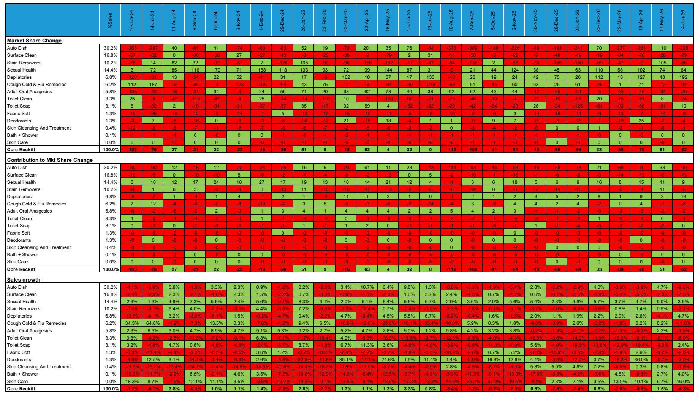
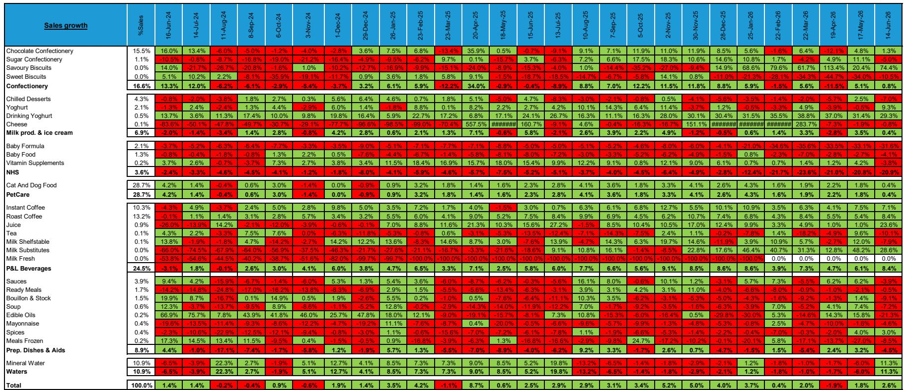
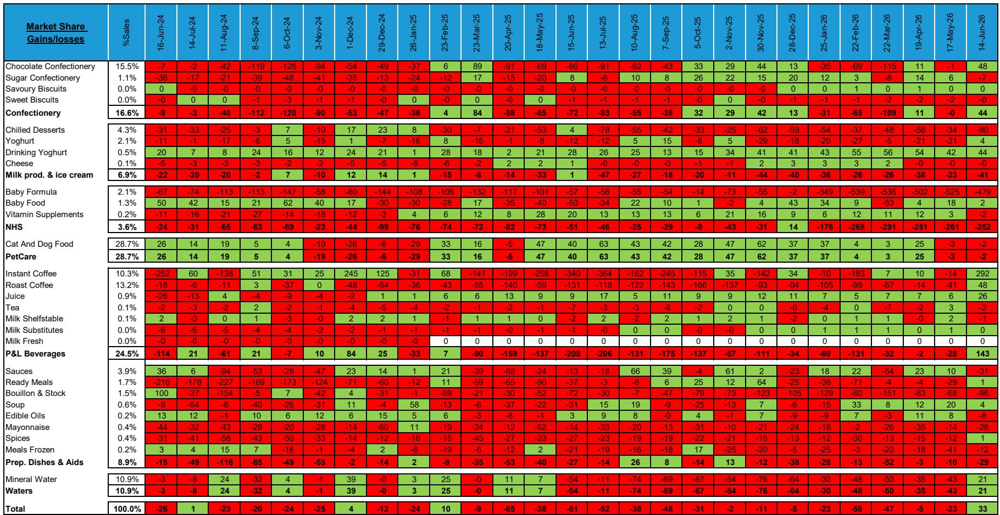

# Bernstein：西欧食品与家庭护理节奏变化，美妆保持韧性

西欧消费品市场正在经历一次明显的结构性分化。Bernstein最新发布的西欧扫描仪数据（截至6月14日的四周）显示，食品、家庭护理和消费者健康三大品类增速集体节奏变化，唯独美妆个护板块逆势加速，价值增速从3.6%提升至4.1%。这组数据揭示了一个关键信号：在通胀退潮、消费者趋于理性的环境下，不同品类的定价权和需求韧性正在拉开差距。

报告覆盖了西欧九大市场（法国、德国、意大利、西班牙、英国、荷兰、比利时、葡萄牙和奥地利），追踪37个食品品类、17个美妆个护品类、9个家庭护理品类和4个消费者健康品类的销售、销量、定价及市场份额变化。数据来源为NielsenIQ，主要覆盖杂货、便利店和药房渠道，因此对部分依赖其他渠道的公司可能存在统计偏差。

食品市场价值增速从4.2%降至1.9%，销量增速从2.4%降至0.5%。消费者健康市场更从5.0%的正增长直接进入-1.3%的区间，销量从3.4%降至-4.6%。家庭护理延续调整态势，价值增速为-0.7%。这三个品类共同指向一个事实：消费者正在调整支出结构，或者转向性价比更高的选择。

> **KC评论：** 消费者健康品类的销量变化尤其值得关注。报告提到Haleon在该品类中销量从+2.1%降至-3.3%，但价格/组合却从+0.3%升至+3.1%。这暗示品牌正在用提价弥补销量变化，但消费者可能转向了自有品牌或调整购买习惯。

## 1. 美妆个护的韧性来自销量驱动，而非涨价

美妆个护是相对少见一个价值增速还在加速的板块，从3.6%提升至4.1%。更关键的是，这一增长完全由销量驱动：销量增速维持在4.7%的高位，而价格/组合仍为-0.6%。这意味着消费者并没有因为价格下降而囤货，而是主动增加了购买频次或品类消费。这与食品和家庭护理形成鲜明对比——后两者的销量增速已接近零甚至为负。

Bernstein认为，美妆个护的韧性可能反映了消费者在特定环境下的支出转移：当整体消费环境趋紧时，小额、高频、能带来即时满足感的品类反而受益。L'Oréal的表现印证了这一点，其价值增速从5.1%提升至5.6%，销量从4.3%加速至5.2%，市场份额继续扩大。

## 2. 雀巢和达能靠销量恢复走出调整，联合利华和利洁时仍在调整

公司层面的表现进一步验证了分化。雀巢价值增速从1.8%提升至2.6%，销量从0.9%反弹至3.3%，市场份额从-23个基点扭转为+33个基点。达能同样亮眼，价值增速从1.5%升至4.5%，销量从1.2%加速至3.3%。这两家公司的共同点是：它们正在用销量恢复来弥补价格/组合的节奏变化，而不是依赖提价。

反观联合利华，价值增速从-0.1%进一步降至-1.5%，销量从-3.8%小幅改善至-2.6%，但仍为负值。利洁时变化更明显，价值增速从1.5%降至-4.3%，销量从1.0%降至-6.5%，市场份额流失62个基点。汉高延续调整态势，价值增速为-3.0%，市场份额持续变化。这三家公司的问题出在销量端——消费者正在调整选择。

> **KC评论：** 雀巢和达能的销量恢复并非偶然。报告显示，雀巢在速溶咖啡品类中市场份额大幅改善，达能则在多个品类中销量加速。这说明在通胀退潮期，能够提供明确价值主张（而非单纯降价）的品牌更容易赢得消费者。联合利华和利洁时的问题可能在于，它们的产品组合中缺乏这种“必选消费”属性。

## 3. 一个可复用的观察框架：区分“销量驱动”和“价格驱动”的增长质量

这份报告提供了一个实用的分析框架：判断一家消费品公司的增长质量，不能只看价值增速，更要看价值增速的构成——是销量驱动还是价格驱动。

销量驱动的增长意味着消费者主动选择购买更多，这通常反映品牌力、产品力和渠道覆盖的改善。价格驱动的增长则可能掩盖销量变化的不确定性，尤其是在通胀退潮期，消费者对提价的容忍度会迅速下降。Bernstein的数据显示，Haleon和利洁时正是后者的典型——它们通过提价维持了价值增速，但销量大幅变化，最终价值增速也未能守住。

对于读者和产业决策者而言，这个框架可以帮助识别哪些公司真正具备抗周期能力。美妆个护板块的销量韧性、雀巢和达能的销量恢复，都指向一个共同特征：这些品牌在各自品类中建立了难以替代的消费者认知。而联合利华、利洁时和汉高的变化则提醒我们，当消费者开始调整选择时，单纯的提价策略可能带来其他影响。

For informational purposes only. Portions may be generated,translated,summarized,or edited with AI assistance based on source materials and may contain omissions or errors. Please verify independently. This is not investment,legal,tax,accounting,or other professional advice.

For informational purposes only. Portions may be generated,translated,summarized,or edited with AI assistance based on source materials and may contain omissions or errors. Please verify independently. This is not investment,legal,tax,accounting,or other professional advice.

