# Global Fund Manager Survey

# Pain trades: duration, dividend, defensives

## BofA July Global Fund Manager Survey

Bottom line: investor sentiment more bullish driven by optimism on macro "boom", AI capex, dovish Fed; FMS cash levels fall from 4.1% to 3.6%, US equity OW biggest since Dec'24, as forecasts for "boom" highest since Feb'22; BofA Bull & Bear Indicator @ reading of 9.4... suggests reduce equity & high-beta exposure, summer upside for risk assets to remain stymied by bull positioning.

FMS on Macro: record 54% predict no landing for economy (39% soft & 2% hard), CPI expectations lowest since Jan'25 as FMS oil price forecast adjusts from \$86/bbl to \$71/bbl; asked will Fed hike before midterms 83% say no, i.e. Fed stays dovish; outcome of US midterms... 44% say DEM House/GOP Senate, followed by DEM sweep (27%).

FMS on AI: investors say long global semis most crowded trade (82% - Chart 1) & AI hyperscaler capex most likely source of credit event (48%), trimmed July tech longs to hedge AI risks; but no one short... asked if AI stocks in bubble 48% said no (vs. 43% yes), asked if an AI hyperscaler will announce a capex cut... 61% said no (vs. 28% yes).

FMS on AA: investors adding to equity length via US, Eurozone, healthcare, industrials (most OW since Jul'21), cutting UK (most UW since Aug'20), EM, commodities, energy (largest drop since Jun'10), staples (most UW since Feb'14); note first time since May'17 investors predict low-dividend yield stocks to outperform high-dividend yielders.

FMS Contrarian Trades: based on extreme FMS positions best contrarian trades for a surprise hawkish Fed = long staples & gold, short semis & healthcare, and for "peak boom" = long bonds, UK & high dividend yielders, short industrials & banks.

Chart 1: 82% of FMS investors say "long global semiconductors" is world's most crowded trade. What do you think is currently the most crowded trade?

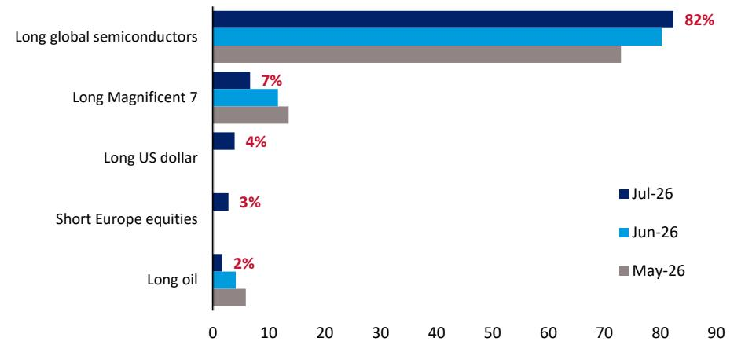  
Source: BofA Global Fund Manager Survey  
BofA GLOBAL RESEARCH

Trading ideas and investment strategies discussed herein may give rise to significant risk and are not suitable for all investors. Investors should have experience in relevant markets and the financial resources to absorb any losses arising from applying these ideas or strategies.
BofA does and seeks to do business with issuers covered in its research reports. As a result, investors should be aware that the firm may have a conflict of interest that could affect the objectivity of this report. Investors should consider this report as only a single factor in making their investment decision.
Refer to important disclosures on page 24 to 26.
12993843

## 14 July 2026

Investment Strategy
Global

## BofA Data Analytics

## Michael Hartnett

Investment Strategist
BofAS
+1 646 855 1508
michael.hartnett@bofa.com

## Anya Shelekhin

Aanya shelekhin
Investment Strategist
BofAS
+1 646 855 3753
anya.shelekhin@bofa.com

## Myung-Jee Jung

myung-jee.jung
Investment Strategist
BofAS
+1 646 855 0389
myung-jee.jung@bofa.com

Jessica Guo
Investment Strategist
BofAS
+1 646 855 0033
jessica.guo@bofa.com

## Notes to Readers

Source for all tables and charts: BofA Fund Manager Survey, DataStream

Survey period July 2 $^{nd}$ to 9 $^{th}$ , 2026

210 panellists with \$555bn AUM participated in the survey. 181 participants with \$484bn AUM responded to the Global FMS questions and 109 participants with \$274bn AUM responded to the Regional FMS questions.

## How to join the FMS panel

Investors/clients are encouraged to sign up to participate in the Survey. This can be done by contacting Michael Hartnett or your BofA sales representative.

Participants in the survey will continue to receive the full set of monthly results but only for the relevant month in which they participate.

OW: overweight; UW: underweight

AA: asset allocation

## Charts of the Month

Chart 2: BofA Global FMS investor sentiment most bullish since Feb'26
Percentile rank of FMS growth expectations, cash level, and equity allocation  
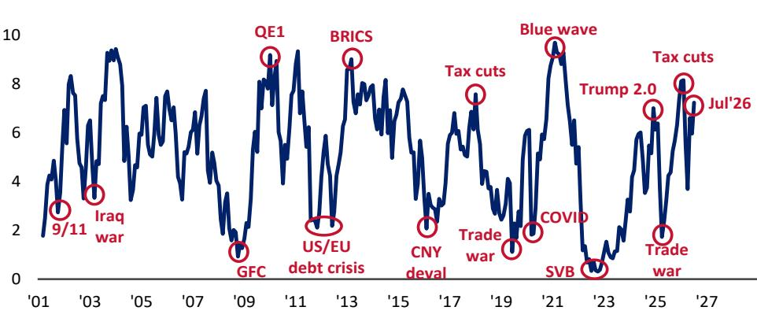  
Percentile rank of FMS growth expectations + cash AA + equity AA (scale 1-10)  
Source: BofA Global Fund Manager Survey  
BofA GLOBAL RESEARCH

July BofA Global FMS shows investors are the most bullish since Feb'26; our broadest measure of FMS sentiment, based on cash levels, equity allocation, and global growth expectations, rose to 7.2 from 6.0.

Chart 3: Cash level falls to 3.6% from 4.1%
BofA FMS average cash level (% of AUM)  
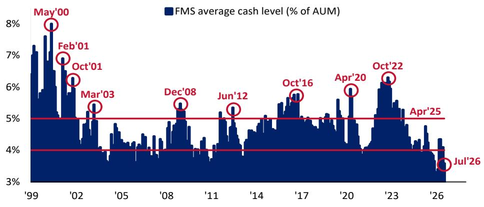  
Source: BofA Global Fund Manager Survey  
BofA GLOBAL RESEARCH

BofA FMS cash level dropped from 4.1% to 3.6% of AUM (lowest since Feb'26), triggering a signal on the BofA Global FMS Cash Rule.

Table 1: On past occasions of FMS cash 3.6% or lower... stocks -1% in two weeks that followed Average returns for MSCI ACWI & US Treasuries in 1wk/2mo after certain FMS cash levels

<table><tr><td rowspan="2">FMS cash %</td><td rowspan="2"># of signals since 2002</td><td colspan="2">Global equities</td><td colspan="2">Treasuries</td></tr><tr><td>2 weeks</td><td>1 month</td><td>2 weeks</td><td>1 month</td></tr><tr><td>3.5</td><td>11</td><td>-1.1%</td><td>-1.5%</td><td>0.6%</td><td>0.6%</td></tr><tr><td>3.6</td><td>16</td><td>-0.8%</td><td>-0.5%</td><td>0.6%</td><td>0.4%</td></tr><tr><td>3.7</td><td>24</td><td>-0.5%</td><td>0.1%</td><td>0.5%</td><td>0.4%</td></tr><tr><td>3.8</td><td>39</td><td>-0.1%</td><td>0.5%</td><td>0.3%</td><td>0.1%</td></tr><tr><td>3.9</td><td>57</td><td>-0.1%</td><td>0.6%</td><td>0.2%</td><td>0.1%</td></tr><tr><td>4.0</td><td>71</td><td>0.1%</td><td>0.3%</td><td>0.3%</td><td>0.3%</td></tr></table>

Source: BofA Global Fund Manager Survey, Bloomberg

Note FMS cash level fell to 3.6% or lower in 16 prior instances since 2002... on average, stocks fell 1% in the two weeks after (-0.5% in the month after) and Treasuries outperformed.

Chart 4: 54% say "no landing," 39% say "soft landing," 2% say "hard landing" What is the most likely outcome for the global economy in the next 12 months?  
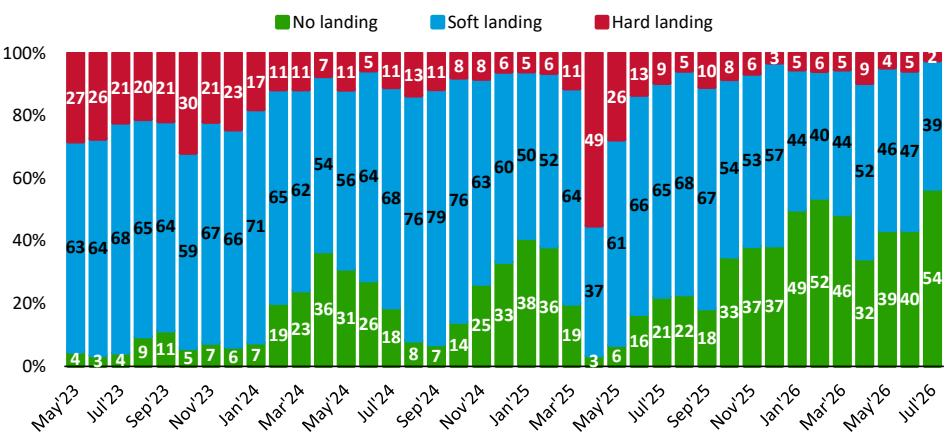  
Source: BofA Global Fund Manager Survey  
BofA GLOBAL RESEARCH

Chart 5: Global growth expectations rise to 5-month high
Net % expect stronger global economy and S&P 500 (YoY %)  
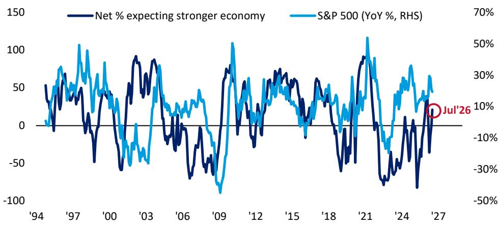  
Source: BofA Global Fund Manager Survey, Bloomberg  
BofA GLOBAL RESEARCH

Chart 6: Consensus flip from higher to lower inflation tempering rate hike expectations
Net % expecting higher global CPI and net % expecting higher short-term rates  
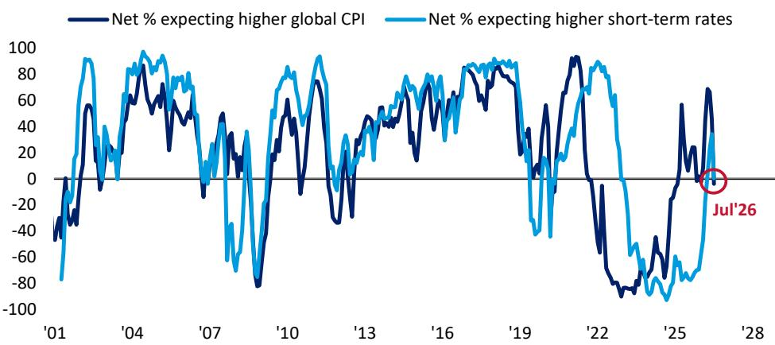  
Source: BofA Global Fund Manager Survey  
BofA GLOBAL RESEARCH

Asked what the most likely outcome for the global economy is in the next 12 months...

A record 54% of investors expect "no landing".

Another 39% expect a "soft landing," while a record-low 2% expect a "hard landing."

Global growth optimism rose to a 5-month high in July... net 21% expect a stronger economy.

Macro expectations are catching up to US equity performance.

On inflation... net 4% of July FMS investors expect lower global inflation, a big flip from last month when net 45% expected higher inflation.

The outlook on rates fell alongside the CPI outlook... net 1% expect higher short-term rates, down from 34%.

Chart 7: FMS oil forecast drops to \$71/bbl by end '26 (from \$86)
In which of the following ranges do you expect the price of oil to trade in by year-end 2026?  
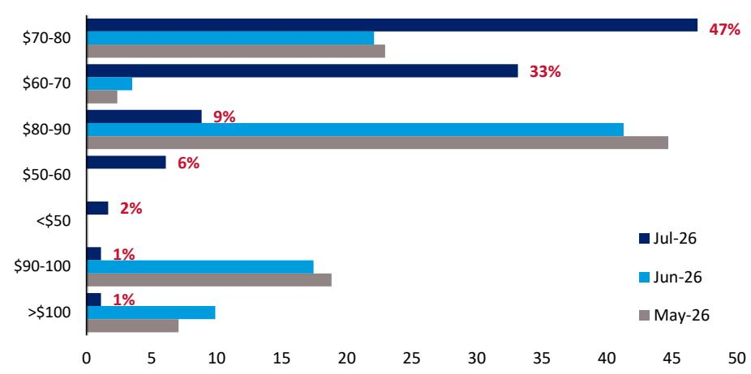  
Source: BofA Global Fund Manager Survey

Chart 8: $83\%$ say no Fed hike before November midterm election Will the Fed hike before the November US midterms?  
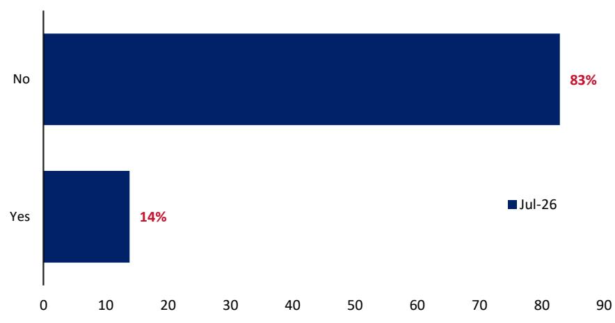  
Source: BofA Global Fund Manager Survey

Chart 9: 44% expect DEM House/GOP Senate post-midterms, 27% say DEM sweep What outcome do you expect from the 2026 US midterm elections?  
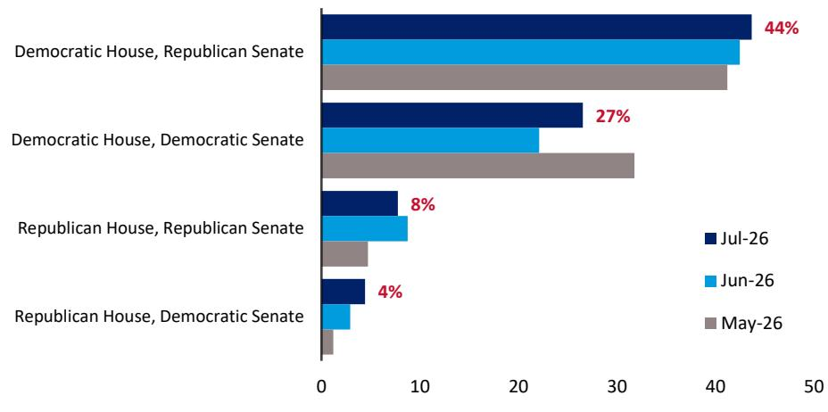  
Source: BofA Global Fund Manager Survey  
BofA GLOBAL RESEARCH

Inflation expectations were lowered as FMS end-year oil price forecast adjusted 17% from \$86/bbl in June (on a weighted-average basis) to \$71/bbl.

Just 2% of investors expect oil to trade above \$90/bbl.

On policy... asked whether the Fed will hike before US midterms, 83% said no (14% said yes).

Separately when asked how the Fed will change the Fed Funds rate in the next year, just 36% said they expected at least one hike and 29% expect no change.

On the US midterm elections (Republicans currently hold majorities in both the House and Senate)...

Expectations for a DEM sweep (Democratic House & Democratic Senate) rose to 27% from 22%, but FMS investors say the most likely outcome is a split Democratic House & Republican Senate (44%).

Chart 10: 61% of FMS say no hyperscaler capex cut in '26
Will one of the AI hyperscalers announce a cut in capex in 2026?  
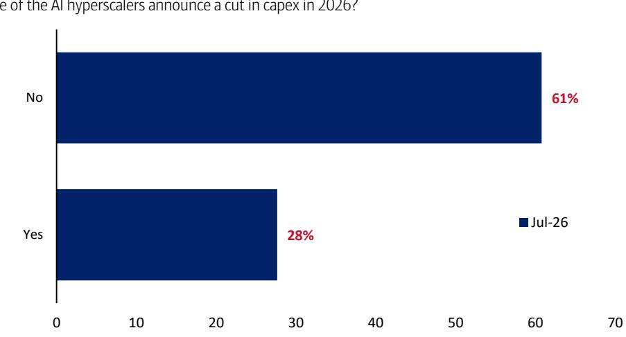  
Source: BofA Global Fund Manager Survey  
A greater share of FMS investors also continue to believe that AI stocks are not in a bubble (48% vs the 43% that say "yes").

Chart 11: 48% of FMS investors think no AI bubble (vs 43% yes)
Do you think that AI stocks are in a bubble?  
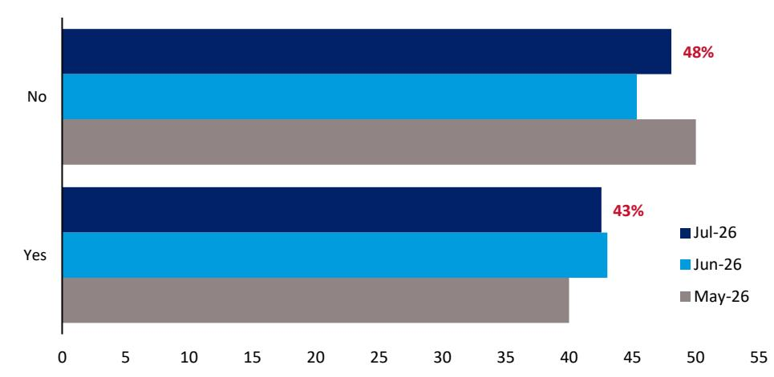  
Source: BofA Global Fund Manager Survey

FMS investors also remain positive on the outlook for AI... asked if one of the AI hyperscalers would announce a cut in capex in 2026, the majority (61%) of FMS investors expect no cut to hyperscaler capex (vs 28% "yes").

Chart 12: 45% of FMS investors say AI bubble is the biggest tail risk
What do you consider the biggest 'tail risk'?  
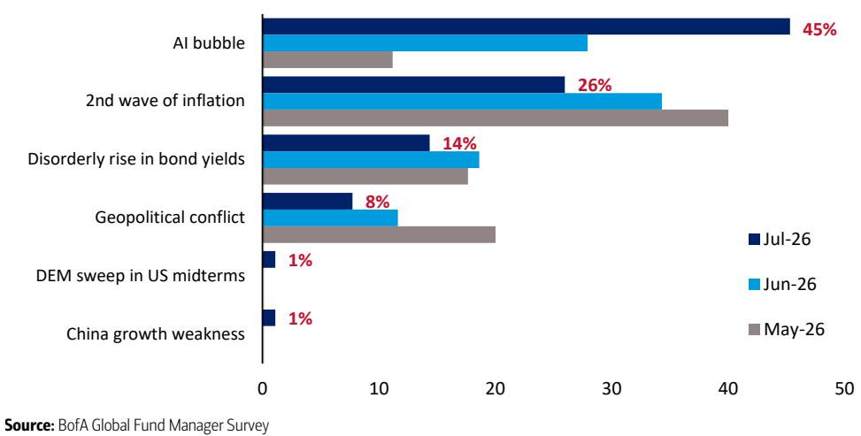  
BofA GLOBAL RESEARCH

"AI bubble" rose to the top spot for the biggest tail risk in July per 45% of FMS investors (up from 28% last month).

In June, the #1 perceived tail risk was '2 $^{nd}$ wave inflation'... this has dropped to #2 (26% of investors, from 34%).

BofA GLOBAL RESEARCH

Chart 13: AI hyperscaler capex = #1 most likely source of a systemic credit event
What is the most likely source of a systemic credit event?  
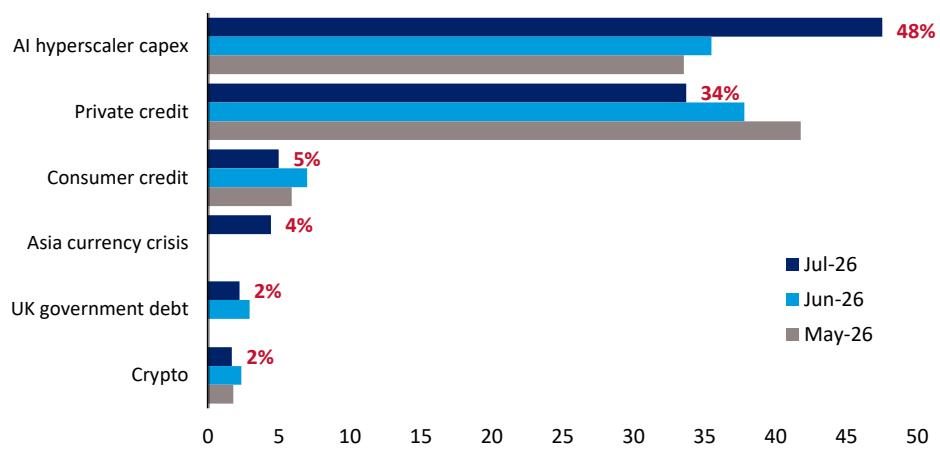  
Source: BofA Global Fund Manager Survey  
BofA GLOBAL RESEARCH

Chart 14: Gold deemed most undervalued since Mar'23
Net % say gold is overvalued  
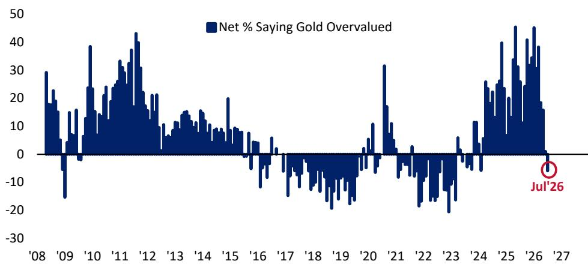  
Source: BofA Global Fund Manager Survey

Chart 15: FMS investors most OW US equities since Dec'24
Net % overweight US equities  
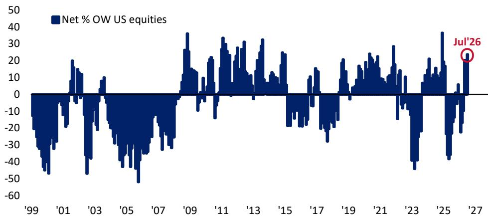  
Source: BofA Global Fund Manager Survey

July also saw 48% of FMS investors say that 'AI hyperscaler capex' is the most likely source of a systemic credit event, followed by 34% 'private credit.'

Asked about the current price of gold, net 6% of FMS investors say gold is undervalued (most undervalued since Mar'23).

## On asset allocation...

FMS investors increased their overweight in US equities to net 24% OW, the biggest OW since Dec'24 and the 3 $^{rd}$ highest US weighting in the past 5 years.

Chart 16: FMS investors most UW UK equities since Aug'20
Net % overweight UK equities  
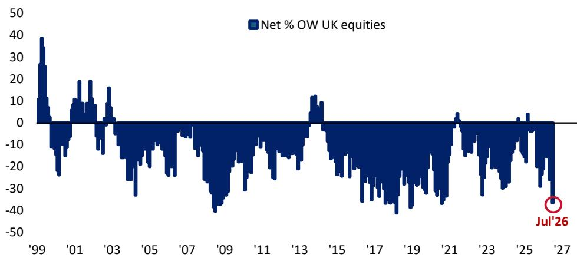  
On the other hand, FMS investors further reduced their allocation to UK equities to net 37% UW, the lowest allocation since Aug'20.  
Source: BofA Global Fund Manager Survey  
BofA GLOBAL RESEARCH

Chart 17: Lowest FMS allocation to consumer stocks since May'06
Net % OW staples + net % OW discretionary  
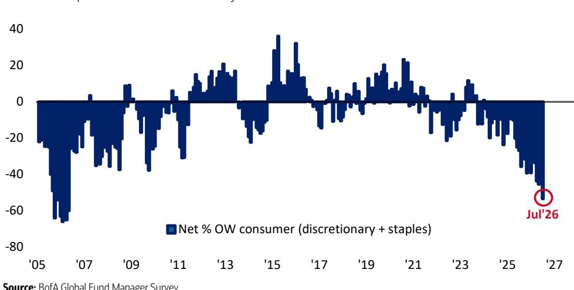  
Source: BofA Global Fund Manager Survey  
On sector allocation...  
FMS investors were net 53% underweight consumer sectors (staples + discretionary), the lowest allocation since May'06.  
For the first time since May'17, FMS investors expect low-dividend yield stocks to outperform high-dividend yield stocks.

Chart 18: FMS says low-dividend yield > high-dividend yield for first time since May'17
Net % think high dividend yield will outperform vs low dividend yield stocks

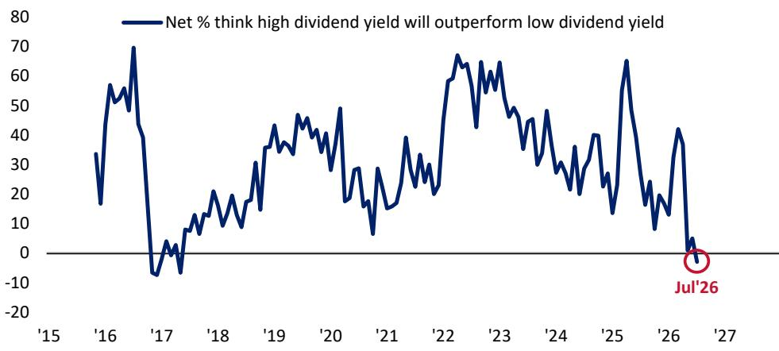  
Source: BofA Global Fund Manager Survey  
BofA GLOBAL RESEARCH

BofA GLOBAL RESEARCH

Chart 19: July rotation into healthcare, EU and bonds vs out of energy, commodities and UK Monthly change in FMS investor positioning  
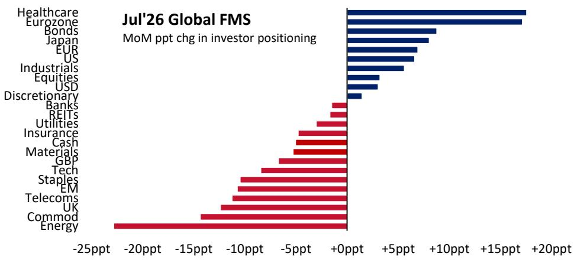  
Source: BofA Global Fund Manager Survey  
BofA GLOBAL RESEARCH

Chart 20: FMS most OW stocks, EM and healthcare vs most UW UK, bonds and staples
FMS absolute positioning (net % overweight)  
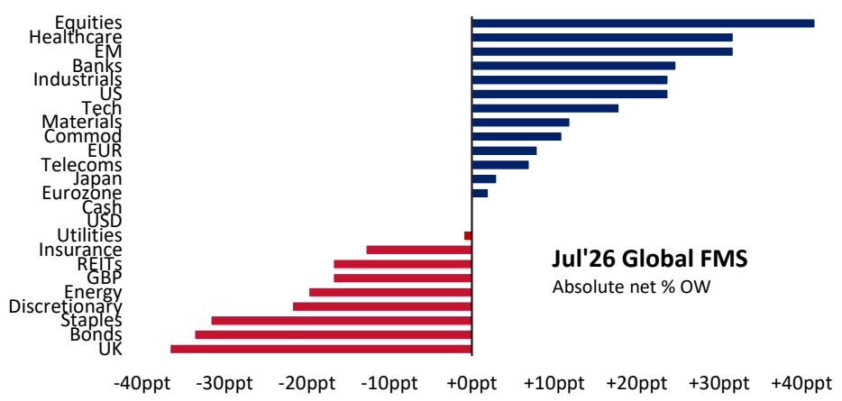  
Source: BofA Global Fund Manager Survey

Chart 21: Relative to history, OW utilities, US and industrials vs UW staples, UK and energy FMS positioning vs history (z-score)  
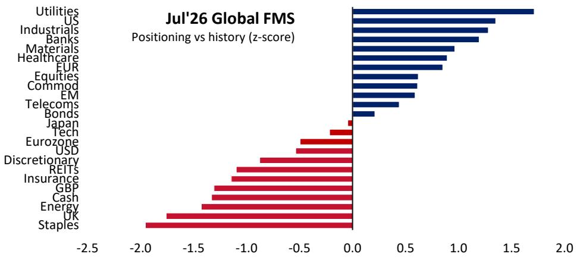  
Source: BofA Global Fund Manager Survey  
This chart shows July's monthly changes in FMS investor allocation.  
Investors increased allocation to healthcare, Europe, and bonds...

... and reduced allocation to energy, commodities, and UK.

This chart shows absolute FMS investor positioning (net % overweight).

In July, investors are most overweight equities, EM, and healthcare...

... vs. most underweight UK, bonds, and consumer staples.

This chart shows absolute FMS investor positioning (net % overweight).

In July, investors are most overweight utilities, US, and industrials...

... vs. most underweight consumer staples, UK, and energy.

Chart 22: Evolution of Global FMS "biggest tail risk" History of Global FMS "biggest tail risk" answers  
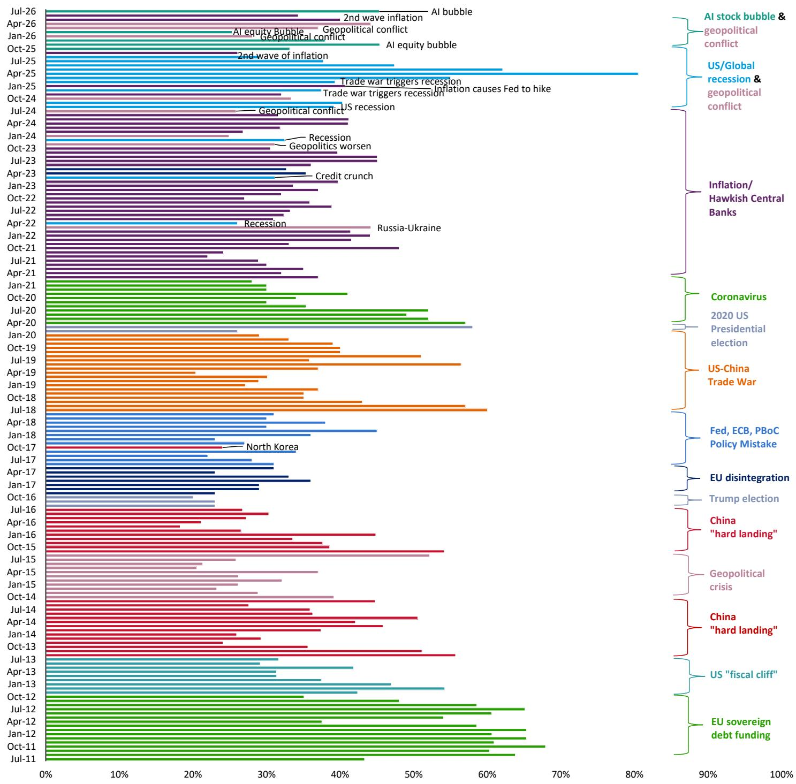  
Source: BofA Global Fund Manager Survey  
BofA GLOBAL RESEARCH

\- This chart shows the full history of the biggest "tail risk" for markets from BofA's monthly Global Fund Manager Survey.

\- The dominant concerns of investors since 2011 have been Eurozone debt, Chinese growth, populism, quantitative tightening & trade wars, global coronavirus, inflation, and central bank rate hikes; US\$ debasement, AI bubble, and geopolitics.

• The top tail risk is "AI bubble" (45%) in July.

Chart 23: Evolution of Global FMS "most crowded trade" History of Global FMS "most crowded trade" answers  
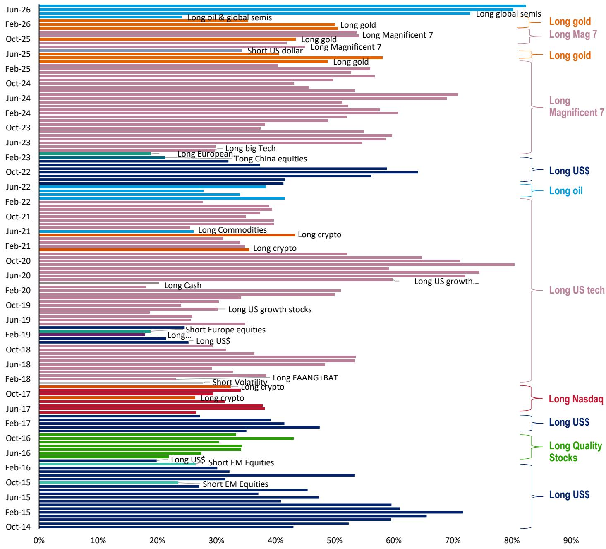  
Source: BofA Global Fund Manager Survey  
BofA GLOBAL RESEARCH

\- This chart shows the full history of the most "crowded trade" according to BofA's monthly Global Fund Manager Survey.

\- The market leadership has been relatively narrow since 2013, shifting from high yielding debt; long US\$; long Quality; long Tech; long Emerging Markets; long US Treasuries, long US tech & growth stocks, long Bitcoin, long commodities, long tech, long commodities, long US dollar, long Magnificent Seven, short US dollar, long gold, long oil, long global semiconductors.

\- The #1 FMS most crowded trade in July is long global semiconductors (82%) followed by long Magnificent 7 (7%), and long US dollar (4%).

## BofA Global FMS Rules & Tools

The Global FMS Rules & Tools are designed to help investors determine risk appetite, rotation opportunities, and tactical entry points.

## Table 2: BofA Global FMS Cash Rule and Bull & Bear Indicator

Current reading of BofA Global FMS Cash Rule and Bull & Bear Indicator

<table><tr><td></td><td>Category</td><td>Current reading</td><td>Current signal</td></tr><tr><td>BofA Global FMS Cash Rule</td><td>Contrarian</td><td>3.6%</td><td>Sell</td></tr><tr><td>Buy global equities when cash at or above 5.0%; sell when cash at or below 4.0%</td><td></td><td></td><td></td></tr><tr><td>BofA Bull &amp; Bear Indicator</td><td>Contrarian</td><td>9.4</td><td>Sell</td></tr><tr><td>Buy global equities when the indicator falls below 2.0; sell when it rises above 8.0</td><td></td><td></td><td></td></tr><tr><td colspan="4">Source: BofA Global Investment Strategy</td></tr></table>

BofA GLOBAL RESEARCH

Disclaimer: The indicators identified as BofA Global FMS Cash Rule and BofA Bull & Bear Indicator above are intended to be indicative metrics only and may not be used for reference purposes or as a measure of performance for any financial instrument or contract, or otherwise relied upon by third parties for any other purpose, without the prior written consent of BofA Global Research. These indicators were not created to act as a benchmark.

For full details please see: Global Investment Strategy: The BofA Global FMS Rules & Tools, 12 November 2020 and the Global Investment Strategy: BofA Bull & Bear Indicator revamp 11 December 2025

## FMS Investors on the Macro, Risks & AI

Chart 24: Net % of FMS investors who see a stronger global economy in next 12 months
Net % of FMS investors expecting stronger economy  
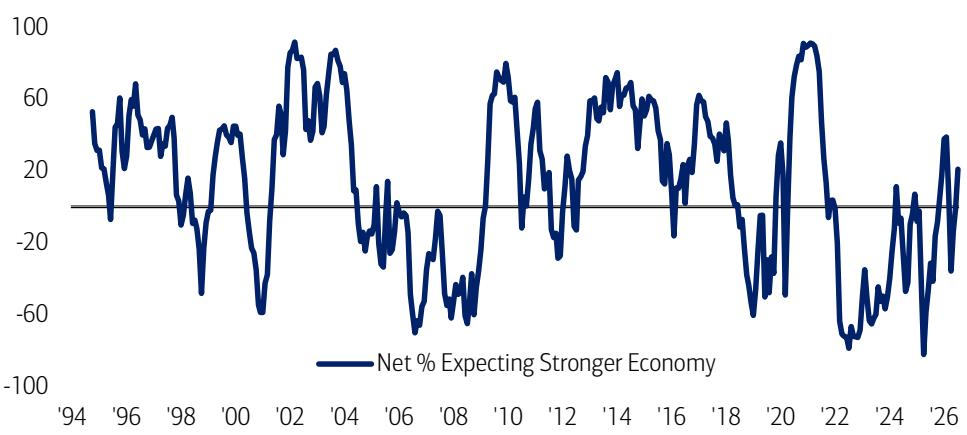  
Source: BofA Global Fund Manager Survey  
BofA GLOBAL RESEARCH

Chart 25: How FMS investors would describe the global economy over the next 12 months FMS expectations for the global economy over the next 12 months?  
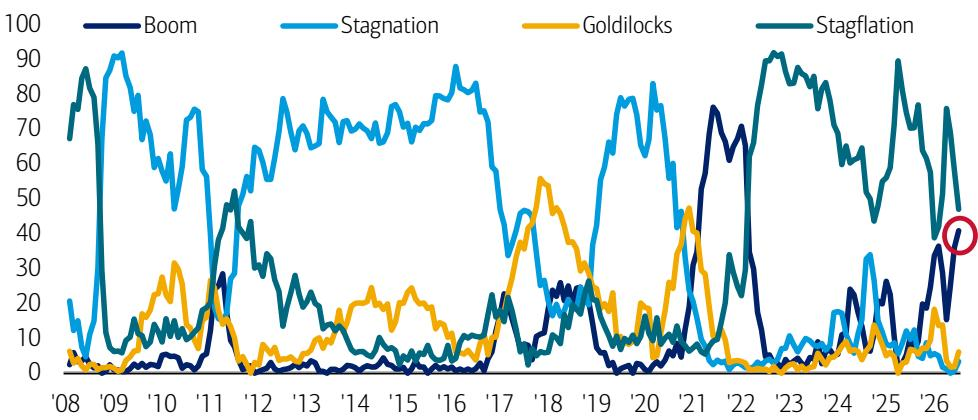  
Source: BofA Global Fund Manager Survey.  
BofA GLOBAL RESEARCH

Chart 26: Net % of FMS investors that expect higher global CPI
Net % of FMS investors expecting higher inflation  
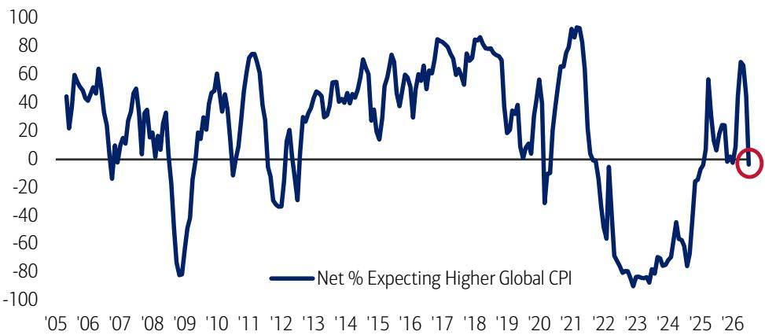  
Source: BofA Global Fund Manager Survey.  
BofA GLOBAL RESEARCH

On the macro...

July FMS showed net 21% of investors expecting stronger economic growth in the next 12 months, up from net 1% expecting weaker economic growth last month.

Growth expectations have risen to the strongest since Feb'26.

Asked about expectations for the global economy in the next 12 months...

47% of FMS investors say they expect "stagflation" (below-trend growth & above-trend inflation), down from 58% a month ago.

In contrast, 41% say "boom" (above-trend growth & above-trend inflation), up from 36% and the highest since Feb'22.

Expectations for "goldilocks" and "stagnation" remain very low.

Net 4% of FMS investors expect global CPI to be lower in 12 months' time... vs net 45% higher last month.

Inflation expectations are the lowest since Jan'25.

Chart 27: What would you most like to see companies do with cash flow? What FMS investors would most like to see companies do with cash flow  
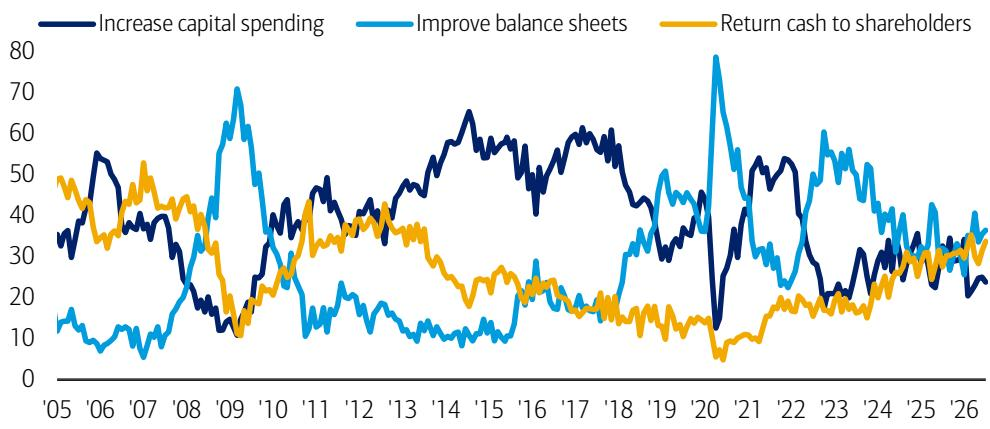  
Source: BofA Global Fund Manager Survey.  
BofA GLOBAL RESEARCH

Chart 28: Expectations for investment performance over the next 12 months
Over the next 12 months, net % FMS investors think...  
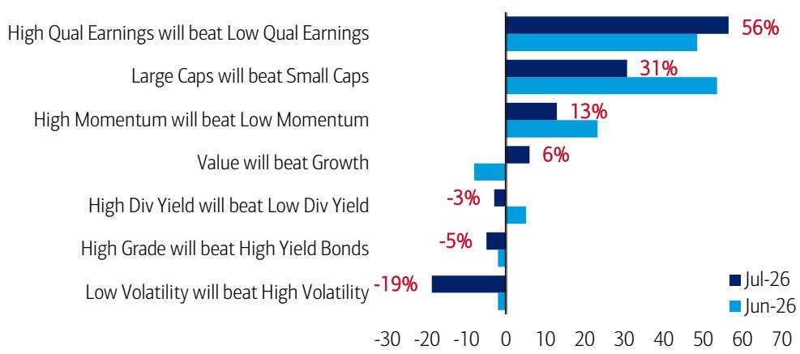  
Source: BofA Global Fund Manager Survey  
BofA GLOBAL RESEARCH

Chart 29: FMS investors taking higher than normal risk levels What level of risk do you think you're currently taking relative to your benchmark?  
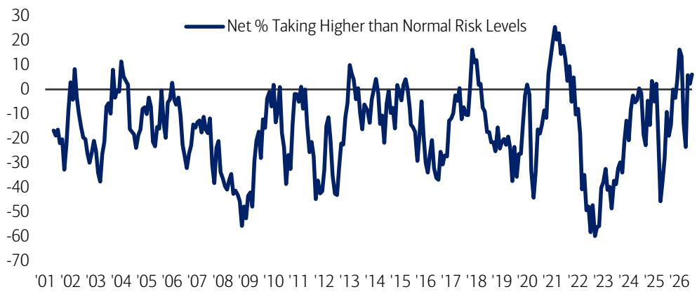  
Source: BofA Global Fund Manager Survey  
BofA GLOBAL RESEARCH

Asked what companies should do with cash flow... 34% said "return cash to shareholders," 36% said "improve balance sheets," and 24% said "improve capital spending."

## Per July FMS...

Net 56% say high-quality earnings will outperform low-quality earnings (from 48%).

Net 13% say high momentum will beat low momentum (from 23%).

Net 6% say value will beat growth, from 8% saying growth will beat value last month.

Net 3% say low-dividend yield will outperform high-dividend yield, for the first time since May'17. Last month 5% said high-dividend yield will outperform low-dividend yield.

FMS investors are taking net 6% higher than normal risk levels (vs 2% last month).

Chart 30: FMS Financial Market Stability Risks Indicator at -1.4
FMS Financial Market Stability Risks Indicator vs S&P 500 YoY %  
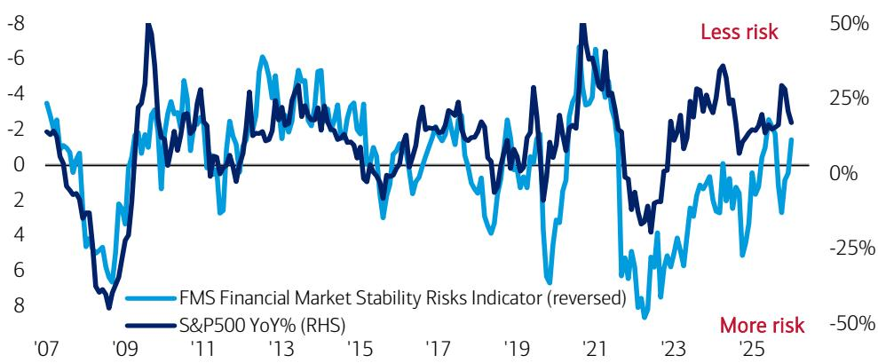  
Source: BofA Global Fund Manager Survey, Bloomberg  
BofA GLOBAL RESEARCH

Chart 31: FMS rating of potential risks to Financial Market Stability
Components of the FMS Financial Market Stability Risks Indicator  
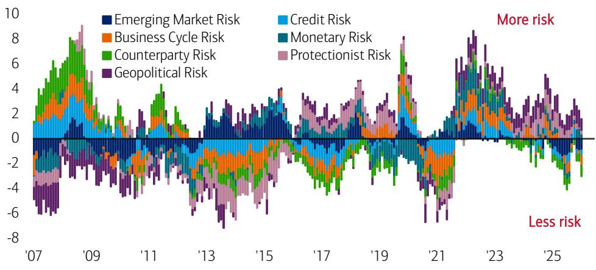  
Source: BofA Global Fund Manager Survey  
BofA GLOBAL RESEARCH

Chart 32: 52% of FMS investors say AI stocks are in "boom" part of cycle
Which of the following stages of an investment boom/bubble cycle are AI stocks currently in?  
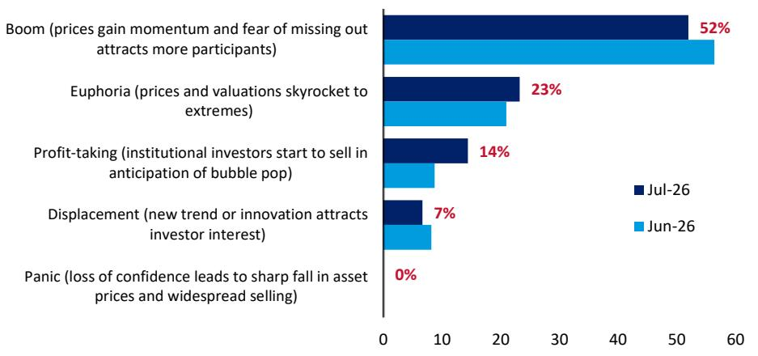  
Source: BofA Global Fund Manager Survey  
BofA GLOBAL RESEARCH

FMS Financial Market Stability Risks Indicator falls to -1.4 from 0.5.

The FMS Financial Market Stability Risks Indicator is intended to be an indicative metric only and may not be used for reference purposes or as a measure of performance for any financial instrument or contract, or otherwise relied upon by third parties for any other purpose, without the prior written consent of BofA Global Research. This indicator was not created to act as a benchmark.

More info and methodology on the FMS Financial Market Stability Risks Indicator can be found in the Nov'22 Global FMS.

The chart shows the individual z-scores of each response to how FMS investors rated potential risks to financial market stability since '07.

In July, 2 risk factors (out of 7) increased relative to the previous month...emerging and protectionist.

Asked what stage of the investment cycle AI stocks are currently in, 52% say "boom" (i.e. FOMO = more buyers), while 23% say "euphoria" (i.e. valuations in 'danger zone').

## FMS Asset Allocation

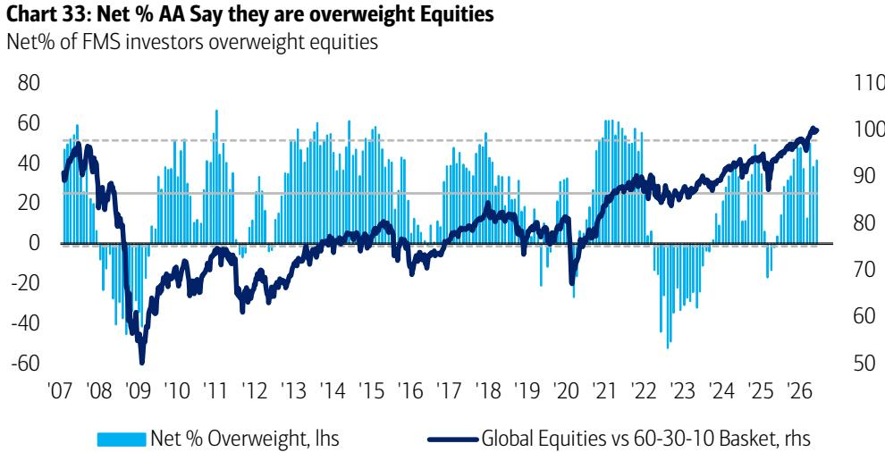  
Source: BofA Global Fund Manager Survey, Datastream

## On asset allocation...

FMS equity allocation increased to net 42% OW, from net 38% OW last month.

Current allocation is 0.6 stdev above its long-term average.

BofA GLOBAL RESEARCH

Chart 34: Net % AA Say they are overweight Bonds  
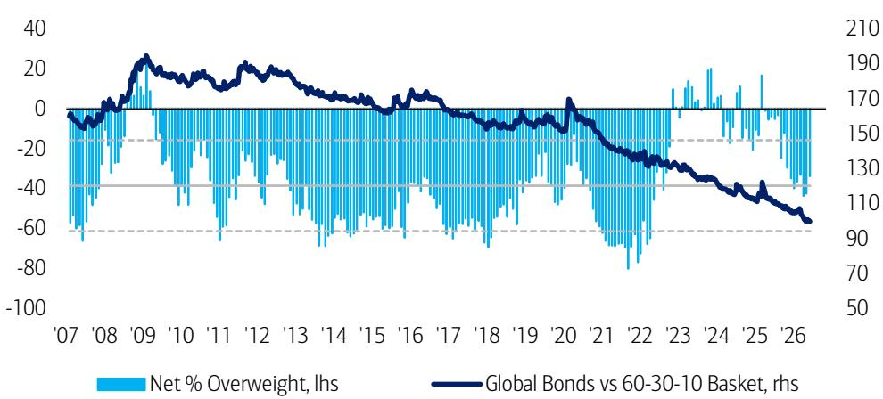  
Source: BofA Global Fund Manager Survey, Datastream

FMS bond allocation increased to net 34% UW, vs net 42% UW last month.

Current allocation is 0.2 stdev above its long-term average.

BofA GLOBAL RESEARCH

Chart 35: Net % AA Say they are overweight Cash
Net% of FMS investors overweight cash  
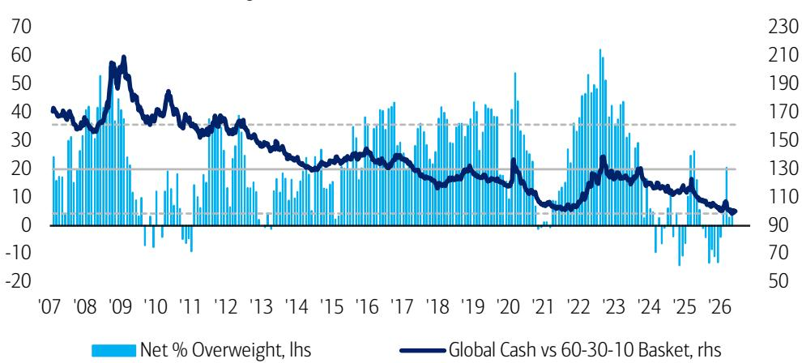  
Source: BofA Global Fund Manager Survey, Datastream

FMS cash allocation is neutral, down from net 5% OW a month ago.

Current allocation is 1.3 stdev below its long-term average.

Gold Bullion LBM U\$/Troy Ounce, rhs

Chart 36: Net % AA Say they are overweight Real Estate
Net% of FMS investors overweight Real Estate  
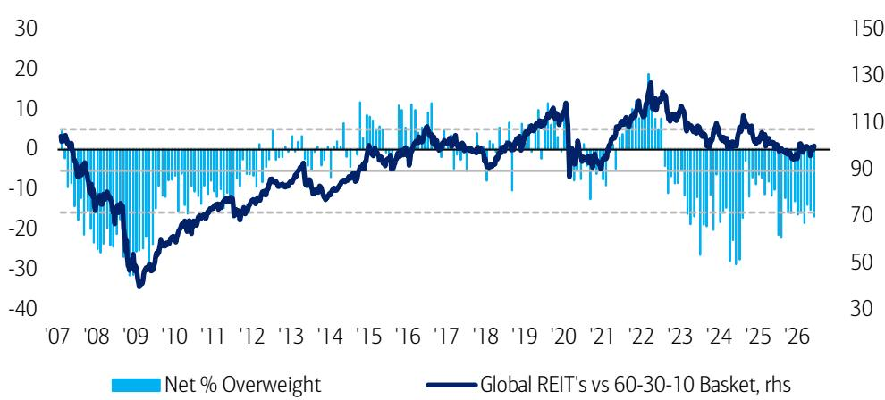  
Source: BofA Global Fund Manager Survey, Datastream  
BofA GLOBAL RESEARCH

FMS real estate allocation is net 17% UW (vs net 15% UW one month ago).

Current allocation is 1.1 stdev below its long-term average.

Chart 37: Net % AA Say they are overweight Commodities
Net% of FMS investors overweight commodities  
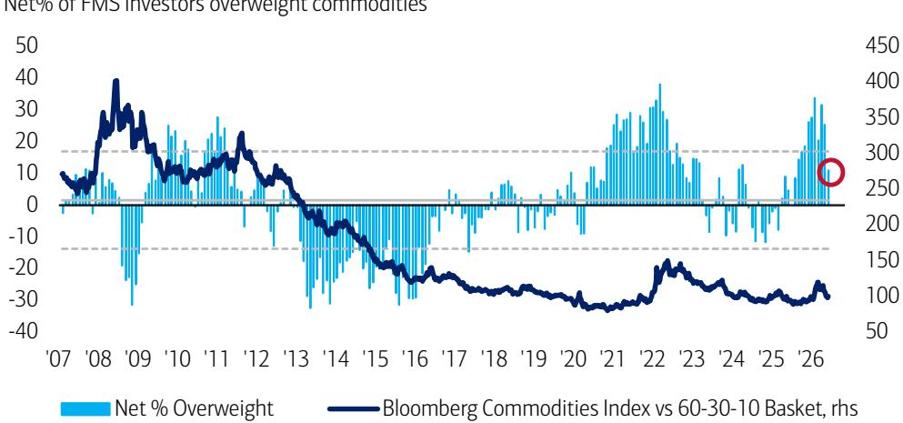  
Source: BofA Global Fund Manager Survey, Datastream.  
BofA GLOBAL RESEARCH  
Net% of FMS investors saying gold overvalued

FMS commodities allocation is net 11% OW, down from net 25% OW last month.

Current allocation is 0.6 stdev above its long-term average.

Chart 38: Gold Valuation and Gold Price (\$/oz)

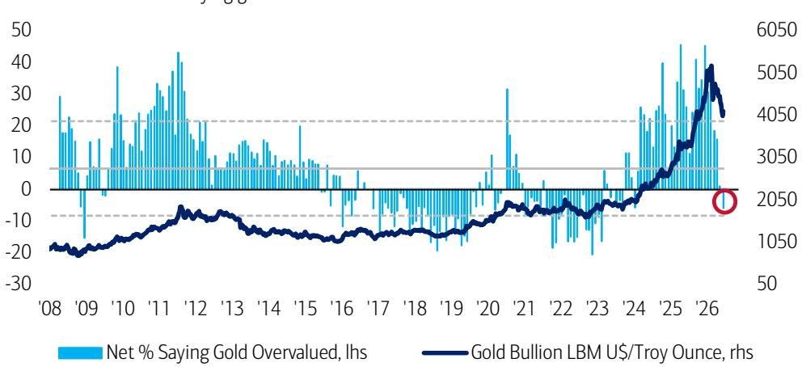  
Net 6% of FMS investors say gold is undervalued, the lowest since Mar'23 (from 1% saying overvalued last month).  
Source: BofA Global Fund Manager Survey, Datastream.

## Currencies extremes

Net % of FMS investors saying GBP overvalued  
  
Source: BofA Global Fund Manager Survey, Datastream  
BofA GLOBAL RESEARCH

Net 34% of FMS investors say US\$ is overvalued, unchanged from a month ago.

Current valuation is 0.7 stdev above the long-term average.

## On currencies...

Chart 40: EUR valuation and Trade weighted index  
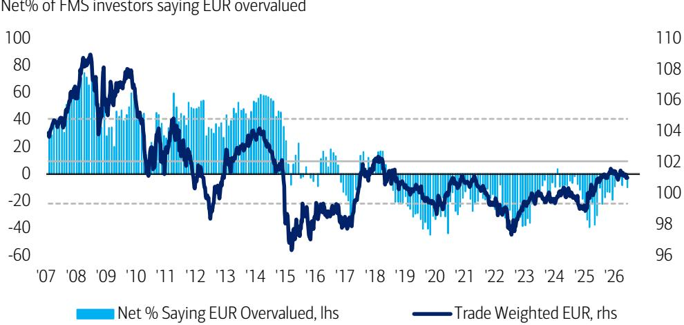  
Source: BofA Global Fund Manager Survey, Datastream  
BofA GLOBAL RESEARCH

Net 10% of FMS investors say EUR is undervalued (vs neutral last month).

Current valuation is 0.6 stdev below the long-term average.

Chart 41: GBP valuation and Trade weighted index  
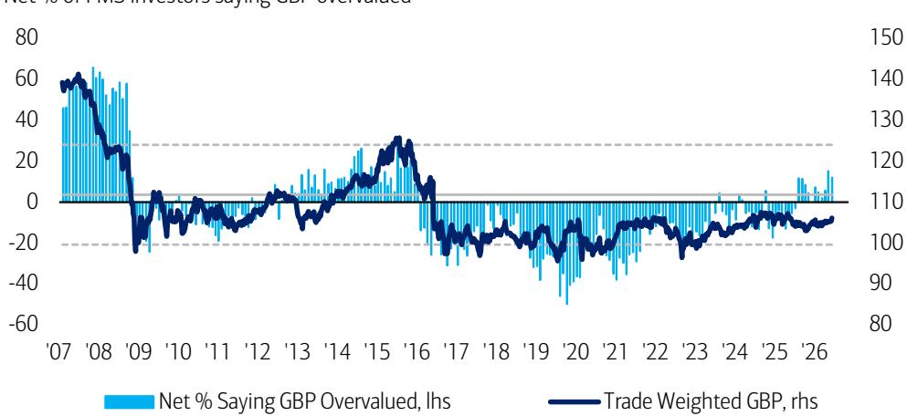  
Source: BofA Global Fund Manager Survey, Datastream

Net 12% of FMS investors think GBP is overvalued (vs 15% a month ago).

Current valuation is 0.3 stdev above the long-term average.

## Investor Regional Equity Allocation

Chart 42: Net % AA Say they are overweight US Equities
Net% of FMS investors overweight US equities  
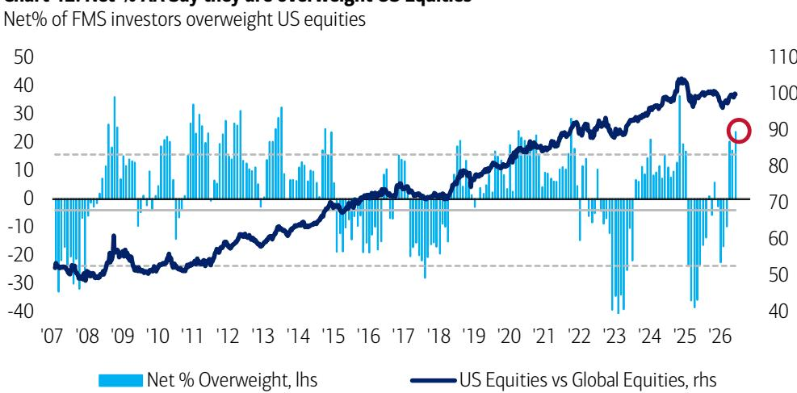  
Source: BofA Global Fund Manager Survey, Datastream  
BofA GLOBAL RESEARCH

On regional equity allocation...

FMS investors are net 24% OW US equities, the highest since Dec'24 (vs net 17% OW last month).

Current allocation is 1.4 stdev above its long-term average.

Chart 43: Net % AA Say they are overweight Eurozone Equities
Net% of FMS investors overweight EU equities  
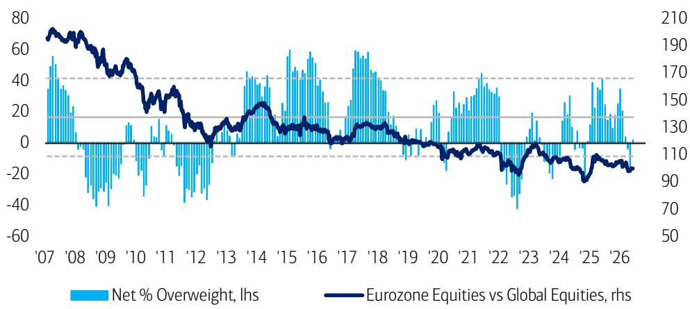  
Source: BofA Global Fund Manager Survey, Datastream  
BofA GLOBAL RESEARCH

FMS investors are net 2% OW Eurozone equities, from net 15% UW a month ago.

Current allocation is 0.5 stdev below its long-term average.

Chart 44: Net % AA Say they are overweight EM Equities  
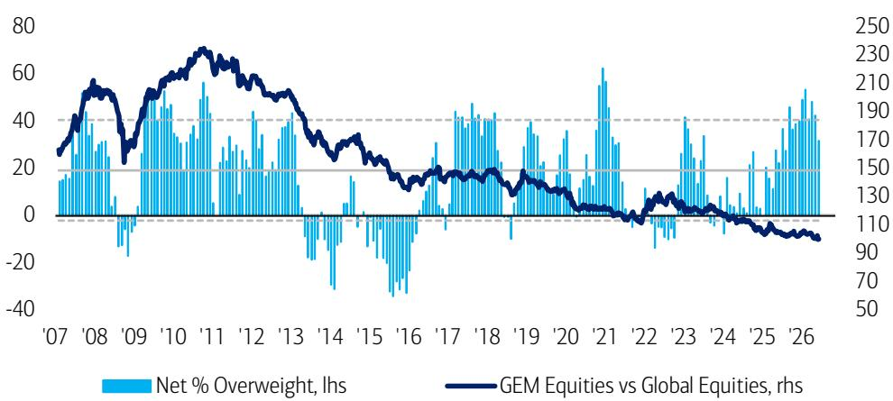  
Source: BofA Global Fund Manager Survey, Datastream

FMS investors are net 32% OW EM equities (from net 42% OW a month ago).

Current allocation is 0.6 stdev above its long-term average.

Chart 45: Net % AA Say they are overweight Japanese Equities
Net% of FMS investors overweight Japanese equities  
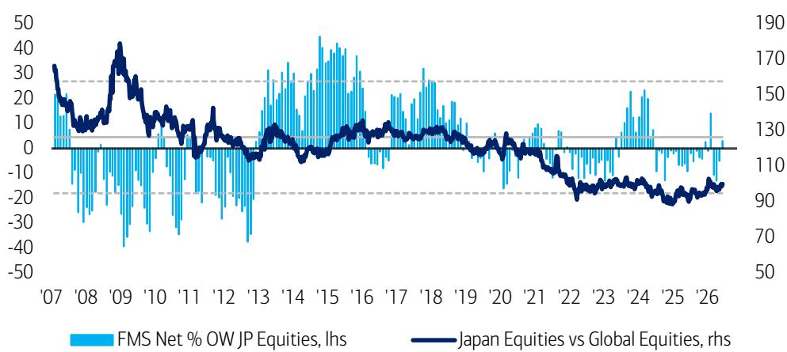  
Source: BofA Global Fund Manager Survey, Datastream  
BofA GLOBAL RESEARCH

FMS investors are net 3% OW Japanese equities (vs net 5% UW last month).

Current allocation is in line with its long-term average.

Chart 46: Net % AA Say they are overweight UK Equities
Net% of FMS investors
