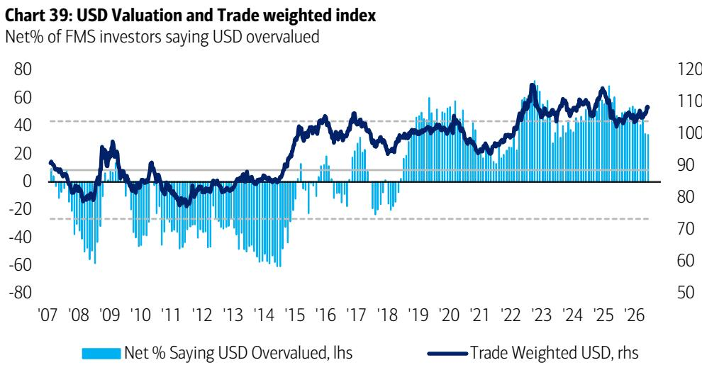

# 市场情绪指标达到历史极端水平，引发策略反思

2026年7月全球基金经理调查显示了一个值得关注的矛盾：专业读者对“不着陆”经济情景的预期创下新高，但反映这种乐观情绪的头寸配置却触发了反向信号。现金配置比例降至管理资产的3.6%，这一水平在历史上曾预示全球市场在随后两周内出现平均0.8%的调整。该机构的牛熊指标目前处于9.4的极端读数，为2026年2月以来最高，同样发出了警示信号。这并非被动延续原有策略的时刻，而是重新审视当前组合构建中隐含假设的时机。

这些数据值得关注，因为它们捕捉到了罕见的近乎一致的市场情绪。创纪录的54%的基金经理目前预期全球经济将实现“不着陆”，而仅有2%预期硬着陆。全球增长预期升至五个月高点，净21%的读者预期经济将走强。这种宏观乐观情绪直接驱动着资产配置决策，形成了集中的风险敞口，一旦主流叙事出现任何扰动，这些敞口将变得脆弱。关键问题不在于经济是否会繁荣，而在于市场是否已经将这种繁荣完全定价，以至于下一步必然面临修正。

趋势清晰可见。基金经理不仅乐观，而且正在以坚定的信念将这种乐观付诸行动。美国权益类头寸已升至2024年12月以来最高水平。向周期股的轮动正在加速，工业股达到2021年7月以来最受青睐的读数。医疗保健也是这一轮动的主要受益者。与此同时，读者正在削减那些能在下行中提供保护的资产：能源、大宗商品和英国权益类。必需消费品处于2014年2月以来最不受欢迎的水平，而消费板块整体自2006年5月以来从未如此被冷落。这是一个为无冲击世界构建的组合。历史经验表明，正是这种头寸配置使得冲击发生时影响更为显著。

## 半导体板块的共识拥挤构成不可忽视的结构性脆弱

该调查最引人注目的单一数据点是，82%的基金经理将“做多全球半导体”视为最拥挤的交易。这并非边缘共识，而是近乎单一文化的头寸集中。作为对比，其次最常被提及的拥挤交易——做多Magnificent 7和做多美元——分别仅占7%和4%。当超过五分之四的专业读者在同一拥挤交易上达成一致时，无序平仓的可能性已非尾部风险，而是核心情景。

这种集中尤其令人担忧，因为它建立在一个关于人工智能的特定叙事之上，而调查本身显示这一叙事是脆弱的。虽然61%的读者认为2026年不会有超大规模企业宣布削减资本支出，但相当比例的28%预期会有企业这样做。更重要的是，48%的读者现在将“AI泡沫”视为市场的最大尾部风险，较一个月前的28%大幅上升。这是一个悖论：同样拥挤在半导体板块的读者，同时将AI泡沫列为首要担忧。他们正在对冲自己正在执行的交易。这种认知失调表明，信念比头寸数据所暗示的要浅。超大规模企业支出方面的单一负面数据点，就可能触发市场最拥挤交易的快速同步退出。

## 向低股息增长的轮动标志着因子偏好的制度性转变，带来二阶风险

自2017年5月以来首次，净多数的基金经理预期低股息回报表现股票将跑赢高股息回报表现股票。这是一个微妙但有力的转变。它证实市场不仅是在偏好成长而非价值，更是在主动惩罚那些在以往周期中为组合提供支撑的收益型防御特征。从必需消费品转向医疗保健和工业的轮动与此主题一致。读者正在周期股和AI相关板块中追求资本增值，同时放弃那些能在下行中提供稳定性的资产。

这里的风险是双重的。首先，低股息偏好形成了自我强化的循环，推高了成长板块的估值，增加了最终修正的幅度。其次，它使组合在结构上缺乏波动保护。当一个组合压倒性地偏向于在繁荣期表现最佳的资产时，任何对繁荣叙事的干扰——无论是来自通胀、地缘政治还是信用事件——都将找不到天然的对冲工具。调查自身的反向交易建议具有指导意义：对于意外的鹰派美联储，建议的交易是做多必需消费品和黄金，做空半导体和医疗保健。对于“繁荣见顶”情景，建议是做多债券、英国权益类和高股息回报表现股票，同时做空工业股和银行股。这些恰恰与当前头寸配置相反。

## 通胀与利率共识已完全翻转，任何上行意外都将极具破坏性

7月调查中最戏剧性的转变或许是通胀预期的崩溃。净4%的读者现在预期全球通胀将下降，与上月净45%预期通胀上升形成完全逆转。这一转变主要由油价预测驱动，油价预期已从每桶86美元下跌17%至每桶71美元。仅有2%的读者预期油价将交易在每桶90美元以上。相应地，对短期利率上升的预期已经消失，从净34%降至净1%。高达83%的读者认为美联储在11月美国中期选举前不会加息。

这一共识危险地偏向一方。市场正在定价鸽派美联储、较低通胀和稳定增长。任何打破这一三重奏的数据点——地缘政治事件导致的油价飙升、粘性的核心通胀读数或鹰派的美联储评论——都将迫使利率预期快速重新定价。调查自身数据显示，仅有36%的读者预期未来一年内至少有一次加息。如果这一数字需要上升，那些从鸽派叙事中受益最多的资产——久期敏感的成长股和拥挤的半导体板块——将最为脆弱。来自现金规则和牛熊指标的信号表明，市场已经为完美情景定价，没有为即使是温和的通胀意外留下任何空间。

## AI尾部风险与信用事件担忧为组合构建提供决策框架

该调查通过识别两个最重要的风险，为组合决策提供了清晰的框架。首先，45%的读者现在将AI泡沫视为最大的尾部风险，高于6月的28%。其次，48%的人认为AI超大规模企业的资本支出是最可能引发系统性信用事件的来源，其次是私人信贷的34%。这两个风险是相互关联的。主要超大规模企业削减资本支出将同时验证AI泡沫叙事并触发信用事件，因为为这些投资提供融资的债务将受到审视。调查显示，读者意识到这种关联性但尚未采取行动：他们在7月削减了科技多头头寸，但没有人做空。

从这些数据中浮现的决策框架是一种杠铃式方法。一方面，“不着陆”共识和鸽派美联储观点支持继续持有周期股和美国权益类。另一方面，极端的头寸配置、半导体板块的拥挤交易以及历史性的反向信号，都主张降低风险并增加对冲。调查中确定的反向交易提供了具体指导。对于鹰派意外，对冲是做多必需消费品和黄金。对于繁荣见顶情景，对冲是做多债券和高股息回报表现股票。当前组合同时暴露于这两种风险之下，却没有相应的对冲。审慎的应对是减少最拥挤交易——半导体、美国权益类和低股息成长股——的敞口，并增加在当前头寸配置所忽略的情景中能够表现的对冲。现金规则信号在3.6%的水平并非对崩盘的预测。它是一个警告：市场已经变得过于舒适，下一个10%的波动更可能是向下而非向上。

*仅供参考。部分内容可能基于源材料通过AI辅助生成、翻译、总结或编辑，可能存在遗漏或错误。请独立核实。本文不构成投资、法律、税务、会计或其他专业建议。*

仅供参考。部分内容可能基于源材料通过AI辅助生成、翻译、总结或编辑，可能存在遗漏或错误。请独立核实。本文不构成投资、法律、税务、会计或其他专业建议。

