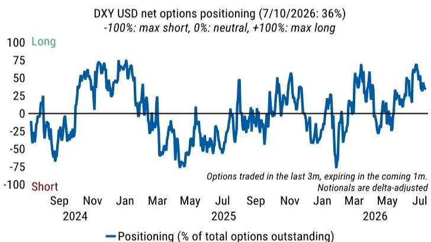
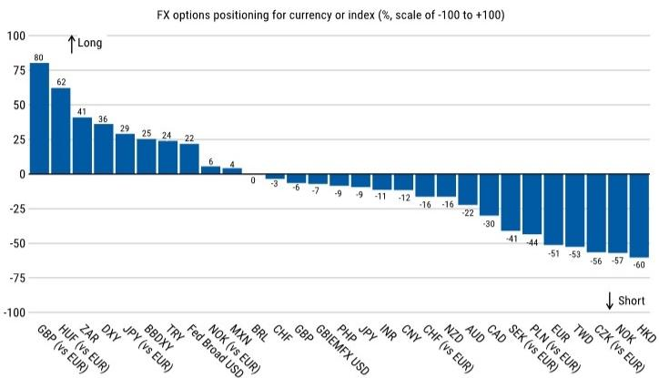

# MS：外汇仓位显示读者仍净做多美元

截至7月10日的期权定价数据显示，战术读者整体维持美元多头仓位，同时持有欧元空头。这份MS外汇仓位报告的核心发现并不复杂：市场对美元的看多情绪依然集中，但结构上出现了一些值得关注的边际变化。

报告通过期权和期货两个市场的数据交叉验证，勾勒出当前G10外汇市场的资金分布格局。期权市场显示读者增加了挪威克朗（兑欧元）的多头头寸，同时加大了瑞士法郎的空头押注。期货市场方面，日元多头和加元空头成为当周最显著的变化方向。

> **KC评论：** 期权和期货数据指向的方向并不完全一致，这正是仓位分析的价值所在——它揭示的是不同交易群体、不同时间框架下的资金行为差异，而非一个简单的“看多或看空”结论。

## 1. 美元多头仓位仍在累积，但增速节奏变化

报告中最具信息量的数据点来自美元指数期货仓位。截至7月7日，投机性美元多头仓位占未平仓合约的比例从一周前的51.2%升至52.6%。这个数字本身并不极端，但结合期权市场同样显示美元多头占优的信号，可以判断市场对美元的偏好仍处于偏强区间。

值得留意的是，仓位增速在节奏变化。从51.2%到52.6%的升幅，低于此前几周的变动幅度。这可能意味着新增多头力量在减弱，而非趋势逆转。

## 2. 挪威克朗和日元成为仓位变化中的两个异类

报告明确指出了两个方向性变化：期权市场读者增加了挪威克朗多头，期货市场读者增加了日元多头。这两个货币的仓位变化方向与整体美元偏强的格局形成对比。

MS的反向交易策略据此提出，基于仓位百分位数的信号，做多挪威克朗兑日元目前具备一定价值。这个判断的逻辑基础是：当某一货币的仓位过度集中后，后续资金流入的空间有限，反向押注的赔率反而更优。

## 3. 不同交易群体的仓位分化提供了观察窗口

报告将期货市场参与者进一步拆分为资产管理机构和杠杆产品。数据显示，资产管理机构主要持有欧元多头和新西兰元空头，而杠杆产品则集中在澳元多头和加元空头。这种分化本身就是一个信号：不同类型的资金对同一宏观环境做出了不同的方向选择。

对于关注外汇市场的读者而言，这种分化比单一方向的仓位数据更有参考意义。它意味着当前市场缺乏一致性的叙事，资金在不同货币对上的博弈仍在进行中。

## 4. 新西兰元情绪改善幅度居G10之首

截至7月10日，新西兰元的每日情绪指数显示，看多交易者的比例在G10货币中改善最为明显。这一变化与期货市场中新西兰元仍被净做空的仓位数据形成对照。情绪改善但仓位尚未跟上，这种背离往往是价格变动的先行信号，但也可能只是短期噪音。

整个报告的核心价值不在于给出一个具体的交易方向，而在于提供了一套观察市场资金分布的分析框架。仓位数据本身是中性的，但当它与情绪指标、不同交易群体的行为结合起来时，就能帮助读者判断当前价格中已经包含了多少共识，以及哪些方向可能存在预期差。

For informational purposes only. Portions may be generated,translated,summarized,or edited with AI assistance based on source materials and may contain omissions or errors. Please verify independently. This is not investment,legal,tax,accounting,or other professional advice.

For informational purposes only. Portions may be generated,translated,summarized,or edited with AI assistance based on source materials and may contain omissions or errors. Please verify independently. This is not investment,legal,tax,accounting,or other professional advice.

