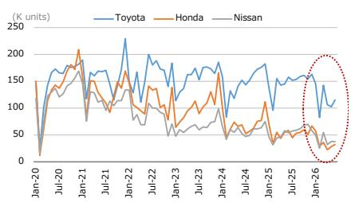

# 日本汽车零部件行业观察

## 日本整车厂商在华新车销售情况（2026年6月）对零部件行业的影响

### 核心观察

2026年6月，日本整车厂商在华新车销量数据显示：丰田同比下降27%，本田下降44%，日产下降30%。这一趋势对零部件供应商而言，意味着需要关注相关变化。

从4月至6月的整体数据来看，丰田、本田、日产分别同比下降27%、47%和32%。虽然零部件供应商第一季度业绩可能受益于日元汇率等因素，但中国区业务的变化幅度可能超出此前预期。

零部件供应商正在采取生产场地重组整合、优化人员配置、计提设备减值等措施，但部分公司可能仍需进一步推进结构性调整。

随着日本整车厂商越来越多地采用中国本土供应商的零部件，并表现出以中国零部件为基准进行比对的趋势，我们认为竞争加剧是日本汽车零部件企业需要持续关注的课题。

我们认为日本汽车零部件供应商需要通过以下方式应对：采购和利用本地采购的中国材料、推进本地化开发并提升开发速度、与中国企业建立合作关系。

### 数据概览

截至7月10日，日本三大整车厂商均已公布2026年6月在华新车销量数据。丰田为11.5万辆（同比下降27%），本田为3.2万辆（同比下降44%），日产为3.8万辆（同比下降30%）。2026年4月至6月期间，丰田在华新车销量总计32.4万辆（同比下降27%），本田为8.3万辆（同比下降47%），日产为10.7万辆（同比下降32%）。

图表1：三大日本整车厂商在华月度新车销量
图表2：日本整车厂商在华季度新车销量

来源：公司数据

<table><tr><td rowspan="2"></td><td colspan="4">2024年</td><td colspan="4">2025年</td><td colspan="2">2026年</td></tr><tr><td>1-3月</td><td>4-6月</td><td>7-9月</td><td>10-12月</td><td>1-3月</td><td>4-6月</td><td>7-9月</td><td>10-12月</td><td>1-3月</td><td>4-6月</td></tr><tr><td colspan="11">（千辆）</td></tr><tr><td>丰田</td><td>374.0</td><td>410.7</td><td>460.5</td><td>530.8</td><td>387.4</td><td>445.4</td><td>464.0</td><td>478.6</td><td>370.7</td><td>324.1</td></tr><tr><td>本田</td><td>206.9</td><td>209.0</td><td>172.1</td><td>264.1</td><td>157.9</td><td>157.3</td><td>152.7</td><td>177.5</td><td>122.5</td><td>83.3</td></tr><tr><td>日产</td><td>167.3</td><td>172.0</td><td>157.7</td><td>199.6</td><td>121.3</td><td>158.1</td><td>177.7</td><td>195.9</td><td>130.0</td><td>107.4</td></tr><tr><td colspan="11">（同比）</td></tr><tr><td>丰田</td><td>-2%</td><td>-18%</td><td>-9%</td><td>1%</td><td>4%</td><td>8%</td><td>1%</td><td>-10%</td><td>-4%</td><td>-27%</td></tr><tr><td>本田</td><td>-6%</td><td>-32%</td><td>-43%</td><td>-34%</td><td>-24%</td><td>-25%</td><td>-11%</td><td>-33%</td><td>-22%</td><td>-47%</td></tr><tr><td>日产</td><td>3%</td><td>-12%</td><td>-16%</td><td>-19%</td><td>-27%</td><td>-8%</td><td>13%</td><td>-2%</td><td>7%</td><td>-32%</td></tr><tr><td colspan="11">（环比）</td></tr><tr><td>丰田</td><td>-28%</td><td>10%</td><td>12%</td><td>15%</td><td>-27%</td><td>15%</td><td>4%</td><td>3%</td><td>-23%</td><td>-13%</td></tr><tr><td>本田</td><td>-49%</td><td>1%</td><td>-18%</td><td>53%</td><td>-40%</td><td>0%</td><td>-3%</td><td>16%</td><td>-31%</td><td>-32%</td></tr><tr><td>日产</td><td>-32%</td><td>3%</td><td>-8%</td><td>27%</td><td>-39%</td><td>30%</td><td>12%</td><td>10%</td><td>-34%</td><td>-17%</td></tr></table>

来源：公司数据

---

*本文内容基于公开信息整理，仅供参考，不构成任何建议。*
