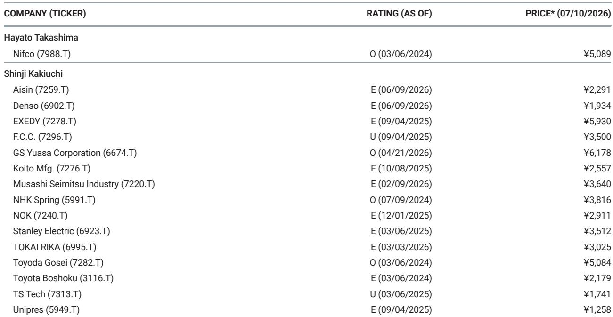

# 日本汽车零部件供应商在中国面临结构性挑战，而非周期性波动

数据清晰且不容忽视。2026年6月，丰田在中国销售11.5万辆新车，同比下降27%。本田仅售出3.2万辆，下降44%。日产售出3.8万辆，下降30%。在4月至6月的完整季度中，三家日本整车制造商共交付51.4万辆，较去年同期减少约三分之一。这些并非季度性波动，而是代表了过去两年持续加速的结构性变化，对依赖这些整车制造商的日本汽车零部件供应链而言，其影响远比临时性生产调整更为深远。

传统观点认为，日本零部件供应商可以通过日元贬值（提升海外收益回流价值）以及工厂整合、人员优化等成本削减措施来应对挑战。但这种看法已变得不够全面。2026年4月至6月的数据证实，中国市场的销量下滑已十分严重，足以抵消大多数供应商的汇率利好。更关键的是，问题不仅在于销量。随着日本整车制造商越来越多地从中国本土供应商采购，并以中国零部件为基准进行规格对标，日本零部件生态系统的竞争基础正受到侵蚀。这构成了双重打击：来自传统客户群的销量减少，以及单车零部件份额的下降。

本文观点明确：日本汽车零部件供应商必须超越渐进式重组，采取三管齐下的战略应对——在中国积极实现本地化采购与研发、与中国科技公司建立合作关系、从根本上调整成本结构以与本土供应商竞争。那些将中国问题视为可通过财务手段管理的暂时低谷的企业，将在三年内发现自己在全球最大汽车市场中失去结构性地位。

## 销量下滑规模已超出单纯重组可解决的范围

要理解为何此次下滑不同以往，需观察趋势线而非季度数据。丰田在华季度销量于2024年第四季度达到53.08万辆峰值，到2026年第二季度降至32.41万辆，六个季度内下降39%。本田的轨迹更为显著：从2024年第四季度26.41万辆的季度峰值降至2026年第二季度的8.33万辆，降幅达68%。日产同期从19.96万辆降至10.74万辆，下降46%。这些并非由单月疲软或产品周期缺口引发的需求波动，而是市场地位的永久性丧失。

直接原因显而易见。原油价格上涨削弱了中国市场对燃油车的需求，而日本整车制造商在向新能源车型转型方面进展缓慢。相比之下，中国本土制造商以日本品牌难以匹敌的价格，推出了大量有竞争力的电动及插电式混合动力车型。但因果链条并未止于整车层面。对零部件供应商而言，销量下滑还叠加了第二层效应：日本整车制造商面临巨大利润压力，正积极通过从中国本土供应商采购更多零部件来降低销售成本。一份全球投行报告指出，日本整车制造商“正在增加使用中国本土供应商制造的零部件”，并“显示出以中国零部件为基准进行对标的动向”。这并非传闻或遥远的可能性，而是正在发生的事实。

对零部件供应商而言，这意味着收入基础正从两个方向同时受到侵蚀。首先，整车产量减少，意味着每家企业所需的零部件数量下降。其次，仍需要的零部件越来越多地从中国竞争对手而非传统日本供应链采购。这是一种结构性利润压缩，无法通过提高工厂效率或计提设备减值来解决。这些措施应对的是产能过剩的症状，而非竞争能力过时的根源。

## 日元贬值是暂时缓解，而非结构性成本劣势的解药

日本零部件供应商的少数亮点之一是日元贬值，这提升了其海外（尤其是中国）收益以日元计值的规模。对4月至6月季度而言，这一汇率利好可能部分抵消报告收益中的销量下滑。但依赖这一效应在战略上存在两个风险。

首先，汇率利好是一种机械性的会计效应，无助于改善供应商在中国运营的根本竞争力。一家因价格高出20%而输给中国竞争对手的供应商，不会因日元贬值就重新赢得合同。中国客户以人民币支付，本地竞争对手的成本结构也以人民币计价。汇率优势仅在收益汇回时发挥作用，而非在合同得失之时。等到销量下滑体现在以日元计值的合并收益中时，竞争损害已然造成。

其次，日元贬值并非必然持续。若汇率走强，收益支撑将消失，使供应商暴露于销量下滑和市场份额流失的全部压力之下。2026年4月至6月的数据使这一风险变得突出。即使日元处于历史低位，销量下滑仍如此严重，很可能导致中国业务较上一季度预期进一步恶化。报告明确警告，4月至6月期间“中国业务可能比预期更差”。如果汇率利好都无法阻止这种恶化，那么当利好消退时会发生什么？

战略启示很明确：供应商必须将当前的日元贬值视为重组中国业务以获取长期竞争力的机会窗口，而非应对竞争压力的永久缓冲。那些利用汇率利好补贴缺乏竞争力的成本结构的企业，将陷入困境：因本地竞争而无法提价，因遗留结构而无法快速削减成本，因与日本整车制造商的关系义务而无法退出。

## 中国本土采购转变正实时重塑竞争格局

对日本零部件供应商而言，最具深远影响的并非销量下滑本身，而是由此引发的整车制造商采购行为变化。日本整车制造商在中国正面临巨大压力，需降低车辆价格以与本土制造商竞争。最快的方式是用本地生产的中国替代品替换进口或日本采购的零部件，这些替代品通常便宜20%至30%。

这并非渐进趋势。报告指出，日本整车制造商“正在增加使用中国本土供应商制造的零部件”，并“显示出以中国零部件为基准进行对标的动向”。措辞谨慎但含义深刻。以中国零部件为基准意味着，日本整车制造商不再仅依据传统标准（质量、可靠性、长期关系）评估供应商，而是明确将日本零部件与中国零部件在价格和性能上进行对比，并据此做出采购决策。

对日本零部件供应商而言，这代表着竞争动态的根本性转变。过去，日本供应商可基于历史关系和共享工程标准，依赖来自丰田、本田或日产的某种程度的业务保障。这种隐性保障正在消失。整车制造商正作为理性买家行事，他们发现中国供应商能以显著更低的成本提供可接受的质量。报告结论称“竞争加剧是日本汽车零部件公司面临的问题”，这低估了形势的严重性。这并非竞争加剧，而是结构性替代。

第二层含义是，日本供应商不能仅通过削减自身利润来在价格上竞争。中国供应商的优势超越劳动力成本：他们拥有更短的供应链、更快的产品开发周期、政府对本地内容的补贴，以及日本供应商在中国无法匹敌的规模。一家日本供应商试图以日本制造并运往中国的零部件匹配中国竞争对手的价格，是一场必败之战。相对少见可行的应对是在中国生产、在中国采购材料、在中国开发产品。

## 战略应对需根本性调整中国业务模式

鉴于挑战的规模，工厂整合和人员精简等渐进措施虽有必要但远远不够。报告概述了日本零部件供应商需采取的三项具体行动：采购和利用本地采购的中国材料、实现研发本地化并提高开发速度、与中国公司建立合作关系。这三项行动构成了连贯的战略框架，每一项都值得仔细审视。

第一项行动——采购本地化——直接解决成本结构问题。继续从日本进口原材料、子组件或工装的供应商，将始终面临成本劣势。目标必须是在中国实现与本地竞争对手相当的成本基础，而不仅仅是与日本竞争对手相当。这需要与中国材料供应商建立关系，使其产品通过汽车用途认证，并将其整合到生产流程中。这是一项多年努力，但却是实现成本对等的相对少见途径。

第二项行动——研发本地化并提高开发速度——解决创新差距问题。中国汽车制造商正以日本整车制造商及其供应商历来难以匹敌的速度前进。产品周期更短、功能需求变化迅速，为特定车型定制零部件的能力是竞争必需品。将工程和设计团队留在日本、仅向中国工厂发送规格的供应商将过于缓慢。他们需要在中国建立本地工程团队，能够在数天而非数周内响应客户需求，并能与中国整车制造商及其一级供应商共同开发零部件。

第三项行动——与中国公司建立合作关系——解决市场准入和技术差距问题。中国供应商不仅是低成本生产商，许多企业在电动动力总成组件、电池系统和软件定义车辆架构等领域已开发出专有技术。试图独立开发这些能力的日本供应商将落后更多。合作、合资甚至对中国科技公司的少数投资，可提供获取这些能力的途径，同时保留与日本整车制造商的现有关系。报告提及“与中国公司建立合作关系”，直接承认了单打独斗已不再可行。

## 供应商决策框架：三种战略姿态及其权衡

对日本汽车零部件供应商的高管而言，问题不在于是否应对，而在于如何将有限资源分配至这三项行动。以下框架可基于供应商在中国的现有定位帮助确定优先级。

第一种战略姿态是“全面本地化”路径。适用于在中国拥有大量现有产能、产品组合广泛且服务于多家整车制造商的供应商。这些供应商的优先事项应是在18至24个月内实现材料的完全本地采购，并在中国建立拥有根据本地需求修改设计权限的完整工程中心。风险在于，在收入下降时期需要大量前期投入。回报在于能够捍卫市场份额，并可能赢得中国整车制造商的新业务。

第二种战略姿态是“合作主导”路径。适用于拥有专业技术或在利基组件中占据强势地位但缺乏全面本地化规模的供应商。优先事项应是确定能提供互补能力或市场准入的中国合作伙伴。形式可以是合资生产特定组件线，或允许中国合作伙伴以日本品牌制造的技术许可协议。风险在于对知识产权的控制权丧失以及与现有客户的潜在渠道冲突。回报在于更快的市场进入和更低的资本承诺。

第三种战略姿态是“有序退出”路径。适用于中国业务规模小、产品线狭窄或成本结构无论本地化程度如何都无法具备竞争力的供应商。优先事项应是最大化现有运营的现金流，同时逐步减少风险敞口。这可能涉及将生产线出售给中国买家、以特许权使用费形式许可技术，或让合同自然到期而不续签。风险在于永久放弃中国市场，但对某些供应商而言，竞争所需的资本可能超过预期回报。

报告未指明哪条路径适合特定供应商，答案取决于供应商的产品组合、客户集中度和资产负债表实力。明确的是，维持现状并非可行选项。继续将中国作为遗留业务管理、采取渐进式成本削减并寄望日本整车制造商恢复市场份额的供应商，是在押注与过去六个季度证据相悖的假设。

2026年4月至6月的数据应成为警钟。丰田、本田和日产在中国并非经历暂时挫折，而是竞争地位的结构性下滑，其零部件供应商正随之被拖累。能够生存并发展的供应商，将是那些认识到向中国输出日本工程卓越性的旧模式已终结的企业。新模式要求成为中国的竞争者，而不仅仅是恰好在中国设有工厂的日本供应商。

*仅供参考。部分内容可能基于源材料通过AI辅助生成、翻译、摘要或编辑，可能存在遗漏或错误。请独立核实。本文不构成专业建议。*

仅供参考。部分内容可能基于源材料通过AI辅助生成、翻译、摘要或编辑，可能存在遗漏或错误。请独立核实。本文不构成专业建议。

