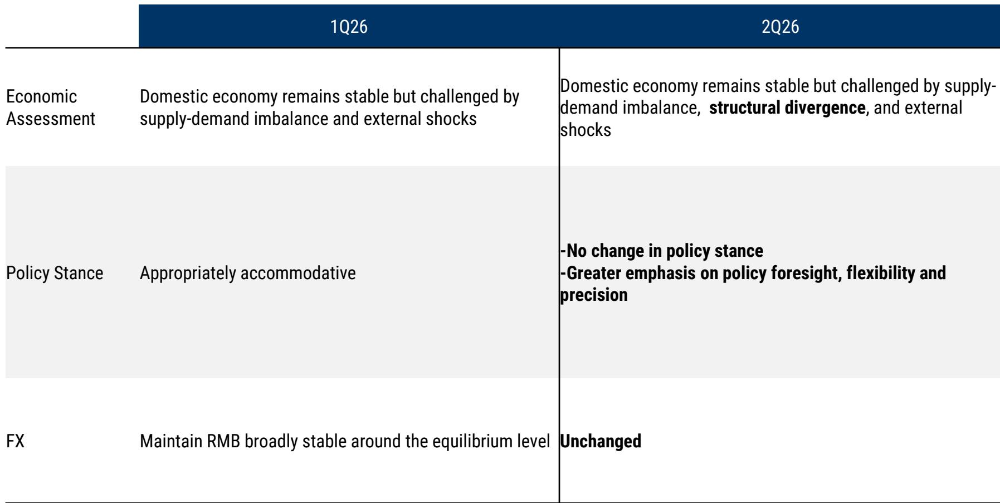
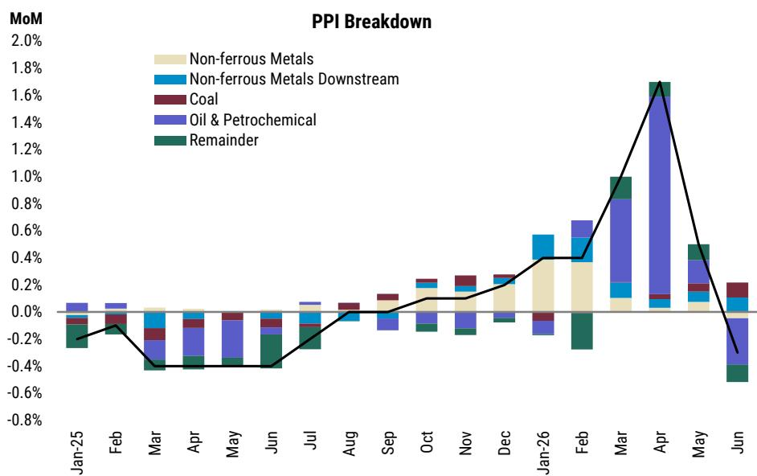
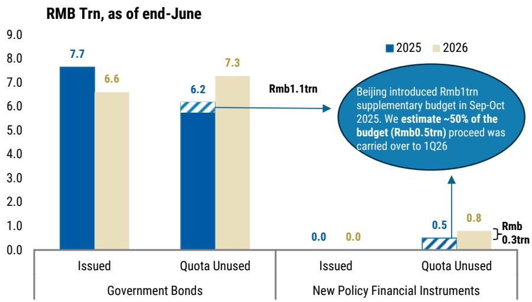

# 宏观观察：通胀回升但需求未同步——对市场环境的再思考

近期，整体价格指标有所上行，但其构成与传统周期中的需求驱动型回升有所不同。能源价格的传导，而非广泛的需求复苏，是近期数据变化的主要推动力。剔除某些特定项目后的核心价格指标依然温和。这是一种缺乏需求同步回暖的价格上涨——这一模式对资产配置、政策定位和企业战略的影响，与需求拉动型复苏的叙事有本质区别。

这种区别之所以重要，是因为它改变了全球读者和跨国企业面对宏观环境时进行决策的考量基础。一个需求与价格同步回暖的环境，通常意味着财政乘数在发挥作用，消费者信心在恢复，定价权正在向生产者转移。然而，我们目前观察到的是，在持续偏弱的下游利润和脆弱的消费者信心之上，叠加了成本推动的现象。经济运行的底层动能依然有待加强，而政策层面的应对也反映了对这一现实的准确判断。

当前环境有三个结构性特征：下游利润空间受挤压，导致生产者难以转嫁投入成本；财政政策更注重执行效率而非规模扩张；以及以供给为导向的产业策略，这可能会延长而非解决供需之间的不平衡。这些特征对于读者如何配置相关资产，以及企业财务管理者如何考虑货币与运营风险，都带来了各自的战略启示。

## 财政脉冲真实存在但需正确理解：操作框架是“微调”，而非“转向”

下半年，政策层面仍有约2万亿元人民币的额外财政空间。从表面看，这似乎是推动需求回升的弹药。但关键的区别在于，这部分空间将被用于加速预算执行，而非扩大预算总盘子。政策目标是缩小预算支出与实际执行之间的差距，而不是推出会进一步扩大赤字的新刺激措施。

这一区别并非语义上的。它反映了政策制定者的一种审慎选择：在试图支持增长的同时，避免增加历史遗留的不平衡问题——尤其是在地方融资和房地产领域的负债。出口的韧性为这种做法提供了缓冲空间。由于外部需求的支撑好于预期，采取额外逆周期宽松措施的紧迫性有所降低。政策层面的考量似乎是，只要出口引擎继续运转，经济就能承受国内需求复苏的较慢步伐，而不会引发硬着陆。

对读者而言，这意味着财政乘数效应将比以往刺激规模更大、更前置的周期更为温和。能从政府支出中受益的行业，将是那些与预算执行直接相关的领域——基础设施维护、国有企业设备更新，以及战略性项目的技术采购。广泛的消费刺激或大规模的家庭转移支付尚未提上日程。财政立场是支持性的，但并非变革性的。

## 央行的政策定力：问题不在货币端

从近期货币政策委员会会议的通稿来看，措辞较上一季度变化不大。经济评估在原有的供需失衡和外部冲击判断基础上，增加了“结构性分化”的表述，但政策立场仍保持“适度宽松”，并更强调前瞻性、灵活性和精准性。外汇指导方针未变：保持人民币汇率在均衡水平上的基本稳定。

这种连续性本身就是一个信号。当一个经济体出现价格上涨但需求未同步回暖时，央行面临两难。在核心需求疲弱、下游利润受压的情况下，为应对整体价格指标而加息是不合适的。而降息则可能进一步削弱本币，并加剧输入性价格压力。最优的应对是按兵不动，而这正是当前的选择。

对于固收读者而言，这意味着回报表现曲线将因政策按兵不动而保持稳定，但存在一个微妙的转折。不加息意味着中国债券相对于发达市场同行的利差优势只会逐步收窄，而非消失。对于汇率策略师来说，稳定指导方针强化了这样一种观点：人民币将在窄幅区间内交易，央行愿意使用其工具箱——包括逆周期因子和流动性管理——来防止无序波动。策略不在于押注方向，而在于正确定价波动率溢价。

## 仅靠更明智的产业政策无法解决供需失衡

当前周期在分析上最具挑战性的特征，是尽管政府努力引导投资方向，但供给侧过剩问题依然持续。除房地产外的投资增速已从2021-2023年的高位放缓，但减速幅度不大。更重要的是，投资的“接力棒”已从传统制造业和房地产等明显产能过剩的领域，传递到新能源、半导体和先进材料等过剩程度较低但正在增长的领域。

这种轮动是北京方面持续强调的供给侧产业策略的直接结果。近期关于建设世界级科技强国的目标表述，强化了对人工智能、量子技术、生命科学、集成电路和先进制造等战略领域的优先投入。政策框架强调深化科技与产业融合、培养青年人才、改革科研评价体系。

这些都是值得肯定的长期目标。然而，近期的后果是，即使需求增长不足以吸收，投资仍持续流入产能建设。政府已引入“全国统一大市场”和“反内卷”等概念来解决重复产能和地方保护主义问题。这些方向正确，但实施起来颇具挑战。跨区域的产能协调需要基于市场的机制来引导地方专业化，而这些机制尚不成熟。地方政府的激励措施与产能整合的目标仍不一致，税收体系也继续偏向生产而非消费。

对于企业战略制定者而言，启示是明确的：即使产能过剩的构成发生变化，制造业领域的利润压力仍将持续。在产业政策目标行业竞争的公司，应预期持续的竞争和资本回报率受压，直到需求赶上或产能退出发生。这两种情况似乎都不会很快出现。

## 决策框架：读者需回答的三个问题

价格上涨但需求未同步带来的分析挑战在于，标准的周期性框架失效了。当价格上涨是供给驱动且政策应对受到结构性遗留问题制约时，依赖产出缺口、价格指标和政策利率之间关系的传统模型用处不大。一个更有用的框架侧重于三个诊断性问题。

第一，价格上涨是否传导给了最终消费者？下游利润的证据表明没有。当生产者无法转嫁成本增加时，负担落在企业盈利能力上，而非消费者价格上。这意味着权益读者应警惕投入成本高且定价能力有限的行业，尤其是消费品和中间制造业。赢家将是那些拥有独特定价能力的公司——通常通过品牌、技术或监管壁垒——或那些受益于自身投入成本下降的公司。

第二，财政政策在刺激需求方面是变得更有效还是更低效？微调方法表明边际收益递减。每一单位增量财政支出产生的需求刺激比以往周期要少，因为支出针对的是供给侧目标而非家庭收入支持。对宏观读者的启示是，增长预测应纳入比历史平均值更低的财政乘数。风险不在于财政政策将被撤回，而在于它无法产生市场已在风险资产中定价的那种自我强化的复苏。

第三，供给侧策略是自我纠正还是自我强化？证据表明短期内是自我强化。随着地方政府竞相发展战略性产业，投资催生更多投资，由此产生的产能过剩压低回报，进而需要更多政策支持来维持战略目标。这种循环可能持续数年，直到市场力量或政策改革打破它。投资启示是，应用于相关资产的贴现率应包含一个结构性风险溢价，以反映这一调整过程的持续时间，而不仅仅是周期性不确定性。

## 可能打破模式的结构性改革：议程之上，但并非迫在眉睫

有三类改革可以解决结构性过剩问题：干部考核改革，以奖励改善民生和环境而非投资量的成果；社会福利改革，以加强安全网并减少预防性储蓄；以及财政体制改革，转向效率导向的直接税，并为公共服务而非项目提供资金。

这些改革中的每一项都将解决延续供需失衡的一个特定机制。干部考核改革将减少地方官员批准重复产能的动机。社会福利改革将通过减少家庭为医疗、教育和退休储蓄的需求，直接提振消费。财政体制改革将通过改变税收法规中嵌入的激励措施，将资源分配从投资转向消费。

挑战在于，这些改革需要尚未到位的政治共识和行政能力。干部考核制度以前修改过，但执行情况参差不齐。社会福利改革涉及财政可持续性与家庭福利之间的复杂权衡。财政体制改革需要重新谈判中央与地方之间的收入分享安排，这是中国政策制定中政治最敏感的问题之一。

对读者而言，相关问题不在于这些改革是否可取——它们显然是可取的——而在于它们在投资期限内是否可能实现。证据表明，渐进式进展是可能的，但变革性变化则不然。这意味着，价格上涨但需求未同步的结构性特征——利润受压、消费者信心疲弱和供给驱动投资——将作为投资组合构建的背景条件持续存在，而非通过政策行动就能解决的暂时性异常。

## 人民币国际化路径：可控渠道，而非资本账户开放

报告提供建设性更新的一个领域，是通过香港发展离岸人民币生态系统。基础设施方案包括：将“南向通”债券通额度从5000亿元人民币提高至8000亿元，扩大合格投资范围，将人民币业务设施从2000亿元提高至5000亿元并延长期限，推出五年期离岸人民币国债期货，以及建立跨境黄金清算和结算机制。

这些措施的意义在于它们不是什么：它们不是资本账户自由化。策略是通过可控渠道建立离岸人民币市场的深度和流动性，而不是开放资本账户并冒破坏在岸金融体系稳定的风险。对于跨国公司和机构读者而言，实际意义是管理人民币敞口的工具箱正在扩大。更长期限对冲工具的可用性和更深的离岸流动性，降低了人民币风险管理的成本和复杂性。

战略逻辑与价格上涨但需求未同步这一更广泛的主题一致。政府愿意投资于人民币国际化的基础设施，因为它支持减少对美元主导体系依赖的长期目标。但国际化步伐将保持渐进和可控，与整体政策方法一致，即微调而非转向。离岸人民币生态系统将增长，但它不会取代在岸体系成为人民币定价和结算的主要场所。

对于企业财务管理者而言，启示是做好准备迎接一个以人民币计价的贸易和投资流动增加，但货币仍受管理且资本账户仍部分封闭的世界。对冲策略应侧重于流动性正在改善的离岸市场，而不是期望走向完全可兑换，从而允许无缝的在岸-离岸套利。

*仅供参考。部分内容可能基于源材料通过AI辅助生成、翻译、总结或编辑，可能存在遗漏或错误。请独立核实。本文不构成专业建议。*

仅供参考。部分内容可能基于源材料通过AI辅助生成、翻译、总结或编辑，可能存在遗漏或错误。请独立核实。本文不构成专业建议。

