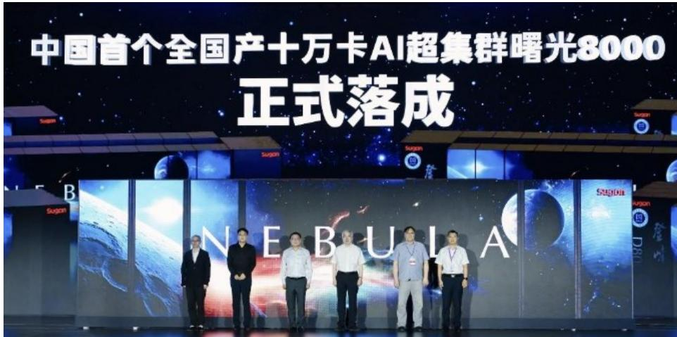
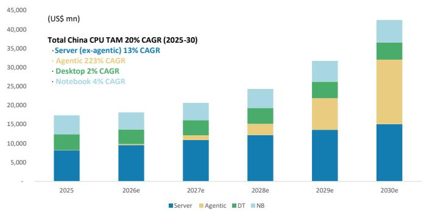
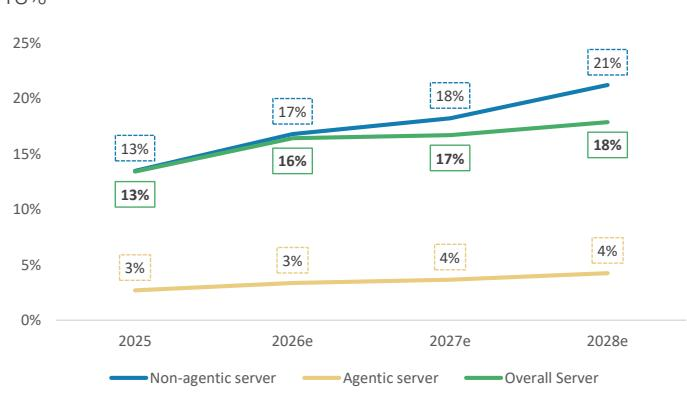
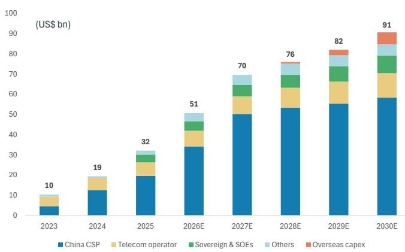
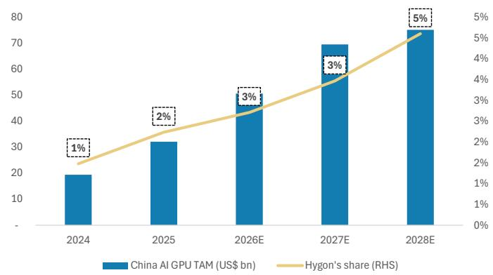
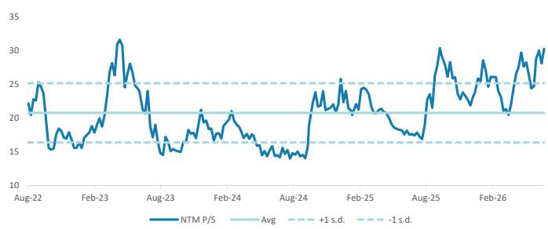
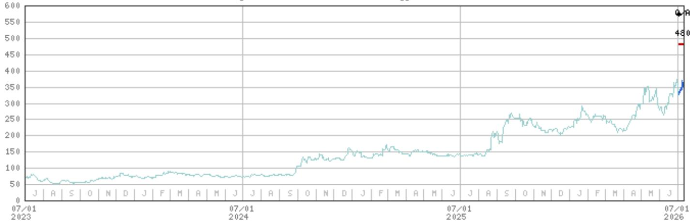

# Hygon Information Technology Co., Ltd. | Asia Pacific

# Sugon 8000 launch and industry observations

China launched its first 100,000-card AI supercluster using Hygon's CPUs, GPUs and switch chips. We also address questions about Hygon's differentiation, market positioning and the agentic AI opportunity.

Hygon's CPUs and GPUs used in China's first 100,000-card AI supercluster: Sugon launched Sugon 8000, a 100,000-accelerator AI supercluster, in Zhengzhou last Friday. All six core chip types in the cluster were developed domestically by the Sugon/Hygon ecosystem, including the Hygon C86 CPU, Hygon DCU (GPGPU AI accelerator), HySW scale-up switch ASIC (interconnecting GPUs within the same board), PCIe 5.0 switch chip (interconnecting CPUs and GPUs), 400/800G switch ASIC, 400G NIC ASIC. For more see Key Takeaways from HIECO Conference.

## We address three key questions following our Hygon initiation report:

First, the differentiation of Hygon vs. other GPU companies. Hygon's integrated "CPU + GPU" model differentiates it from most local peers that focus primarily on GPUs, allowing Hygon to address both general-purpose server workloads and AI training/inference simultaneously. Also, its largest shareholder Sugon (27.96% shareholding) is not only a supercomputer manufacturer but a key player in China AI infrastructure, spanning chips, computing, storage, networking, cooling, applications and services. We think Hygon could leverage its largest shareholder's ecosystem and gain more share in China's CPU and GPU markets.

## Second, why does Hygon deserve a comparable market assessment as other GPU companies?

Some observers are reluctant to assign a comparable assessment to Hygon's CPU business, as most CPUs are not restricted from import and CPU TAM growth seems slower than GPUs. We argue that China's server CPU TAM growth, including agentic AI demand, will be higher at a 31% CAGR (Exhibit 2) than AI GPU TAM growth at 23% (Exhibit 4). Also, the CPU localization drive is coming from policy and procurement mandates, and supply-chain security. Therefore, we don't think Hygon's CPU business should be assessed at lower multiples than other GPU companies.

## Third, how should we think about Hygon's positioning in the agentic AI era?

As AI systems evolve toward multi-agent architectures, CPUs are increasingly responsible for workflow control and system-level coordination. We estimate China's agentic AI CPU TAM to be US$17bn by 2030, or 21% of global demand. We expect Hygon to address 3-5% of that demand as its CPUs' presence in security-sensitive verticals like government and finance aligns well with emerging requirements for data sovereignty, compute isolation, and trusted infrastructure. We expect Hygon's next-generation CPUs to deliver higher clock speeds, stronger performance, and enhanced security to meet the demands of agentic AI.

## MS ASIA LIMITED+

<table><tr><td colspan="2">Daisy Dai, CFA</td></tr><tr><td>Equity Analyst</td><td></td></tr><tr><td>Daisy.Dai@morganstanley.com</td><td>+852 2848-7310</td></tr></table>

## MS TAIWAN LIMITED+

<table><tr><td colspan="2">Charlie Chan</td></tr><tr><td colspan="2">Equity Analyst</td></tr><tr><td>Charlie.Chan@morganstanley.com</td><td>+886 2 2730-1725</td></tr></table>

<table><tr><td colspan="2">Daniel Yen, CFA</td></tr><tr><td colspan="2">Equity Analyst</td></tr><tr><td>Daniel.Yen@morganstanley.com</td><td>+886 2 2730-2863</td></tr></table>

<table><tr><td colspan="2">Ethan Jia</td></tr><tr><td>Research Associate</td><td></td></tr><tr><td>Ethan.Jia@morganstanley.com</td><td>+852 3963-2287</td></tr></table>

<table><tr><td colspan="2">Henry Zhao</td></tr><tr><td colspan="2">Research Associate</td></tr><tr><td>Henry.Zhao@morganstanley.com</td><td>+852 2239-7731</td></tr></table>

## Asia Summer School 2026

## Hygon Information Technology Co., Ltd. (688041.SS, 688041 CH)

Greater China Technology Semiconductors | China

<table><tr><td>Stock Rating</td><td>Overweight</td></tr><tr><td>Industry View</td><td>Attractive</td></tr><tr><td>Price target</td><td>Rmb480.00</td></tr><tr><td>Up/downside to price target (%)</td><td>36</td></tr><tr><td>Shr price, close (Jul 10, 2026)</td><td>Rmb353.00</td></tr><tr><td>52-Week Range</td><td>Rmb395.17-134.85</td></tr><tr><td>Mkt cap, curr (mn)</td><td>Rmb820,491.3</td></tr><tr><td>Avg daily trading value (mn)</td><td>Rmb7,831</td></tr></table>

<table><tr><td>Fiscal Year Ending</td><td>12/25</td><td>12/26e</td><td>12/27e</td><td>12/28e</td></tr><tr><td>EPS (Rmb)**</td><td>1.10</td><td>2.02</td><td>3.31</td><td>5.30</td></tr><tr><td>EPS (Rmb)§</td><td>1.35</td><td>1.98</td><td>3.01</td><td>4.29</td></tr><tr><td>Revenue, net (Rmb mn)</td><td>14,376.9</td><td>22,419.7</td><td>32,906.0</td><td>45,341.8</td></tr><tr><td>EBITDA (Rmb mn)</td><td>5,103.7</td><td>7,431.0</td><td>10,877.4</td><td>15,953.3</td></tr><tr><td>ModelWare net inc (Rmb mn)</td><td>2,544.9</td><td>4,694.7</td><td>7,702.8</td><td>12,307.6</td></tr><tr><td>P/E</td><td>204.6</td><td>174.8</td><td>106.5</td><td>66.7</td></tr><tr><td>ROE (%)</td><td>12.6</td><td>20.9</td><td>29.1</td><td>37.3</td></tr></table>

Unless otherwise noted, all metrics are based on MS ModelWare framework  
\*\* = Based on consensus methodology  
§ = Consensus data is provided by Refinitiv Estimates  
e = MS estimates

MS does and seeks to do business with companies covered in MS. As a result, investors should be aware that the firm may have a conflict of interest that could affect the objectivity of MS. Investors should consider MS as only a single factor in making their investment decision.

## For analyst certification and other important disclosures, refer to the Disclosure Section, located at the end of this report.

+= Analysts employed by non-U.S. affiliates are not registered with FINRA, may not be associated persons of the member and may not be subject to FINRA restrictions on communications with a subject company, public appearances and trading securities held by a research analyst account.

## Key Takeaways from HIECO Conference

Core chips in China's first homegrown 100,000 card AI supercluster are localized: Sugon launched Sugon 8000, a 100,000-accelerator AI supercluster whose deployment was completed in June. All six types of core chip in the cluster were developed domestically by the Sugon/Hygon ecosystem, including the Hygon C86 CPU, Hygon DCU (GPGPU AI accelerator), HySW scale-up switch ASIC (interconnecting GPUs within the same board), PCIe 5.0 switch chip (interconnecting CPUs and GPUs), 400/800G switch ASIC, 400G NIC ASIC. Sugon's scaleFabric 400 scale-out networking platform is built around the network switch and NIC ASIC, with proprietary 112G SerDes IP.

The AI supercluster enables highly efficient training and inference for massive models. The system supports 64-bit, 32-bit, 16-bit, and 8-bit (incl. FP8 and INT8) formats, as well as mixed-precision execution, with vendor-reported benchmark results indicating competitive performance across these precision formats. ParaStor, Sugon's distributed storage platform for large-scale AI and HPC systems, ranked first on both the IO500 Production and 10 Node Production lists, with scores 2.46x and 2.72x the previous leading scores, respectively.

For training workloads, Sugon 8000 has supported customer pre-training workloads at the 10,000-accelerator scale (incl. Zhipu's LLM, iFlytek's speech models, and BAAI's world models); Sugon 8000 is also designed to scale to 100,000 accelerators for next-gen, 10-trillion-parameter-class models. For inference workloads, Sugon 8000 supports inference for over 400 mainstream models and supports optimization for prefill-decode disaggregation and KV-cache management.

Various applications already run on the cluster. The core node has already completed optimization for over 300 supercomputing-AI fusion applications across more than 20 fields, including large models, robotics, automotive, pharmaceuticals, new materials, quantum computing, and weather forecasting. More than 70 of these applications have achieved 10,000-card scale expansion, validating the system's stability and reliability under massive, high-intensity scientific workloads.

The node is now open to research institutions, universities, enterprises, and individual users, offering inclusive, efficient, and convenient computing services through the national supercomputing internet.

Exhibit 1: China's first homegrown 100,000-card AI supercluster goes live in Zhengzhou  
  
Source: Company data

## Key Charts

Exhibit 2: We expect China's CPU TAM to rise to US$42bn in 2030, with server (incl. agentic) growth at a 31% CAGR  
  
Source: Company data, MS estimates

Exhibit 3: ...with Hygon's share in China server CPUs hitting 18%  
  
Source: Company data, MS estimates

Exhibit 4: We expect China's AI GPU TAM to grow to US$91bn by 2030  

Exhibit 5: ...with Hygon's share rising to 5% by 2028  
  
Source: Company data, MS estimate  
Source: Mercury, MS estimates

Exhibit 6: We expect Hygon to deliver strong sales growth and sustained gross margin  
  
Source: Company data, MS estimates

Exhibit 7: Hygon: NTM P/S ratio  
  
Source: Factset, MS estimates

This report references U.S. Executive Order 14032 and/or entities or securities that are designated thereunder. U.S. persons may be prohibited from buying certain securities of entities named in this report. Readers are solely responsible for ensuring that their investment activities are carried out in compliance with applicable laws.

This report references export controls and/or entities that may be subject to export control restrictions. Readers are solely responsible for ensuring that their investment or trade activities are carried out in compliance with applicable laws.

This report references U.S. Executive Order 14105 and/or entities that may be in scope of such order. U.S. persons may be prohibited from engaging in certain transactions or otherwise require certain other transactions be notified to the U.S. Department of Treasury. Readers are solely responsible for ensuring that their investment or trade activities are carried out in compliance with applicable laws.

## Valuation Methodology and Risks

## Hygon Information Technology Co., Ltd. (688041.SS)

We assume an 8.0% cost of equity (beta 1.05, risk-free rate 2.0% and risk premium 5.8%), a payout ratio of 50%, a medium-term growth rate of 25.0%, and a terminal growth rate of 5.0%, all of which are in line with other China AI chip companies under our coverage.

## Risks to Upside

■ Hygon further differentiates itself from local CPU and GPU competitors and gains significant market share in China's CPU and GPU markets

■ China AI demand is stronger than expected

■ Faster ramp-up of leading node capacity

## Risks to Downside

■ Intensified pricing competition among local GPU companies

■ China AI demand is weaker than expected

■ Slower yield improvement and capacity buildout at local leading node foundries

## Disclosure Section

The information and opinions in MS were prepared or are disseminated by MS Asia Limited (which accepts the responsibility for its contents) and/or MS Asia (Singapore) Pte. (Registration number 199206298Z) and/or MS Asia (Singapore) Securities Pte Ltd (Registration number 200008434H), regulated by the Monetary Authority of Singapore (which accepts legal responsibility for its contents and should be contacted with respect to any matters arising from, or in connection with, MS), and/or MS Taiwan Limited and/or MS & Co International plc, Seoul Branch, and/or MS Australia Limited (A.B.N. 67 003 734 576, holder of Australian financial services license No. 233742, which accepts responsibility for its contents), and/or MS Wealth Management Australia Pty Ltd (A.B.N. 19 009 145 555, holder of Australian financial services license No. 240813, which accepts responsibility for its contents), and/or MS India Company Private Limited having Corporate Identification No (CIN) U22990MH1998PTC115305, regulated by the Securities and Exchange Board of India ("SEBI") and holder of licenses as a Research Analyst (SEBI Registration No. INH000001105); Stock Broker (SEBI Stock Broker Registration No. INZ000244438), Merchant Banker (SEBI Registration No. INM000011203), and depository participant with National Securities Depository Limited (SEBI Registration No. IN-DP-NSDL-567-2021) having registered office at Altimus, Level 39 & 40, Pandurang Budhkar Marg, Worli, Mumbai 400018, India; Telephone no. +91-22-61181000; Compliance Officer Details: Mr. Tejarshi Hardas, Tel. No.: +91-22-61181000 or Email: tejarshi.hardas@morganstanley.com; Grievance officer details: Mr. Tejarshi Hardas, Tel. No.: +91-22-61181000 or Email: msic-compliance@morganstanley.com which accepts the responsibility for its contents and should be contacted with respect to any matters arising from, or in connection with, MS, and their affiliates (collectively, "MS"). MS India Company Private Limited (MSICPL) may use AI tools in providing research services. All recommendations contained herein are made by the duly qualified research analysts.

For important disclosures, stock price charts and equity rating histories regarding companies that are the subject of this report, please see the MS Disclosure Website at www.morganstanley.com/eqr/disclosures/webapp/generalresearch, or contact your investment representative or MS at 1585 Broadway, (Attention: Research Management), New York, NY, 10036 USA.

For valuation methodology and risks associated with any recommendation, rating or price target referenced in this research report, please contact the Client Support Team as follows: US/Canada +1 800 303-2495; Hong Kong +852 2848-5999; Latin America +1 718 754-5444 (U.S.); London +44 (0)20-7425-8169; Singapore +65 6834-6860; Sydney +61 (0)2-9770-1505; Tokyo +81 (0)3-6836-9000. Alternatively you may contact your investment representative or MS at 1585 Broadway, (Attention: Research Management), New York, NY 10036 USA.

## Analyst Certification

The following analysts hereby certify that their views about the companies and their securities discussed in this report are accurately expressed and that they have not received and will not receive direct or indirect compensation in exchange for expressing specific recommendations or views in this report: Charlie Chan; Daisy Dai, CFA; Daniel Yen, CFA.

## Global Research Conflict Management Policy

MS has been published in accordance with our conflict management policy, which is available at www.morganstanley.com/institutional/research/conflictpolicies. A Portuguese version of the policy can be found at www.morganstanley.com.br

## Important Regulatory Disclosures on Subject Companies

As of June 30, 2026, MS beneficially owned 1% or more of a class of common equity securities of the following companies covered in MS: ACM Research Inc, Advanced Micro-Fabrication Equipment Inc, Advanced Wireless Semiconductor Co, Alchip Technologies Ltd, AllRing Tech Co., AP Memory Technology Corp, ASE Technology Holding Co. Ltd., ASMPT Ltd, Cambricon Technology Corporation, Dosilicon Co Ltd, FOCI Fiber Optic Communications Inc, GigaDevice Semiconductor Beijing Inc, GlobalWafers Co Ltd, Gudeng Precision, Hangzhou Silan Microelectronics Co. Ltd., King Yuan Electronics Co Ltd, Macronix International Co Ltd, MediaTek, Montage Technology Co Ltd, Parade Technologies Ltd, Phison Electronics Corp, Powerchip Semiconductor Manufacturing Co, SG Micro Corp., Shanghai Fudan Microelectronics, Silergy Corp., Silicon Motion, TSMC, UMC, Unigroup Guoxin Microelectronics Co Ltd, Vanguard International Semiconductor, WIN Semiconductors Corp, Winbond Electronics Corp, WPG Holdings, WT Microelectronics Co. Ltd..

Within the last 12 months, MS managed or co-managed a public offering (or 144A offering) of securities of Alchip Technologies Ltd, Montage Technology Co Ltd, Powerchip Semiconductor Manufacturing Co.

Within the last 12 months, MS has received compensation for investment banking services from ASMPT Ltd, Montage Technology Co Ltd, Powerchip Semiconductor Manufacturing Co.

In the next 3 months, MS expects to receive or intends to seek compensation for investment banking services from Advanced Micro-Fabrication Equipment Inc, Alchip Technologies Ltd, AP Memory Technology Corp, ASE Technology Holding Co. Ltd., ASMedia Technology Inc, ASMPT Ltd, Aspeed Technology, Espressif Systems, GigaDevice Semiconductor Beijing Inc, GlobalWafers Co Ltd, Gudeng Precision, Himax Technologies Inc, Hua Hong Semiconductor Ltd, Iluvatar CoreX Semiconductor Co., Ltd., Innoscience, King Yuan Electronics Co Ltd, Macronix International Co Ltd, MediaTek, MetaX Integrated Circuits, Montage Technology Co Ltd, Novatek, Phison Electronics Corp, Powerchip Semiconductor Manufacturing Co, Realtek Semiconductor, SG Micro Corp., Shenzhen Longsys Electronics Co Ltd, SICC Co Ltd, Silergy Corp., Silicon Motion, TSMC, UMC, Universal Scientific Ind. (Shanghai), Vanguard International Semiconductor, Winbond Electronics Corp, WinWay Technology Co Ltd, WPG Holdings, WT Microelectronics Co. Ltd..

Within the last 12 months, MS has received compensation for products and services other than investment banking services from ASE Technology Holding Co. Ltd., King Yuan Electronics Co Ltd, MediaTek, Nanya Technology Corp., Novatek, Nuvoton Technology Corporation, Realtek Semiconductor, Silicon Motion, SMIC, TSMC, UMC, Universal Scientific Ind. (Shanghai), Winbond Electronics Corp, WT Microelectronics Co. Ltd..

Within the last 12 months, MS has provided or is providing investment banking services to, or has an investment banking client relationship with, the following company: Advanced Micro-Fabrication Equipment Inc, Alchip Technologies Ltd, AP Memory Technology Corp, ASE Technology Holding Co. Ltd., ASMedia Technology Inc, ASMPT Ltd, Aspeed Technology, Espressif Systems, GigaDevice Semiconductor Beijing Inc, GlobalWafers Co Ltd, Gudeng Precision, Himax Technologies Inc, Hua Hong Semiconductor Ltd, Iluvatar CoreX Semiconductor Co., Ltd., Innoscience, King Yuan Electronics Co Ltd, Macronix International Co Ltd, MediaTek, MetaX Integrated Circuits, Montage Technology Co Ltd, Novatek, Phison Electronics Corp, Powerchip Semiconductor Manufacturing Co, Realtek Semiconductor, SG Micro Corp., Shenzhen Longsys Electronics Co Ltd, SICC Co Ltd, Silergy Corp., Silicon Motion, TSMC, UMC, Universal Scientific Ind. (Shanghai), Vanguard International Semiconductor, Winbond Electronics Corp, WinWay Technology Co Ltd, WPG Holdings, WT Microelectronics Co. Ltd..

Within the last 12 months, MS has either provided or is providing non-investment banking, securities-related services to and/or in the past has entered into an agreement to provide services or has a client relationship with the following company: ASE Technology Holding Co. Ltd., King Yuan Electronics Co Ltd, MediaTek, Montage Technology Co Ltd, Nanya Technology Corp., Novatek, Nuvoton Technology Corporation, Realtek Semiconductor, Silicon Motion, SMIC, TSMC, UMC, Universal Scientific Ind. (Shanghai), Winbond Electronics Corp, WT Microelectronics Co. Ltd..

MS & Co. LLC makes a market in the securities of ACM Research Inc, Himax Technologies Inc, Silicon Motion.

The equity research analysts or strategists principally responsible for the preparation of MS have received compensation based upon various factors, including quality of research, investor client feedback, stock picking, competitive factors, firm revenues and overall investment banking revenues. Equity Research analysts' or strategists' compensation is not linked to investment banking or capital markets transactions performed by MS or the profitability or revenues of particular trading desks.

MS and its affiliates do business that relates to companies/instruments covered in MS, including market making, providing liquidity, fund management, commercial banking, extension of credit, investment services and investment banking. MS sells to and buys from customers the securities/instruments of companies covered in MS on a principal basis. MS may have a position in the debt of the Company or instruments discussed in this report. MS trades or may trade as principal in the debt securities (or in related derivatives) that are the subject of the debt research report.
Certain disclosures listed above are also for compliance with applicable regulations in non-US jurisdictions.

## STOCK RATINGS

MS uses a relative rating system using terms such as Overweight, Equal-weight, Not-Rated or Underweight (see definitions below). MS does not assign ratings of Buy, Hold or Sell to the stocks we cover. Overweight, Equal-weight, Not-Rated and Underweight are not the equivalent of buy, hold and sell. Investors should carefully read the definitions of all ratings used in MS. In addition, since MS contains more complete information concerning the analyst's views, investors should carefully read MS, in its entirety, and not infer the contents from the rating alone. In any case, ratings (or research) should not be used or relied upon as investment advice. An investor's decision to buy or sell a stock should depend on individual circumstances (such as the investor's existing holdings) and other considerations.

## Global Stock Ratings Distribution

(as of June 30, 2026)

The Stock Ratings described below apply to MS's Fundamental Equity Research and do not apply to Debt Research produced by the Firm.

For disclosure purposes only (in accordance with FINRA requirements), we include the category headings of Buy, Hold, and Sell alongside our ratings of Overweight, Equal-weight, Not-Rated and Underweight. MS does not assign ratings of Buy, Hold or Sell to the stocks we cover. Overweight, Equal-weight, Not-Rated and Underweight are not the equivalent of buy, hold, and sell but represent recommended relative weightings (see definitions below). To satisfy regulatory requirements, we correspond Overweight, our most positive stock rating, with a buy recommendation; we correspond Equal-weight and Not-Rated to hold and Underweight to sell recommendations, respectively.

<table><tr><td></td><td colspan="2">Coverage Universe</td><td colspan="3">Investment Banking Clients (IBC)</td><td colspan="2">Other Material Investment ServicesClients (MISC)</td></tr><tr><td>Stock RatingCategory</td><td>Count</td><td>% of Total</td><td>Count</td><td>% of Total IBC</td><td>% of RatingCategory</td><td>Count</td><td>% of Total OtherMISC</td></tr><tr><td>Overweight/Buy</td><td>1544</td><td>42%</td><td>453</td><td>49%</td><td>29%</td><td>757</td><td>44%</td></tr><tr><td>Equal-weight/Hold</td><td>1577</td><td>43%</td><td>390</td><td>42%</td><td>25%</td><td>769</td><td>44%</td></tr><tr><td>Not-Rated/Hold</td><td>3</td><td>0%</td><td>1</td><td>0%</td><td>33%</td><td>1</td><td>0%</td></tr><tr><td>Underweight/Sell</td><td>544</td><td>15%</td><td>89</td><td>10%</td><td>16%</td><td>204</td><td>12%</td></tr><tr><td>Total</td><td>3,668</td><td></td><td>933</td><td></td><td></td><td>1731</td><td></td></tr></table>

Data include common stock and ADRs currently assigned ratings. Investment Banking Clients are companies from whom MS received investment banking compensation in the last 12 months. Due to rounding off of decimals, the percentages provided in the "% of total" column may not add up to exactly 100 percent.

## Analyst Stock Ratings

Overweight (O). The stock's total return is expected to exceed the average total return of the analyst's industry (or industry team's) coverage universe, on a risk-adjusted basis, over the next 12-18 months.

Equal-weight (E). The stock's total return is expected to be in line with the average total return of the analyst's industry (or industry team's) coverage universe, on a risk-adjusted basis, over the next 12-18 months.

Not-Rated (NR). Currently the analyst does not have adequate conviction about the stock's total return relative to the average total return of the analyst's industry (or industry team's) coverage universe, on a risk-adjusted basis, over the next 12-18 months.

Underweight (U). The stock's total return is expected to be below the average total return of the analyst's industry (or industry team's) coverage universe, on a risk-adjusted basis, over the next 12-18 months.

Unless otherwise specified, the time frame for price targets included in MS is 12 to 18 months.

## Analyst Industry Views

Attractive (A): The analyst expects the performance of his or her industry coverage universe over the next 12-18 months to be attractive vs. the relevant broad market benchmark, as indicated below.

In-Line (I): The analyst expects the performance of his or her industry coverage universe over the next 12-18 months to be in line with the relevant broad market benchmark, as indicated below. Cautious (C): The analyst views the performance of his or her industry coverage universe over the next 12-18 months with caution vs. the relevant broad market benchmark, as indicated below. Benchmarks for each region are as follows: North America - S&P 500; Latin America - relevant MSCI country index or MSCI Latin America Index; Europe - MSCI Europe; Japan - TOPIX; Asia - relevant MSCI country index or MSCI sub-regional index or MSCI AC Asia Pacific ex Japan Index.

## Stock Price, Price Target and Rating History (See Rating Definitions)

Hygon Information Technology Co., Ltd. (688041.SS) - As of 07/11/26 GMT in CNY Industry : Greater China Technology Semiconductors

  
Stock Rating History: 7/3/26 : 0/A  
Price Target History: 7/3/26 : 480

Source: MS Date Format : MM/DD/YY Price Target = No Price Target Assigned (NA)

Stock Price (Not Covered by Current Analyst) — Stock Price (Covered by Current Analyst)

Stock and Industry Ratings (abbreviations below) appear as ♦ Stock Rating/Industry View

Stock Ratings: Overweight (O) Equal-weight (E) Underweight (U) Not-Rated (NR) No Rating Available (NA)

Industry View: Attractive (A) In-line (I) Cautious (C) No Rating (NR)

Effective January 13, 2014, the stocks covered by MS Asia Pacific will be rated relative to the analyst's industry (or industry team's) coverage.

Effective January 13, 2014, the industry view benchmarks for MS Asia Pacific are as follows: relevant MSCI country index or MSCI sub-regional index or MSCI AC Asia Pacific ex Japan Index.

## Important Disclosures for MS Smith Barney LLC Customers

Important disclosures regarding any material conflict of interest that can reasonably be expected to have influenced MS Smith Barney LLC's choice of a third-party research provider or the subject company of a third-party research report, are available on the MS Wealth Management disclosure website at www.morganstanley.com/online/researchdisclosures. For MS specific disclosures, you may refer to https://www.morganstanley.com/eqr/disclosures/webapp/generalresearch.

Each MS report is reviewed and approved on behalf of MS Smith Barney LLC. This review and approval is conducted by the same person who reviews the research report on behalf of MS. This could create a conflict of interest.

## Other Important Disclosures

MS policy is to update research reports as and when the Research Analyst and Research Management deem appropriate, based on developments with the issuer, the sector, or the market that may have a material impact on the research views or opinions stated therein. In addition, certain Research publications are intended to be updated on a regular periodic basis (weekly/monthly/quarterly/annual) and will ordinarily be updated with that frequency, unless the Research Analyst and Research Management determine that a different publication schedule is appropriate based on current conditions.

MS is not acting as a municipal advisor and the opinions or views contained herein are not intended to be, and do not constitute, advice within the meaning of Section 975 of the Dodd-Frank Wall Street Reform and Consumer Protection Act.

MS produces an equity research product called a "Tactical Idea." Views contained in a "Tactical Idea" on a particular stock may be contrary to the recommendations or views expressed in research on the same stock. This may be the result of differing time horizons, methodologies, market events, or other factors. For all research available on a particular stock, please contact your sales representative or go to Matrix at http://www.morganstanley.com/matrix.

MS is provided to our clients through our proprietary research portal on Matrix and also distributed electronically by MS to clients. Certain, but not all, MS products are also made available to clients through third-party vendors or redistributed to clients through alternate electronic means as a convenience. For access to all available MS, please contact your sales representative or go to Matrix at http://www.morganstanley.com/matrix.

Any access and/or use of MS is subject to MS's Terms of Use (http://www.morganstanley.com/terms.html). By accessing and/or using MS, you are indicating that you have read and agree to be bound by our Terms of Use (http://www.morganstanley.com/terms.html). In addition you consent to MS processing your personal data and using cookies in accordance with our Privacy Policy and our Global Cookies Policy (http://www.morganstanley.com/privacy\_pledge.html), including for the purposes of setting your preferences and to collect readership data so that we can deliver better and more personalized service and products to you. To find out more information about how MS processes personal data, how we use cookies and how to reject cookies see our Privacy Policy and our Global Cookies Policy (http://www.morganstanley.com/privacy\_pledge.html). Please use the provided link to review the Terms and Conditions and Most Important Terms and Conditions for MS India Company Private Limited (https://www.morganstanley.com/assets/pdfs/about-us-global-offices/india/Terms\_and\_conditions.pdf) and the following link to review the audit report (https://ny.matrix.ms.com/eqr/research/webapp/researchdocs/MSICPL\_Morgan\_Stanley\_Research\_Audit\_Report.pdf).

If you do not agree to our Terms of Use and/or if you do not wish to provide your consent to MS processing your personal data or using cookies please do not access our research. MS does not provide individually tailored investment advice. MS has been prepared without regard to the circumstances and objectives of those who receive it. MS recommends that investors independently evaluate particular investments and strategies, and encourages investors to seek the advice of a financial adviser. The appropriateness of an investment or strategy will depend on an investor's circumstances and objectives. The securities, instruments, or strategies discussed in MS may not be suitable for all investors, and certain investors may not be eligible to purchase or participate in some or all of them. MS is not an offer to buy or sell or the solicitation of an offer to buy or sell any security/instrument or to participate in any particular trading strategy. The value of and income from your investments may vary because of changes in interest rates, foreign exchange rates, default rates, prepayment rates, securities/instruments prices, market indexes, operational or financial conditions of companies or other factors. There may be time limitations on the exercise of options or other rights in securities/instruments transactions. Past performance is not necessarily a guide to future performance. Estimates of future performance are based on assumptions that may not be realized. If provided, and unless otherwise stated, the closing price on the cover page is that of the primary exchange for the subject company's securities/instruments.

The fixed income research analysts, strategists or economists principally responsible for the preparation of MS have received compensation based upon various factors, including quality, accuracy and value of research, firm profitability or revenues (which include fixed income trading and capital markets profitability or revenues), client feedback and competitive factors. Fixed Income Research analysts', strategists' or economists' compensation is not linked to investment banking or capital markets transactions performed by MS or the profitability or revenues of particular trading desks.

The "Important Regulatory Disclosures on Subject Companies" section in MS lists all companies mentioned where MS owns 1% or more of a class of common equity securities of the companies. For all other companies mentioned in MS, MS may have an investment of less than 1% in securities/instruments or derivatives of securities/instruments of companies and may trade them in ways different from those discussed in MS. Employees of MS not involved in the preparation of MS may have investments in securities/instruments or derivatives of securities/instruments of companies mentioned and may trade them in ways different from those discussed in MS. Derivatives may be issued by MS or associated persons.

With the exception of information regarding MS, MS is based on public information. MS makes every effort to use reliable, comprehensive information, but we make no representation that it is accurate or complete. We have no obligation to tell you when opinions or information in MS change apart from when we intend to discontinue equity research coverage of a subject company. Facts and views presented in MS have not been reviewed by, and may not reflect information known to, professionals in other MS business areas, including investment banking personnel.

MS personnel may participate in company events such as site visits and are generally prohibited from accepting payment by the company of associated expenses unless pre-approved by authorized members of Research management.

MS may make investment decisions that
