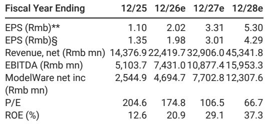
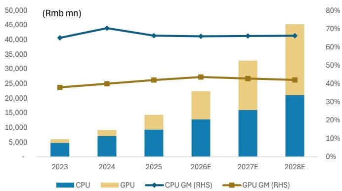

# MS：海光信息Sugon8000发布与读者反馈

上周，郑州上线了国内首个十万卡 AI 超算集群“Sugon 8000”。集群内六类核心芯片——从 CPU、GPGPU 到交换芯片、网卡——全部由 Sugon 与 Hygon 生态自主研发。这不仅是算力规模的一次跃迁，更让市场重新审视一家公司的定位：Hygon。

MS在最新报告中回应了读者围绕 Hygon 的三个核心疑问：它与纯 GPU 公司的差异何在、其 CPU 业务为何不应被低估、以及在智能体 AI 时代它扮演什么角色。报告的核心判断是，市场可能低估了 CPU 在 AI 基础设施中的结构性价值，尤其是在中国语境下。

## 1. “CPU+GPU”一体化模式，与纯 GPU 公司形成差异化竞争

国内多数 AI 芯片公司聚焦 GPU 单点突破。Hygon 的不同之处在于，它同时提供 CPU 和 DCU（GPGPU），能够覆盖通用服务器负载与 AI 训练/推理两类场景。报告认为，这种“CPU+GPU”一体化模式让 Hygon 在客户部署中拥有更高的集成度和兼容性。

另一个关键变量是其大股东 Sugon（持股 27.96%）。Sugon 不仅是超算制造商，更是中国 AI 基础设施的全链条参与者——从芯片、计算、存储、网络到冷却、应用和服务。Hygon 可以借助 Sugon 生态获取更多 CPU 和 GPU 市场份额。

> **KC评论：** 市场习惯将 Hygon 与寒武纪、海光等 GPU 公司直接对标。但报告提醒，Hygon 的竞争逻辑更接近“平台型”——它卖的不只是加速卡，而是从 CPU 到互联芯片的整机能力。这种差异在客户采购决策中可能比纸面算力更重要。

## 2. CPU 市场增速可能快于 AI GPU，不应被给予更低估值

部分读者不愿给 Hygon 的 CPU 业务高估值，理由是 CPU 不受进口限制，且市场增速低于 GPU。但MS给出了相反的数据：中国服务器 CPU 市场（含智能体 AI 需求）预计 2024-2030 年复合增速为 31%，高于 AI GPU 市场的 23%。

背后的驱动力来自政策和供应链安全。报告指出，CPU 的国产化替代并非单纯的市场选择，而是采购指令和供应链安全要求共同推动的结果。这意味着 Hygon 的 CPU 业务面临的政策确定性高于 GPU 业务，其估值逻辑不应简单套用 GPU 公司的倍数。

## 3. 智能体 AI 时代，CPU 承担系统级协调角色，Hygon 定位安全敏感场景

报告专门讨论了智能体 AI（agentic AI）对 CPU 需求的影响。随着 AI 系统向多智能体架构演进，CPU 越来越多地负责工作流控制和系统级协调。MS测算，到 2030 年中国智能体 AI 的 CPU 市场规模可达 170 亿美元，占全球需求的 21%。

Hygon 的 CPU 在政府、资金等安全敏感领域已有部署，这与智能体 AI 对数据主权、计算隔离和可信基础设施的要求高度吻合。报告预计 Hygon 可覆盖该市场 3%-5% 的需求，其下一代 CPU 将在主频、性能和安全性上进一步升级。

> **KC评论：** 智能体 AI 对 CPU 的需求增量，是一个容易被忽视的变量。当市场注意力集中在 GPU 算力竞赛时，CPU 作为“调度中枢”的价值正在被重新定义。Hygon 在安全敏感行业的存量客户，可能是它切入这一市场的天然入口。

Sugon 8000 的落地是一个信号：国产 AI 基础设施正在从“单点替代”走向“全栈闭环”。Hygon 能否在这一进程中持续扩大份额，取决于它能否将 CPU 的生态优势转化为客户粘性，并在智能体 AI 的增量市场中建立先发位置。

For informational purposes only. Portions may be generated,translated,summarized,or edited with AI assistance based on source materials and may contain omissions or errors. Please verify independently. This is not investment,legal,tax,accounting,or other professional advice.

For informational purposes only. Portions may be generated,translated,summarized,or edited with AI assistance based on source materials and may contain omissions or errors. Please verify independently. This is not investment,legal,tax,accounting,or other professional advice.

