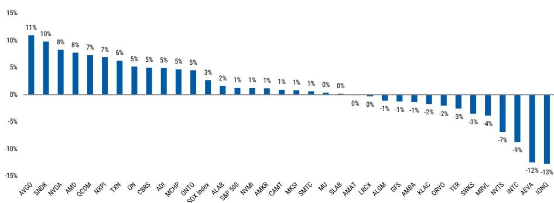
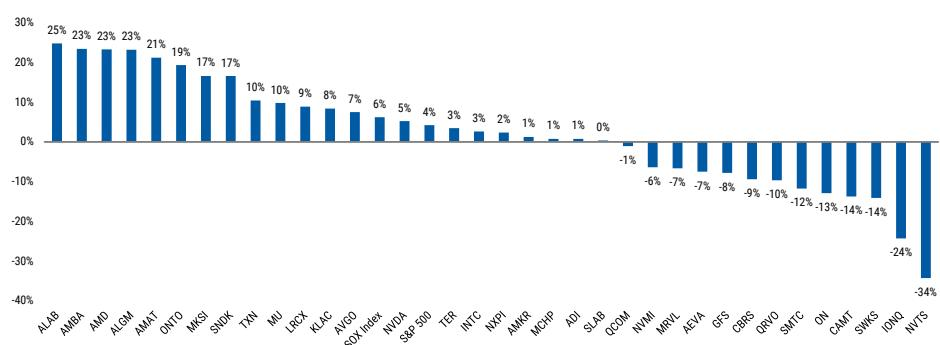
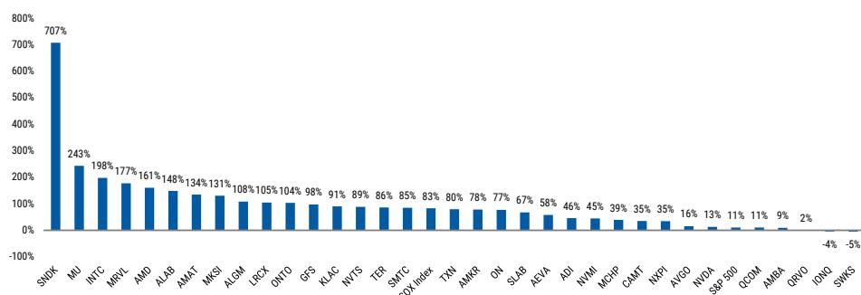
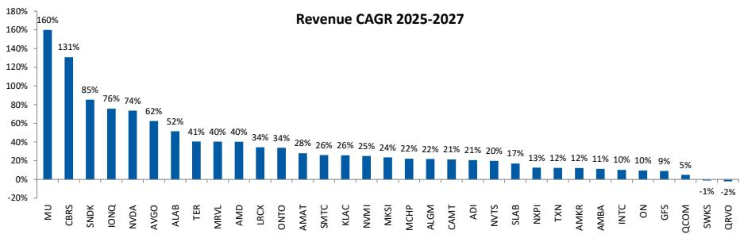
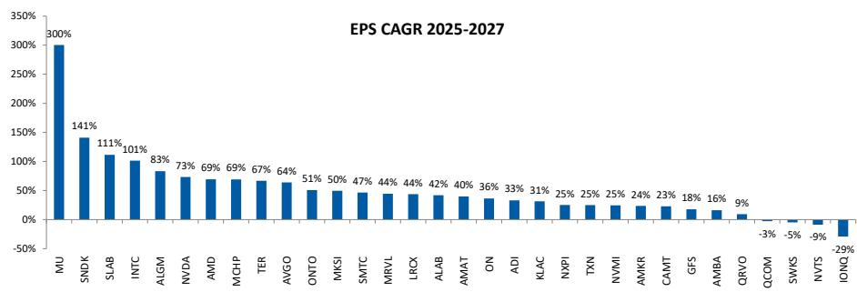
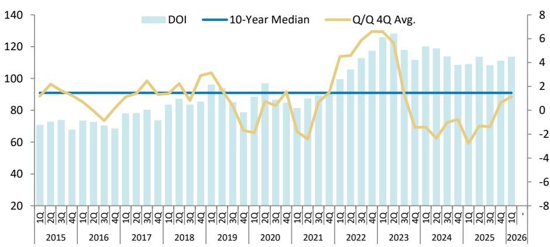
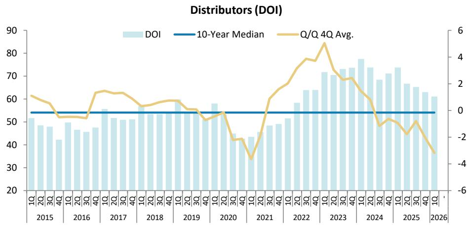

July 13, 2026 04:56 AM GMT

Semiconductors | North America

# Weekly: NVDA Road Show Feedback

We address feedback from last week's NDR; NVDA remains our top pick in semis, and we think some of the themes from this NDR could be key in unlocking the value that we see.

## Feedback Post the NVIDIA Road Show

Last week, we hosted several meetings with NVDA CEO Jensen Huang, CFO Collette Kress, and head of IR Toshiya Hari. We wrote a note about it on Friday (link), and have had dozens of investor interactions with significant feedback.

We note that specialists continue to be fundamentally mostly optimistic about NVIDIA's near term earnings prospects, and the overall most asked question is "what does it take for the company to outperform" given recent relative performance for no fundamental reason. Our answer is that we aren't frankly sure on the catalyst but the valuation disconnect is too wide to persist.

## We Have Several Points of Feedback:

1) There is significant interest in the notion that NVIDIA is working closely with more value and income based accounts. This makes sense to us, as the biggest single challenge for the company is the outsized market cap and index exposures; there simply have been a lack of incremental buyers, at a time when every mid/large cap peer has had a significant bid. NVIDIA working with value and income based fund groups & family offices - while continuing to focus on its core growth investor base - can be an answer to this issue. Value interest in the name should be clear, given current quarter growth of 95% in the quarter before a major product cycle, management's contention that this growth is accelerating, and a greater than 5% free cash flow yield for next year with over half of that cash likely to be returned.

2) Strong near term business is the expectation everywhere. While there is a vigorous debate about longer term growth, market share, and profitability, there was very little pushback on the notion of accelerating revenue from the current strong growth rates.

3) There continues to be mixed feedback on the re-segmentation, and the growth rate of the AI cloud/Sovereign/Enterprise portion of the business. We find, in particular, the geographic reshoring of AI data centers as a compelling theme, as global shortages of space and power are leading countries to carve out those resources for domestic companies rather than for US hyperscalers. This of course is not a new topic, but those dynamics are intensifying and in some cases we are seeing new deployments as regulatory approvals happen.

In particular, the notion of a new neo-cloud business model proposed by NVIDIA in a blog post a week or so ago could frame the next big debate for the company. NVIDIA will provide credit support for a broader range of neo-clouds in exchange for revenue sharing on cloud services, in addition to the hardware sales. It's a debate because credit support has some cost that isn't evident from the P&L, as well as some risk. But as the focus shifts from what could go wrong to what could go right, given the substantial compute shortage, the company could end up with a substantial recurring revenue stream at 100% gross margins. We plan to dig into this further.

4) NVIDIA commentary contributes to the memory debate. In particular, NVIDIA's comments that the memory shortage - which they expect to last for several years - will lead them to try to adapt and make do with less - have created some debates for the memory names.

We remain optimistic about the memory cycle. But that enthusiasm is less about peak earnings power, and more about the duration of the current high earnings environment, and we are seeing several factors that to some degree trade cycle amplitude for cycle duration. That's true of long term agreements - which could dampen near term price upside, but which add to longer term visibility - and is true of data center users getting by with less memory, as a matter of need, which should result in higher demand when there is higher supply. Of course, both amplitude and duration matter, but our focus is the total area under the curve of the upturn, which seems quite significant.

## Semiconductor Coverage – Valuation / Stock Performance

Exhibit 1: Weekly stock performance  
  
Source: FactSet, MS

Exhibit 2: Monthly stock performance  
  
Source: FactSet, MS

Exhibit 3: YTD stock performance  
  
Source: FactSet, MS  
-4% -5%

## Semis Week Ahead

## Exhibit 4: July 13th - July 17th, 2026

Monday, July 13th

Tuesday, July 14th  
AEHR Earnings  
5:00pm ET  
Wednesday, July 15th  
ASML Earnings  
9:00am ET  
SEMI Advanced Packaging Summit 2026  
https://www.semi.org/en/connect/events/advanced-packaging-summit-2026

Thursday, July 16th
TSMC Earnings
2:00am ET

Friday, July 17th

LOOKING AHEAD  
Wednesday, July 22nd  
TXN Earnings  
4:30pm ET  
AMD Advancing AI - Day 1

Thursday, July 23rd  
BESI Earnings  
10:00am ET  
STMicro Earnings  
3:30am ET  
AMD Advancing AI - Day 2  
Livestream - https://www.youtube.com/@AMD/streams  
INTC Earnings  
5:00pm ET

July 26th-29th DAC 2026: The Chips To Systems Conference https://dac.com/2026

Monday, July 27th  
NVTS Earnings  
5:00pm ET  
AMKR Earnings  
5:00pm ET

Tuesday, July 28th  
NXPI Earnings  
4:30pm ET  
KLAC Earnings  
5:00pm ET

Wednesday, July 29th
Melexis Earnings
4:30am ET
ASMI Earnings
9:00am ET
QCOM Earnings
4:45pm ET
ARM Earnings
5:00pm ET
LRCX Earnings
5:00pm ET

Thursday, July 30th ALGM Earnings 8:30am ET

Monday, August 3rd UCTT Earnings 4:45pm ET

August 4th-6th
Flash Memory Summit (FMS): Future of Memory & Storage
https://flashmemorysummit.com/

Tuesday, August 4th  
ALAB Earnings  
4:30pm ET  
AMD Earnings  
5:00pm ET

Wednesday, August 5th
IFX Earnings
3:30am ET
GFS Earnings
8:30am ET
SNDK Earnings
4:30pm ET

August 23rd-25th Hot Chips https://hotchips.org/

Wednesday, August 26th
NVDA Earnings
5:00pm ET

September 2nd-4th SEMICON Taiwan https://www.semicontaiwan.org/en

Tuesday, September 8th
IONQ Investor Day
2:00pm ET

September 8th-11th
SPIE Photomask Technology + EUV Lithography https://spie.org/conferences-and-exhibitions/ph

September 15th-17th
Al Infra Summit
https://www.ai-infra-summit.com/

Wednesday, September 16th ON Financial Analyst Day 2:00pm ET

September 22nd-24th
QCOM Snapdragon Summit
https://www.quakcomm.com/company/events/snapdragon-summit

Wednesday, September 23rd
TSMC North America OIP Ecosystem Forum
https://pr.tsmc.com/english/events

October 12th-15th
OCP Global Summit
https://www.opencompute.org/summit/global-summit

October 13th-15th SEMICON West https://www.semiconwest.org/

October 20th-22nd  
GTC Berlin  
https://www.nvidia.com/en-eu/gtc/  
Wednesday, October 21st  
NVDA CEO Jensen Huang Keynote  
Livestream link TBD - 5:00am ET

November 10th-13th SEMICON Europa https://www.semiconeuropa.org/

November 15th-20th
SC26 (Supercomputing Conference)
https://sc26.supercomputing.org/

December 9th-11th SEMICON Japan https://www.semiconjapan.org/en

Source: Bloomberg, Refinitiv, MS

## Semiconductor Coverage

Exhibit 5: Semiconductors - Risk Reward

<table><tr><td rowspan="2">Ticker</td><td rowspan="2">Rating</td><td rowspan="2">Price</td><td colspan="3">Risk-Reward</td><td rowspan="2">% Upside / Downside Base</td></tr><tr><td>Bear</td><td>Base</td><td>Bull</td></tr><tr><td colspan="7">Computing</td></tr><tr><td>AMD</td><td>EW</td><td>$557.9</td><td>$210</td><td>$410</td><td>$570</td><td>-27%</td></tr><tr><td>CBRS</td><td>OW</td><td>$215.1</td><td>$90</td><td>$273</td><td>$400</td><td>27%</td></tr><tr><td>INTC</td><td>EW</td><td>$109.8</td><td>$43</td><td>$73</td><td>$110</td><td>-34%</td></tr><tr><td>NVDA</td><td>OW</td><td>$211.0</td><td>$160</td><td>$288</td><td>$330</td><td>37%</td></tr><tr><td colspan="7">Memory</td></tr><tr><td>MU</td><td>OW</td><td>$979.3</td><td>$675</td><td>$1,200</td><td>$1,650</td><td>23%</td></tr><tr><td>SNDK</td><td>OW</td><td>$1,915.9</td><td>$1,100</td><td>$1,750</td><td>$2,635</td><td>-9%</td></tr><tr><td colspan="7">Capital Equipment</td></tr><tr><td>AMAT</td><td>EW</td><td>$602.5</td><td>$455</td><td>$647</td><td>$854</td><td>7%</td></tr><tr><td>CAMT</td><td>EW</td><td>$143.8</td><td>$119</td><td>$167</td><td>$222</td><td>16%</td></tr><tr><td>KLAC</td><td>OW</td><td>$231.5</td><td>$171</td><td>$274</td><td>$333</td><td>18%</td></tr><tr><td>LRCX</td><td>OW</td><td>$350.3</td><td>$289</td><td>$404</td><td>$519</td><td>15%</td></tr><tr><td>MKSI</td><td>OW</td><td>$368.6</td><td>$278</td><td>$442</td><td>$595</td><td>20%</td></tr><tr><td>NVMI</td><td>EW</td><td>$475.9</td><td>$384</td><td>$540</td><td>$723</td><td>13%</td></tr><tr><td>ONTO</td><td>OW</td><td>$321.4</td><td>$257</td><td>$371</td><td>$475</td><td>15%</td></tr><tr><td>TER</td><td>EW</td><td>$359.6</td><td>$267</td><td>$387</td><td>$512</td><td>8%</td></tr><tr><td colspan="7">Comm-IC / Multi-Market</td></tr><tr><td>ALAB</td><td>OW</td><td>$413.0</td><td>$121</td><td>$240</td><td>$332</td><td>-42%</td></tr><tr><td>AMBA</td><td>OW</td><td>$77.3</td><td>$34</td><td>$96</td><td>$136</td><td>24%</td></tr><tr><td>AVGO</td><td>OW</td><td>$400.0</td><td>$308</td><td>$502</td><td>$637</td><td>26%</td></tr><tr><td>MRVL</td><td>EW</td><td>$235.8</td><td>$130</td><td>$195</td><td>$286</td><td>-17%</td></tr><tr><td>QCOM</td><td>EW</td><td>$189.2</td><td>$108</td><td>$231</td><td>$305</td><td>22%</td></tr><tr><td>QRVO</td><td>EW</td><td>$85.8</td><td>$40</td><td>$84</td><td>$110</td><td>-2%</td></tr><tr><td>SMTC</td><td>EW</td><td>$136.1</td><td>$95</td><td>$175</td><td>$230</td><td>29%</td></tr><tr><td>SWKS</td><td>EW</td><td>$60.4</td><td>$43</td><td>$76</td><td>$105</td><td>26%</td></tr><tr><td colspan="7">Analog / MCUs</td></tr><tr><td>ADI</td><td>OW</td><td>$395.7</td><td>$342</td><td>$428</td><td>$517</td><td>8%</td></tr><tr><td>ALGM</td><td>OW</td><td>$54.9</td><td>$43</td><td>$51</td><td>$70</td><td>-7%</td></tr><tr><td>MCHP</td><td>EW</td><td>$88.6</td><td>$69</td><td>$94</td><td>$118</td><td>6%</td></tr><tr><td>NVTS</td><td>UW</td><td>$13.5</td><td>$4.9</td><td>$13.7</td><td>$22.7</td><td>2%</td></tr><tr><td>NXPI</td><td>OW</td><td>$292.3</td><td>$268</td><td>$335</td><td>$400</td><td>15%</td></tr><tr><td>ON</td><td>NC</td><td>$96.0</td><td>++</td><td>++</td><td>++</td><td>-</td></tr><tr><td>SLAB</td><td>EW</td><td>$218.6</td><td>$83</td><td>$231</td><td>$265</td><td>6%</td></tr><tr><td>TXN</td><td>UW</td><td>$311.5</td><td>$184</td><td>$221</td><td>$263</td><td>-29%</td></tr><tr><td colspan="7">Components</td></tr><tr><td>AEVA</td><td>EW</td><td>$21.0</td><td>$4.5</td><td>$18.5</td><td>$52.0</td><td>-12%</td></tr><tr><td colspan="7">Foundry</td></tr><tr><td>AMKR</td><td>EW</td><td>$70.5</td><td>$49</td><td>$69</td><td>$88</td><td>-2%</td></tr><tr><td>GFS</td><td>EW</td><td>$69.0</td><td>$34</td><td>$58</td><td>$96</td><td>-16%</td></tr><tr><td colspan="7">Quantum Computing</td></tr><tr><td>IONQ</td><td>EW</td><td>$42.9</td><td>$6</td><td>$48.5</td><td>$110</td><td>13%</td></tr></table>

Source: FactSet, MS estimates

Exhibit 6: MS vs. Street

<table><tr><td rowspan="2" colspan="2"></td><td colspan="3">CY2026e EPS</td><td rowspan="2"></td><td colspan="3">CY2026e Revenue</td></tr><tr><td>MS</td><td>Consensus</td><td>% Diff</td><td>MS</td><td>Consensus</td><td>% Diff</td></tr><tr><td rowspan="14">OW</td><td>ADI</td><td>$13.21</td><td>$12.74</td><td>(4%)</td><td>ADI</td><td>$15,499</td><td>$15,067</td><td>(3%)</td></tr><tr><td>ALAB</td><td>$2.88</td><td>$3.02</td><td>(8%)</td><td>ALAB</td><td>$1,532</td><td>$1,550</td><td>(1%)</td></tr><tr><td>ALGM</td><td>$0.93</td><td>$0.88</td><td>10%</td><td>ALGM</td><td>$1,048</td><td>$1,022</td><td>2%</td></tr><tr><td>AMBA</td><td>$0.74</td><td>$0.78</td><td>3%</td><td>AMBA</td><td>$443</td><td>$437</td><td>0%</td></tr><tr><td>AVGO</td><td>$13.68</td><td>$12.89</td><td>(3%)</td><td>AVGO</td><td>$123,943</td><td>$116,826</td><td>0%</td></tr><tr><td>CBRS</td><td>-$0.78</td><td>-$0.94</td><td>(3%)</td><td>CBRS</td><td>$863</td><td>$866</td><td>0%</td></tr><tr><td>KLAC</td><td>$4.42</td><td>$4.45</td><td>(1%)</td><td>KLAC</td><td>$15,453</td><td>$15,451</td><td>(0%)</td></tr><tr><td>LRCX</td><td>$7.21</td><td>$6.91</td><td>(0%)</td><td>LRCX</td><td>$27,917</td><td>$27,110</td><td>(0%)</td></tr><tr><td>MKSI</td><td>$11.95</td><td>$11.74</td><td>4%</td><td>MKSI</td><td>$4,870</td><td>$4,808</td><td>1%</td></tr><tr><td>MU</td><td>$104.09</td><td>$99.70</td><td>45%</td><td>MU</td><td>$172,900</td><td>$168,899</td><td>18%</td></tr><tr><td>NVDA</td><td>$4.77</td><td>$8.62</td><td>6%</td><td>NVDA</td><td>$215,938</td><td>$377,965</td><td>5%</td></tr><tr><td>NXPI</td><td>$14.96</td><td>$14.73</td><td>4%</td><td>NXPI</td><td>$14,138</td><td>$14,067</td><td>1%</td></tr><tr><td>ONTO</td><td>$7.31</td><td>$7.20</td><td>4%</td><td>ONTO</td><td>$1,347</td><td>$1,342</td><td>1%</td></tr><tr><td>SNDK</td><td>$161.07</td><td>$135.50</td><td>43%</td><td>SNDK</td><td>$38,078</td><td>$34,035</td><td>7%</td></tr><tr><td rowspan="17">EW</td><td>AEVA</td><td>-$1.80</td><td>-$1.69</td><td>2%</td><td>AEVA</td><td>$33</td><td>$32</td><td>(19%)</td></tr><tr><td>AMAT</td><td>$13.96</td><td>$13.03</td><td>2%</td><td>AMAT</td><td>$36,976</td><td>$35,004</td><td>3%</td></tr><tr><td>AMD</td><td>$7.22</td><td>$7.47</td><td>1%</td><td>AMD</td><td>$48,807</td><td>$49,970</td><td>(5%)</td></tr><tr><td>AMKR</td><td>$2.07</td><td>$2.08</td><td>(8%)</td><td>AMKR</td><td>$7,570</td><td>$7,610</td><td>(4%)</td></tr><tr><td>CAMT</td><td>$3.56</td><td>$3.50</td><td>10%</td><td>CAMT</td><td>$577</td><td>$571</td><td>5%</td></tr><tr><td>GFS</td><td>$1.94</td><td>$1.89</td><td>(4%)</td><td>GFS</td><td>$7,250</td><td>$7,240</td><td>(1%)</td></tr><tr><td>INTC</td><td>$1.12</td><td>$1.08</td><td>21%</td><td>INTC</td><td>$58,131</td><td>$58,545</td><td>0%</td></tr><tr><td>IONQ</td><td>-$0.54</td><td>-$0.37</td><td>(109%)</td><td>IONQ</td><td>$266</td><td>$266</td><td>3%</td></tr><tr><td>MCHP</td><td>$2.71</td><td>$2.78</td><td>(1%)</td><td>MCHP</td><td>$5,769</td><td>$5,818</td><td>2%</td></tr><tr><td>MRVL</td><td>$3.98</td><td>$3.95</td><td>3%</td><td>MRVL</td><td>$11,498</td><td>$11,223</td><td>2%</td></tr><tr><td>NVMI</td><td>$10.18</td><td>$10.48</td><td>1%</td><td>NVMI</td><td>$1,064</td><td>$1,065</td><td>4%</td></tr><tr><td>QCOM</td><td>$9.23</td><td>$10.81</td><td>(100%)</td><td>QCOM</td><td>$39,926</td><td>$42,952</td><td>(100%)</td></tr><tr><td>QRVO</td><td>$6.31</td><td>$6.89</td><td>(3%)</td><td>QRVO</td><td>$3,346</td><td>$3,507</td><td>(7%)</td></tr><tr><td>SLAB</td><td>$3.00</td><td>$2.77</td><td>9%</td><td>SLAB</td><td>$934</td><td>$922</td><td>1%</td></tr><tr><td>SMTC</td><td>$2.72</td><td>$2.58</td><td>(2%)</td><td>SMTC</td><td>$1,375</td><td>$1,331</td><td>0%</td></tr><tr><td>SWKS</td><td>$4.68</td><td>$5.04</td><td>(4%)</td><td>SWKS</td><td>$3,750</td><td>$3,948</td><td>(3%)</td></tr><tr><td>TER</td><td>$8.03</td><td>$7.46</td><td>0%</td><td>TER</td><td>$4,748</td><td>$4,538</td><td>2%</td></tr><tr><td rowspan="2">UW</td><td>NVTS</td><td>-$0.17</td><td>-$0.17</td><td>13%</td><td>NVTS</td><td>$43</td><td>$42</td><td>15%</td></tr><tr><td>TXN</td><td>$7.82</td><td>$7.70</td><td>(1%)</td><td>TXN</td><td>$21,035</td><td>$21,020</td><td>(1%)</td></tr><tr><td>++</td><td>ON</td><td>$3.12</td><td>$3.08</td><td>8%</td><td>ON</td><td>$6,472</td><td>$6,472</td><td>(0%)</td></tr></table>

Source: FactSet, MS estimates

## Revenue and EPS Growth

Exhibit 7: 2025-27e Revenue CAGR  
  
Source: FactSet, MS estimates

Exhibit 8: 2025-27e EPS CAGR  
  
Source: FactSet, MS estimates

## Inventory

Exhibit 9: Semiconductor Company inventory is at 114 days, up 2 days q/q which is 2 days ahead of the seasonal increase of 5 days. DOI is 23 days above the historical median and trailing 4-quarters slightly increased..

Semiconductor Company (DOI)  
  
Source: FactSet, MS

Exhibit 10: Semi Customer DOI increased 9 days sequentially to 60 days vs a seasonal increase of 8 days. DOI is above the historical median and trailing 4 quarters increased from last quarter.

Semi Customers (DOI)  
  
Source: FactSet, MS

Exhibit 11: Distributor inventory is at 61 days, down 2 days q/q, below seasonal increase of 4 days. DOI is 7 days above the historical median while trailing 4-quarters decreased sequentially.  
  
Source: FactSet, MS

## Short Interest

Exhibit 12: Short Interest as % of Float

<table><tr><td></td><td>10/Jul/25</td><td>10/Apr/26</td><td>10/May/26</td><td>10/Jun/26</td><td>10/Jul/26</td></tr><tr><td>ADI</td><td>1.7%</td><td>2.0%</td><td>2.2%</td><td>1.9%</td><td>2.5%</td></tr><tr><td>AEVA</td><td>8.2%</td><td>12.4%</td><td>11.9%</td><td>10.7%</td><td>6.9%</td></tr><tr><td>ALAB</td><td>6.4%</td><td>9.0%</td><td>7.7%</td><td>6.9%</td><td>7.4%</td></tr><tr><td>ALGM</td><td>7.0%</td><td>6.4%</td><td>5.9%</td><td>6.4%</td><td>8.3%</td></tr><tr><td>AMAT</td><td>1.9%</td><td>1.6%</td><td>2.0%</td><td>2.5%</td><td>2.5%</td></tr><tr><td>AMBA</td><td>4.9%</td><td>4.8%</td><td>6.0%</td><td>5.1%</td><td>7.5%</td></tr><tr><td>AMD</td><td>3.0%</td><td>2.2%</td><td>2.2%</td><td>2.7%</td><td>2.6%</td></tr><tr><td>AMKR</td><td>2.6%</td><td>3.5%</td><td>3.0%</td><td>3.4%</td><td>3.6%</td></tr><tr><td>AVGO</td><td>1.2%</td><td>1.1%</td><td>1.1%</td><td>1.2%</td><td>1.5%</td></tr><tr><td>CAMT</td><td>7.8%</td><td>7.4%</td><td>6.5%</td><td>6.5%</td><td>5.8%</td></tr><tr><td>CBRS</td><td></td><td></td><td></td><td>2.1%</td><td>4.8%</td></tr><tr><td>GFS</td><td>1.8%</td><td>3.1%</td><td>1.8%</td><td>1.4%</td><td>1.3%</td></tr><tr><td>INTC</td><td>2.6%</td><td>2.4%</td><td>2.8%</td><td>2.7%</td><td>2.5%</td></tr><tr><td>IONQ</td><td>9.8%</td><td>21.7%</td><td>22.4%</td><td>15.5%</td><td>11.8%</td></tr><tr><td>KLAC</td><td>2.8%</td><td>2.4%</td><td>2.4%</td><td>26.9%</td><td>2.6%</td></tr><tr><td>LRCX</td><td>2.5%</td><td>2.2%</td><td>2.3%</td><td>2.6%</td><td>2.3%</td></tr><tr><td>MCHP</td><td>6.5%</td><td>5.1%</td><td>5.5%</td><td>6.0%</td><td>7.2%</td></tr><tr><td>MKSI</td><td>6.1%</td><td>5.5%</td><td>5.3%</td><td>6.6%</td><td>7.3%</td></tr><tr><td>MRVL</td><td>2.9%</td><td>3.2%</td><td>3.2%</td><td>4.0%</td><td>3.9%</td></tr><tr><td>MU</td><td>2.5%</td><td>2.8%</td><td>3.3%</td><td>3.3%</td><td>2.8%</td></tr><tr><td>NVDA</td><td>1.0%</td><td>1.2%</td><td>1.2%</td><td>1.2%</td><td>1.3%</td></tr><tr><td>NVMI</td><td>5.2%</td><td>5.2%</td><td>4.8%</td><td>5.6%</td><td>4.6%</td></tr><tr><td>NVTS</td><td>19.7%</td><td>18.3%</td><td>17.7%</td><td>15.2%</td><td>14.6%</td></tr><tr><td>NXPI</td><td>2.4%</td><td>3.2%</td><td>2.6%</td><td>3.3%</td><td>3.5%</td></tr><tr><td>ON</td><td>9.0%</td><td>7.9%</td><td>7.5%</td><td>8.0%</td><td>7.7%</td></tr><tr><td>ONTO</td><td>4.3%</td><td>2.7%</td><td>2.0%</td><td>3.9%</td><td>5.3%</td></tr><tr><td>QCOM</td><td>2.0%</td><td>4.1%</td><td>4.7%</td><td>4.3%</td><td>3.8%</td></tr><tr><td>QRVO</td><td>7.0%
