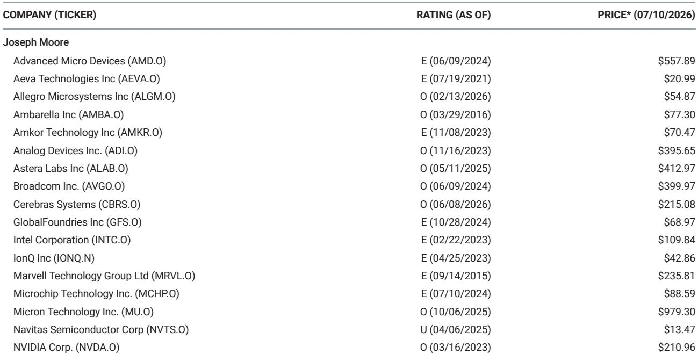
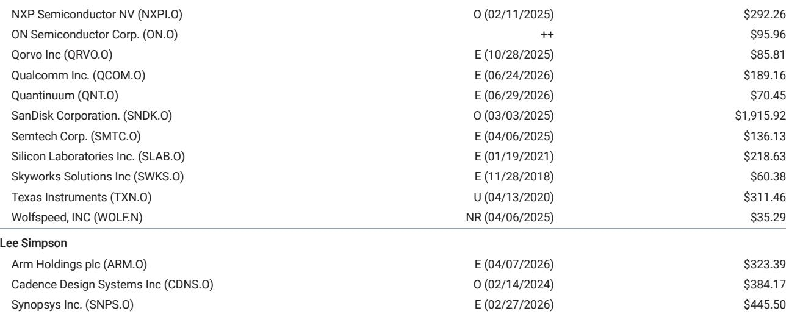
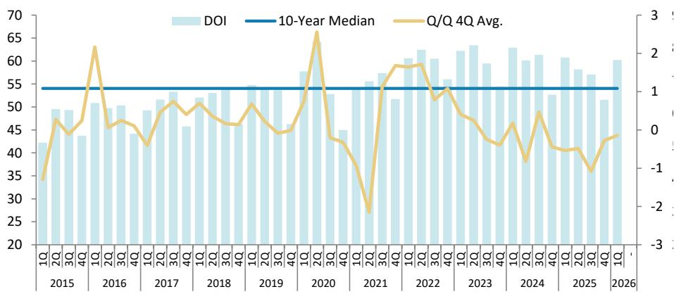

# 关于某科技公司估值与市场认知差异的观察：买方结构变化与新商业模式或重塑市场定价

某科技公司当前季度收入同比增长95%，且处于重大产品周期之前，管理层将这一增长描述为加速态势。该公司预计明年自由现金流回报率超过5%，其中超过一半的现金可能返还给股东。然而，该公司近期报价表现落后于同行业中型和大型公司，且并无基本面原因。这并非业务状况恶化的故事，而是公司盈利能力与其读者基础之间存在结构性错配。

近期与该公司CEO、CFO及读者关系负责人交流后，机构读者提出的核心问题并非关于需求、竞争或利润率，而是直截了当：需要什么条件才能让报价反映观点？会议得出的答案有两个方面。首先，该公司正积极将其股东基础从增长导向型基金扩展到价值和收益型账户，这一转变直接针对报价最持久的阻力。其次，一种新的云商业模式（尚处于早期阐述阶段）可能创造高利润率的经常性收入流，从而改变市场对公司的估值方式。这两项发展共同指向一个难以持续的估值认知差异。

## 将买方基础扩展至增长型读者之外，直接应对报价的结构性表现问题

该公司报价面临的最大挑战并非技术、竞争地位或短期盈利轨迹，而是其庞大的市值及由此产生的指数敞口。这造成了一种局面：当所有中型和大型半导体同行都享有显著买盘时，增量买家却恰恰稀缺。增长型基金一直是该公司的主要持有者，但日益受到集中度限制和投资组合权重上限的约束。报价所反映的估值，正是这种买方枯竭，而非基础业务的任何恶化。

该公司目前正与价值和收益型基金集团以及家族办公室密切合作，同时继续与其核心增长型读者群体保持互动。这是对结构性问题的战略回应。逻辑很简单：一家当前季度收入同比增长95%、管理层明确表示增长正在加速、且下一财年自由现金流回报率超过5%的公司，符合价值导向型读者的标准。仅自由现金流回报率一项，加上可能将超过一半现金返还给股东的资本回报计划，就为历来回避该名称的收益型账户创造了令人信服的理由。

这意味着该公司正试图在其股东名册中实现一次轮换。如果成功，这将创造一种新的需求来源，且与主导该报价交易模式的增长型基金资金流无关。该公司与同行之间的估值差距（尽管基本面表现更优，但差距仍在扩大）正是这种买方集中度的直接后果。扩大基础是缩小这一差距的最直接路径。

## 新云模式或可创造毛利率100%的经常性收入流

此次交流中讨论的最具战略意义的发展，是该公司近期博客文章中提出的新云商业模式。在此框架下，该公司将向更广泛的新云提供商提供信贷支持，以换取云服务的收入分成，同时向其销售硬件。这并非一项小规模的融资安排，而是代表着该公司如何将其计算基础设施货币化的潜在转变。

读者之间的争论集中在成本和风险上。信贷支持具有实际成本，不会立即体现在损益表上，并且会引入该公司历史上未曾有过的资产负债表风险。这些都是合理的担忧。但争论的框架正在改变。随着焦点从“可能出什么问题”转向“可能带来什么好处”，机会变得清晰。鉴于巨大且持续的计算能力短缺，获得该公司信贷支持的新云提供商将部署原本不存在的产能。该公司从由此产生的云服务中获得的收入分成，将具有实际上100%的毛利率，从而创造出完全增量于硬件销售的经常性收入流。

这一战略逻辑令人信服。全球计算能力短缺并非暂时现象。各国为本国公司而非美国超大规模企业划拨国内计算资源，导致AI数据中心的地理回迁正在加剧。监管审批正在解锁此前缺乏资本或基础设施进行大规模建设的地区的新部署。该公司的信贷支持加速了这一进程，为其硬件创造了受约束的需求，并产生了市场尚未定价的长期收入流。风险是真实存在的，但结果的不对称性有利于上行。

## 短期收入加速无争议，使估值差距完全成为前瞻性讨论

读者对该公司长期增长轨迹、市场份额可持续性以及峰值盈利能力存在激烈争论。但在交流中，对于收入正在从已经强劲的增长率基础上加速这一观点，几乎没有遇到阻力。这是一个关键点。短期业务不仅良好，而且正在变得更好。当前季度95%的增长发生在重大产品周期之前，这意味着随着新产品的推出，增长率可能维持甚至提高。

普遍观点认为短期盈利强劲。分歧在于未来两到三个季度之后增长曲线的持续时间和斜率。这意味着当前的估值折价完全是长期不确定性的函数。但长期不确定性并不等同于恶化的证据。市场正在定价一个风险溢价，考虑到加速的短期轨迹和新云模式中蕴含的战略选择权，这一溢价可能过高。

读者应认识到，关于长期增长的辩论是在公司积极创造新收入模式、并通过信贷支持和地理多元化扩大其可寻址市场的环境中进行的。急剧减速的风险存在，但持续（即使放缓）增长的概率高于当前估值所暗示的水平。

## 存储周期正从幅度转向持续时间，这有利于总回报而非峰值盈利

该公司关于存储短缺的评论为理解更广泛的半导体周期提供了有用的框架。该公司表示，存储短缺将持续数年，公司将通过尽可能少用存储来适应。这在存储读者中引发了争论，但其影响比简单的需求阻力更为微妙。

关键洞察在于存储周期正在经历结构性转变。存储供应商与客户之间的长期协议抑制了短期价格上涨，但增加了长期可见性。数据中心运营商出于必要而减少存储使用，意味着当供应最终增加时，将存在被压抑的需求，从而支持更长时间的高盈利期。权衡是幅度换取持续时间。峰值盈利可能低于以往周期，但高于趋势的盈利期将延长。

对读者而言，相关指标并非峰值季度盈利数字，而是上升期曲线下的总面积。一个峰值较低但更长的周期，可以比一个急剧飙升后崩溃的周期产生更多的累计现金流。那些能够从这种结构性转变中受益的存储公司，是那些拥有强大长期协议且受益于计算短缺所支撑的数据中心需求的公司。对存储周期的热情应更少关注峰值盈利能力，而更多关注当前高盈利环境的持续时间。

## 读者的决策框架：三个问题判断估值认知差异是否为机会

此次交流的分析可以提炼为一个决策框架，供评估该公司及更广泛半导体领域的读者使用。三个问题决定了当前估值是代表机会还是价值陷阱。

首先，买方基础扩大能否成功？答案取决于价值和收益型读者能否超越该报价增长型的历史，专注于当前的财务指标。5%的自由现金流回报率，加上加速的收入增长和回报资本的承诺，是价值读者历来认为有吸引力的组合。风险在于该报价的指数权重和波动性会阻止这些买家。但公司正在积极接触这一读者群体，这增加了成功的可能性。

其次，新云模式能否创造实质性的新收入流？答案取决于该公司愿意提供的信贷支持规模以及新云提供商的采用率。计算能力短缺是真实且正在加剧的，这为任何能够实现产能部署的融资创造了强劲需求。即使是在不断增长的云服务基础上获得适度的收入分成，也可能在两到三年内增加数十亿美元的高利润率经常性收入。信贷支持的成本是真实的，但相对于潜在上行空间而言是可控的。

第三，存储周期从幅度到持续时间的转变，对总回报而言是净正面吗？对于关注累计现金流而非峰值盈利的读者来说，答案是肯定的。长期协议、受限供应以及数据中心运营商的持续需求相结合，创造了多年的盈利顺风。风险在于习惯于周期性峰值的读者会低估持续时间的价值。

对于所有三个问题都给出肯定答案的读者而言，当前的估值认知差异是一个机会。对于那些在任何领域看到风险的读者来说，该报价近期的表现不佳可能会持续到这些风险得到解决。来自交流的证据表明，概率平衡有利于肯定答案。

*仅供参考。部分内容可能基于源材料通过AI辅助生成、翻译、总结或编辑，可能包含遗漏或错误。请独立核实。这不构成专业建议。*

仅供参考。部分内容可能基于源材料通过AI辅助生成、翻译、总结或编辑，可能包含遗漏或错误。请独立核实。这不构成专业建议。

