# 梅赛德斯-奔驰集团 | 欧洲

## 向东迁移，保持汽车制造领先地位

我们随MBG管理层参观了位于匈牙利的工厂，公司计划在此将产能弹性较高，从新款电动C级车开始。MBG已投资于具有成本竞争力的先进制造，产品线逐步显现，为股东回报提供支撑。

**匈牙利工厂产能弹性较高。** MBG自2022年起在该工厂投资10亿欧元，该工厂是全球第二大工厂，也是欧洲最大工厂。工厂扩建仪式包括匈牙利总理和经济部长出席，显示对MBG计划的支持——将当前20万辆产能提升至40万辆，逐步增加新车型，从新款电动C级车开始。凯奇凯梅特工厂具有高度灵活性和竞争力，较低薪资、较长工时、有限病假和较低能源成本使工厂成本比德国低70%，同时靠近欧洲核心市场，并能出口全球。

**MBG产能向东迁移，是保持成本效率、灵活性和韧性的正确举措。** 计划是在投资与劳动力成本（包括自动化选项）之间平衡分配生产，逐步最大化匈牙利产量，同时保留部分灵活性，可在德国工厂之间调整产量。MBG正在执行的行动计划积极应对市场状况，目标是变得更精简、更灵活、更具成本竞争力。全球已安装产能已从250万辆降至240万辆（墨西哥工厂），目标调整至200-220万辆，并在欧洲和中国的产能进行调整，必要时可进一步降低。部分产能正转向匈牙利，以应对德国的劳动力成本和生产率问题。

**成本聚焦，已在执行阶段。** MBG的成本基础已从2022年到2024年下降10%，公司预计到2027年再下降10%，并通过技术（自动化、机器人、人工智能、工业产能）、德国文化变革（增加工时、降低单位成本）以及将产量转移至匈牙利成本竞争力运营，为后续进一步降本留出空间。与工会的谈判正在进行，但所需结果明确（保持竞争力），董事会致力于实现这一目标。

**保持成本/质量平衡。** MBG的目标不是在材料上节省成本，而是继续投资于产品（研发）和生产自动化，使降本与提升质量并行。

**目标60-70%本地化生产。** 思路是提升全球本地化布局，更贴近客户，以应对贸易壁垒和供应链中断。MBG计划将美国本地化生产从30%（2026年）提升至50%，重点在SUV（包括新款GLC）。欧洲生产将聚焦豪华和性能品牌，本地化率从>80%提升至>85%，增加高端产品全球出口。在中国，思路是本地化入门和核心产品组合，充分利用本地价值链，同时将中国作为亚洲市场的出口枢纽。

**中国市场情况。** 中国本地市场持续面临挑战。MBG一季度销量符合预期，但二季度销量落后，同时电动车占比增加，两者均对利润率产生稀释。中国经销商利润率持续低于盈亏平衡线，可能在下半年获得更多经销商支持，包括销量调整，预计在2026年下半年体现，但谈判仍在进行中。另一方面，MBG的新产品正逐步进入经销商展厅，设计、规格和定价具有竞争力。

**暂无指引调整，但可能很快宣布减值。** 欧洲和美国表现较好，部分弥补了中国市场的情况，金融服务业务处于区间上端，二季度自由现金流为正，但因季度内库存积累而环比下降。可能在2026年二季度看到一些非现金资产调整，MBG对部分投资进行市值重估，尚待观察这些调整对MBG指引的影响。

**汽车业务之外的选项。** 仍在讨论阶段，MBG可利用工业产能“负责任地”增加防务领域敞口，增加无人机生产和其他产品线。公司还展示了人形机器人进展，MBG希望设定标准，目前聚焦于无需精度的简单任务（物流、喷漆），同时投资数据学习，待技术成熟后引领发展，但不急于在大多数装配任务（可变位置任务）中应用。

梅赛德斯是我们偏好的欧洲OEM。我们认为这个市场已发生结构性变化，传统量产OEM的盈利能力有限，被迫依赖产能和成本削减。继宝马发布利润预警后，我们认为MBG可能跟进，两家公司共享高端定位和中国及亚洲市场敞口，关键讨论在于这种压力将如何传导至欧洲，以及这些公司产品线能提供多大保护。我们对MBG的偏好源于其新产品推出速度预期快于宝马的Neue Klasse。近期，MBG的销量、利润率和自由现金流低于潜力，但我们认为戴姆勒卡车的持股为其强劲的股东回报承诺提供了重要支撑。

公司评论为我们对所述内容的理解，不应视为逐字引用。

## MS估算图表

图表1：MBG新车型发布分组：FY25-26车型推动销量
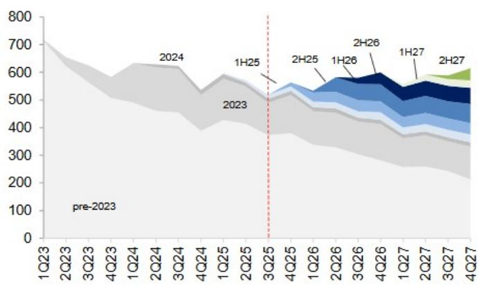
来源：S&P Global, MS。注：全新或重大改款车型的季度预估产量。分组显示初始生产期间。

图表2：新车型可能占销售比例高于同行
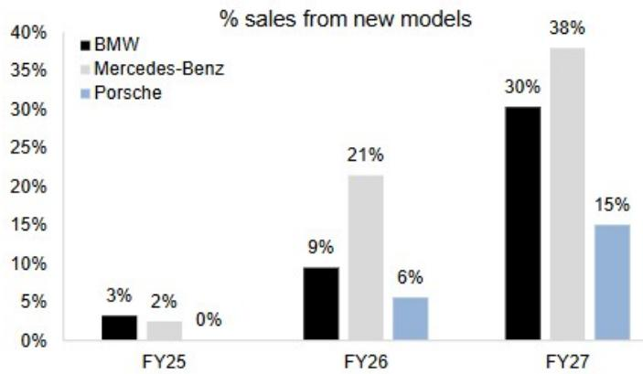
来源：S&P Global, VisibleAlpha, MS。注：全新或重大改款车型的预估产量。仅包括OEM自有品牌。比较FY25-27新车型累计销量与一致预期单位销量。

图表3：MBG指引概览

| | MBG - 指引 | 2025 | 此前指引 | 更新指引 | 一致预期 |
|---|---|---|---|---|---|
| 集团收入 | 百万欧元 | 132,214 | 与上年持平 | 与上年持平 | 130,948 |
| 集团EBIT（报告） | 百万欧元 | 5,820 | 显著高于 | 显著高于 | 6,781 |
| 乘用车RoS（EBIT利润率） | % | 5.0% | 3%-5% | 3%-5% | 3.8% |
| 厢式车RoS（EBIT利润率） | % | 10.2% | 8%-10% | 8%-10% | 9.1% |
| 出行ROE | % | | 10-12% | 10-12% | |
| 工业自由现金流 | 百万欧元 | 5,414 | 略低于 | 略低于 | 4,440 |

来源：MBG, MS估算(e)

图表4：MBG乘用车EBIT利润率
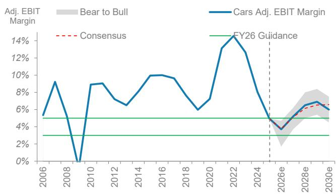
来源：MBG, MS估算(e)

图表5：MBG全球市场份额：MS销售追踪
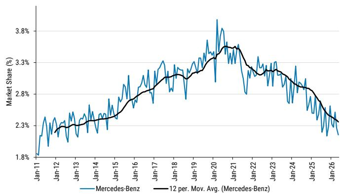
来源：各地汽车协会, MS估算

图表6：MBG EU-5市场份额
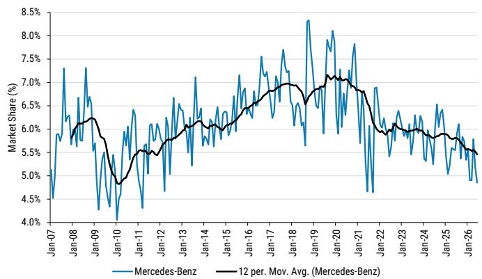
来源：各地汽车协会, MS估算

图表7：MBG美国销量：表现落后于宝马
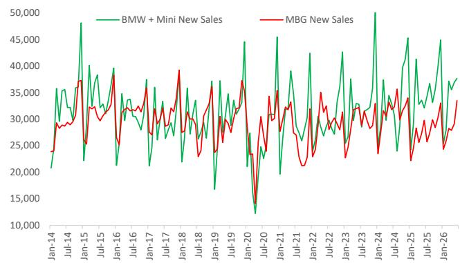
来源：Motor Intelligence, MS估算(e)

图表8：MBG中国市场份额：份额变化
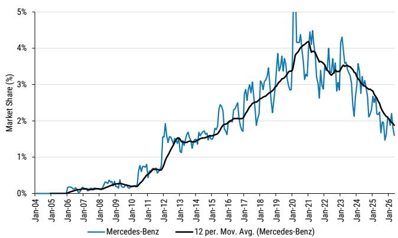
来源：Motor Intelligence, MS估算(e)

图表9：EBIT利润率：一致预期合理
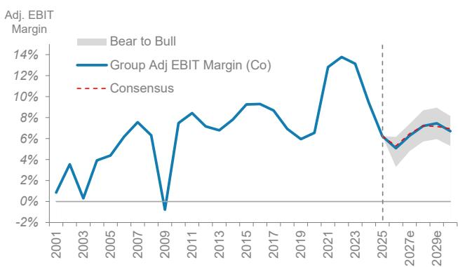
来源：公司数据, MS估算

图表10：EBIT（百万欧元）：我们与一致预期一致
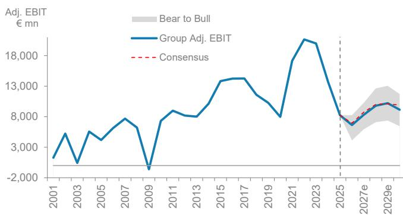
来源：公司数据, Visible Alpha, MS估算(e)

图表11：梅赛德斯EBIT利润率现略高于宝马
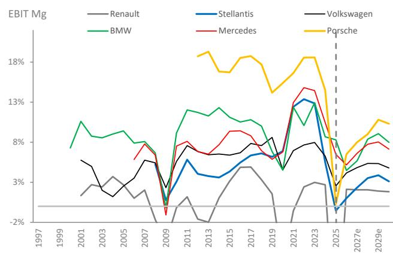
来源：公司数据, MS估算(e)

图表12：...其资本支出+研发较低，导致更高股息支付率（含股票回购）
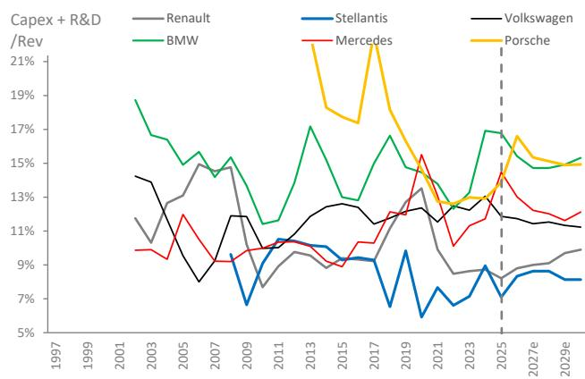
来源：公司数据, MS估算(e)

图表13：价格/组合压力反映在一致预期中（梅赛德斯平均单车收入）...
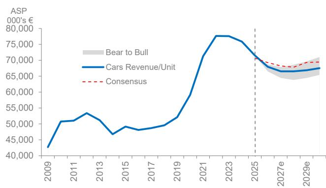
来源：Visible Alpha, 公司数据, MS估算(e)

图表14：...影响净收入
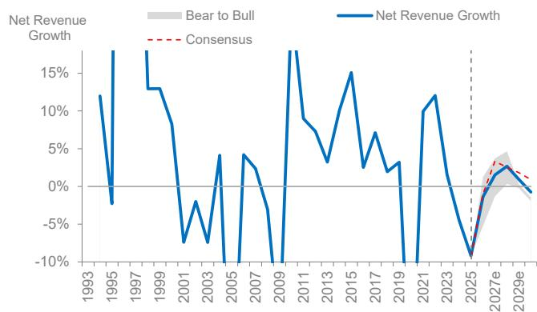
来源：Visible Alpha, 公司数据, MS估算(e)

图表15：资本支出受控，但仍消耗现金流...
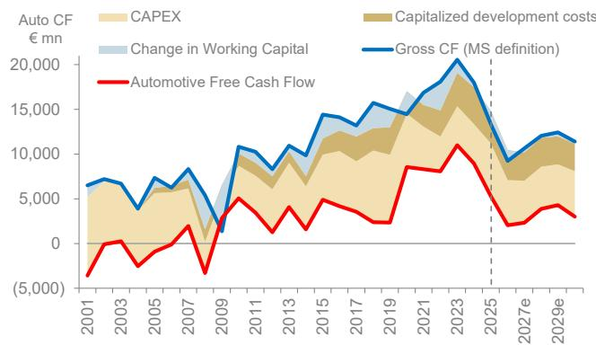
来源：公司数据, MS估算(e)

图表16：...减少股东可获得的工业总现金流比例
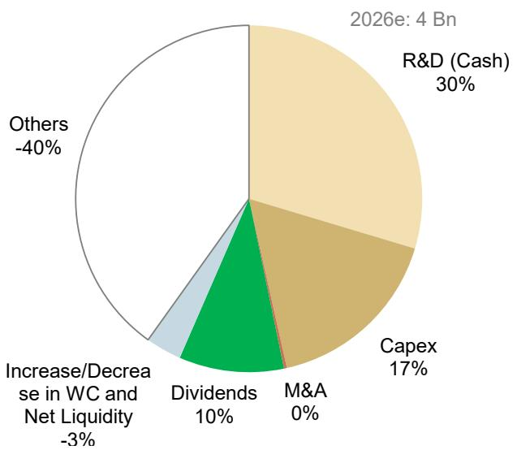
来源：MS估算。注：图表显示2026年梅赛德斯工业总现金流分配情况。

图表17：一致预期修订历史：一致预期现合理
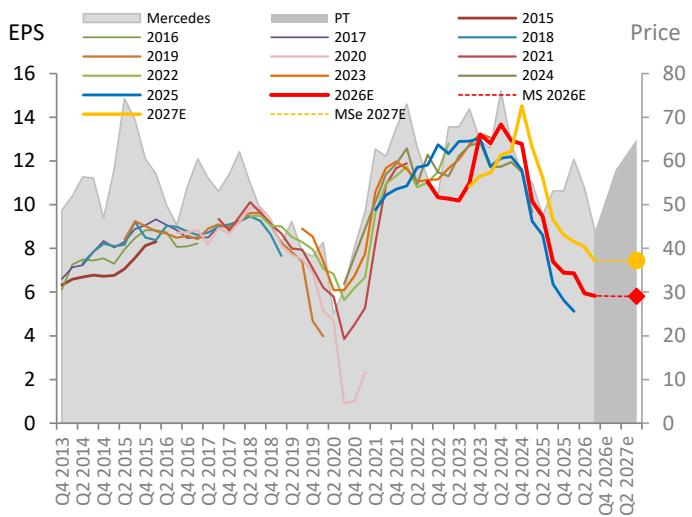
来源：Datastream, MS估算(E)

图表18：评级历史：买入和报告评级增加
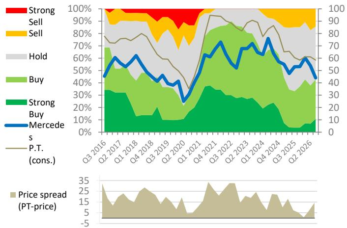
来源：Datastream, MS

## 梅赛德斯-奔驰估值总结图表

图表19：欧洲汽车市盈率
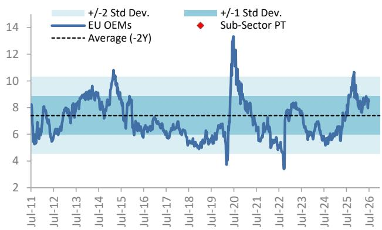
来源：Datastream, MS估算。注：市盈率和子行业目标价指欧洲OEM（行业目标价由我们底层目标价隐含）。

图表20：欧洲汽车EV/EBIT
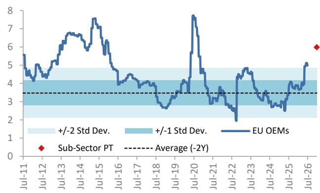
来源：Datastream, MS估算。注：EV/EBIT和子行业目标价指欧洲OEM（行业目标价由我们底层目标价隐含）。

图表21：梅赛德斯：报价表现受EBIT利润率驱动
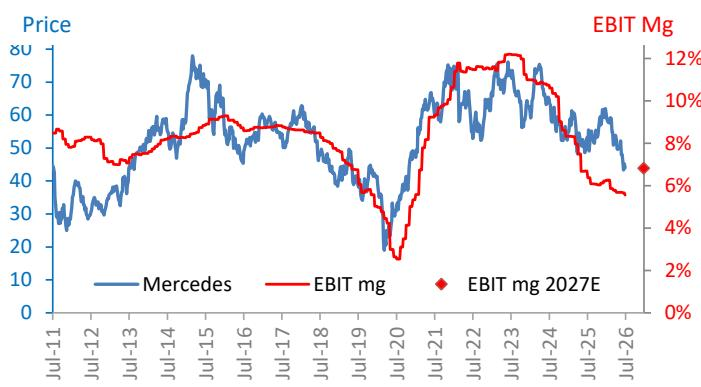
来源：Datastream, MS估算(E)

图表22：NTM市盈率：梅赛德斯
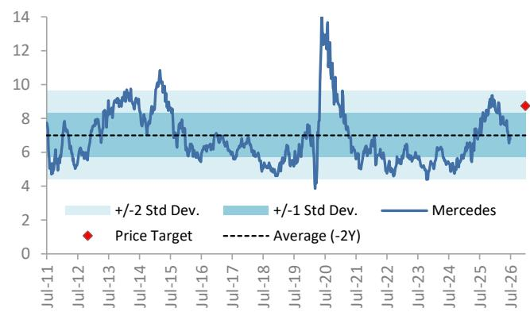
来源：Datastream, MS估算

图表23：NTM市盈率：梅赛德斯 vs 欧洲OEM
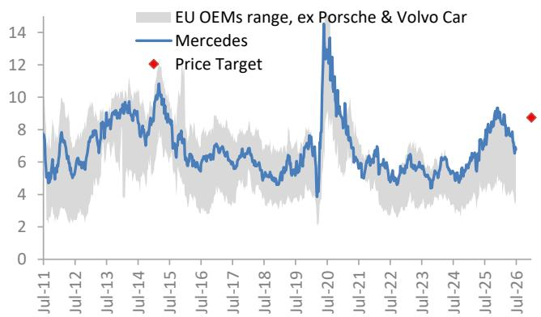
来源：Datastream, MS估算

图表24：NTM市盈率：梅赛德斯 vs 宝马
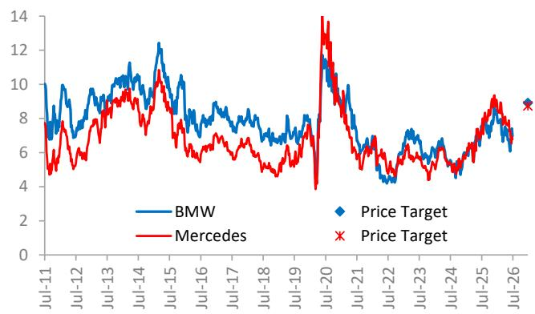
来源：Datastream, MS估算

图表25：NTM市盈率：宝马/梅赛德斯指数
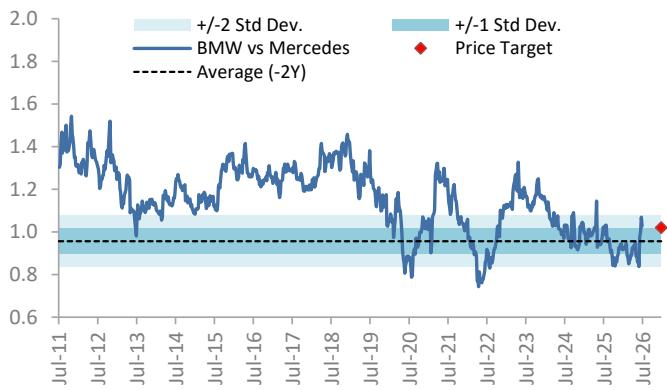
来源：Datastream, MS估算

图表26：欧洲汽车表现落后于欧洲市场（100=-1年）...
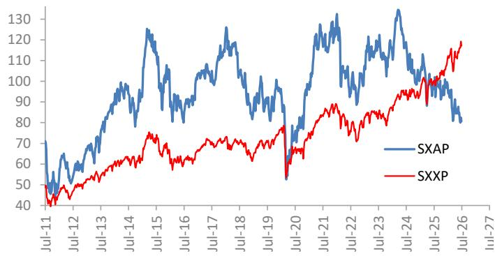
来源：Datastream

图表27：...和欧洲周期股（100=-1年）
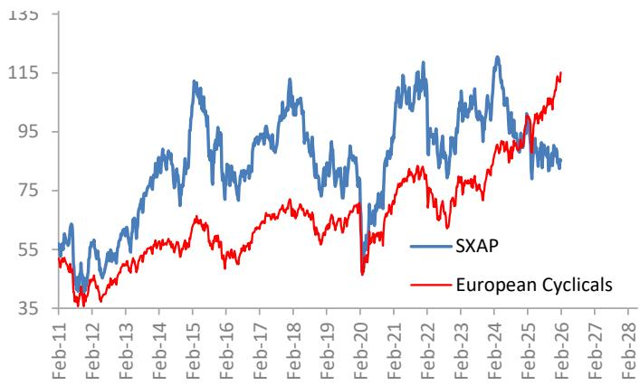
来源：Datastream

图表28：梅赛德斯 vs 欧洲OEM
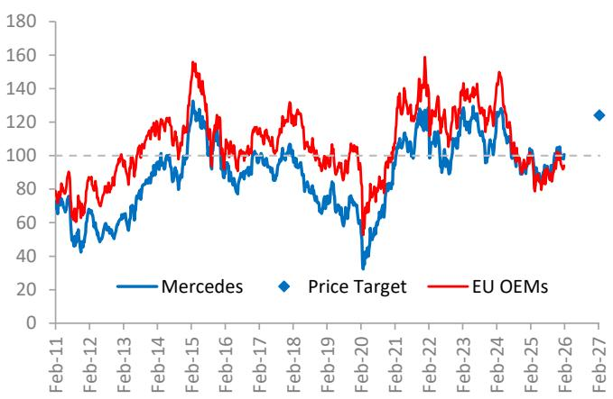
来源：Datastream, MS估算

图表29：梅赛德斯/欧洲OEM
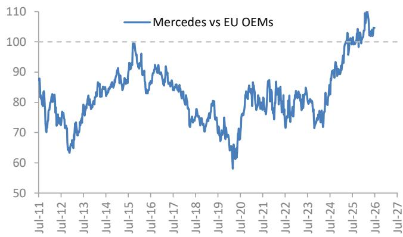
来源：Datastream

图表30：梅赛德斯 vs 欧洲市场
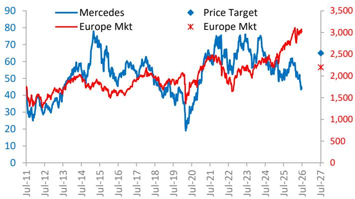
来源：Datastream, MS估算

图表31：梅赛德斯/欧洲市场
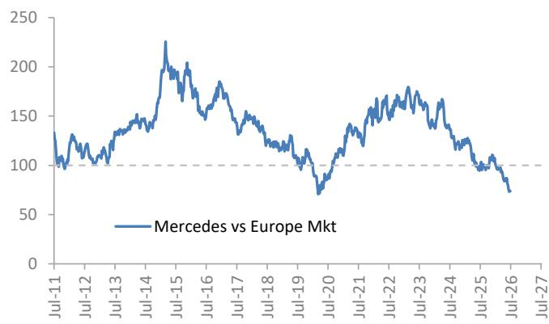
来源：Datastream

图表32：梅赛德斯 vs 宝马
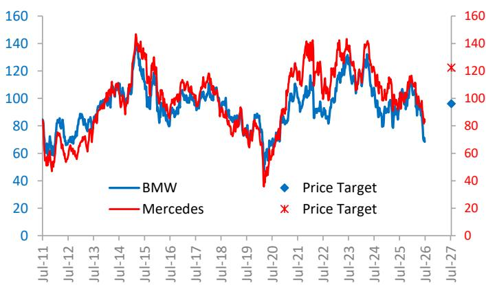
来源：Datastream, MS估算

图表33：宝马/梅赛德斯

来源：Datastream

图表34：梅赛德斯2年维度表现优于同行（100 = -2年）
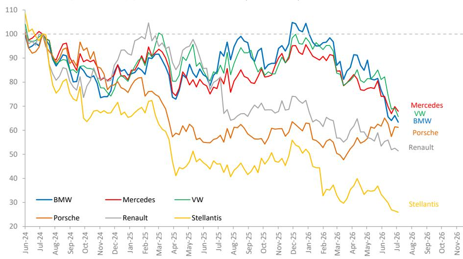
来源：Datastream

精选梅赛德斯-奔驰报告：

欧洲OEM：结构性下行中的战术性上行（2026年7月6日）

欧洲5月汽车销量：市场稳健，多数欧洲OEM份额变化（2026年7月6日）

美国6月销量：市场和欧洲OEM份额上升（2026年7月2日）

5月全球汽车销量：持平（2026年6月24日）

全球产品线：时不我待（2026年6月17日）

欧洲OEM：走向全球——中国扩张进入欧洲（2026年6月16日）

MBG在中国：5月（2026年6月11日）

MBG：2026年一季度：好于预期（2026年4月29日）

欧洲OEM：2026年展望（2026年3月29日）

MBG NDRS：增长恢复前的股息支撑（2026年2月23日）

MBG CMD：产品线驱动2026-27年增长和利润率（2026年2月12日）

对决：梅赛德斯-奔驰 vs 宝马（2026年2月6日）

欧洲汽车合集

## 估值方法与风险

## 宝马（BMWG.DE）

我们基于约9.2倍预估FY26每股收益约9.9欧元对宝马进行估值。该倍数反映了市场对高端OEM在中国价格/组合正常化和盈利能力的持续关注。高于该股长期均值约9倍，反映了地缘环境改善后风险回报比的提升，以及宝马利润率稳定性的记录，同时考虑了市场风险。

## 上行风险

■ EBIT利润率维持高位时间超出预期
■ 经济预期改善推动倍数上升
■ 宝马对电动车竞争/价格战的脆弱性低于预期

## 下行风险

■ 经济增长未能回升，汽车需求增长再次放缓
■ 电动车竞争影响中国/全球市场份额/利润率
■ 宝马加速投资以满足未来电动车计划

## 梅赛德斯-奔驰集团（MBGn.DE）

我们应用11.2倍FY26e市盈率倍数，略低于长期均值，但高于近期历史均值，反映梅赛德斯通过100%自由现金流支付率的股东回报策略。我们持续关注价格/组合正常化和中国利润率，但认为公司现金回报策略继续驱动表现。目标价基于FY26e每股收益约5.8欧元，较近年下降但接近疫情前水平。

## 上行风险

■ 梅赛德斯乘用车估值倍数上升，EBIT利润率/自由现金流大幅提高
■ 梅赛德斯电动车故事改变叙事
■ 执行使每股收益维持高位且周期性减弱

## 下行风险

■ 全球信贷（和/或中国）经济状况和信心持续
■ 梅赛德斯乘用车定价因基数效应走弱
■ 全球竞争导致持续更高的投资需求

## 披露部分

本报告中的信息和观点由MS Europe S.E.（受德国联邦金融监管局监管）和/或MS & Co. International plc（由审慎监管局授权，受金融行为监管局和审慎监管局监管）准备或传播。MS & Co. International plc在英国传播其准备的研究报告及其任何关联方准备的报告，仅面向（i）符合《2000年金融服务与市场法（金融促销）令2005》（修订版）第19(5)条的投资专业人士；（ii）符合该令第49(2)(a)至(d)条的高净值实体；或（iii）可合法接收投资活动邀请或诱因的人士。本披露部分中，MS包括RMB MS Proprietary Limited、MS Europe S.E.、MS & Co International plc及其关联方。

有关重要披露、股价图表和股权评级历史，请访问MS披露网站 www.morganstanley.com/eqr/disclosures/webapp/generalresearch，或联系您的投资代表或MS（地址：1585 Broadway, Attention: Research Management, New York, NY 10036 USA）。

有关估值方法和风险，请联系客户支持团队：美国/加拿大 +1 800 303-2495；香港 +852 2848-5999；拉丁美洲 +1 718 754-5444（美国）；伦敦 +44 (0)20-7425-8169；新加坡 +65 6834-6860；悉尼 +61 (0)2-9770-1505；东京 +81 (0)3-6836-9000。或联系您的投资代表或MS。

## 分析师认证

以下分析师特此证明，他们对本报告讨论的公司及其证券的观点准确表达，且未因表达具体推荐或观点而直接或间接获得补偿：Shaqal A Kirunda；Javier Martínez de Olcoz Cerdan。

## 全球研究冲突管理政策

MS已按照冲突管理政策发布，该政策可在 www.morganstanley.com/institutional/research/conflictpolicies 获取。葡萄牙语版本可在 www.morganstanley.com.br 获取。

## 关于标的公司的重要监管披露

截至2026年6月30日，MS实益持有以下公司普通股1%或以上：AUTO1 Group SE, Autoliv, BMW, Continental AG, Forvia, Mercedes-Benz Group AG, Michelin, Renault, Stellantis, Valeo SE。

过去12个月内，MS管理或联合管理了Autoliv, BMW, Renault, Stellantis, Traton SE, Volkswagen的公开（或144A）发行。

过去12个月内，MS从Autoliv, BMW, Mercedes-Benz Group AG, Pirelli & C SpA, Renault, Stellantis, Traton SE, Volkswagen获得投资银行服务报酬。

未来3个月内，MS预计从AUTO1 Group SE, Autoliv, BMW, Continental AG, Daimler Truck Holding AG, Forvia, Iveco Group NV, Mercedes-Benz Group AG, Michelin, Opmobility SE, Pirelli & C SpA, Porsche AG, Renault, Stellantis, Traton SE, Valeo SE, Volkswagen, Volvo寻求投资银行服务报酬。

过去12个月内，MS从Autoliv, BMW, Continental AG, Daimler Truck Holding AG, Mercedes-Benz Group AG, Michelin, Opmobility SE, Pirelli & C SpA, Porsche AG, Renault, Stellantis, Traton SE, Volkswagen, Volvo获得非投资银行服务和产品报酬。

过去12个月内，MS向以下公司提供或正在提供投资银行服务，或与其有投资银行客户关系：AUTO1 Group SE, Autoliv, BMW, Continental AG, Daimler Truck Holding AG, Forvia, Iveco Group NV, Mercedes-Benz Group AG, Michelin, Opmobility SE, Pirelli & C SpA, Porsche AG, Renault, Stellantis, Traton SE, Valeo SE, Volkswagen, Volvo。

过去12个月内，MS向以下公司提供或正在提供非投资银行、证券相关服务，或曾签订服务协议或存在客户关系：Autoliv, BMW, Continental AG, Daimler Truck Holding AG, Mercedes-Benz Group AG, Michelin, Opmobility SE, Pirelli & C SpA, Porsche AG, Renault, Stellantis, Traton SE, Volkswagen, Volvo。

MS & Co. LLC在Autoliv证券中做市。

主要负责准备MS的股权研究分析师或策略师的薪酬基于多种因素，包括研究质量、读者客户反馈、选股、竞争因素、公司收入和整体投资银行收入。股权研究分析师或策略师的薪酬不与MS进行的投资银行或资本市场交易或特定交易台的盈利能力或收入挂钩。

MS及其关联方与报告涉及的公司/工具有业务往来，包括做市、提供流动性、基金管理、商业银行、信贷扩展、投资服务和投资银行。MS以本金形式向客户买卖报告涉及的公司/工具证券。MS可能持有公司债务或报告讨论的工具头寸。MS作为本金交易或可能交易债务证券（或相关衍生品）。

上述某些披露也适用于非美国司法管辖区的合规要求。

## 股票评级

MS使用相对评级系统，包括增持、等权、未评级或减持（见定义）。MS不对我们覆盖的股票分配买入、持有或报告评级。增持、等权、未评级和减持不等同于买入、持有和卖出。读者应仔细阅读MS中所有评级的定义。此外，由于MS包含分析师观点的更完整信息，读者应仔细阅读完整MS，而非仅从评级推断内容。在任何情况下，评级（或研究）不应被用作或依赖为建议。读者买卖股票的决定应取决于个人情况（如现有持仓）和其他考虑因素。

## 全球股票评级分布

## （截至2026年6月30日）

以下描述的股票评级适用于MS的基础股权研究，不适用于公司生产的债务研究。

仅为披露目的（符合FINRA要求），我们在增持、等权、未评级和减持评级旁包含买入、持有和卖出类别标题。MS不对我们覆盖的股票分配买入、持有或报告评级。增持、等权、未评级和减持不等同于买入、持有和卖出，而是代表相对权重建议（见定义）。为满足监管要求，我们将增持（我们最积极的股票评级）对应买入建议；将等权和未评级对应持有，减持对应卖出建议。

| | 覆盖范围 | | 投资银行客户（IBC） | | 其他重要投资服务客户（MISC） |
|---|---|---|---|---|---|
| 股票评级类别 | 数量 | 占比 | 数量 | 占IBC比例 | 占评级类别比例 | 数量 | 占其他MISC比例 |
| 增持/买入 | 1544 | 42% | 453 | 49% | 29% | 757 | 44% |
| 等权/持有 | 1577 | 43% | 390 | 42% | 25% | 769 | 44% |
| 未评级/持有 | 3 | 0% | 1 | 0% | 33% | 1 | 0% |
| 减持/卖出 | 544 | 15% | 89 | 10% | 16% | 204 | 12% |
| 总计 | 3,668 | | 933 | | | 1731 | |

数据包括当前分配评级的普通股和ADR。投资银行客户是过去12个月内MS从中获得投资银行报酬的公司。由于四舍五入，“占比”列百分比可能不完全等于100%。

## 分析师股票评级

增持（O）：预计该股总回报在风险调整基础上，未来12-18个月超过分析师行业（或行业团队）覆盖范围的平均总回报。

等权（E）：预计该股总回报在风险调整基础上，未来12-18个月与分析师的行业（或行业团队）覆盖范围的平均总回报一致。

未评级（NR）：目前分析师对该股总回报相对于分析师行业（或行业团队）覆盖范围的平均总回报没有足够信心。

减持（U）：预计该股总回报在风险调整基础上，未来12-18个月低于分析师行业（或行业团队）覆盖范围的平均总回报。

除非另有说明，MS中价格目标的时间范围为12-18个月。

## 分析师行业观点

有吸引力（A）：分析师预计其行业覆盖范围未来12-18个月的表现相对于相关广泛市场基准具有吸引力，如下所示。

一致（I）：分析师预计其行业覆盖范围未来12-18个月的表现与相关广泛市场基准一致，如下所示。

谨慎（C）：分析师对其行业覆盖范围未来12-18个月的表现相对于相关广泛市场基准持谨慎态度，如下所示。

各地区基准：北美 - S&P 500；拉丁美洲 - 相关MSCI国家指数或MSCI拉丁美洲指数；欧洲 - MSCI欧洲；日本 - TOPIX；亚洲 - 相关MSCI国家指数或MSCI次区域指数或MSCI AC亚洲除日本指数。

## 股价、目标价和评级历史（见评级定义）

宝马（BMWG.DE）- 截至2026年7月13日GMT，欧元
行业：汽车与共享出行
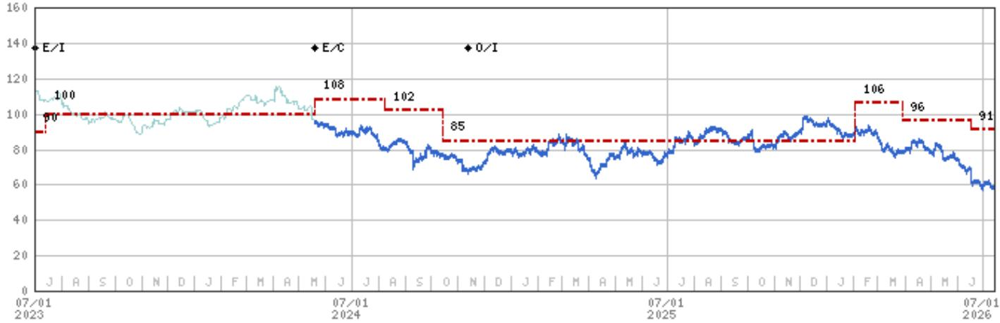
股票评级历史：2021年7月1日：U/I；2023年4月26日：E/I；2024年5月20日：E/C；2024年11月12日：O/I

目标价历史：2021年4月16日：80；2021年10月27日：85；2021年11月6日：90；2023年1月25日：85；2023年4月26日：90；2023年7月13日：100；2024年5月20日：108；2024年8月8日：102；2024年10月14日：85；2026年2月3日：106；2026年3月30日：96；2026年6月16日：91

来源：MS 日期格式：MM/DD/YY 目标价 未分配目标价（NA）

股价（非当前分析师覆盖）— 股价（当前分析师覆盖）

股票和行业评级（缩写如下）显示为♦ 股票评级/行业观点

股票评级：增持（O）等权（E）减持（U）未评级（NR）无可用评级（NA）

行业观点：有吸引力（A）一致（I）谨慎（C）无评级（NR）

自2014年1月13日起，MS亚太地区覆盖的股票将相对于分析师行业（或行业团队）覆盖范围进行评级。

自2014年1月13日起，MS亚太地区的行业观点基准为：相关MSCI国家指数或MSCI次区域指数或MSCI AC亚洲除日本指数。

梅赛德斯-奔驰集团（MBGn.DE）- 截至2026年7月13日GMT，欧元
行业：汽车与共享出行

股票评级历史：2021年7月1日：O/I；2021年12月14日：E/I；2024年5月20日：O/C；2024年11月12日：O/I

目标价历史：2021年4月19日：80；2021年12月14日：70；2023年2月27日：72；2023年5月11日：73.5；2023年11月10日：70；2024年5月20日：90；2024年8月8日：82；2024年10月14日：72；2025年4月25日：64；2026年2月3日：73；2026年3月30日：65

股价（非当前分析师覆盖）— 股价（当前分析师覆盖）

股票和行业评级（缩写如下）显示为♦ 股票评级/行业观点

股票评级：增持（O）等权（E）减持（U）未评级（NR）无可用评级（NA）

行业观点：有吸引力（A）一致（I）谨慎（C）无评级（NR）

自2014年1月13日起，MS亚太地区覆盖的股票将相对于分析师行业（或行业团队）覆盖范围进行评级。

自2014年1月13日起，MS亚太地区的行业观点基准为：相关MSCI国家指数或MSCI次区域指数或MSCI AC亚洲除日本指数。

## MS Smith Barney LLC客户的重要披露

有关可能合理预期影响MS Smith Barney LLC选择第三方研究提供商或第三方研究报告标的公司的重大利益冲突的重要披露，请访问MS财富管理披露网站 www.morganstanley.com/online/researchdisclosures。有关MS特定披露，请参阅 https://www.morganstanley.com/eqr/disclosures/webapp/generalresearch。

每份MS报告由代表MS Smith Barney LLC的人员审查和批准。此审查和批准由审查MS研究报告的同一人进行。这可能产生利益冲突。

## 其他重要披露

MS政策是根据研究分析师和研究管理层认为适当的时机更新研究报告，基于发行方、行业或市场的发展可能对研究观点或意见产生重大影响。此外，某些研究出版物旨在定期更新（每周/每月/每季度/每年），并将按此频率更新，除非研究分析师和研究管理层根据当前情况确定不同的发布计划。

MS不担任市政顾问，本文所含观点或意见不构成《多德-弗兰克华尔街改革与消费者保护法》第975条含义内的建议。

MS生产一种称为“战术观点”的股权研究产品。特定股票的“战术观点”中包含的观点可能与同一股票研究中的推荐或观点相反。这可能是由于不同的时间范围、方法论、市场事件或其他因素所致。如需特定股票的所有研究，请联系您的销售代表或访问Matrix http://www.morganstanley.com/matrix。

MS通过我们专有的研究门户Matrix向客户提供，并由MS以电子方式分发给客户。某些（但非全部）MS产品也通过第三方供应商向客户提供，或通过替代电子方式重新分发给客户。如需访问所有可用的MS，请联系您的销售代表或访问Matrix http://www.morganstanley.com/matrix。

任何访问和/或使用MS均受MS使用条款约束（http://www.morganstanley.com/terms.html）。通过访问和/或使用MS，您表示已阅读并同意受我们的使用条款约束。此外，您同意MS根据我们的隐私政策和全球Cookie政策（http://www.morganstanley.com/privacy_pledge.html）处理您的个人数据并使用Cookie，包括用于设置偏好和收集读者数据，以便为您提供更好、更个性化的服务和产品。有关MS如何处理个人数据、如何使用Cookie以及如何拒绝Cookie的更多信息，请参阅我们的隐私政策和全球Cookie政策（http://www.morganstanley.com/privacy_pledge.html）。请使用提供的链接查看MS印度公司私人有限公司的条款和条件以及最重要条款和条件（https://www.morganstanley.com/assets/pdfs/about-us-global-offices/india/Terms_and_conditions.pdf），以及以下链接查看审计报告（https://ny.matrix.ms.com/eqr/research/webapp/researchdocs/MSICPL_Morgan_Stanley_Research_Audit_Report.pdf）。

如果您不同意我们的使用条款和/或不愿同意MS处理您的个人数据或使用Cookie，请勿访问我们的研究。MS不提供个性化研究交流。MS的编制未考虑接收者的情况和目标。MS建议读者独立评估特定投资和策略，并鼓励读者寻求财务顾问的建议。投资或策略的适当性取决于读者的情况和目标。MS中讨论的证券、工具或策略可能不适合所有读者，某些读者可能没有资格购买或参与部分或全部内容。MS不是购买或出售任何证券/工具或参与任何特定交易策略的要约或要约邀请。您的研究价值和收入可能因利率、汇率、违约率、提前还款率、证券/工具价格、市场指数、公司运营或财务状况或其他因素的变化而变化。期权或其他证券/工具交易权利可能存在时间限制。过往表现不一定是未来表现的指引。未来表现估计基于可能无法实现的假设。如提供且除非另有说明，封面上的收盘价是标的公司证券/工具主要交易所的价格。

主要负责准备MS的固定收益研究分析师、策略师或经济学家的薪酬基于多种因素，包括研究质量、准确性和价值、公司盈利能力或收入（包括固定收益交易和资本市场盈利能力或收入）、客户反馈和竞争因素。固定收益研究分析师、策略师或经济学家的薪酬不与MS进行的投资银行或资本市场交易或特定交易台的盈利能力或收入挂钩。

MS中“关于标的公司的重要监管披露”部分列出了MS持有公司普通股1%或以上的所有公司。对于MS中提到的所有其他公司，MS可能持有不到1%的证券/工具或衍生品，并可能以与MS讨论不同的方式交易。未参与MS准备的MS员工可能持有提及公司的证券/工具或衍生品，并可能以与MS讨论不同的方式交易。衍生品可能由MS或关联人士发行。

除MS信息外，MS基于公开信息。MS尽一切努力使用可靠、全面的信息，但不保证其准确或完整。我们没有义务在MS中的意见或信息发生变化时通知您，除非我们打算停止对标的公司的股权研究覆盖。MS中提出的事实和观点未经MS其他业务领域（包括投资银行人员）的专业人员审查，可能不反映其已知信息。

MS人员可能参与公司活动，如实地考察，通常被禁止接受公司支付相关费用，除非经研究管理层授权成员预先批准。

MS可能做出与本报告中的推荐或观点不一致的投资决策。

对于在台湾交易或交易台湾证券/工具的读者：在台湾交易的证券/工具信息由MS台湾有限公司（MSTL）分发。此类信息仅供参考。读者应独立评估投资风险，并自行负责投资决策。未经MS明确书面同意，MS不得向公共媒体传播或引用。在台湾证券交易所推荐法规第7-1条范围内的非客户读者访问和/或接收MS时，不得向任何第三方（包括但不限于关联方、关联公司和任何其他第三方）提供MS，或从事任何可能产生或看似产生利益冲突的MS相关活动。不在台湾交易的证券/工具信息仅供信息参考，不构成推荐或要约。MSTL可能不为客户执行这些证券/工具的交易。

MS未根据中国法律注册，本报告相关研究在中国境外进行。MS不构成在中国出售任何证券的要约或要约邀请。中国读者应具有投资此类证券的相关资格，并应自行负责从相关政府机构获得所有相关批准、许可、验证和/或注册。本报告或其任何部分均不构成中国法律定义的证券投资咨询或顾问服务。此类信息仅供您参考。

MS在巴西由MS C.T.V.M. S.A.分发，地址：Av. Brigadeiro Faria Lima, 3600, 6th floor, São Paulo - SP, Brazil；受Comissão de Valores Mobiliários监管；在墨西哥由MS México, Casa de Bolsa, S.A. de C.V分发，受Comision Nacional Bancaria y de Valores监管，地址：Paseo de los Tamarindos 90
