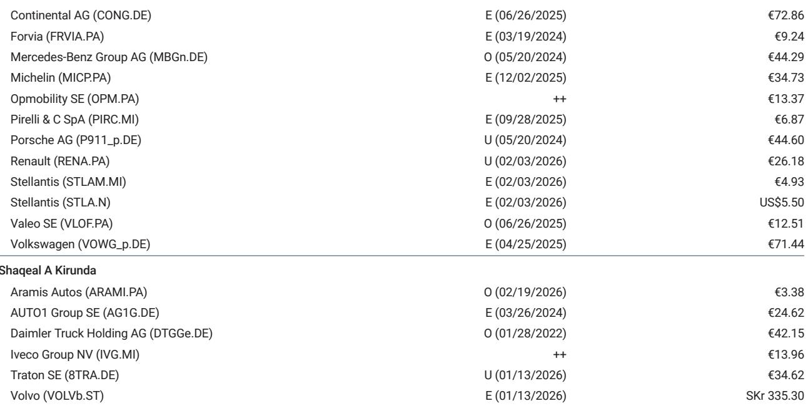
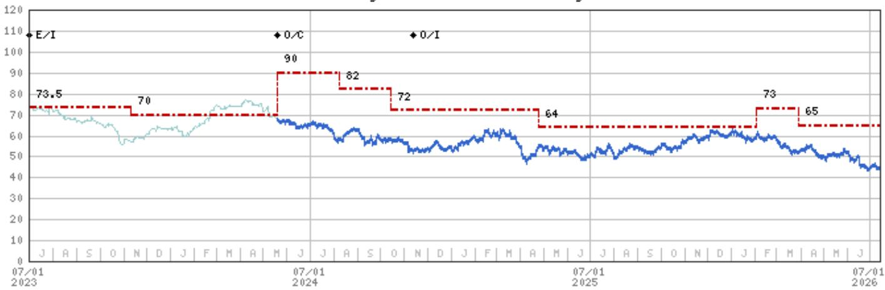

# Mercedes-Benz Must Move East to Survive: Hungary's Factory Cost Advantage Is Now a Structural Imperative, Not a Strategic Option

Mercedes-Benz Group has invested EUR 1 billion since 2022 in its Kecskemet, Hungary plant to double production capacity from 200,000 to 400,000 units, starting with the new electric C-Class. This is not a marginal capacity adjustment. It is the centerpiece of a survival strategy for a premium automaker whose German cost base is 70% higher per unit than its Hungarian operation, according to a recent plant visit analysis by a global research institution. Lower salaries, longer working hours, more limited sick leave, and lower energy costs in Hungary create a structural cost advantage that Mercedes cannot replicate in Germany without fundamental cultural and labor reform.

The urgency is clear. Mercedes has already reduced global installed capacity from 2.5 million to 2.4 million units, targeting 2.0-2.2 million with further adjustments in Europe and China. Part of that capacity is shifting to Hungary specifically to address labor cost and productivity issues in Germany. The company's cost base has already decreased 10% from 2022 to 2024, and management targets another 10% reduction by 2027 through automation, robotics, AI, industrial capacity improvements, and cultural changes in Germany including increased working hours and reduced cost per hour. Negotiations with unions are open, but the needed outcome is crystal clear: stay competitive or cede ground permanently.

This restructuring comes at a moment when Mercedes faces simultaneous pressure on multiple fronts. The Chinese market continues to evolve, with second-quarter volumes lagging behind expectations, higher electric vehicle mix diluting margins, and dealer margins remaining below break-even. Europe and the US are holding better, partially compensating for China, but the structural challenge is unmistakable. The global research institution report identifies Mercedes as its top pick among European OEMs precisely because the company is taking decisive action on cost and capacity while competitors hesitate. The argument is that the market is permanently structurally altered, and legacy premium OEMs must rely on capacity and cost-cutting efforts to survive.

## Mercedes' Hungary Expansion Creates a 70% Factory Cost Advantage That German Plants Cannot Match Without Fundamental Labor Reform

The Kecskemet plant is now Mercedes' second largest globally and its largest factory in Europe. The combination of lower salaries, longer working hours, more limited sick leave, and lower energy costs allows for a 70% lower factory cost versus Germany, with proximity to core European markets and global export capability. This is not a marginal difference. It is a structural gap that, if left unaddressed, would make German production economically unsustainable for volume models over time.

The plant extension ceremony included Hungary's Prime Minister and the minister of economy, demonstrating government support for Mercedes' plan to move from current capacity of 200,000 units to 400,000 units incrementally. The new electric C-Class production starting now is the first of multiple new models that will be allocated to Hungary. The plant's flexibility allows it to produce both internal combustion and electric vehicles on the same line, giving Mercedes the ability to adjust production mix rapidly based on demand.

Mercedes' plan is to allocate production balancing investment versus labor cost, including automation optionalities, gradually maximizing production in Hungary while retaining some flexibility to move volume from or to plants in Germany. This is not about abandoning Germany. It is about creating a dual production base where cost-competitive Hungarian capacity absorbs volume that would otherwise be unprofitable in Germany, while German plants focus on higher-margin luxury and performance vehicles where customers are less price-sensitive and more willing to pay for German engineering heritage.

## The 20% Capacity Reduction Target Signals That Mercedes Is Preparing for a Smaller, More Profitable Future

Global installed capacity has already been reduced from 2.5 million to 2.4 million with the closure of the Mexico plant. The target is now 2.0-2.2 million with adjustments in Europe and China, or even lower if needed. This represents a potential 12-20% reduction from the already-reduced base. For context, Mercedes sold approximately 2.0 million vehicles in 2025. The company is effectively aligning capacity with realistic demand expectations rather than maintaining excess capacity in the hope of a demand recovery that may not materialize.

This capacity reduction is not just about shrinking. It is about reallocating production to the most cost-competitive locations. Part of the capacity shifting to Hungary directly addresses the labor cost and productivity issues in Germany. The company is not simply cutting capacity; it is moving it eastward where the cost structure allows profitable production even in a lower-demand environment.

The cost focus is already in execution phase. Mercedes' cost base has decreased 10% from 2022 to 2024, and the company expects another 10% reduction by 2027. This second phase includes technology improvements such as automation, robotics, AI, and industrial capacity optimization, as well as cultural changes in Germany and moving volume to Hungary's cost-competitive operation. The board is committed to making this happen, and negotiations with unions are ongoing. The outcome is not in doubt; the only question is the timeline and the specific terms.

## Mercedes Is Not Sacrificing Quality for Cost: The Strategy Targets Production Efficiency, Not Material Degradation

A critical distinction in Mercedes' cost strategy is that the company is not targeting cost savings on materials. The idea is to continue investing in product development and automation in production, making cost reduction compatible with improving quality. This is a fundamental strategic choice that differentiates Mercedes from competitors that might cut corners on components or reduce engineering investment to meet short-term cost targets.

Mercedes is investing in cutting-edge, cost-competitive manufacturing. The Hungary plant is not a low-quality operation; it is a highly automated, flexible facility that can produce vehicles to the same quality standards as German plants but at significantly lower cost. The company is using technology to close the quality gap while maintaining the cost advantage. This includes investments in robotics, AI-driven quality control, and industrial capacity improvements that reduce labor requirements while maintaining or improving output quality.

The product pipeline is gradually showing up. New models represent a higher proportion of sales than at peers, according to the research institution's analysis. Cumulative sales from new models introduced in fiscal years 2025-2027 are expected to be higher as a percentage of total sales than for competitors. This new product flow, combined with cost-competitive production, creates a pathway to margin improvement even in a challenging demand environment.

## The Local-for-Local Strategy Is Mercedes' Answer to Trade Barriers and Supply Chain Disruption

Mercedes plans to increase local production in the US from 30% in 2026 to 50%, with a focus on SUVs including the new GLC. Europe production will focus on luxury and performance brands, increasing localization from over 80% to over 85%, with increased top-end exports globally. In China, the idea is to localize entry and core portfolio, fully tapping the local value chain, and also using China as an export hub to Asian markets.

This local-for-local strategy addresses multiple risks simultaneously. Trade barriers and tariffs become less relevant when production is located within the market. Supply chain disruptions have less impact when key components are sourced locally. Currency fluctuations are partially hedged when revenues and costs are in the same currency. And local production allows Mercedes to adapt vehicles to local market preferences more quickly and efficiently.

The Hungary plant fits into this strategy as a European production hub that can serve both European customers and global export markets. Its location in Central Europe provides proximity to core European markets while maintaining cost competitiveness relative to Western European production locations. The plant's flexibility allows it to adjust production mix based on demand across different markets, reducing the risk of capacity underutilization in any single location.

## A Decision Framework for Observers: How to Evaluate Mercedes' Restructuring Against Peer Performance and Market Reality

For observers assessing Mercedes' position, the following framework translates the report's analysis into actionable evaluation criteria. First, track the pace of capacity shift to Hungary and other low-cost locations. The target of 400,000 units in Hungary represents approximately 20% of total capacity at the lower end of the 2.0-2.2 million target range. If Mercedes executes faster than expected, it signals management is serious about cost reduction. If execution slows, it suggests labor or political constraints that could undermine the strategy.

Second, monitor the cost reduction trajectory. The 10% reduction from 2022 to 2024 is already achieved. The next 10% by 2027 is the critical test. Key indicators include working hour agreements in Germany, automation investment levels, and the proportion of volume allocated to Hungary. If Mercedes achieves this target, its cost structure will be significantly more competitive. If it falls short, the margin pressure will persist.

Third, evaluate the China situation separately from the rest of the business. The Chinese market continues to be more challenging than expected, with second-quarter volumes lagging behind expectations and higher EV weight diluting margins. Dealer margins remain below break-even, suggesting more dealer support may be needed in the second half of 2026, including volume adjustments. However, Europe and the US are holding better, partially compensating. The key question is whether the new product pipeline, with attractive design, specifications, and competitive pricing, can stabilize or improve Mercedes' position in China over time.

Fourth, compare Mercedes' product pipeline rollout against competitors, particularly BMW. The research institution's preference for Mercedes is driven by expectations of a faster rollout of new products versus BMW's Neue Klasse. New models represent a higher proportion of sales for Mercedes than for peers, which should support volumes and pricing as older models are replaced.

Fifth, assess the dividend and shareholder return implications. Mercedes' stake in Daimler Truck provides meaningful support for its strong shareholder return commitment. The company has been paying out 100% of free cash flow, and the cost reduction and capacity optimization efforts should support this payout even if earnings decline. The dividend yield is a key support factor for the stock, particularly in a low-yield environment.

The market is pricing Mercedes as if the structural challenges will overwhelm the restructuring efforts. The stock trades at approximately 7.6 times estimated 2026 earnings, below its long-term average of around 9 times. This discount reflects continued concern about price and mix normalization and profitability of premium OEMs in China. But it also creates an opportunity if the restructuring succeeds. Mercedes is not trying to grow its way out of the problem. It is shrinking, shifting, and optimizing its way to a more profitable base. That is a realistic strategy for a market that has been permanently structurally altered.

The research institution's report suggests that near-term sales, margins, and free cash flow are below potential, but the product pipeline and cost actions should drive improvement from the second half of 2026. The key debate is how much pressure from China will translate into Europe and how well protected Mercedes will be by its product pipeline. The answer depends on execution. The strategy is sound. The cost advantage of Hungary is real. The question is whether management can navigate the labor, political, and market challenges to deliver on the plan.

*For informational purposes only. Portions may be generated, translated, summarized, or edited with AI assistance based on source materials and may contain omissions or errors. Please verify independently. This is not professional advice.*

For informational purposes only. Portions may be generated, translated, summarized, or edited with AI assistance based on source materials and may contain omissions or errors. Please verify independently. This is not professional advice.

