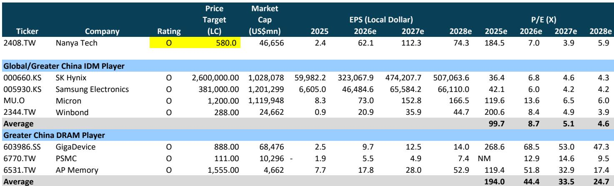
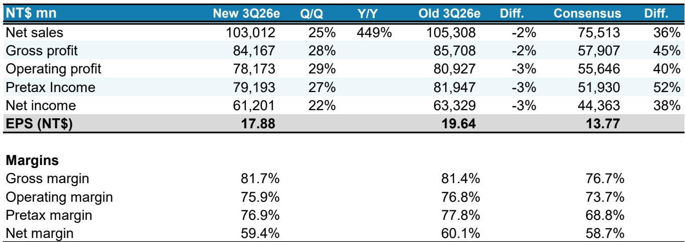
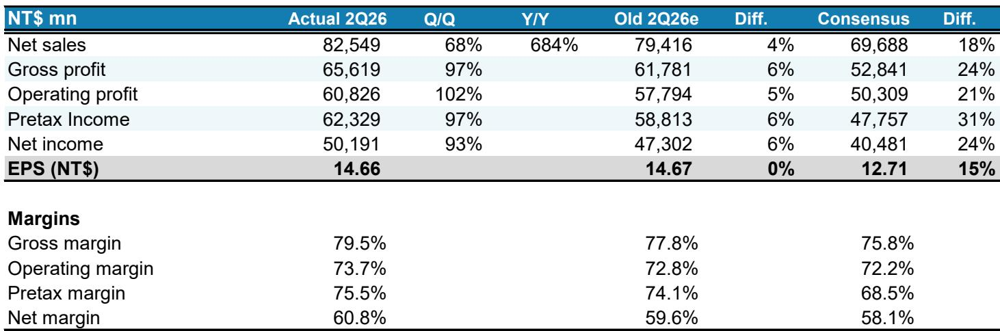

# MS：南亚科技，利基型DRAM上行周期或延续至2028年

这轮存储周期与以往不同。MS在最新报告中指出，南亚科技所处的利基型DRAM市场，供需紧张格局可能持续到2028年，而非市场普遍预期的2026年见顶。核心驱动力来自AI基础设施对高带宽内存和DDR5的溢出需求，正在挤压传统DRAM产能。

报告基于南亚科技第二季度财报做出判断。当季营收同比增长684%，毛利率从67.9%跃升至79.5%，EPS达到14.66新台币，超出市场预期15%。更关键的是，管理层对下半年持乐观态度——第三季度营收预计环比增长至少25%，且价格上行趋势可能延续到第四季度。

## 1. 结构性短缺正在取代周期性波动

传统上，DRAM市场以3-4年为一个周期，供需逆转往往伴随价格明显波动。但MS认为，本轮短缺有结构性因素支撑。AI基础设施不仅拉动GPU和HBM需求，还在推动CPU、ASIC以及eSSD、SmartNIC、BMC等周边芯片对更高性能DRAM的消耗。这些需求叠加，使得即便非AI领域的出货也受到产能挤压，产品组合持续向高端倾斜。

报告特别强调，管理层并不担心2028年前出现供应过剩。这与市场对新增产能的担忧形成对比——南亚科技刚宣布2027-2029年160亿美元资本支出计划，用于建设月产能4.5万片的12英寸晶圆厂，其中80%将用于设备采购，EUV光刻机预计2028年导入。

> **KC评论：** 市场通常将大规模资本支出视为周期见顶信号，但这份报告的逻辑是：新增产能主要面向AI定制化产品和WoW（晶圆对晶圆）方案，而非标准型DRAM，因此不会直接冲击DDR4/DDR5的供需平衡。

## 2. 定价权正在向供应端转移

南亚科技第二季度ASP环比增长超过60%，而出货量持平。这意味着营收增长完全由价格驱动，而非出货量扩张。毛利率在短短一个季度内从67.9%升至79.5%，反映出在产能受限的环境下，供应商拥有极强的议价能力。

报告预计第三季度毛利率将进一步升至81.7%，全年毛利率维持在79%以上。这种定价能力并非短期现象——MS认为，DDR4将维持严重短缺状态，而南亚科技通过长期协议锁定了未来增长基础。

从全球DRAM估值对比来看，南亚科技2027年预期市盈率约为3.9倍，而全球同业平均为5.1倍。考虑到其2025-2028年EPS复合增长率高达216%，当前估值并未充分反映这一轮周期的持续性和强度。

## 3. 非AI需求正在被AI间接重塑

一个容易被忽视的观察点是：非AI领域的DRAM需求并非仍在调整，而是被产能约束所抑制。报告指出，由于产能优先分配给高利润的AI相关产品，传统服务器和消费电子领域的出货持续受到容量限制，产品组合被迫向高端迁移。

这意味着，即便终端需求没有爆发式增长，DRAM供应商仍能通过结构性短缺维持高利润。这种“被动高端化”的效应，在以往周期中很少出现。南亚科技第二季度AI基础设施和服务器相关销售已占营收20-30%，这一比例还在上升。

## 4. 资本开支周期与盈利周期的错位

160亿美元的资本支出计划看似激进，但报告将其视为2027-2029年的长期布局。新晶圆厂今年完成建设，2027年第一季度开始设备导入，产能将稳步爬坡至2029年。这意味着新增供给不会在短期内冲击市场，而需求端AI的持续扩张可能恰好消化这部分产能。

值得注意的是，报告预计2028年EPS将回落至74.33新台币，低于2027年的112.32新台币。这暗示MS认为2027年可能是盈利峰值，但即便如此，2028年的盈利水平仍远高于2025年的2.36新台币。周期的高点被拉长，而非骤降。

> **KC评论：** 对关注半导体周期的读者来说，这份报告提供了一个不同于市场共识的框架：不是“资本支出增加=周期见顶”，而是“AI结构性需求+产能约束=周期延长”。关键在于区分标准型DRAM和定制化AI产品的供需逻辑是否真的独立。

For informational purposes only. Portions may be generated,translated,summarized,or edited with AI assistance based on source materials and may contain omissions or errors. Please verify independently. This is not investment,legal,tax,accounting,or other professional advice.

For informational purposes only. Portions may be generated,translated,summarized,or edited with AI assistance based on source materials and may contain omissions or errors. Please verify independently. This is not investment,legal,tax,accounting,or other professional advice.

