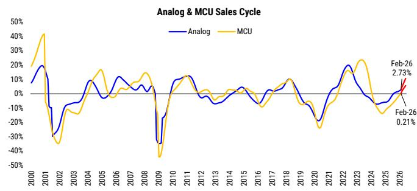
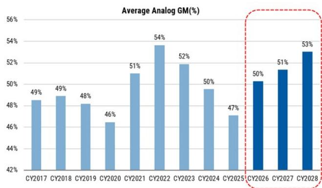
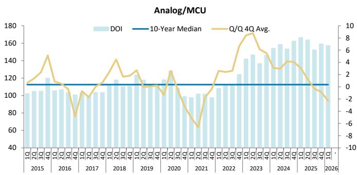
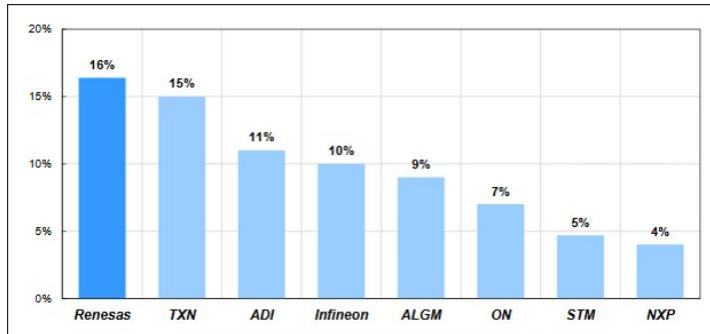

July 13, 2026 04:00 AM GMT

Technology - Global Semiconductors

# The Analog Playbook: 2Q26 800v dynamics in play

We launch our quarterly analog playbook identifying market focus into the print. This quarter we expect investor focus on (i) whether improving orders are a reflection of inventory restocking or genuine end-market acceleration, and (ii) power semi deployment in the data center.

We expect the Q2 quarterly prints to build on the improving demand trends that emerged last quarter. Channel inventories continue to screen lean, gradual replenishment is underway and pricing pressure is easing providing a supportive backdrop for another quarter of above-seasonal performance. The key debate will be whether improving orders reflect the start of a broader restocking cycle or genuine end-market acceleration. Based on our channel checks, we continue to favour the latter, with companies highlighting pricing discipline, limited order cancellations and longer customer order visibility as signs of healthier underlying demand rather than speculative inventory builds. Alongside improving factory utilisation and lower underutilisation charges, we expect these dynamics to support further margin expansion, reinforcing our view that the analog sector is entering the early stages of a more durable earnings recovery. With this note we launch our global analog model tracking group revenue, margin trajectory, FCF dynamics and valuation metrics by stock.

Investor focus this earnings season is likely to centre on the implications of Nvidia replacing the Kyber rack architecture with a new solution, and the implications for power semiconductor deployment into 2027/28. While we acknowledge execution risk around the phasing of 800V adoption as rack architectures evolve, our channel checks indicate sidecar power systems are being introduced independently at lower voltages, supporting shipments from 3Q26 and helping limit downside to our server rack assumptions. We therefore expect Infineon to reaffirm its €1.5bn (FY26) and €2.5bn (FY27) data centre sales guidance, underpinned by a structurally rising power content per rack and improving \$/kW economics. Meanwhile, accelerating demand for optical networking solutions remains a key upside driver for STMicroelectronics, where rollout of the PIC100 and higher-margin optical products could support further upgrades to revenue and margin guidance.

Stock in focus: STMicroelectronics. We are calling out STMicroelectronics as our preferred analog stock this quarter for an earnings surprise. Ahead of the quarter, we lifted our PT to €78 on growing confidence in STM's optical exposure and cyclical recovery. For FY26, we estimate 9% and 30% yy growth for the automotive and industrial segments respectively and now see data center sales growing at a 77% CAGR FY26 to FY28, surpassing \$3bn in FY28. We also like the LEO story and model sales ramping from \$815mn FY26 to \$1.8bn FY28 (see our TechBytes Space

<table><tr><td colspan="2">MS &amp; CO. INTERNATIONAL PLC+</td></tr><tr><td colspan="2">Lee Simpson</td></tr><tr><td colspan="2">Equity Analyst</td></tr><tr><td>Lee.Simpson@morganstanley.com</td><td>+44 20 7425-3378</td></tr><tr><td colspan="2">Shawn Kim</td></tr><tr><td colspan="2">Equity Analyst</td></tr><tr><td>Shawn.Kim@morganstanley.com</td><td>+44 20 7677-1018</td></tr><tr><td colspan="2">Nigel van Putten</td></tr><tr><td colspan="2">Equity Analyst</td></tr><tr><td>Nigel.Putten@morganstanley.com</td><td>+44 20 7425-2803</td></tr><tr><td colspan="2">Amelia M Scicluna</td></tr><tr><td colspan="2">Research Associate</td></tr><tr><td>Amelia.Scicluna@morganstanley.com</td><td>+44 20 7425-6694</td></tr><tr><td colspan="2">MS &amp; CO. LLC</td></tr><tr><td colspan="2">Joseph Moore</td></tr><tr><td colspan="2">Equity Analyst</td></tr><tr><td>Joseph.Moore@morganstanley.com</td><td>+1 212 761-7516</td></tr><tr><td colspan="2">Nicole Kozhukhov</td></tr><tr><td colspan="2">Research Associate</td></tr><tr><td>Nicole.Kozhukhov@morganstanley.com</td><td>+1 212 761-1636</td></tr></table>

<table><tr><td colspan="2">TECHNOLOGY - EUROPEAN SEMICONDUCTORS</td></tr><tr><td>Europe</td><td></td></tr><tr><td>Industry View</td><td>In-Line</td></tr><tr><td colspan="2">SEMICONDUCTORS</td></tr><tr><td>North America</td><td></td></tr><tr><td>Industry View</td><td>Attractive</td></tr><tr><td colspan="2">GREATER CHINA TECHNOLOGY SEMICONDUCTORS</td></tr><tr><td>Asia Pacific</td><td></td></tr><tr><td>Industry View</td><td>Attractive</td></tr><tr><td colspan="2">JAPAN SEMICONDUCTORS</td></tr><tr><td>Japan</td><td></td></tr><tr><td>Industry View</td><td>In-Line</td></tr></table>

MS does and seeks to do business with companies covered in MS. As a result, investors should be aware that the firm may have a conflict of interest that could affect the objectivity of MS. Investors should consider MS as only a single factor in making their investment decision.

For analyst certification and other important disclosures, refer to the Disclosure Section, located at the end of this report.

+= Analysts employed by non-U.S. affiliates are not registered with FINRA, may not be associated persons of the member and may not be subject to FINRA restrictions on communications with a subject company, public appearances and trading securities held by a research analyst account.

Technology - Orbital Computing and 06 May note LEO Opportunity Enters Orbit). We recently moved to a sum-of-the-parts valuation framework to better reflect the emergence of the structural growth opportunities in LEO and optical. We value these segments on a 36x P/E multiple versus the 18x P/E multiple that we apply to the cyclical segment. This sets our PT of €78.

Please reach out if you would like to see our global analog model and server rack model.

## Our story in 6 charts

Exhibit 1: Cycle recovery is in play...  
  
Source: AlphaWise, MS.

Exhibit 2: ...with margin expansion on the horizon...  
  
Source: MS estimates

Exhibit 3: ...and improving inventory dynamics.  
  
Source: FactSet, MS

Exhibit 4: Data centre exposure by stock.  
  
Source: MS estimates

Exhibit 5:  
Analog stock preferences.  
  
Source: MS

Exhibit 6: Our global analog coverage.

<table><tr><td>Stock</td><td>Rating</td><td>Thesis</td></tr><tr><td rowspan="6"></td><td>OW, PT €91 Covered by Lee Simpson</td><td>We view Infineon as best placed amongst European analog names for a cyclical recovery in automotive/industrial, demonstrating a superior ability to weather the headwinds facing these markets in the meantime. We expect new wins in auto to validate IFX&#x27;s strategy (design focus, capacity build, proprietary IP). A strong IP library augurs well for GaN longer term too including use in EVs, data centres and energy storage.</td></tr><tr><td>OW, PT €78 Covered by Lee Simpson</td><td>STM has a portfolio positioned for growth areas (BICHOS imaging sensors, GP MCUs). We see opportunity for recovery into FY26/27. We expect drivers of FY27 growth to come from data centres, with a material ramp in optical revenues driven by pluggables and NPOs (2027+), as well as 1L O/s on the CEP and market. We allow for a modest industrial recovery cycle starting 2H26. We see some signs of automotive recovery as ADL-grade microcontroller (MCUs) design wins start to convert to sales (2027+).</td></tr><tr><td>OW, PT $428 Covered by Joe Moore</td><td>We are OW ADI on the back of 3 reasons: 1) ADI has managed the downcycle well, only seeing 1 quarter of OPM% below 40%, 2) the company&#x27;s revenue outlook looks strong with high industrial exposure, and 3) the company has relatively higher ASP products which should limit the competition with operating Chinese capacity. ADI is a core holding in the analog space long term as the company has exposure to the right end markets as well as superior margins and FCF generation, a result of developing a comprehensive analog portfolio via successful integration of Linear Tech and Mastem.</td></tr><tr><td>OW, PT $335 Covered by Joe Moore</td><td>We remain OW NOP on the back of: 1) NXP should outperform Auto semis in 2026E as auto gross other end markets in ancestry. 2) Structural improvements to the business: NXP has multiple levers to improve gross margin from here (channel shipments, internal utilization, and overall revenue growth), and 3) Favorable HCL set up into 2026 as momentum acceleration appears likely to inflect.</td></tr><tr><td>OW, PT $51 Covered by Joe Moore</td><td>We see scope for Allegro to outperform over the next several years as the recovery remains in an upcycle, with earnings power increasingly supported by incremental secular growth vectors in auto electrification and industrial. 35a is in line with the company&#x27;s average PE multiple since 2022, but is a premium to auto semi peers and in-line with higher gross margin analog/MCU companies.</td></tr><tr><td>OW, PT 6,000 JPY Covered by Kazuo Yoshikawa</td><td>After years of stagnation, we expect growth of memory interface and digital power for datacenters, MCU for E/E architecture, R-Car for ADAS to drive growth from CY26. Product mix improvement should drive continued gross margin improvement. Data center revenue growth and sustained gross margin improvement outlook, as well as improved prospect of shareholder returns, could trigger re-rating.</td></tr><tr><td rowspan="4"></td><td>EW, PT €65 Covered by Nigel van Putten</td><td>Melexis enters FY26 with flat revenue expectations and only limited margin improvement, as typical industry drivers are not yielding meaningful growth. Innovation and mix benefits are offset by pricing dynamics, leaving operating leverage muted. We are EW as we await clearer visibility into sustained growth and margin expansion beyond FY26.</td></tr><tr><td>EW, PT $94 Covered by Joe Moore</td><td>There&#x27;s opportunity here as we think certain concerns surrounding the company are overblown (OM%, BS), but the biggest variable is revenue growth as a cyclical recovery would be an undervalable lever to EPS as well as possible worries. There are considerable headwinds the company will have to get past including increased MCU competition, macro uncertainty, and regaining customer trust from overly extending FIP. If macro uncertainty subsides and we get indication that the MCU upcycle is strengthening, we would be quick to revisit our EW rating, but for now we remain EW.</td></tr><tr><td>EW, PT €9 HKD Covered by Daisy Dai</td><td>We believe Innoscience is well positioned to benefit from secular growth drivers for the GaN market, such as NVIDIA&#x27;s 800V AI data centers, EVs and humanoid robotics. Despite secular growth drivers, we expect competition to remain fierce and excessive capacity may persist industry-wide in the next five years on the back of aggressive capacity additions. We expect Innoscience&#x27;s gross margin to improve at a moderate pace in 2026/27e, partly because of rising depreciation costs, and the company to incur losses until 2026e. Our EW relative to our coverage reflects balanced risk-reward on high revenue growth potential, amid lofty market expectations.</td></tr><tr><td>EW, PT 82 CNY Covered by Charlie Chan</td><td>The analog cycle has bottomed, but the rebound seems soft in sectors other than auto and AI. SG Micro should still enjoy top-line growth, backed by its comprehensive product portfolio (+8,800 SKUs). The long-term gross margin outlook should be stable, ranging from 48% to 52%, due to improvement in product mix and aggressive market share gains. SG Micro is actively engaging into optical networking business with ability to supply 800G/1.8T optical module. The stock is trading of 65x-2026e P/E, which is less compelling to us as it stands around its historical average.</td></tr><tr><td rowspan="3"></td><td>UW, PT $221 Covered by Joe Moore</td><td>TI is looking to ramp capex over the next few years to help bring more manufacturing in-house, but this will act as a near-term headwind to earnings and FCF growth. The company has also seen pricing and market share pressure in personal electronics and enterprises, as customers move to multisource components, and face competition with local Chinese supply. The company trades at a premium valuation for its solid governance track record, and we advise the company&#x27;s long-term direction, but we see this dynamic as limiting upside in the near-term as margin should come under pressure from the capex ramp.</td></tr><tr><td>UW, PT $13.7 Covered by Joe Moore</td><td>The GaN market is increasingly looking more competitive, with STMicro, Infineon, and Renesas all making broader into GaN via acquisitions and partnerships. While these larger players may expiste the adoption of GaN in markets outside smartphone chargers and expand the TAM, we expect these opportunities to be captured by more established power semi-providers rather than Navitas given their supply assurance and automotive qualification experience. NVDA&#x27;s 800V AI server racks are an enticing opportunity, but given competition and timeline, we think it is too early to fully price in this opportunity.</td></tr><tr><td>UW, PT 388 TWD Covered by Charlie Chan</td><td>We have downgraded Silergy in view of its margin miss from foundry coal hikes and weak consumer demand. Its server and optical PMIC exposure remains relatively small. Our price target implies 23x-2027e P/E. We view valuation as more than full, especially after a strong stock rally.</td></tr></table>

Source: MS

Global Analog Forecasts

We launch our global analog model, a deep dive into how the global analog players stack against each other in terms of revenue, automotive revenue, industrial revenue, GM%, inventory, FCF and valuation metrics such as ROIC. We expect FY26 to mark the start of the upcycle with gross margin expansion across all of our analog names.

Exhibit 7: Our Global Analog Model

<table><tr><td></td><td>CY2016</td><td>CY2017</td><td>CY2018</td><td>CY2019</td><td>CY2020</td><td>CY2021</td><td>CY2022</td><td>CY2023</td><td>CY2024</td><td>CY2025</td><td>CY2026e</td><td>CY2027e</td><td>CY2028e</td></tr><tr><td colspan="14">Revenue</td></tr><tr><td>Infinexen (€mn)</td><td>6,563</td><td>7,193</td><td>7,794</td><td>7,976</td><td>9,281</td><td>11,588</td><td>15,010</td><td>16,059</td><td>14,677</td><td>14,900</td><td>16,662</td><td>18,624</td><td></td></tr><tr><td>STMicroelectronics ($mn)</td><td>6,972</td><td>8,346</td><td>9,665</td><td>9,554</td><td>10,219</td><td>12,761</td><td>16,128</td><td>17,286</td><td>13,269</td><td>11,799</td><td>14,500</td><td>17,866</td><td>19,483</td></tr><tr><td>Meleisys (€mn)</td><td>456</td><td>512</td><td>569</td><td>487</td><td>508</td><td>644</td><td>836</td><td>964</td><td>933</td><td>849</td><td>864</td><td>906</td><td>950</td></tr><tr><td>NXP Semiconductor ($mn)</td><td>9,498</td><td>9,256</td><td>9,407</td><td>8,877</td><td>8,612</td><td>11,063</td><td>13,205</td><td>13,276</td><td>12,614</td><td>12,269</td><td>14,138</td><td>15,557</td><td>16,407</td></tr><tr><td>Analog Devices ($mn)</td><td>3,636</td><td>5,642</td><td>6,223</td><td>5,754</td><td>5,858</td><td>8,444</td><td>12,579</td><td>11,569</td><td>9,338</td><td>11,757</td><td>15,499</td><td>17,105</td><td>18,570</td></tr><tr><td>Texas Instruments ($mn)</td><td>13,370</td><td>14,961</td><td>15,784</td><td>14,383</td><td>14,461</td><td>18,344</td><td>20,028</td><td>17,519</td><td>15,641</td><td>17,682</td><td>21,035</td><td>22,310</td><td>23,558</td></tr><tr><td>Microchip ($mn)</td><td>3,063</td><td>3,881</td><td>5,022</td><td>5,278</td><td>5,298</td><td>6,444</td><td>8,050</td><td>8,541</td><td>4,757</td><td>4,972</td><td>5,769</td><td>6,517</td><td>7,172</td></tr><tr><td>Navitas Semiconductor ($mn)</td><td>-</td><td>-</td><td>-</td><td>-</td><td>12</td><td>24</td><td>38</td><td>79</td><td>83</td><td>46</td><td>43</td><td>66</td><td>97</td></tr><tr><td>ON Semiconductor ($mn)</td><td>3,907</td><td>5,543</td><td>5,878</td><td>5,518</td><td>5,255</td><td>6,740</td><td>8,226</td><td>8,259</td><td>7,082</td><td>5,995</td><td>6,472</td><td>7,196</td><td>8,152</td></tr><tr><td>SG Micro (RMB mn)</td><td>452</td><td>522</td><td>572</td><td>792</td><td>1,197</td><td>2,238</td><td>3,188</td><td>2,616</td><td>3,347</td><td>3,898</td><td>4,961</td><td>5,852</td><td>6,744</td></tr><tr><td>Silergy (NT$ mn)</td><td>7,139</td><td>8,599</td><td>9,414</td><td>10,778</td><td>13,876</td><td>21,506</td><td>23,511</td><td>15,427</td><td>18,455</td><td>18,812</td><td>23,695</td><td>28,515</td><td>33,920</td></tr><tr><td>Remesis (Wm)</td><td>639</td><td>779</td><td>757</td><td>718</td><td>716</td><td>994</td><td>1,503</td><td>1,469</td><td>1,348</td><td>1,318</td><td>1,568</td><td>1,754</td><td>1,959</td></tr><tr><td>Innoscience (RMB mn)</td><td></td><td></td><td></td><td></td><td></td><td>68</td><td>136</td><td>593</td><td>828</td><td>1,213</td><td>2,001</td><td>3,641</td><td>6,176</td></tr><tr><td colspan="14">Y/Y(%)</td></tr><tr><td>Infinexen</td><td></td><td>9.6%</td><td>8.4%</td><td>2.3%</td><td>16.4%</td><td>24.9%</td><td>29.5%</td><td>7.0%</td><td>-8.6%</td><td>1.5%</td><td>11.8%</td><td>11.8%</td><td></td></tr><tr><td>STMicroelectronics</td><td></td><td>19.7%</td><td>15.8%</td><td>-1.1%</td><td>6.9%</td><td>24.9%</td><td>26.4%</td><td>7.2%</td><td>-23.2%</td><td>-11.1%</td><td>22.9%</td><td>23.2%</td><td>9.1%</td></tr><tr><td>Meleisys</td><td></td><td>12.1%</td><td>11.3%</td><td>-14.5%</td><td>4.3%</td><td>26.8%</td><td>29.9%</td><td>15.3%</td><td>-3.3%</td><td>-10.0%</td><td>5.7%</td><td>6.9%</td><td>5.0%</td></tr><tr><td>NXP Semiconductor</td><td></td><td>-2.5%</td><td>1.6%</td><td>-5.6%</td><td>-3.0%</td><td>28.5%</td><td>19.4%</td><td>0.5%</td><td>-5.0%</td><td>-2.7%</td><td>15.2%</td><td>10.0%</td><td>5.5%</td></tr><tr><td>Analog Devices</td><td></td><td>55.1%</td><td>10.3%</td><td>-7.6%</td><td>1.8%</td><td>44.1%</td><td>49.0%</td><td>-8.0%</td><td>-19.3%</td><td>25.9%</td><td>31.8%</td><td>10.4%</td><td>8.6%</td></tr><tr><td>Texas Instruments</td><td></td><td>11.9%</td><td>5.5%</td><td>-8.9%</td><td>0.5%</td><td>26.9%</td><td>9.2%</td><td>-12.5%</td><td>-10.7%</td><td>13.0%</td><td>19.0%</td><td>6.1%</td><td>5.6%</td></tr><tr><td>Microchip</td><td></td><td>26.7%</td><td>29.4%</td><td>5.1%</td><td>0.4%</td><td>21.6%</td><td>24.9%</td><td>6.1%</td><td>-44.3%</td><td>-8.1%</td><td>31.9%</td><td>13.0%</td><td>10.1%</td></tr><tr><td>Navitas Semiconductor</td><td></td><td></td><td></td><td></td><td></td><td>100.3%</td><td>59.9%</td><td>109.4%</td><td>4.8%</td><td>-44.9%</td><td>-5.9%</td><td>52.9%</td><td>47.4%</td></tr><tr><td>ON Semiconductor</td><td></td><td>41.9%</td><td>6.0%</td><td>-6.1%</td><td>-4.8%</td><td>28.3%</td><td>23.5%</td><td>-0.9%</td><td>-14.2%</td><td>-15.3%</td><td>7.9%</td><td>11.2%</td><td>13.3%</td></tr><tr><td>SG Micro</td><td></td><td>17.6%</td><td>12.7%</td><td>38.5%</td><td>51.0%</td><td>73.1%</td><td>42.4%</td><td>-17.9%</td><td>28.0%</td><td>16.5%</td><td>27.3%</td><td>18.0%</td><td>15.2%</td></tr><tr><td>Silergy</td><td></td><td>20.5%</td><td>9.5%</td><td>14.5%</td><td>28.8%</td><td>55.0%</td><td>9.3%</td><td>-34.4%</td><td>19.6%</td><td>1.9%</td><td>26.0%</td><td>20.3%</td><td>19.0%</td></tr><tr><td>Remesis</td><td></td><td>22.0%</td><td>-2.9%</td><td>-5.1%</td><td>-0.4%</td><td>38.9%</td><td>51.1%</td><td>-2.2%</td><td>-8.2%</td><td>-2.2%</td><td>18.9%</td><td>11.8%</td><td>11.7%</td></tr><tr><td>Innoscience</td><td></td><td></td><td></td><td></td><td></td><td></td><td>99.6%</td><td>335.3%</td><td>39.8%</td><td>46.4%</td><td>65.0%</td><td>81.9%</td><td>69.6%</td></tr><tr><td colspan="14">Automotive Segment Revenue</td></tr><tr><td>Infinexen (€mn)</td><td></td><td></td><td></td><td></td><td>3,847</td><td>5,081</td><td>6,998</td><td>8,296</td><td>7,559</td><td>7,470</td><td>7,790</td><td>7,842</td><td></td></tr><tr><td>STMicroelectronics ($mn)</td><td></td><td></td><td></td><td></td><td></td><td></td><td></td><td>7,944</td><td>6,064</td><td>4,950</td><td>4,986</td><td>5,237</td><td></td></tr><tr><td>Meleisys (€mn)</td><td></td><td>406</td><td>455</td><td>518</td><td>448</td><td>447</td><td>573</td><td>753</td><td>868</td><td>840</td><td>741</td><td>761</td><td>814</td></tr><tr><td>NXP Semiconductor ($mn)</td><td></td><td>3,688</td><td>4,263</td><td>4,507</td><td>4,212</td><td>3,825</td><td>5,493</td><td>6,879</td><td>7,484</td><td>7,151</td><td>7,116</td><td>7,944</td><td>8,998</td></tr><tr><td>Analog Devices ($mn)</td><td></td><td></td><td></td><td></td><td></td><td></td><td></td><td></td><td></td><td></td><td></td><td></td><td></td></tr><tr><td>Texas Instruments ($mn)</td><td></td><td>1,048</td><td>1,471</td><td>1,541</td><td>1,484</td><td>1,453</td><td>1,969</td><td>2,598</td><td>2,975</td><td>2,847</td><td>3,380</td><td>3,673</td><td>4,003</td></tr><tr><td>ON Semiconductor ($mn)</td><td></td><td></td><td></td><td></td><td></td><td></td><td></td><td></td><td></td><td></td><td></td><td></td><td></td></tr><tr><td>Silergy (NT$ mn)</td><td></td><td>1,321</td><td>1,665</td><td>1,846</td><td>1,819</td><td>1,686</td><td>2,289</td><td>3,361</td><td>4,320</td><td>3,901</td><td>3,081</td><td></td><td></td></tr><tr><td>Remesis (Wm)</td><td></td><td></td><td></td><td></td><td></td><td></td><td></td><td></td><td></td><td></td><td></td><td></td><td></td></tr><tr><td>Innoscience (RMB mn)</td><td></td><td>350</td><td>413</td><td>390</td><td>371</td><td>341</td><td>462</td><td>645</td><td>660</td><td>703</td><td>640</td><td>713</td><td>753</td></tr><tr><td></td><td></td><td></td><td></td><td></td><td></td><td></td><td></td><td></td><td></td><td></td><td></td><td></td><td></td></tr><tr><td colspan="14">Y/Y(%)</td></tr><tr><td>Infinexen</td><td></td><td></td><td></td><td></td><td></td><td>32.1%</td><td>37.7%</td><td>18.5%</td><td>-8.9%</td><td>-1.2%</td><td>4.3%</td><td>0.7%</td><td></td></tr><tr><td>STMicroelectronics ($mn)</td><td></td><td></td><td></td><td></td><td></td><td></td><td></td><td></td><td></td><td>-23.7%</td><td>-24.2%</td><td>8.5%</td><td>5.0%</td></tr><tr><td>Meleisys</td><td></td><td></td><td></td><td></td><td></td><td></td><td></td><td></td><td></td><td></td><td></td><td></td><td></td></tr><tr><td>NXP Semiconductor</td><td></td><td></td><td></td><td></td><td></td><td></td><td></td><td></td><td></td><td></td><td></td><td></td><td></td></tr><tr><td>Analog Devices</td><td></td><td></td><td></td><td></td><td></td><td></td><td></td><td></td><td></td><td></td><td></td><td></td><td></td></tr><tr><td>Texas Instruments</td><td></td><td></td><td></td><td></td><td></td><td></td><td></td><td></td><td></td><td></td><td></td><td></td><td></td></tr><tr><td>ON Semiconductor</td><td></td><td></td><td></td><td></td><td></td><td></td><td></td><td></td><td></td><td></td><td></td><td></td><td></td></tr><tr><td>Silergy</td><td></td><td></td><td></td><td></td><td></td
