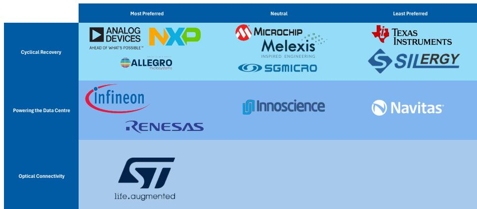
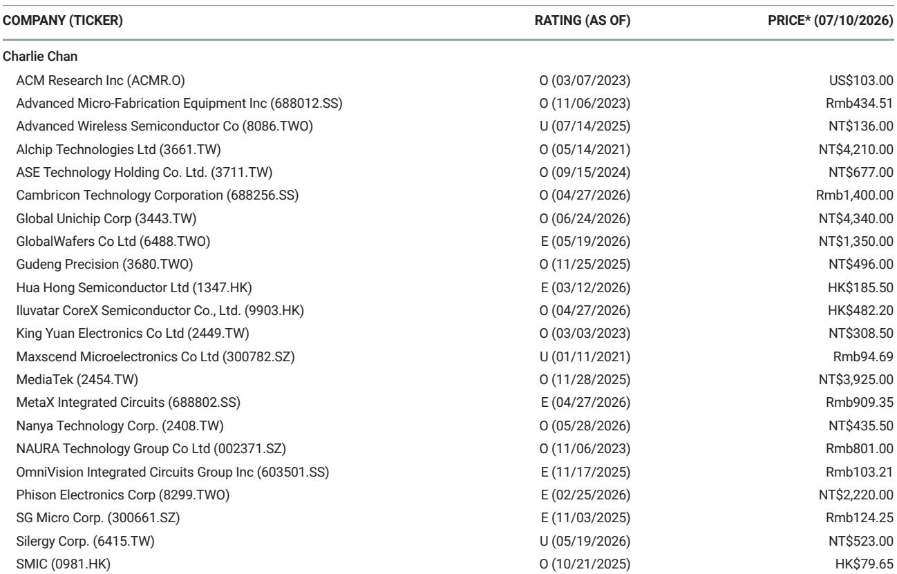
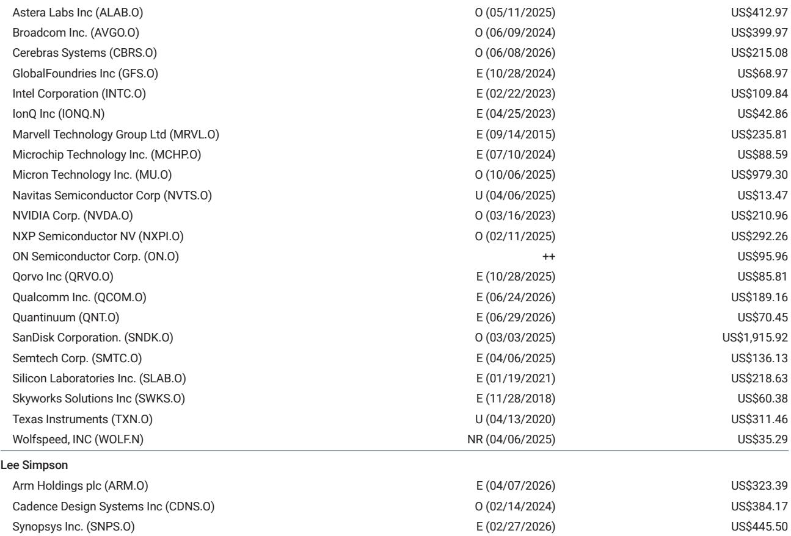

# MS：全球半导体模拟芯片策略-800V动态在发挥作用

这份MS发布的全球模拟芯片季度报告，核心判断并不复杂：模拟芯片行业正在进入一个更可持续的盈利修复周期。但真正值得关注的，不是“复苏”这个结论本身，而是支撑这个结论的证据链条——订单改善究竟是库存回补的短期现象，还是终端需求真实加速的信号。

报告给出的答案是后者。基于渠道调研，分析师观察到三个关键信号：定价纪律在维持、订单取消量有限、客户订单可见度在拉长。这些特征与投机性补库存行为明显不同。与此同时，工厂利用率改善、低利用率费用下降，共同指向利润率将进一步扩张。报告认为，模拟芯片行业正处于更持久的盈利复苏的早期阶段。

## 1. 数据中心功率半导体的部署路径正在被重新定义

读者在本季财报季最关注的问题之一，是英伟达更换机架架构对功率半导体部署的影响。报告承认，随着机架架构演进，800V 方案的采用节奏存在执行不确定性。但渠道调研显示，侧挂式电源系统正在以较低电压独立引入，从 2026 年第三季度开始支持出货，这有助于限制对服务器机架假设的节奏变化不确定性。

基于此，报告预计英飞凌将重申其数据中心销售指引：2026 财年 15 亿欧元、2027 财年 25 亿欧元。支撑这一判断的，是每个机架功率含量的结构性上升，以及每千瓦宏观环境性的持续改善。换句话说，即便 800V 方案推进速度不如预期，功率半导体在数据中心的价值量仍在上升通道中。

> **KC评论：** 这里容易被忽略的是“侧挂式电源系统独立引入”这个细节。它意味着功率半导体的部署并不完全绑定于英伟达的机架架构演进节奏，存在一条独立的、更低电压的出货路径。这对评估相关公司的收入可见度很重要。

## 2. 意法半导体成为本季度的焦点标的

报告明确将意法半导体列为本季度模拟芯片板块的首选标的，看好其财报超预期的潜力。核心驱动力来自两个结构性增长领域：数据中心光学互联和低地球轨道卫星通信。

在光学领域，PIC100 产品的推出以及更高利润率的光学产品正在成为收入和利润率指引上调的催化剂。报告估计，意法半导体的数据中心销售额在 2026 至 2028 财年将以 77% 的年复合增长率增长，到 2028 财年超过 30 亿美元。在低地球轨道卫星领域，报告预计销售额将从 2026 财年的 8.15 亿美元增长至 2028 财年的 18 亿美元。

值得注意的是，报告最近将意法半导体的估值框架切换为分部加总法，以更好地反映光学和低地球轨道业务的结构性增长机会。对这两个高增长业务，报告给予 36 倍市盈率，而周期性业务仅给予 18 倍市盈率。这种估值框架的调整本身，就反映了对业务结构变化的判断。

## 3. 全球模拟芯片模型揭示的行业分化

报告首次推出了全球模拟芯片模型，覆盖收入、利润率、自由现金流和估值指标。从模型数据看，2026 财年将是模拟芯片上行周期的起点，所有覆盖公司的毛利率都将扩张。

但分化同样明显。在数据中心和光学领域有敞口的公司，如意法半导体和英飞凌，增长路径更清晰。而一些以消费电子和通用工业为主要市场的公司，复苏力度相对温和。报告对德州仪器持谨慎看法，认为其资本开支扩张将在短期内压制盈利和自由现金流增长，同时面临定价不确定性和来自中国本土供应商的竞争。

这种分化意味着，模拟芯片的复苏并非普涨行情，而是结构性需求驱动的公司才能获得更持续的盈利改善。对于产业决策者而言，判断一家模拟芯片公司的前景，关键不在于行业整体是否复苏，而在于其终端市场组合中，数据中心、汽车电气化和光学互联等结构性增长领域的占比有多大。

For informational purposes only. Portions may be generated,translated,summarized,or edited with AI assistance based on source materials and may contain omissions or errors. Please verify independently. This is not investment,legal,tax,accounting,or other professional advice.

