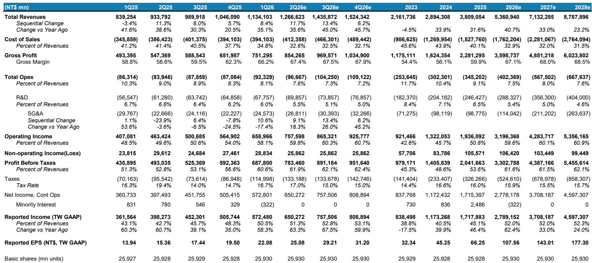
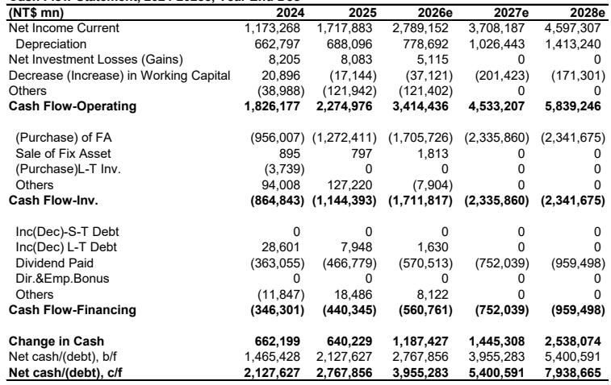
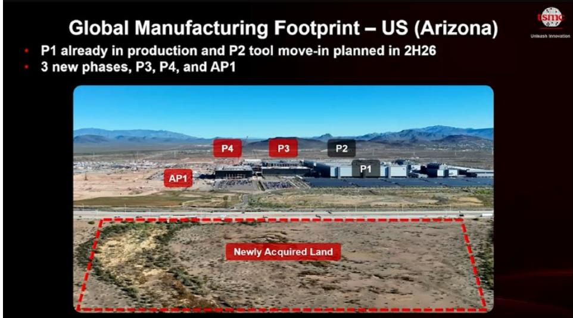

# 关于某半导体代工龙头毛利率讨论背后的深层战略：产能分配，而非定价，将定义下一周期

该龙头即将发布最新财报，当前公司报价对应2027年预估每股表现的约17倍，而其2025至2028年的年复合营收增长率约为32%。这种估值压缩反映了市场正在努力调和两种相互矛盾的信号：异常清晰的需求前景，以及在其历史上最激进的产能建设周期之前似乎已达峰值的毛利率轨迹。核心矛盾不在于AI需求是否真实——它是真实的——而在于市场对毛利率的预期是否已经超出了该公司全球扩张所带来的结构性成本现实。在与约30至40位海外读者交流后，共识观点是，该公司的重新定价将逐步进行，而非跳跃式，并且接近70%的毛利率预期是担忧的来源，而非确信。

买方已建立了对2026年第三季度的预期，这些预期暗示毛利率环比持平或微升至约69%至70%，这得益于2026年下半年的晶圆价格上涨。全年营收预期已上调至同比增长30%以上，2026年的资本支出指引预计将超过560亿美元。2026至2028年的三年资本支出展望，可能超过2000亿美元，也在预期之中。这些假设孤立来看并非不合理。但它们建立在一个前提之上：晶圆价格上涨对利润率的传导速度，要快于海外晶圆厂的成本压力和2nm制程爬坡带来的稀释效应所能抵消的速度。这个前提是脆弱的。

我们自己的预估在营收上更为积极，但在毛利率上更为谨慎。我们预计2026年第三季度营收（以美元计）环比增长10%至15%，全年营收将达到同比增长30%以上，接近40%。利润率前景则不那么乐观：我们预计第三季度毛利率在67%至68%区间，环比持平，因为海外晶圆厂成本和2nm制程稀释吸收了利用率提升带来的好处。买方正在定价一个成本结构可能尚不支持利润率扩张。营收动能与利润率轨迹之间的差距，是该龙头公司近期估值最重要的单一变量。

## AI半导体收入的5年年复合增长率正加速至70%，但AI半导体的定义正成为一个战略决策

我们需求预测中最重要的修正，是该龙头公司AI半导体收入的年复合增长率在未来五年内从中高50%区间加速至70%。主要驱动力并非GPU需求的突然激增——这已包含在先前的预估中。而是内存成本对近期云资本支出增长的贡献日益增加，这反过来又通过该公司的生态系统拉动了更多的代工订单。更高的内存成本意味着云服务提供商必须花费更多才能获得相同的计算能力，而这部分增量支出又流回了该公司的先进制程晶圆启动量。

这种加速引发了一个定义性问题，管理层需要在财报电话会议上解决。该公司历史上对AI半导体收入的定义方式，可能排除了AI CPU芯片和网络芯片。如果公司收窄定义，报告的AI收入年复合增长率将低于真实的经济敞口。如果它拓宽定义，总体数字将激增，但与以往期间的可比性将被打破。观察者不仅应关注增长率，还应关注该公司围绕其设定的边界条件。战略含义很明确：该公司的AI收入正变得如此广泛，以至于该类别本身可能需要重新定义，才能保持分析上的有用性。

## 代工竞争是关键议题，答案在于EUV光刻机分配，而非制程节点规格

财报电话会议前的读者对话集中在该公司将如何应对来自三星代工（受益于强劲的内存利润）和英特尔代工（享有海外政策支持）的竞争。技术路线图对比显示，该公司在逻辑密度和制造执行方面保持领先，其2nm环绕栅极工艺预计将超越两家竞争对手。英特尔的18A工艺正在追赶该公司的N3E性能，三星的SF2正接近该公司的N3P。但在特定节点上的技术对等，并不等同于产能分配上的竞争对等。

该公司真正的竞争护城河不仅仅是工艺技术——而是极紫外光刻设备的分配。我们的行业调研表明，ASML根据历史需求和合作伙伴关系深度优先分配EUV设备，而该公司仍然是EUV工具的最大客户。这赋予了该公司在产能部署上的结构性优势，这是任何竞争对手在短期内都无法复制的。一家代工厂可以设计出有竞争力的2nm工艺，但如果没有优先获得EUV工具，就无法将该工艺扩展到有意义的规模。2027年的EUV分配计划，将根据ASML即将发布的财报来确定，这将定义2028年全球2nm代工供应格局。该公司在2027年将先进制程晶圆价格提高5%至10%的能力，取决于这种分配优势，而非抽象的定价权。

## 非AI需求疲软是真实的，但对该公司先进产能而言结构上无关紧要

某地区智能手机芯片库存修正已经开始，数据是明确的。整个供应链的半导体库存天数在2026年第一季度堆积，因为强劲的AI和周边需求推动整个生态系统建立缓冲库存。智能手机和个人电脑领域的非AI客户现在面临物料清单成本上升，他们的应对方式是削减订单或试图将增量成本转嫁给终端用户。该地区智能手机出货量同比下降20%，比先前假设的15%降幅更差。

这种修正对该龙头公司的影响可以忽略不计，原因在于结构。该公司的消费类客户集中在高端市场，在那里成本转嫁更容易。某头部厂商是这一动态的例证：它提高了产品定价，同时保持了在该公司的相同晶圆需求。更重要的是，消费类客户释放的晶圆位于先进制程节点——5nm及以下——在这些节点上，AI需求几乎可以立即吸收产能。5nm节点本身预计将从2027年开始下降，因为某系列产品将从5nm迁移至3nm，但这是一个计划中的过渡，而非需求冲击。非AI修正是一个长期增长故事中的周期性事件，而该公司的产能可互换性使其对公司的财务轨迹而言无足轻重。

## 评估该龙头公司的决策框架：三个变量，一个结果

在当前水平评估该龙头公司的观察者需要一个结构化框架来区分信号和噪音。三个变量决定了该公司报价在未来12至18个月的轨迹，每个变量都有明确的方向性含义。

第一个变量是营收增长与毛利率之间的差距。如果该公司报告的2026年第三季度毛利率符合我们67%至68%的预估，而非买方预期的69%至70%，报价最初可能会有所反应。这种反应可能是一个观察机会，因为利润率压缩是由暂时性成本因素驱动的——海外晶圆厂爬坡和2nm稀释——这些因素将随着利用率提升和折旧稳定而逆转。毛利率底部在60%，长期轨迹是从当前水平向上。短期内的毛利率未达预期并不会改变中期利润率观点。

第二个变量是从5nm到3nm以及从3nm到2nm的产能转换速度。该公司正在加速这两个过渡。它正在将台南的初始3nm产能布局改为2nm，将日本熊本晶圆厂从6nm迁移至3nm，并在某地区将5nm产能转换为3nm。这些举措证实了3nm产能严重短缺，并且该公司愿意牺牲成熟节点收入来捕捉先进制程需求。对观察者的含义是，该公司的收入组合将更积极地转向更高价值的节点，即使晶圆级定价保持稳定，也能支持长期平均销售价格的扩张。

第三个变量是三年资本支出展望。如果该公司提供2026至2028年超过2000亿美元的资本支出框架，市场将将其解读为对需求可见性有信心的信号。我们的预估指向2027年和2028年均为750亿美元，2nm和1.6nm产能建设到2026年底将达到每月近10万片晶圆，2027年达到15万至17万片，2028年超过20万片。用于CoWoS和SoIC的先进封装产能也在快速扩张，预计到2027年CoWoS将达到每月20万片晶圆，SoIC达到每月7万片晶圆。达到或高于共识的资本支出数字将强化一个叙事：该公司正在为一个多年需求周期进行投资，而非一个峰值。

这三个变量的结果是，该公司的重新定价将是渐进和阶段性的。该公司报价目前对应2027年每股表现的约17倍，而营收年复合增长率为32%，这意味着市场正在定价一个显著的利润率压缩，而我们的分析表明这是暂时的。每一次确认需求故事同时澄清利润率轨迹的财报发布，都将消除一层不确定性。催化剂是明确的：ASML的财报将确认EUV分配优先级，全球云服务提供商的资本支出更新将验证内存驱动的需求加速。该公司的财报电话会议将是这些催化剂中的第一个，也是最重要的一个。

*仅供参考。部分内容可能基于源材料通过AI辅助生成、翻译、总结或编辑，可能存在遗漏或错误。请独立核实。这不构成任何专业建议。*

仅供参考。部分内容可能基于源材料通过AI辅助生成、翻译、总结或编辑，可能存在遗漏或错误。请独立核实。这不构成任何专业建议。

