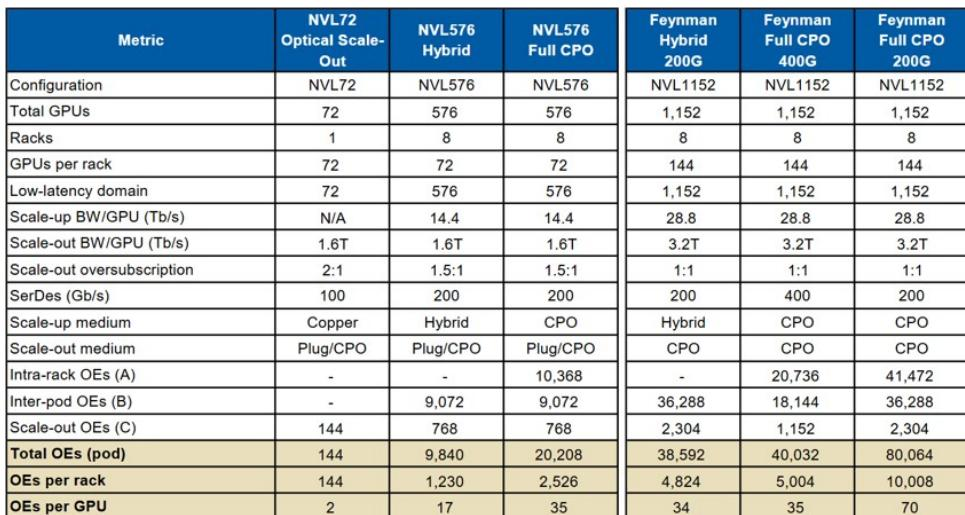
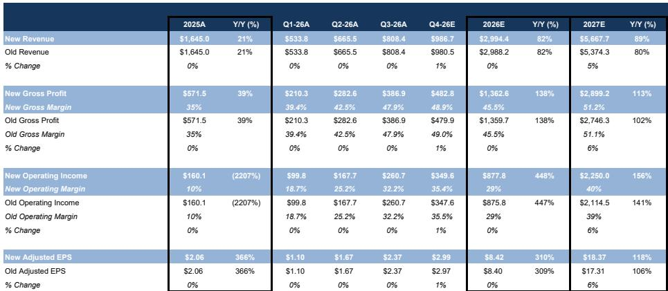
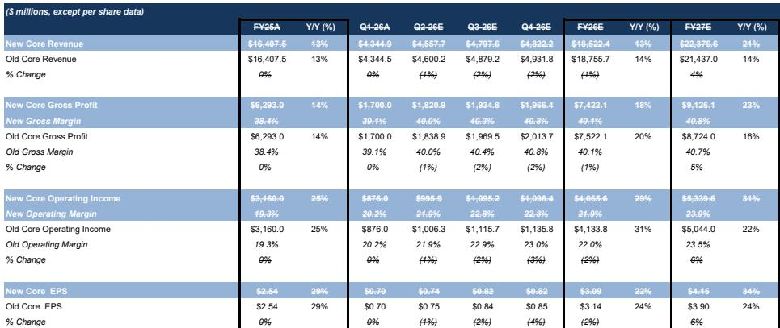

# MS：科技-北美为扩展网络带来更多光明-更新版扩展入门

AI基础设施的研究叙事正在经历一次关键修正。MS最新发布的Scale-Up网络深度报告，将2030年市场规模预估从一年前的170亿美元大幅上调至730亿美元，增幅超过4倍。这个数字变化的背后，不是简单的需求线性外推，而是AI集群架构本身正在发生结构性变化。

报告的核心判断是：铜缆在AI加速器互联中的寿命被市场低估，而共封装光学（CPO）的真正规模化部署可能要等到2029年之后。这意味着，近期市场对CPO进度“延迟”的担忧，可能过度放大了短期不确定性。

## 1. 集群规模膨胀是TAM暴增的真正推手

Scale-Up网络市场预估的4倍上调，主要驱动力来自单个集群内加速器数量的急剧增加。一年前，行业主流还是8颗GPU的小规模互联；Blackwell架构将这一数字推高至单机柜72颗GPU。而根据报告整理的NVIDIA路线图，Vera Rubin将实现144颗GPU的Scale-Up集群，Rubin Ultra达到576颗，Feynman则可能超过1000颗。

集群规模的扩大，意味着每颗GPU需要与更多邻居通信，互联连接的复杂度和数量呈指数级增长。报告中的测算表显示，从NVL72到Feynman全CPO方案，每颗GPU对应的光学引擎数量从2个飙升至70个。这不是简单的线性增长，而是架构本身在重塑。

> **KC评论：** 市场习惯用“AI资本支出”来估算上游需求，但这份报告提醒我们，资本支出只是分母，真正决定市场规模的是“每单位资本支出中互联的占比”。集群越大，互联占比越高。

## 2. 铜缆的“葬礼”被多次推迟，这次可能也不例外

报告用大量篇幅讨论了铜缆与光互联的博弈。铜缆在延迟、功耗、成本和生态开放性上具有天然优势，但信号速率提升带来的电气损耗、插入损耗和噪声问题，正在逼近物理极限。行业常说的“铜墙”似乎就在眼前。

然而，MS认为，铜缆的寿命被持续低估。PAM4调制、更强大的数字信号处理器、重定时器以及改进的连接器，这些技术创新一次次将铜缆的“死亡日期”向后推。当前的核心争论在于：448G SerDes、PAM6调制和200G重定时器能否将铜缆的传输距离再延长至6米以上。Broadcom已经展示了相关技术，这直接挑战了NVIDIA在Vera Rubin Ultra中推动CPO跨机柜互联的策略。

报告给出的判断是：铜缆在机柜内部仍将是首选方案，至少还会延续几代产品。真正推动光互联落地的，不是信号速率的渐进提升，而是架构层面的变化——当Scale-Up域扩展到多机柜时，铜缆的功耗和效率劣势才会变得不可接受。

## 3. CPO的真正催化剂不在2028，而在2029

市场近期对CPO进度存在担忧，部分原因是NVIDIA的Rubin Ultra方案中CPO部署有限。MS认为，这种担忧被放大了。报告明确指出，CPO在Scale-Up领域的实质性采用要到2029年才会发生，Feynman架构才是第一个真正意义上的全光互联Scale-Up方案。

报告列出了四个关键催化剂：多机柜Scale-Up架构、电气I/O功耗上升、带宽密度需求增加，以及更大规模、更通信密集的AI工作负载带来的带宽需求持续增长。这些趋势会逐步推动近封装和共封装光学解决方案的采用，但时间窗口在2029年之后。

对于光互联相关公司而言，下一个关键催化剂是10月的OCP峰会。报告认为，Q2财报可能不会成为重大催化剂，因为当前供应链约束和CPO进度担忧已经导致相关标的近期表现不佳。但OCP峰会可能重新点燃市场对CPO的热情。

> **KC评论：** 市场往往对技术路线图的时间点过于敏感。这份报告的价值在于，它把“CPO延迟”重新定义为“铜缆寿命延长”，两者是同一枚硬币的两面。对于读者而言，关键不是CPO何时到来，而是铜缆相关公司在这段延长期内能获得多少增量。

## 4. 架构多样性本身就是一种研究逻辑

报告最后给出了一个值得关注的观察框架：由于Scale-Up网络正处于架构演进期，不同客户会选择不同方案，这种多样性本身就是一种确定性。NVIDIA、AMD、AWS、Google各有自己的路线图，没有一种技术方案能统一市场。

这种架构多样性，使得测试与测量领域的公司成为确定性受益者。报告特别上调了Keysight的评级，理由正是“架构多样性需要更多测试”。每一家厂商、每一种互联方案都需要独立的测试验证，这为测试设备公司创造了结构性需求。

对于半导体和互联器件公司，报告认为整体存在正向结构性顺风，但公司表现更多取决于估值和执行记录。NVIDIA仍是首选，Broadcom在2027-2028年ASIC放量前具有吸引力，Astera Labs作为纯正受益标的前景乐观但估值偏高，Marvell有望获得Scale-Up份额但估值和XPU可见性有限。

这份报告的核心启示在于：AI基础设施的研究逻辑正在从“算力增长”转向“互联增长”。当集群规模从几十颗GPU膨胀到上千颗，互联不再只是算力的配角，而是决定系统效率的关键变量。铜缆和光互联的博弈，本质上是工程宏观环境学与物理极限的赛跑——而这场赛跑，铜缆可能比多数人预期的更持久。

For informational purposes only. Portions may be generated,translated,summarized,or edited with AI assistance based on source materials and may contain omissions or errors. Please verify independently. This is not investment,legal,tax,accounting,or other professional advice.

For informational purposes only. Portions may be generated,translated,summarized,or edited with AI assistance based on source materials and may contain omissions or errors. Please verify independently. This is not investment,legal,tax,accounting,or other professional advice.

