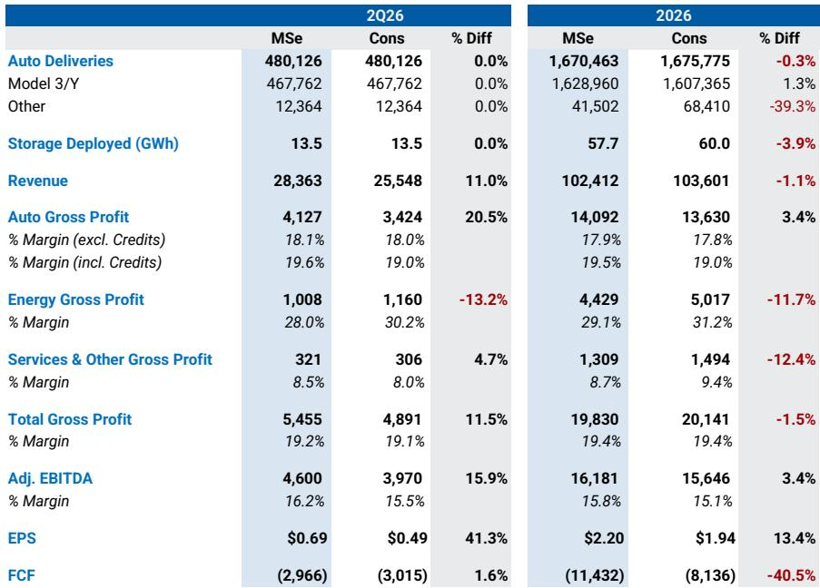
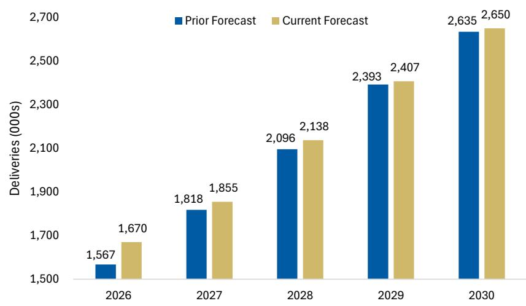
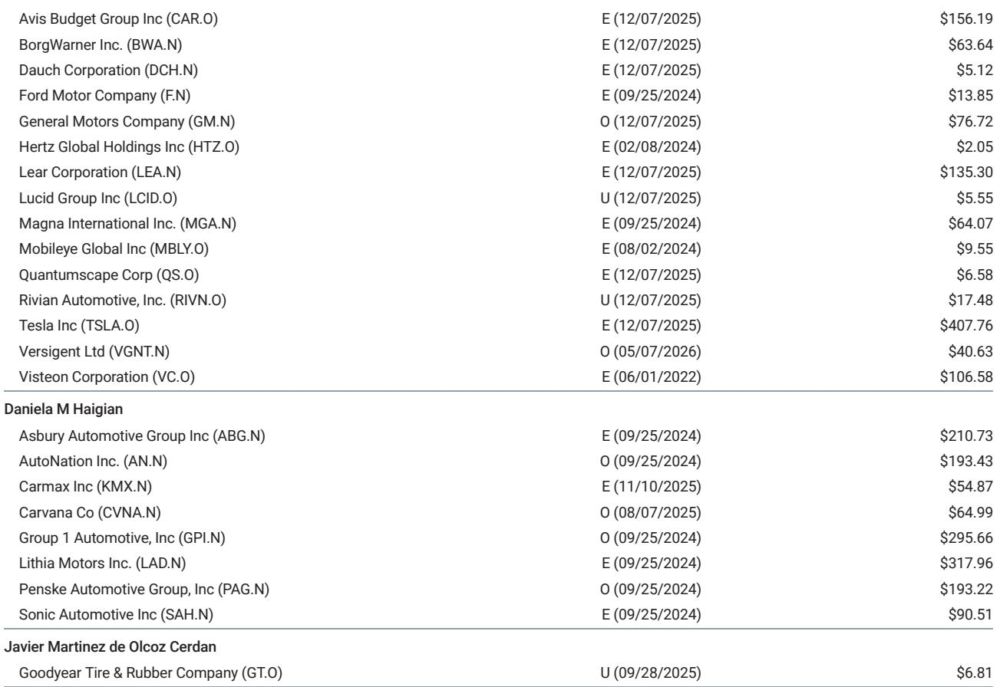

# 特斯拉2026年第二季度财报：物理AI进展能否支撑资本开支弹性较高？

特斯拉在2026年第二季度交付了480,126辆汽车，这一结果比市场普遍预期高出18%，也是该公司自2023年第三季度以来录得的最高汽车增长率。消息公布后，公司股价走低。这一价格走势反映了当前特斯拉叙事中的核心张力：核心汽车业务正在企稳，但市场已不再主要依据汽车销量来为公司定价。随着资本支出预计在2026年弹性较高以上，达到约268亿美元，自由现金流转为负114亿美元，对于观察者而言，关键问题在于特斯拉能否证明其支出正在物理AI领域——自动驾驶出租车和人形机器人——建立起可防御的竞争地位，且速度足以证明现金消耗的合理性。

即将发布的第二季度财报，将在四个维度上提供迄今最具体的证据，用以判断这一论点是否成立：Optimus Gen 3的生产准备情况、Robotaxi服务的地理扩张、Cybercab的制造效率，以及当前资本支出周期的可能持续时间。每一个维度的影响都远超单个季度的数字。汽车业务仍约占总收入的70%，其稳定性之所以重要，是因为它为观察者赢得了耐心，从而可以对特斯拉在更大潜在市场中的成功赋予更高概率。但仅靠稳定性本身并非催化剂。推动公司报价决定性走高的重新定价，需要证据表明特斯拉的物理AI雄心正在变得具体可感。

## 强劲的汽车交付提供了基础，但并非故事的全部

第二季度交付量的超预期表现，得益于汽油价格上涨、欧洲市场在低基数上的反弹，以及HW3换购带来的潜在利好。在美国新发布的Model YL应会继续支撑2027年的销量。分析师们已据此将2026年和2027年的交付预测分别上调至167万辆和186万辆，此前分别为157万辆和182万辆。

然而，市场对一次明确的运营超预期表现反应平淡，这表明汽车板块已成为研究逻辑的必要条件，而非充分条件。剔除ZEV积分的汽车毛利率预计本季度为18.1%，基本符合市场预期的18.0%，全年预计为17.9%。对于一家正在扩大生产规模的制造商而言，这些数字尚可，但它们并不代表盈利能力的阶跃式变化。特斯拉模式中的真正杠杆来自高毛利的软件和服务收入。全自动驾驶订阅的毛利率估计约为90%。按年底全球约15%的渗透率（即约148万订阅用户）计算，仅FSD一项就能显著改变已安装基数的利润结构。但这一渗透率取决于欧洲和中国的监管批准，以及无监督FSD的成功推出——这两者仍存在不确定性。

结论很明确。观察者应将汽车业务视为保持公司运营可信度的基础，但估值倍数将由其他因素决定。一个稳定的汽车板块是物理AI叙事的入场券，而非其上行空间的来源。

## FSD里程加速是领先指标，但无监督时间表仍是真正考验

FSD于5月3日突破了100亿英里行驶里程的里程碑，比预期提前数周，日均里程数从4月的1850万英里加速至约2670万英里。这是一个有意义的数据点。更多里程在FSD启用状态下行驶，意味着更多的训练数据、更高的订阅用户留存率，以及更强的证据表明该系统正接近无监督运行所需的可靠性门槛。

第二季度财报电话会议应提供三个方面的更新。首先，FSD v15的推出，这被视为一个关键的模型版本，可能实现大规模的无监督Robotaxi和个人无监督FSD。其次，在中国和欧盟取得监管批准的进展，此前已有少数欧洲国家在本季度批准了该技术。第三，面向消费者车辆的无监督FSD的任何具体里程碑，尽管管理层已表示最早可能的时间点是2026年第四季度。

然而，市场的关注点将较少放在技术本身，而更多放在运营的实证上。特斯拉于7月3日在迈阿密推出了其Robotaxi服务，包括没有安全监控员的无监督车辆——这是德克萨斯州以外的首次此类推出。在第一季度财报演示中，迈阿密与凤凰城、奥兰多、坦帕和拉斯维加斯一同被列为“筹备中”。观察者应预期特斯拉确认在年底前于所有这些都会区推出服务。车队中Robotaxi的相对数量预计到年底仅为1500辆，到2030年增至30000辆，因此近期的收入贡献微不足道。重要的是推出的变化速度。每一个新城市的推出，都会减少对特斯拉自动驾驶技术能否在受控环境之外大规模运行的怀疑。

## Optimus采购指引指向值得密切关注的生产爬坡

近期报道显示，特斯拉已开始为Optimus组件发布具体的采购指引，要求供应商在9月前将产能提升至每周约1000台，到年底提升至每周2000至2500台。如果实现，这些产量将代表从迄今为止展示的少数原型机的大幅加速。

第二季度财报电话会议是公司提供关于最终设计、生产爬坡节奏以及特斯拉自身制造基地内早期应用场景机会的更新的自然场合。根据近期管理层评论，完整的产品发布被认为可能性较低，但观察者应关注Gen 3的验证过程。如果特斯拉能够证明Optimus正从一个研究项目转变为一个拥有承诺供应商产能的生产项目，那么人形机器人的叙事将获得其此前所缺乏的可信度。

其战略逻辑很直接。人形机器人代表的总潜在市场可能甚至超过汽车行业，而特斯拉的优势在于其能够利用现有的制造专长、供应链关系和AI能力。但原型机与生产线之间的差距是巨大的。如果采购指引得到确认并执行，这将是特斯拉正在弥合这一差距的较强烈信号。观察者应将任何具体的生产时间表视为比产品演示更重要的催化剂。

## 资本支出周期是约束条件，明确其持续时间至关重要

特斯拉的资本支出预计在2026年达到268亿美元，是前一年水平的两倍多，自由现金流消耗为114亿美元。公司已指引资本支出超过250亿美元，并在第一季度财报电话会议上确认预计今年剩余时间自由现金流为负。这些数字尚未包括更大规模太阳能建设或Terafab产能带来的潜在上行空间，这两者都可能推高资本支出。

对观察者而言，关键问题不在于资本支出在理论上是否合理，而在于高支出将持续多久。如此规模的多年度资本支出周期意味着特斯拉正在同时为多个业务建设基础设施：汽车生产、储能制造、Robotaxi车队运营，以及潜在的人形机器人组装。每一项都需要专门的工厂产能、工装和自动化设备。

第二季度财报电话会议应提供关于此周期持续时间的更多信息。如果管理层暗示资本支出将在三年或更长时间内保持在250亿美元以上，自由现金流状况将在较长时间内保持为负，估值将完全取决于市场对这些投资最终能产生回报的信心。反之，如果管理层表示2026年代表周期峰值，且资本支出将在2027年和2028年下降，那么实现正自由现金流的路径将变得可见，股权故事将从对选择权的押注转变为更传统的合理价格增长计算。

## 评估财报的决策框架

观察者可以借助一个结构化框架来审视第二季度财报，该框架将四个关键主题分别映射到一个具体问题和隐含的估值信号。

首先，关于汽车业务，问题是交付超预期表现能否转化为持续的利润率改善。需关注的信号是剔除ZEV积分的汽车毛利率。如果高于18.1%，则表明销量复苏并非通过激进折扣实现，物理AI叙事的基础正在加强。如果低于此水平，则汽车业务正在企稳但未改善，物理AI板块为证明估值合理性所承担的压力将更大。

其次，关于自动驾驶，问题是FSD的采用率是否在加速，以及Robotaxi的推出是否快于预期。需关注的信号是特斯拉确认已开展Robotaxi运营的城市数量，尤其是无监督运营。在已列出的五个城市之外，每增加一个城市，都会降低该技术无法在受控环境之外泛化的尾部风险。

第三，关于Optimus，问题是采购指引能否转化为可信的生产时间表。需关注的信号是2026年或2027年的任何具体产量目标，以及任何对供应商承诺的确认。一个具体的生产目标将代表对人形机器人叙事的一次实质性风险降低。

第四，关于资本支出，问题是管理层是否提供峰值年份的信号。需关注的信号是任何关于2027年或2028年资本支出水平的指引。如果管理层表示资本支出将在2026年后下降，自由现金流轨迹将改善，股权贴现率应下降。如果管理层为进一步增加留下空间，市场在重新定价前将要求更多回报证据。

这些信号的总和将决定公司报价能否突破当前的交易区间。第二季度的数字本身可能强劲，但市场已对运营稳定性进行定价。决定性因素是特斯拉能否将其庞大的投资周期转化为物理AI领域可见的竞争护城河。这是对公司下一阶段走势相对少见重要的问题。

*仅供参考。部分内容可能基于源材料通过AI辅助生成、翻译、总结或编辑，可能存在遗漏或错误。请独立核实。这不构成专业建议。*

仅供参考。部分内容可能基于源材料通过AI辅助生成、翻译、总结或编辑，可能存在遗漏或错误。请独立核实。这不构成专业建议。

