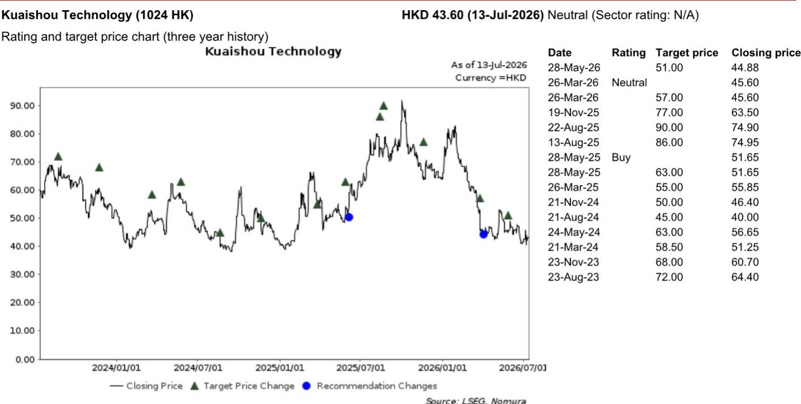
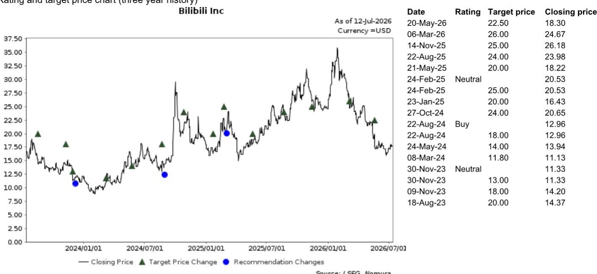
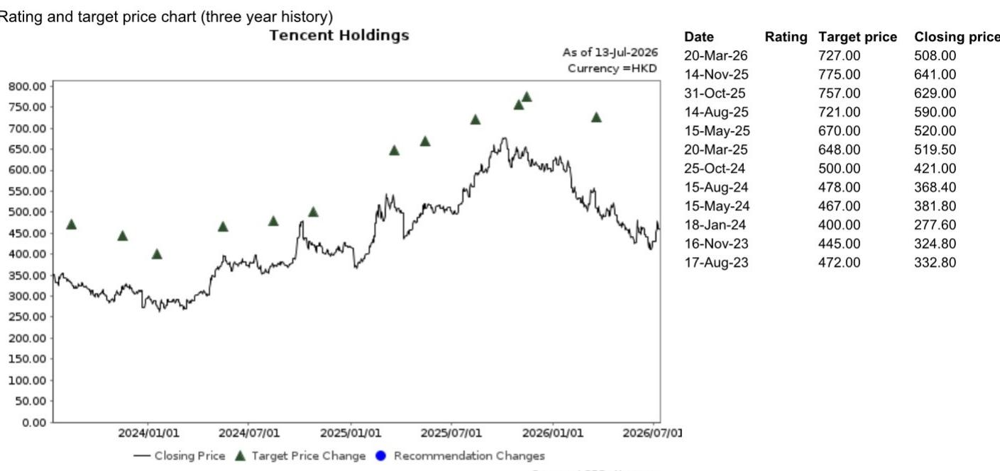

# 研究笔记：中国互联网-新媒体-短剧平台专家交流要点

AI生成短剧的成本优势一度让行业看到了内容生产的“工业化”可能。但研究团队与红果（字节跳动旗下短剧平台）专家的交流揭示了一个反直觉的现实：AI内容在快速膨胀后，正在侵蚀平台最核心的广告价值，迫使平台主动调整策略。

红果是目前国内最大的短剧与动画流媒体平台。其旗舰短剧App在2026年上半年已拥有1.2亿日活用户和3.3亿月活用户。AI生成内容目前贡献了平台不到30%的观看量。但正是这不到三成的份额，已经引发了平台层面的干预——红果正在通过调整权重、收入分成和更严格的内容审核，将AI内容的占比控制在这一水平，同时将约70%的流量分配给真人短剧。

这份报告的核心洞察不在于AI短剧的增长有多快，而在于：当技术大幅降低内容生产门槛后，平台如何在不伤害用户粘性和广告主信任的前提下，管理这种“低成本但低质量”内容的无序扩张。

## 1. AI短剧的成本优势背后，是更低的吸引率与更短的生命周期

AI工具将短剧制作成本压缩至真人内容的四分之一到三分之一，生产周期也大幅缩短。但研究援引专家数据指出，AI短剧获得观众青睐的概率仅为2%至8%，远低于优质真人短剧10%至20%的成功率。

更关键的是，AI短剧的流行周期通常只有两到四周。如果平台放任这类内容泛滥，用户的整体观看时长会下降，疲劳感上升，留存率也会被削弱。对于以广告为主要变现模式的平台而言，用户时长和情感投入的稀释，直接意味着广告价值的缩水。

> **观察：** 成本优势不等于商业优势。AI短剧的低吸引率和短流行周期，意味着平台需要用更多内容来维持同样的用户时长，这反而可能推高内容分发的边际成本。红果的干预，本质上是算了一笔“内容生态的长期账”。

## 2. 广告主对AI内容的付费意愿，是平台决策的底层逻辑

研究显示，2026年上半年红果核心收入约200亿元人民币，同比增长87%，其中广告收入占比高达97%。真人短剧广告收入约165亿元，同比增长69%；AI短剧广告收入虽然同比增长约400%至28亿元，但基数极低。

专家明确指出，品牌广告主对真人内容的投放意愿明显强于AI内容。如果平台的内容供给快速向AI倾斜，广告主可能会重新评估平台的投放价值。红果的干预，本质上是在保护广告主对平台的信任——这种信任一旦被低质量内容稀释，恢复成本极高。

红果2026年全年的核心收入目标为420亿至450亿元，同比增长约100%。要实现这一目标，平台必须在AI内容的成本优势与真人内容的广告溢价之间找到平衡点。

## 3. AI短剧市场仍在快速扩张，但平台竞争格局已初步形成

研究预计，2026年中国AI短剧市场规模将达到267亿元，同比增长约80%。这将推动真人与AI短剧合计市场规模突破1200亿元，同比增长约25%。

红果在AI短剧市场占据超过60%的份额。腾讯和快手相关的App及小程序各占约12%，B站和爱奇艺等传统长视频平台分享剩余约20%的份额。红果的目标是到2026年底，其独立动画短剧App的日活用户达到3100万，月活用户达到8000万，较6月数据有所增长。

但这份增长并非没有代价。红果正在主动管理AI内容的占比，这一策略可能会影响字节跳动旗下视频生成AI工具Seedance的商业化——因为动画工作室正是这类AI工具的关键客户群。平台对AI内容的调整，可能会间接影响上游AI工具的需求。

> **观察：** 红果的案例提供了一个可复用的观察框架：当一项技术大幅降低内容生产门槛时，平台需要同时评估“供给增长”和“质量稀释”两个方向的影响。广告变现模式下，用户时长和情感投入是比内容数量更关键的指标。任何技术带来的供给爆发，如果无法维持或提升这两个指标，平台就需要主动干预。

这份报告的价值，不在于预测AI短剧的增速，而在于揭示了技术应用中的一个常见现象：成本优势并不自动等于商业优势。当内容生产的门槛被大幅降低，平台面临的挑战不再是“如何生产更多”，而是“如何管理更多”。红果的选择，或许会成为其他内容平台在面对AI影响时的一个参考样本。

For informational purposes only. Portions may be generated,translated,summarized,or edited with AI assistance based on source materials and may contain omissions or errors. Please verify independently. This is not investment,legal,tax,accounting,or other professional advice.

For informational purposes only. Portions may be generated,translated,summarized,or edited with AI assistance based on source materials and may contain omissions or errors. Please verify independently. This is not investment,legal,tax,accounting,or other professional advice.

