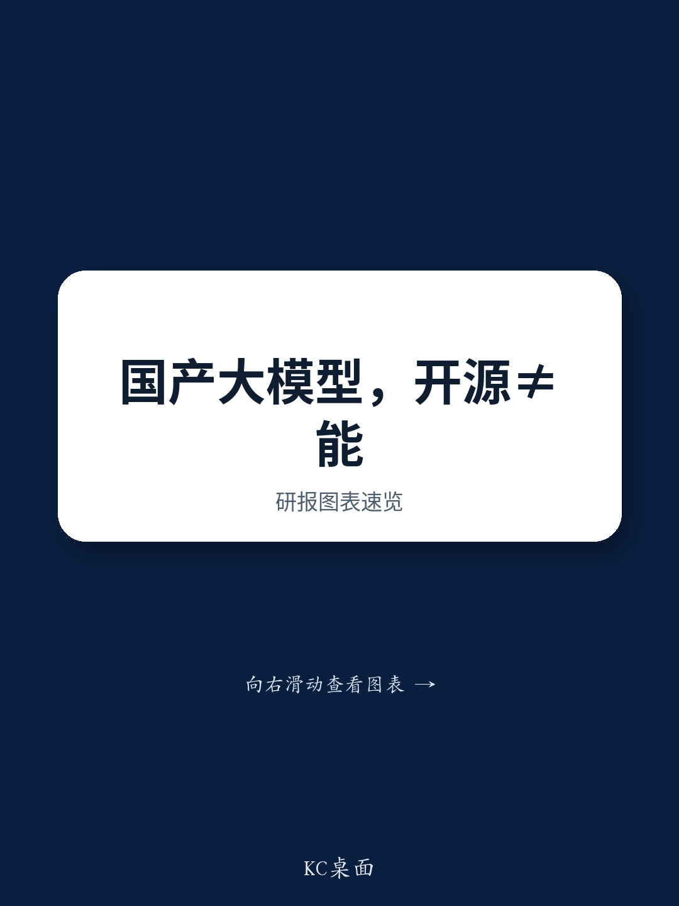

# 开源模型并未创造公平竞争环境：为何DeepSeek的成本优势具有专有性，以及企业锁定将定义赢家

近期一场由全球研究机构组织的专家讨论中，最值得关注的洞察并非中国AI实验室正在降低模型调用价格，而是市场正在分化为两种根本不同的运行模式。一方面，基础模型定价正在下降，供应商将标准化推理服务作为获客手段。另一方面，嵌入企业工作流的高级模型则维持着溢价且持续上升的价格。AI价格战的头条叙事掩盖了一个更具战略性的现实：赢家将是那些能够构建转换成本的供应商，而不仅仅是拥有更好模型的供应商。

开源模型DeepSeek体现了这一悖论。该专家来自一家隶属于研究机构的中国AI实验室，他指出DeepSeek拥有独特的成本优势，这源于其在推理工作负载期间卓越的运营效率。这种效率对于托管相同开源DeepSeek模型的其他平台而言极难复制。开源并不意味着开放操作手册。关键的实现细节和运营知识仍然是专有的，这意味着即使腾讯、阿里巴巴或字节跳动在可比硬件上部署相同的模型权重，DeepSeek的原生部署也能实现更低的平均推理成本。

这种不对称性之所以重要，是因为它重塑了整个中国AI生态系统的竞争格局。开源模型能够普及AI并削弱护城河的传统观点并不完整。在实践中，构建最高效推理栈的模型供应商可以在维持利润率的同时，在API定价上低于所有第三方平台。该专家的实验室在超过100家企业客户中部署了专有基础模型，亲身观察到了这种分化。供应商正在大幅降低基础模型的价格以获取客户，同时提高面向战略客户的高性能模型和定制化服务的定价。

对于企业采购方、观察者和政策制定者而言，战略启示是明确的。竞争不在于谁构建了最佳的模型架构，而在于谁能将模型如此深入地嵌入组织的运营架构中，以至于切换成本变得高不可攀。该专家指出，一旦模型被集成到生产工作流中，切换成本就会变得高昂。这是真正的护城河，并且正在被构建。

## 持续的硬件约束使国产加速器更具吸引力，但优势与推理相关，而非训练

该专家的实验室是华为昇腾加速器的早期大规模采用者，并在近期中国AI芯片需求激增之前数年就开始适配国产硬件和软件。这种早期的投入已见成效。该专家观察到，高端英伟达芯片持续的供应紧张和价格上涨，使得国产AI加速器在推理工作负载方面越来越具吸引力。过去一年中，某些高端英伟达芯片的价格大幅上涨，而国产加速器的价格涨幅则不那么显著。

关键洞察在于，国产硬件的相对经济性在很大程度上取决于工作负载类型。对于训练前沿模型，英伟达的生态系统仍然占据主导地位，且供应约束严峻。但对于推理——企业AI使用的主要场景——国产加速器提供了越来越有吸引力的经济性。该专家的实验室花了数年时间调整其软件栈以在华为硬件上高效运行，这项投入如今正在转化为成本优势，后来者将难以复制。

这为中国更广泛的AI供应链带来了第二层影响。那些已经投资于国产硬件兼容性的公司将在推理方面拥有结构性成本优势，而推理是商业上最相关的层面。那些尚未这样做的公司将面临更高的英伟达采购成本，或者需要花费时间和成本将其软件适配到国产芯片。进行这一转变的窗口正在收窄，该专家的经验表明，适配过程需要数年而非数月。

## 开源不是商业模式，而是一种掩盖专有成本结构的获客策略

该专家对DeepSeek成本优势的分析是报告中最具战略意义的部分。DeepSeek已开源其模型权重和部分软件栈，导致许多观察者认为竞争对手可以复制其性能。该专家有力地论证了这一假设是错误的。DeepSeek的优势源于卓越的系统级优化，包括更高的缓存效率、更低的延迟和更好的硬件利用率。这些不是可以从论文中复制的架构创新，而是必须通过反复实验和深厚的工程专业知识来构建的运营能力。

该专家指出，当云服务提供商在可比硬件上部署相同的开源DeepSeek模型时，DeepSeek的原生部署实现了更高的运营效率和更低的平均推理成本。这意味着DeepSeek可以在API定价上低于第三方平台，同时保持盈利能力。开源模型成为获客工具，但专有的推理栈才是真正的竞争优势。

这种模式并非DeepSeek独有。该专家强调，阿里巴巴是开源策略的早期倡导者，但其最新的旗舰模型Qwen 3.6 Max是以闭源产品形式发布的。正如来自月之暗面的一位专家最近指出的，开源模型对于建立品牌知名度和开发者生态系统有效，但闭源仍然是规模化变现专有模型的主要途径。这意味着当前的开源发布浪潮可能是一个暂时现象。随着中国AI实验室成熟并寻求可持续收入，前沿模型可能会越来越倾向于闭源。

对于企业采购方而言，这意味着依赖开源模型进行生产工作负载存在隐藏风险。模型可能是免费部署的，但运营性能将落后于原始开发者的部署。而且开发者最终可能会停止开源其最佳模型。围绕开源模型构建工作流的决策应考虑这样一种可能性：该模型最具成本效益的部署由单一供应商控制。

## 大语言模型定价的分化创造了两个截然不同的市场，具有非常不同的竞争格局

该专家关于定价分化的观察不仅仅是一个战术洞察。它定义了未来几年的战略格局。基础模型处理标准化任务，如简单的文本生成、摘要和翻译，正经历着激进的价格下降。供应商将这些模型作为获客手段来吸引开发者和企业客户。由于客户可以轻松地将基础API工作负载迁移到竞争模型，当供应商的相对少见差异化因素是模型调用成本时，他们缺乏定价权。

相比之下，高级模型服务于大型企业，这些企业优先考虑模型可靠性、任务完成质量、延迟和服务稳定性。这些客户愿意支付溢价，因为切换成本很高。该专家的机构继续降低基础模型的价格以推动客户获取，同时提高面向战略客户的高性能模型和定制化服务的定价。

这种分化对模型供应商有明确的战略启示。在基础模型定价上竞争是一场逐底竞赛。该细分市场的赢家将是那些推理成本最低的供应商，这就是为什么DeepSeek的专有成本优势如此有价值。但真正的价值创造将发生在高级模型细分市场，其中切换成本和定制化创造了定价权。

对于企业采购方而言，启示同样明确。主导媒体报道的头条模型调用价格与其实际成本越来越不相关。相关的问题不是基础模型的每次调用价格，而是将高级模型集成到生产工作流中的总成本，包括定制化、微调和持续的运营支持。该专家观察到国有企业开始为不太敏感的工作流部署来自私营供应商的优越模型，这表明即使是最保守的采购方也开始认识到高级模型的价值。

## 企业采用由两种不同的决策框架驱动：政府和国有企业的安全性，私营企业的投资回报率

该专家将企业AI客户分为两个具有根本不同采购标准的群体。政府和国有企业优先考虑数据安全、监管合规和本地化部署。这一群体强烈偏好使用国产硬件进行本地部署的模型。国有背景的供应商在此拥有客户获取优势，但该专家指出，国有企业开始为不太敏感的工作流部署来自私营供应商的优越模型。这表明政府细分市场并非完全对私营供应商关闭，但准入门槛很高。

相比之下，私营企业由投资回报率驱动。私营客户不接受模糊的长期生产力提升承诺，而是期望在12至18个月内看到其初始AI投资的明确回报。这创造了一个非常不同的销售流程。供应商必须在相对较短的时间内展示可衡量的生产力提升、成本降低或收入增长。

战略启示是，模型供应商需要两种不同的市场策略。对于政府细分市场，关键差异化因素是安全认证、国产硬件兼容性和监管合规。对于私营细分市场，关键差异化因素是可衡量的投资回报率、集成易用性和工作流定制化。试图用单一方法服务这两个细分市场的供应商很可能在两个市场都失败。

## 最具吸引力的商业垂直领域共享一个共同特征：高切换成本和专有数据

该专家将金融服务、办公生产力、编程、制造业、法律和医疗保健确定为大语言模型最可能的主要采用者。这些领域共享两个共同特征。首先，它们拥有大量专有数据集，可用于针对特定任务微调模型。例如，金融机构拥有数十年的交易数据、法律文件和合规记录。其次，这些领域具有复杂的工作流，模型集成创造了高切换成本。

金融服务被认为是最具吸引力的垂直领域之一。金融机构对高级AI工具有相对较高的支付意愿，潜在应用范围从欺诈检测到自动报告再到算法交易。该专家指出，编程能力是更广泛的智能体AI、机器人和自动化运营的基础层。这意味着编程垂直领域不仅因其直接收入潜力而具有战略重要性，还因为它支持了下一代企业AI应用。

工业制造业目前处于早期采用阶段，该专家估计工作流渗透率低于10%。但随着模型改进其多模态能力以解释物理过程，与工业设备的交互预计将加速。这为基础模型带来了重要的长期增长机会，这些模型可以弥合数字与物理运营之间的差距。

企业采购方的决策框架直接但不易执行。第一步是确定这些垂直领域中的哪一个与其业务最相关。第二步是评估潜在供应商，不仅要看模型质量，还要看其为特定工作流定制模型、与现有系统集成以及提供持续支持的能力。第三步是评估切换成本。提供低初始价格但使客户容易离开的供应商，不如提供较高初始价格但构建深度集成使切换成本高昂的供应商有价值。

该专家关于模型供应商可以通过将模型深度嵌入企业工作流来增强企业客户忠诚度的观察，是报告中最重要的战略洞察。中国AI市场的赢家不会是拥有最佳模型架构或最低模型调用价格的公司。它们将是那些在最有价值的企业工作流中构建最深集成的公司。护城河不是模型。护城河是集成。

*仅供参考。部分内容可能基于源材料通过AI辅助生成、翻译、摘要或编辑，可能存在遗漏或错误。请独立核实。本文不构成专业建议。*
