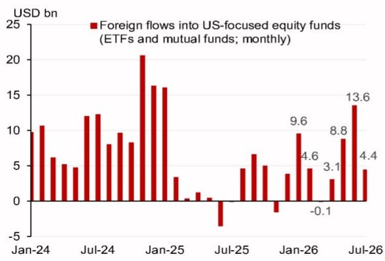
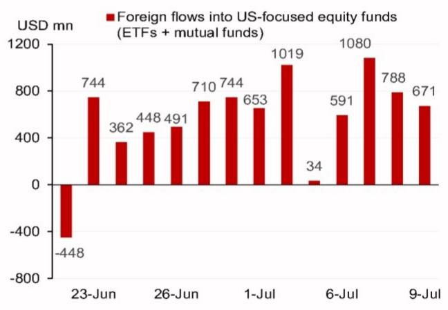
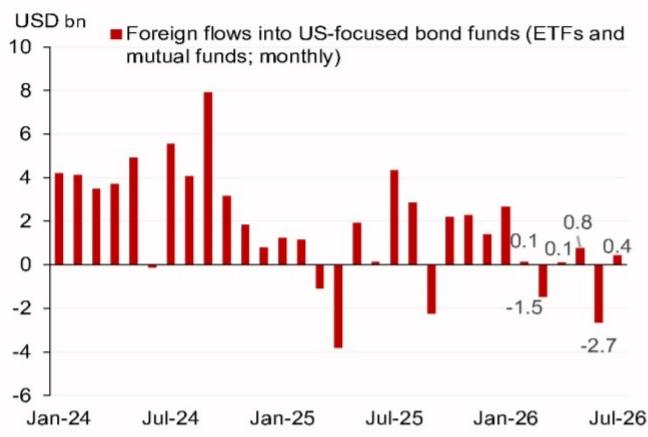
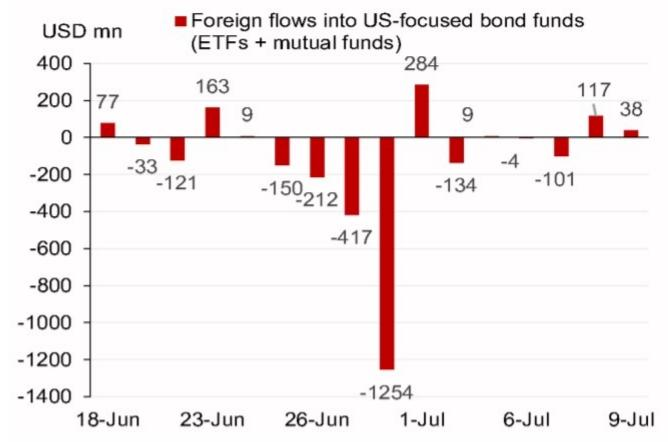
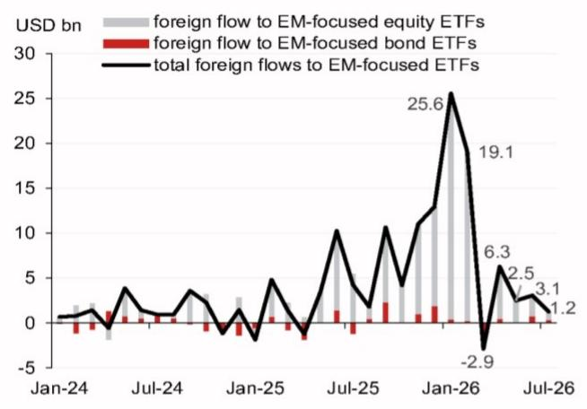
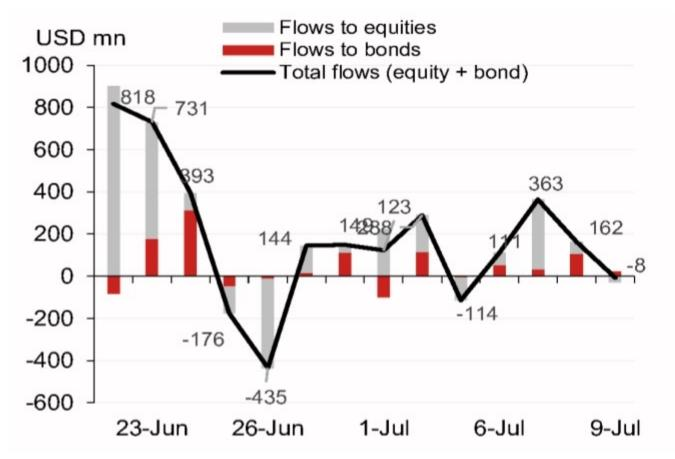
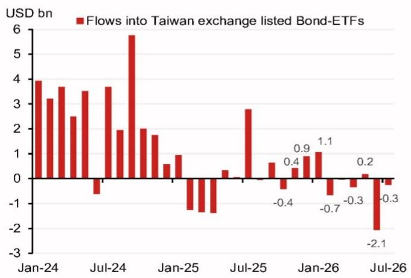
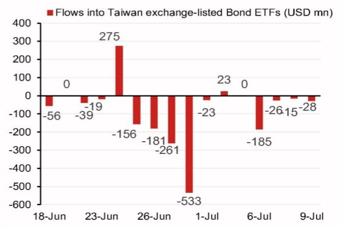
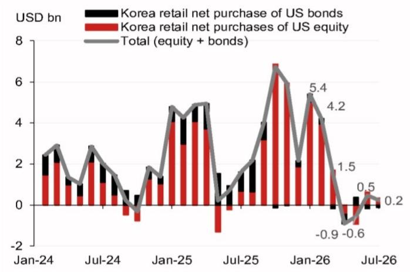

# 宏观观察 - 亚洲（除日本）

## 7月资金持续流入美国相关基金

- 7月3日至9日期间，境外资金净流入美国相关基金总额为32.2亿美元，主要来自权益类基金（32.2亿美元），债券类基金资金流动基本持平。

- 截至7月，美国相关权益类基金累计净流入44.4亿美元，与6月同期约49亿美元的流入规模相近。

- 新兴市场相关ETF资金流入仍较为温和，7月3日至9日期间净流入5.14亿美元，高于前一周的2.69亿美元。

- 韩国个人读者在7月4日至10日期间净卖出美国组合资产8400万美元，扭转了前一周净买入2100万美元的趋势。

- 台湾读者在7月3日至9日期间净卖出美元计价债券基金2.53亿美元，前一周净卖出9.75亿美元。

## 研究分析师

亚洲外汇策略
Craig Chan - NSL
craig.chan@NOM.com
+65 6433 6106

Wee Choon Teo - NSL
weechoon.teo@NOM.com
+65 6433 6107

Vicky Chen - NSL
vicky.chen1@NOM.com
+65 6433 6540

Manthan Shingala - NSL
manthan.shingala1@NOM.com
+65 6433 6427

图1：美国相关证券资金流动汇总

<table><tr><td></td><td colspan="3">境外资金对美国相关基金（ETF和共同基金）</td><td colspan="3">新兴市场相关ETF</td><td colspan="3">韩国个人投资</td><td>台湾本地ETF投资</td></tr><tr><td>百万美元</td><td>美国权益类</td><td>美国债券类</td><td>合计</td><td>权益类基金</td><td>债券类基金</td><td>合计</td><td>美国权益类</td><td>美国债券类</td><td>合计</td><td>美元计价债券</td></tr><tr><td>最新一周（5个交易日）</td><td>3,164</td><td>59</td><td>3,223</td><td>307</td><td>208</td><td>514</td><td>-58</td><td>-26</td><td>-84</td><td>-253</td></tr><tr><td>前一周（前5个交易日）</td><td>3,617</td><td>-1,733</td><td>1,885</td><td>137</td><td>132</td><td>269</td><td>160</td><td>-139</td><td>21</td><td>-975</td></tr><tr><td>7月月度资金流动</td><td>4,449</td><td>436</td><td>4,885</td><td>874</td><td>368</td><td>1,242</td><td>340</td><td>-113</td><td>228</td><td>-253</td></tr><tr><td>6月月度资金流动</td><td>13,555</td><td>-2,655</td><td>10,900</td><td>2,306</td><td>771</td><td>3,077</td><td>633</td><td>-167</td><td>466</td><td>-2,068</td></tr><tr><td>5月月度资金流动</td><td>8,767</td><td>767</td><td>9,535</td><td>2,434</td><td>51</td><td>2,485</td><td>-940</td><td>372</td><td>-568</td><td>175</td></tr><tr><td>4月月度资金流动</td><td>3,092</td><td>114</td><td>3,206</td><td>5,832</td><td>453</td><td>6,285</td><td>-469</td><td>-441</td><td>-910</td><td>-339</td></tr><tr><td>3月月度资金流动</td><td>-111</td><td>-1,465</td><td>-1,575</td><td>-237</td><td>-2,646</td><td>-2,882</td><td>1,691</td><td>-166</td><td>1,525</td><td>-29</td></tr><tr><td>2月月度资金流动</td><td>4,603</td><td>126</td><td>4,729</td><td>18,920</td><td>184</td><td>19,104</td><td>3,949</td><td>257</td><td>4,206</td><td>-662</td></tr></table>

注：最新周度数据截至7月9日（美国权益类和债券类ETF及共同基金、新兴市场相关ETF、台湾读者），以及7月10日（韩国个人读者）。前一周数据为最新周度数据的前5个交易日。
来源：彭博、韩国证券存管院、NOM

## 高频读者资金流动周度更新

- 7月3日至9日期间，境外资金净流入美国相关权益类ETF和共同基金[1]总计32.2亿美元（图3），前一周为36.2亿美元。截至7月，该类基金累计净流入44.4亿美元，而2026年6月为136亿美元（图2）。

- 7月3日至9日期间，境外资金对美国相关债券类ETF和共同基金[2]的净流入基本持平，为5900万美元，前一周为净流出17.3亿美元（图5）。截至7月，该类基金累计净流入4.36亿美元，部分抵消了2026年6月27亿美元的净流出（图4）。

- 7月3日至9日期间，境外资金净流入新兴市场相关ETF[3]增至5.14亿美元，前一周为2.69亿美元。截至7月，境外读者净买入新兴市场相关基金12.2亿美元，而2026年6月为31亿美元（图6和图7）。

- 7月3日至9日期间，权益类基金净流入3.07亿美元，使7月累计净流入达到8.74亿美元，而2026年6月为23亿美元。

7月3日至9日期间，债券类基金净流入2.08亿美元，使7月累计净流入达到3.68亿美元，而2026年6月为7.71亿美元。

- 台湾上市美元债券ETF净流出2.53亿美元（7月3日至9日），较前一周9.75亿美元的净流出有所放缓（图9）。截至7月，台湾读者净卖出美元计价债券2.53亿美元，而2026年6月为21亿美元（图8）。

- 韩国个人读者在7月4日至10日期间仅净卖出美国组合资产8400万美元，其中包括约5800万美元的美国权益类资产和2600万美元的美国债券类资产（图10和图11）。截至7月，韩国个人读者净买入美国组合资产2.28亿美元，而2026年6月为4.66亿美元。

图2：境外资金对美国相关权益类ETF和共同基金的资金流动（月度）

注：7月数据截至7月9日。
来源：彭博、NOM。

图3：境外资金对美国相关权益类ETF和共同基金的资金流动（日度）

来源：彭博、NOM。

图4：境外资金对美国相关债券类ETF和共同基金的资金流动（月度）

注：7月数据截至7月9日。
来源：彭博、NOM。

图5：境外资金对美国相关债券类ETF和共同基金的资金流动（日度）

来源：彭博、NOM。

图6：境外资金对新兴市场相关ETF的资金流动（月度）

注：7月数据截至7月9日。
来源：彭博、NOM

图7：境外资金对新兴市场相关ETF的资金流动（日度）

来源：彭博、NOM

图8：台湾读者对美元债券ETF的资金流动（月度）

注：7月数据截至7月9日。
来源：彭博、NOM。

图9：台湾读者对美元债券ETF的资金流动（日度）

来源：彭博、NOM。

图10：韩国个人读者对美国权益类和债券类资产的资金流动（月度）

注：7月数据截至7月10日。
来源：韩国证券存管院、NOM。

图11：韩国个人读者对美国权益类和债券类资产的资金流动（日度）

来源：韩国证券存管院、NOM。

1. 我们追踪境外资金对美国相关权益类基金流动的代理指标，基于以下假设：在美国以外市场上市/注册的美国相关基金主要由美国以外的个人和机构读者持有。

2. 我们追踪境外资金对美国债券类基金流动的代理指标，基于以下假设：在美国以外市场上市的美国相关基金主要由美国以外的个人和机构读者持有。

3. 我们追踪境外资金对新兴市场相关基金流动的代理指标，基于以下假设：在新兴市场以外市场上市的新兴市场相关基金主要由境外读者持有。

## 附录A-1

本报告由NOM新加坡有限公司（NSL）编制。

关于NOM集团实体的详细信息，请参阅免责声明。

## 分析师认证

我们，Craig Chan、Wee Choon Teo、Vicky Chen和Manthan Shingala，特此证明：（1）本研究报告中所表达的观点准确反映了我们对相关证券或发行人的个人看法；（2）我们的薪酬中没有任何部分直接或间接与本研究报告中的具体建议或观点相关；（3）我们的薪酬中没有任何部分与NOM Securities International, Inc.、NOM International plc或任何其他NOM集团公司进行的特定投行业务挂钩。

## 重要披露

## 研究报告在线获取及利益冲突披露

NOM集团研究报告可在www.NOMnow.com/research、彭博、Capital IQ、Factset、LSEG上获取。

重要披露信息可访问http://go.NOMnow.com/research/m/Disclosures或向NOM Securities International, Inc.索取。如遇网站访问问题，请发送邮件至grpsupport@NOM.com寻求帮助。

负责编制本报告的分析师的薪酬基于多种因素，包括公司总收入，其中一部分来自投行业务。除非另有说明，本报告首页列出的非美国分析师未在FINRA规则下注册/具备研究分析师资格，可能不是NSI的关联人员，且可能不受FINRA规则2241关于与受覆盖公司沟通、公开露面以及研究分析师账户持有证券交易等限制的约束。

NOM Global Financial Products Inc.（NGFP）、NOM Derivative Products Inc.（NDP）和NOM International plc（NIplc）已在美国商品期货交易委员会和美国期货业协会注册为掉期交易商。NGFP、NDPI和NIplc通常从事掉期及其他衍生品交易，其中部分可能为本报告涉及的主题。

## 美国要求的额外披露

自营交易：NOM Securities International, Inc.及其关联公司通常作为本研究报告所涉固定收益证券（或相关衍生品）的自营交易商。分析师与NOM Securities International, Inc.其他人员的互动：NOM Securities International, Inc.及其关联公司的固定收益研究分析师定期与销售和交易部门人员互动，以获取其各自覆盖领域的流动性和定价信息。

## 估值方法 - 固定收益

NOM的固定收益策略师通过提供交易建议来表达对证券价格和市场的看法。这些建议可以是相对价值建议、方向性交易建议、资产配置建议，或三者的组合。

交易建议中嵌入的分析包括但不限于：

- 关于证券价格是否偏离其基础宏观或微观经济基本面的基本面分析。
- 价格变动的定量分析。
- 技术因素，如监管变化、市场风险偏好的变化、意外的评级行动、一级市场活动以及供需因素。

交易建议的时间框架是可变的。战术性建议的时间框架较短，通常少于三个月。战略性交易建议的时间框架较长，通常超过三个月。

根据欧盟市场滥用监管法规，NOM全球固定收益研究发布的评级分布如下：

52%被授予买入（或同等）评级；其中50%的发行人曾接受NOM集团提供的实质性服务*。
0%被授予中性（或同等）评级。
48%被授予卖出（或同等）评级；其中50%的发行人曾接受NOM集团提供的实质性服务。数据截至2026年6月30日。

*根据欧盟市场滥用监管法规的定义
**本报告末尾免责声明部分定义的NOM集团

## 免责声明

本出版物包含由第1页确定的NOM集团实体编制的内容，并可能包含一个或多个NOM集团实体的贡献，其员工及其各自隶属关系在第1页或本出版物其他地方注明。本文中使用的"NOM集团"指NOM Holdings, Inc.及其关联公司和子公司，包括：(a) NOM Securities Co., Ltd.（'NSC'）东京，日本；(b) NOM Financial Products Europe GmbH（'NFPE'），德国；(c) NOM International plc（'NIplc'），英国；(d) NOM Securities International, Inc.（'NSI'），纽约，美国；(e) NOM International (Hong Kong) Ltd.（'NIHK'），香港；(f) NOM Financial Investment (Korea) Co., Ltd.（'NFIK'），韩国（在韩国金融投资协会注册的NOM分析师信息可在KOFIA内部网http://dis.kofia.or.kr上查询）；(g) NOM Singapore Ltd.（'NSL'），新加坡（注册号197201440E，受新加坡金融管理局监管）；(h) NOM Australia Ltd.（'NAL'），澳大利亚（ABN 48 003 032 513），受澳大利亚证券和投资委员会监管，持有澳大利亚金融服务牌照号246412；(i) NOM Securities Malaysia Sdn. Bhd.（'NSM'），马来西亚；(j) NIHK台北分行（'NITB'），台湾；(k) NOM Financial Advisory and Securities (India) Private Limited（'NFASL'），印度孟买（注册地址：Ceejay House, Level 11, Plot F, Shivsagar Estate, Dr. Annie Besant Road, Worli, Mumbai- 400 018, India；电话：91 22 4037 4037，传真：91 22 4037 4111；CIN号：U74140MH2007PTC169116，SEBI证券经纪业务注册号：INZ000255633；SEBI商人银行业务注册号：INM000011419；SEBI研究业务注册号：INH000001014 - 合规官：Pratiksha Tondwalkar女士，电话：91 22 40374904，投诉邮箱：investorgrievancesra@NOM.com 网页：链接

关于印度上市公司或由印度NFASL研究分析师编制的报告：(i) 证券市场投资存在市场风险。投资前请仔细阅读所有相关文件。(ii) SEBI的注册和NISM的认证并不保证中介机构的业绩或向读者提供任何回报保证。(iii) NFASL提供研究服务的条款和条件已在NFASL网页上披露。

(l) NOM Fiduciary Research & Consulting Co., Ltd.（'NFRC'）东京，日本。(m) NOM Orient International Securities Co., Ltd（"NOI"）是NOM集团、东方国际（集团）有限公司和上海黄浦投资控股（集团）有限公司共同控股的合资企业。根据中华人民共和国法律（就本文件而言，不包括香港、澳门和台湾），NOI在中国境内获准提供证券研究和研究交流，并独立于NOM集团其他成员运营；特别是，NOI在中国证券中的权益不会向任何其他NOM集团实体披露或与其持仓合并，其他NOM集团实体在中国证券中的权益也不会向NOI披露或与其持仓合并。研究报告首页NOI旁边印有的个人姓名表明该个人受雇于NOI，根据研究合作协议为NIHK提供研究协助。员工姓名旁边的'NSFSPL'表明该个人受雇于NOM Structured Finance Services Private Limited，根据公司间协议为某些NOM实体提供协助。研究报告首页个人姓名旁边的'Verdhana'表明该个人受雇于PT Verdhana Sekuritas Indonesia（'Verdhana'），根据研究合作协议为NIHK提供研究协助，Verdhana及该个人均未在印度尼西亚境外获得许可。

本材料：(I) 仅供您个人参考，我们不基于此材料招揽任何行动；(II) 不构成在任何司法管辖区出售或招揽购买任何证券的要约，若此类要约或招揽在该司法管辖区属非法行为；以及(III) 除与NOM集团相关的披露外，基于我们认为可靠的来源信息，但未经NOM集团独立核实。

除与NOM集团相关的披露外，NOM集团不保证、陈述或承诺（明示或暗示）本文件的公平性、准确性、完整性、正确性、可靠性或适用于任何特定目的或适销性，并且在法律/法规允许的最大范围内，不承担因使用本文件及相关数据而产生的任何行为（或决定不采取行动）的责任（无论是因疏忽或其他原因，以及全部或部分）。在法律/法规允许的最大范围内，NOM集团的所有保证和其他承诺特此排除，NOM集团不承担因使用、误用或分发本材料或其中包含的信息或以其他方式与之相关的任何损失而产生的任何责任（无论是因疏忽或其他原因，以及全部或部分）。

本材料中表达的意见或估计为截至原始发布日期的最新意见，其中包含的信息（包括意见和估计）可能随时更改，恕不另行通知。然而，NOM集团明确表示不承担任何更新或修订本文件的义务。本文中的任何评论或陈述均为作者的观点，可能与NOM集团内部其他方的观点不同。客户应考虑本报告中的任何建议或推荐是否适合其特定情况，并在适当时寻求专业建议，包括税务建议。NOM集团不提供税务建议。

在适用法律/法规允许的范围内，NOM集团及其高级职员、董事、员工和关联方可能作为自营商、代理人或其他身份进行交易，或持有本文提及的发行人或证券的多头或空头头寸，或买卖基于其的证券、商品或工具、期权或其他衍生工具。NOM集团公司也可能担任发行人金融工具的市场做市商或流动性提供者（根据英国适用法规的定义）。若市场做市商活动符合美国或其他司法管辖区特定法律法规的定义，将在具体的发行人披露中单独说明。

本文件可能包含从第三方获得的信息，包括但不限于信用评级机构的评级（如标准普尔）。NOM集团特此明确否认对从第三方获得的任何信息在本材料中或以其他方式与之相关的原创性、公平性、准确性、完整性、正确性、适销性或适用于特定目的的所有陈述、保证或承诺，并且不承担（无论是因疏忽或其他原因，以及全部或部分）因使用或误用从第三方获得的任何信息而产生的任何直接、间接、附带、示范性、补偿性、惩罚性、特殊或后果性损害、成本、费用、法律费用或损失（包括收入或利润损失和机会成本）。禁止以任何形式复制和分发第三方内容，除非事先获得相关第三方的书面许可。第三方内容提供者不（明示或暗示）保证任何信息（包括评级）的公平性、准确性、完整性、正确性、及时性或可用性，并且不对因使用或误用此类内容而产生的任何错误或遗漏（无论是否疏忽）负责。第三方内容提供者不提供任何明示或暗示的保证，包括任何适销性或适用于特定目的或用途的保证。第三方内容提供者不承担（无论是因疏忽或其他原因，以及全部或部分）因使用或误用其内容（包括评级）而产生的任何直接、间接、附带、示范性、补偿性、惩罚性、特殊或后果性损害、成本、费用、法律费用或损失（包括收入或利润损失和机会成本）。信用评级是意见陈述，不是事实陈述，也不是购买、持有或出售证券的建议。它们不涉及证券的适合性或证券是否适合研究目的，不应作为研究交流依赖。本文件中的任何MSCI来源信息均为MSCI Inc.（'MSCI'）的专有财产。未经MSCI事先书面许可，不得为任何目的复制、转载、重新分发、再分发或使用本信息及任何其他MSCI知识产权（全部或部分），包括创建任何金融产品和任何指数。本信息按"原样"提供。用户承担使用本信息的全部风险。MSCI、其关联方以及任何参与计算或编制本信息的第三方特此明确否认对本材料或其中包含的信息或以其他方式与之相关的任何原创性、公平性、准确性、完整性、正确性、适销性或适用于特定目的的所有陈述、保证或承诺。在不限制前述规定的前提下，MSCI、其任何关联方或任何参与计算或编制本信息的第三方在任何情况下均不承担任何类型的损害赔偿责任（无论是因疏忽或其他原因，以及全部或部分）。MSCI和MSCI指数是MSCI及其关联方的服务标志。

Russell/NOM日本权益指数的知识产权和其他权利属于NOM Fiduciary Research & Consulting Co., Ltd.（"NFRC"）和FTSE Russell（"Russell"）。NFRC和Russell不保证该指数的公平性、准确性、完整性、正确性、可靠性、有用性、适销性、适销性或适合性，并且不对任何指数用户和/或其关联方使用该指数进行的商业活动或服务负责。

读者应将本文件视为其做出决策的单一因素，因此，本报告不应被视为识别或暗示与任何决策相关的所有直接或间接风险。NOM集团制作多种不同类型的研究产品，包括基本面分析和定量分析等；一种研究产品中的建议可能因时间框架、方法论或其他原因而与另一种研究产品中的建议不同。NOM集团以多种不同方式发布研究产品，包括在NOM集团门户网站上发布和/或直接分发给客户。不同客户群体可能根据其个人需求从研究部门获得不同的产品和服务。

本文中呈现的数字可能涉及过往表现或基于过往表现的模拟，这些并非未来或可能表现的可靠指标。若信息包含对未来表现和业务前景的预期、预测或指示，此类预测可能并非未来或可能表现的可靠指标。此外，模拟基于模型和简化假设，可能过度简化且不能反映未来的回报分布。本文件中为说明目的创建和发布的任何数字、策略或指数，均不旨在作为欧盟基准监管法规定义的"基准"使用。某些证券受汇率波动影响，可能对投资的价值、价格或收入产生不利影响。

关于固定收益研究：建议分为两类：战术性建议，通常持续最多三个月；或战略性建议，通常持续6-12个月。然而，交易建议可能随时根据情况变化进行审查。交易建议还提供"止损"水平，一旦触及，将自动关闭交易建议。建议中显示的价格和回报表现是在提交发布时获取的，基于当时彭博、LSEG或NOM的指示性价格和回报表现。显示的价格和回报表现不一定是可以执行交易建议的价格和回报表现。

本文所述的证券可能未根据美国1933年证券法（"1933年法案"）注册，在此情况下，除非已根据1933年法案注册，或符合1933年法案注册要求的豁免条件，否则不得在美国或向美国人士发行或出售。除非适用法律允许，否则任何交易均应通过您所在司法管辖区的NOM实体执行。

本文件已获NIplc批准在英国作为研究分发。NIplc受审慎监管局授权，并受金融行为监管局和审慎监管局监管。NIplc是伦敦证券交易所成员。本文件不构成英国适用法规意义上的个人建议，也未考虑个人读者的特定目标、财务状况或需求。本文件仅面向英国适用法规意义上的"合格对手方"或"专业客户"，因此不得向此类目的下的"零售客户"重新分发。

本文件已获NFPE批准在欧洲经济区作为研究分发。NFPE是一家根据德国法律注册成立的有限责任公司，在法兰克福/美因河畔法院商业登记处注册，注册号为HRB 110223。NFPE受德国联邦金融监管局授权和监管。

本文件已获NIHK批准在香港分发，NIHK受香港证券及期货事务监察委员会监管。本文件仅面向香港适用法规意义上的"专业读者"，因此不得向非"专业读者"的人士重新分发。

本文件已获NAL批准在澳大利亚分发，NAL在澳大利亚受ASIC授权和监管。

本文件也已获NSM批准在马来西亚分发。

在新加坡，本文件由NSL分发，NSL是《财务顾问法》（第110章）定义的豁免财务顾问，并受新加坡金融管理局监管。NSL可根据《财务顾问条例》第32C条安排分发其外国关联公司编制的本文件。本文件面向《证券与期货法》（第289章）定义的认可、专家或机构读者。若本文件接收者不是认可、专家或机构读者，NSL仅在法律要求的范围内对此类接收者承担本文件内容的法律责任。新加坡的接收者应就本文件产生或与之相关的事项联系NSL。本文件旨在广泛分发。它未考虑任何特定个人的具体目标、财务状况或特殊需求。接收者在承诺购买任何证券前，应考虑其具体目标、财务状况或特殊需求，包括根据其认为合适的方式，通过单独约定寻求独立财务顾问关于投资适合性的建议。除非1933年法案S条例的规定禁止，本材料在美国由NSI（一家美国注册经纪交易商）分发，NSI根据1934年美国证券交易法规则15a-6的规定对其内容承担责任。编制本文件的实体允许NOM集团内独立运营的关联公司向其客户提供此类文件的副本。

本文件未经批准分发给沙特阿拉伯王国"授权人士"、"豁免人士"或"机构"（由资本市场管理局定义）以外的人士，或阿拉伯联合酋长国"市场对手方"或"专业客户"（由迪拜金融服务局定义），或卡塔尔国"市场对手方"或"商业客户"（由卡塔尔金融中心监管局定义），具体由NOM沙特阿拉伯、NIplc或NOM集团任何其他成员视情况而定。本文件及其任何副本不得由未经授权的人士带入、传输或分发到沙特阿拉伯、阿联酋或卡塔尔，或分发给沙特阿拉伯境内的"授权人士"、"豁免人士"或"机构"、阿联酋的"市场对手方"或"专业客户"、卡塔尔的"市场对手方"或"商业客户"以外的任何人士。未能遵守这些限制可能构成违反阿联酋、沙特阿拉伯或卡塔尔法律。

关于涉及台湾上市公司或由台湾研究分析师编制的报告：

本文件仅供参考。您应独立评估风险，并自行承担决策责任。未经NOM集团书面授权，任何媒体或任何其他人士不得复制或引用本报告的任何部分。根据台湾《证券商受托买卖有价证券管理规则》和/或其他适用法律法规，您不得向他人（包括但不限于关联方、关联公司和任何其他第三方）提供本报告，或从事与本报告相关的任何可能涉及利益冲突的活动。关于NOM International (Hong Kong) Ltd.台北分行不可执行的证券/工具的信息仅供参考，不构成建议或招揽交易此类证券/工具。

本材料不得在印度尼西亚境内分发，或传递给印度尼西亚共和国境内的个人，或传递给印度尼西亚公民（无论其居住地或所在地）或印度尼西亚实体或居民，若此行为构成印度尼西亚共和国法律下的公开发行。本文提及的证券不得在印度尼西亚境内发行或出售，或向印度尼西亚公民（无论其居住地或所在地）或印度尼西亚实体或居民发行或出售，若此行为构成印度尼西亚共和国法律下的公开发行。

研究报告首页NOI旁边印有的个人姓名表明本文件是NOI在中国发布的研究报告的翻译版本。在所有其他情况下，本文件由未在中国获准提供证券研究的NOM集团或其子公司或关联公司（统称"离岸发行人"）编制。本研究报告未经批准或旨在在中国境内分发。任何A股相关分析（如有）并非为位于或注册于中国境内的任何人士制作。接收者不应依赖本研究报告中包含的任何信息做出决策，离岸发行人不对此承担任何责任。未经NOM集团成员事先书面同意，不得以任何形式（I）复制、影印、复制或复印本材料的任何部分；或（II）重新分发、重新发布或再分发本材料。若本文件通过电子传输方式分发，如电子邮件，则无法保证此类传输的安全或无错误，因为信息可能被拦截、损坏、丢失、销毁、延迟到达或不完整，或包含病毒。因此，发送者不承担因电子传输而产生的本文件内容中的任何错误或遗漏的责任（无论是因疏忽或其他原因，以及全部或部分）。如需验证，请索取纸质版本。

NOM集团通过其合规政策和程序（包括但不限于利益冲突、中国墙和保密政策）以及维护中国墙和员工培训来管理研究制作中的利益冲突。

关于本文件中包含的任何建议所采用的方法或模型的更多信息，可联系首页列出的NOM研究分析师获取。披露信息可根据要求提供，披露信息可在NOM披露网页上获取：

版权所有 © 2026 NOM Singapore Ltd.，新加坡。保留所有权利。
