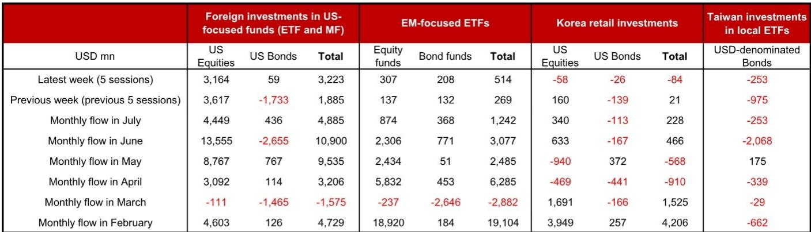
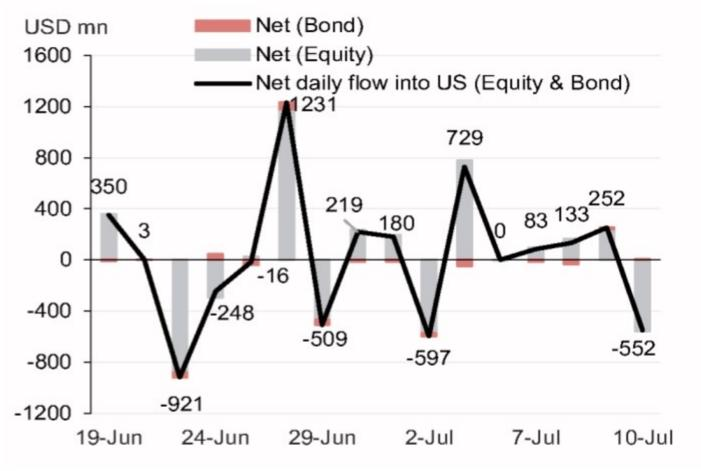

# 七月全球资金流向观察：美国市场吸引力持续，新兴市场资金流入温和

七月上半月的全球资金流向呈现出清晰的格局：外国资金正以与六月相当的节奏重新流入美国市场，而新兴市场基金的资金流入依然温和，亚洲零售读者则在有选择地减少其美国敞口。在7月3日至7月9日期间，外国资金流入美国相关基金的总量达到32亿美元，与上一周36亿美元的规模基本持平。截至7月上半月，累计流入额为44亿美元，已接近六月同期49亿美元的水平。这一数据表明，全球资产配置者并未出现转向或调整，而是再次确认了对美国市场的关注。

关于资金正从美国流向新兴市场或固定收益领域的说法，在周度数据中并未得到支持。最近一周，美国债券基金的资金流入基本持平，为5900万美元，较前一周17亿美元的流出有所恢复，但并未显示出结构性转变。与此同时，新兴市场相关基金仅吸引了5.14亿美元的总流入，高于前一周的2.69亿美元，但与六月全月31亿美元的流入规模相比仍显温和。美国市场需求与新兴市场需求之间的差距正在扩大，而非缩小。对于组合策略研究者而言，这一信号较为明确：2026年主要的资金流向格局并未改变，而七月的数据正在强化这一趋势。

## 美国市场周度资金流入节奏持续，历史经验显示或与美元走势相关

周度资金流入数据显示出显著的稳定性。在最近两个五天的交易周期中，外国读者共向美国相关基金注入了68亿美元。这一节奏比月度总量更能反映资金配置决策的实时动态。六月，月度流入额达到136亿美元，而根据七月前九天的数据，这一趋势似乎正在重现。这意味着机构再平衡资金和零售基金资金正朝着同一方向流动。当月度流入额连续数月保持在100亿美元以上时，随着资金回流压力的积累，美元兑亚洲货币通常会出现升值。汇率研究者应关注这一现象：资金流向数据与美元获得组合资金流入支撑的态势是一致的，而不仅仅是避险需求驱动。

这些资金的结构同样值得关注。股票类资金是总量的主要驱动力，而债券类资金则仍显波动且方向不明。六月，美国债券基金经历了27亿美元的流出，但七月开局录得4.36亿美元的温和流入。这一转变表明，固定收益资产的配置更多是对短期利率预期的反应，而非反映战略性的判断。对于管理多资产组合的读者而言，结论较为直接：外国资金流入美国时偏向股票类资产，这是一种结构性的偏好，而非战术性的波动。任何依赖于资金转向美国债券或从美国市场流出的假设，都需要面对数据所显示的相反事实。

## 新兴市场基金资金流入有所恢复，但规模尚不足以表明格局转变

新兴市场相关基金在最近一周吸引了5.14亿美元的资金流入，约为前一周2.69亿美元的两倍。表面上看，这似乎显示出一定的动能。但结合背景来看，情况更为清晰。六月，新兴市场资金流入为31亿美元，而七月至今的12亿美元表明，这一节奏并未加速。更重要的是，最近一周新兴市场股票类资金流入为3.07亿美元，仅为同期美国市场32亿美元流入额的十分之一。美国市场与新兴市场股票类资金流入的比例约为10比1。这并非格局转变，而是现状的延续。

对于新兴市场资产配置者而言，这一结论虽不轻松，但需要正视。外国读者并未放弃新兴市场，但也并未将其作为优先选择。从前一周的低基数中恢复是积极的信号，但相对规模仍低于吸收一级发行或支持新兴经济体货币持续升值所需的水平。对于亚洲的主权债券管理者来说，新兴市场资金流向数据支持采取防御性姿态。除非新兴市场周度资金流入持续超过10亿美元，否则相对于美元计价资产，增持新兴市场货币或本币债券的风险回报比仍不具吸引力。

## 台湾与韩国零售读者减少美国敞口，但属个体行为而非系统性变化

台湾读者在7月3日至7月9日期间净卖出了2.53亿美元的美元计价债券基金，较前一周9.75亿美元的流出规模显著放缓。韩国零售读者在同一时期净卖出了8400万美元的美国组合资产，与前一周2100万美元的净买入形成逆转。乍看之下，这些数据似乎与强劲的美国资金流入叙事相矛盾。但事实并非如此。解释在于这些资金的性质：它们是零售资金，而非机构资金；集中于特定工具；且受当地市场条件驱动，而非全球宏观重估。

台湾的资金流出主要集中在美元计价的债券ETF，而非股票。月度模式颇具说明性：六月，这些工具录得21亿美元的流出，而七月至今仅录得2.53亿美元。这表明台湾读者可能已基本完成其债券头寸的调整，这或许是对回报表现预期变化或当地监管调整的回应。韩国零售资金的规模更小，且在2026年全年都在买入与卖出之间波动。二月，韩国零售读者净买入42亿美元的美国资产。五月，他们净卖出5.68亿美元。七月至今2.28亿美元的净买入规模完全处于正常的波动范围内。

对于机构读者而言，关键洞察在于亚洲零售资金并不主导整体的外国资金流入图景。每周32亿美元流入美国股票类基金的资金，主要由非美国机构读者和基金管理人驱动。来自台湾和韩国的零售活动，在跨境资金总流量的背景下，影响相对有限。研究者应避免过度解读这些数据点作为区域情绪的指标。它们更适合被理解为特定读者群体内，因应本地回报表现动态或组合再平衡计划而进行的个体化调整。

## 配置者的决策框架：七月下半月需关注的三种资金流向情景

周度资金流向数据可转化为一个实用的决策框架。未来两到三周内，有三种情景值得关注，每种情景对组合定位都有不同的含义。

情景一是延续情景。如果美国市场周度资金流入在七月剩余时间内保持在30亿美元以上，月度总额可能超过120亿美元，与六月持平或更高。在此情景下，美元兑亚洲货币可能走强，美国市场动能可能持续，而新兴市场资产将面临来自资金配置竞争的持续压力。相应的应对是维持对美国市场的关注，减少新兴市场本币债券敞口，并对亚洲货币汇率进行对冲。

情景二是温和情景。如果美国市场周度资金流入降至15亿至30亿美元之间，月度总额将降至约80亿至100亿美元。这仍属健康水平，但表明六月的加速趋势并未重现。在此情景下，美元可能横盘整理，新兴市场资金流入可能趋于稳定，部分新兴市场货币可能出现战术性机会。相应的应对是逐步减少对美国市场的集中配置，并开始探索外部账户稳健的新兴市场债券敞口。

情景三是扰动情景。如果美国市场周度资金流入在任何一周降至15亿美元以下，且新兴市场资金流入同时超过10亿美元，关于美国市场主导地位的叙事将面临首次可信的挑战。这需要催化剂，例如美国经济数据显著恶化、美联储意外转向或地缘政治冲击。在此情景下，美元可能走弱，新兴市场资产可能上涨，向新兴市场股票和本币债券的组合再平衡将变得紧迫。相应的应对是从美国市场的集中配置转向多元化的新兴市场敞口，并偏向亚洲。

当前数据将市场明确置于情景一。但该框架的价值在于，它迫使配置者定义其假设发生变化的阈值。报告中的周度资金流向数据为这一决策树提供了原始输入。

## 结构性启示：全球资金正倾向于美国市场风险而非新兴市场复苏

七月资金流向数据最重要的启示并非相对数字，而是相对配置。外国读者选择美国市场而非新兴市场的比例，在周度资金流向上约为十比一。这并非暂时现象。它与此前观察到的模式一致，即美国市场资金流入在短暂停顿后于三月转为明确正值。三月，美国相关基金录得1.11亿美元的流出。到四月，流入反弹至31亿美元。五月达到88亿美元。六月达到136亿美元。七月正延续这一轨迹。

这一模式反映了某种判断。全球资产配置者并未以同等权重在美国和新兴市场之间分散风险。他们正将资金集中在美国市场，而数据表明，这是一个战略性决策而非战术性选择。对于新兴市场的政策制定者和企业财务官而言，这一启示值得关注：吸引外国资金需要增长差异的显著改善，或美国资产价格的调整使相对价值交易更具吸引力。目前，这两种条件在资金流向数据中均未显现。

举证责任已经转移。任何主张资金转向新兴市场或从美国市场流出的观点，现在都需要解释为何应忽略资金流向数据。数字是明确的：资金正流入美国，且流入的是股票类资产。这是七月下半月资产配置中最重要的事实。

*仅供参考。部分内容可能基于源材料通过AI辅助生成、翻译、总结或编辑，可能存在遗漏或错误。请独立核实。本文不构成任何专业建议。*

仅供参考。部分内容可能基于源材料通过AI辅助生成、翻译、总结或编辑，可能存在遗漏或错误。请独立核实。本文不构成任何专业建议。

