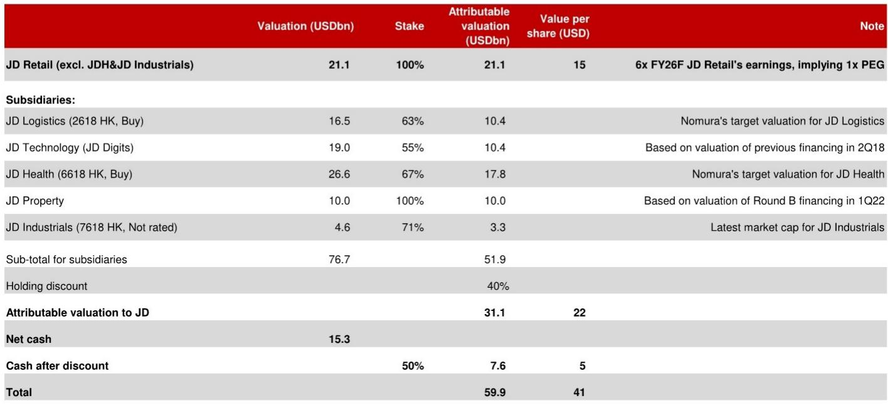
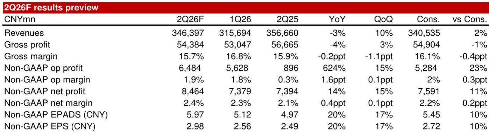
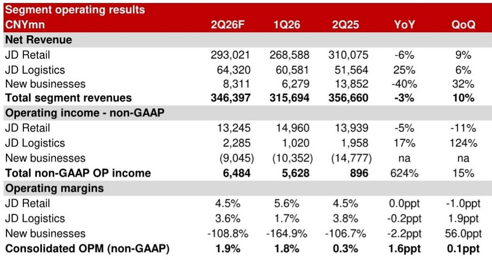

# 京东稳健的业绩背后是战略转型：即时零售亏损收窄比营收波动更值得关注

京东即将发布2026财年第二季度业绩报告，预计营收将出现下滑，这对多数电商公司而言可能令人担忧。核心零售业务营收预计同比下降5.5%，其中电子产品品类下降13%。然而，公司预计调整后净利润同比增长14%至85亿元人民币，超出市场预期11%。这种营收收缩与利润扩张并存的局面并非季度性异常，而是反映出京东正在对其业务组合进行结构性调整。即将发布的财报中，最重要的数字并非营收的增减，而是即时零售业务近60亿元的亏损——这一数字已较去年同期的135亿元大幅收窄。

市场习惯从核心零售利润率和同店销售趋势的角度来审视京东，但这种视角正在变得过时。2026财年第二季度真正的战略看点在于，京东在成熟品类承受周期性压力的同时，以多快的速度控制住了高投入新业务的亏损。电子产品品类的放缓，很大程度上源于高基数效应，应视为暂时性拖累，而非京东竞争地位的结构性削弱。相比之下，日用百货品类展现出真正的韧性，京东超市增长9%，目前约占日用百货品类的45%。

京东零售的营业利润率预计稳定在4.5%，尽管营收有所下降。这一稳定性是整个研究框架的基础。如果京东能够在需求偏弱的周期中维持核心盈利能力，同时将即时零售亏损同比压缩近60%，那么该公司正在执行一项中国电商领域少有同行能复制的艰难平衡。

## 京东零售利润率稳定证明供应链优势在需求趋弱时依然有效

京东零售营收下降5.5%而营业利润率持平，这并非疲软信号。它表明京东的成本结构在固定成本效率方面有所提升，其物流驱动的客户忠诚度使其免受需求下行周期的最严重影响。当营收压力冲击固定物流成本较高的零售商时，利润率通常会压缩。京东能够将营业利润率维持在4.5%，说明其依托物流网络的变动成本模型调整速度超过了营收下降速度。

对观察者而言，这意味着京东零售已不再是中国消费支出的高波动性标的，而是正在成为防御性的利润创造者——能够承受5-6%的营收冲击而不出现实质性利润下滑。这改变了风险评估逻辑。如果京东零售能在电子产品营收下降13%的季度实现132亿元营业利润，那么核心业务的下行风险远低于市场当前定价所反映的程度。

## 即时零售亏损收窄是集团利润增长的最重要驱动力

即时零售业务在2026财年第二季度亏损近60亿元，仍在消耗现金。但趋势才是关键。这一亏损已从去年同期的135亿元和上一季度的79亿元收窄。仅三个月内环比改善近20亿元，表明京东已超越实验阶段，正在优化其即时配送业务的单位经济模型。

这并非易事。中国的即时零售领域一直是资本密集型竞赛，竞争者通过补贴配送费和商品价格来争夺份额。京东能够在保持服务质量的同时将亏损同比削减一半以上，说明其物流基础设施提供了天然的成本优势。原本为次日达和两日达配送而建的京东物流网络，正以增量而非指数级的成本增长，被改造用于一小时达配送。

对集团而言，即时零售亏损收窄是调整后净利润在营收下降3%的情况下仍能同比增长14%的主要原因。如果这一亏损压缩趋势以当前速度持续，京东可能在2027年中期实现即时零售盈亏平衡，这将释放出尚未被市场预期充分反映的显著利润增长空间。

## 电子产品品类波动是周期性的，京东超市正在填补缺口

电子产品营收下降13%是影响京东报价的主要风险因素。但原因在于去年同期的高基数效应，而非市场份额流失或需求基本面恶化。消费电子周期本身具有不规律性，受产品发布节奏和换机周期驱动。京东在中国这一品类中仍占据主导地位，当下一轮升级周期来临时，营收将恢复。

更具战略意义的是日用百货品类的韧性，该品类营收同比增长6%。其中，京东超市增长9%，目前约占日用百货销售额的45%。这是一个结构性转变。京东正成功地从一家销售手机和笔记本电脑的公司，转型为同样高效销售生鲜和日用必需品的平台。生鲜是更高频、更低波动的品类。随着京东超市规模扩大，它将降低京东零售整体的利润波动性，并提供更可预测的营收基础。

估值影响是直接的。如果京东零售能够证明其日用百货增长可以部分抵消电子产品的疲软，市场应对零售业务给予更高估值。

## 评估京东未来四个季度业绩走向的决策框架

2026财年第二季度预览提供了足够的数据点，可以构建一个简单但有效的框架来评估京东。该框架包含三个变量，每个变量的结果决定了报价是向上还是向下调整。

首先，关注京东零售的营业利润率。如果在营收疲软环境下能维持在4.5%或以上，核心业务比当前定价所反映的更具韧性。若跌破4.0%，则表明成本结构不如预期中具有防御性。

其次，跟踪季度即时零售亏损。当前趋势表明，亏损将在2026财年第三季度降至50亿元以下，年底可能接近40亿元。如果亏损压缩停滞，集团利润增长故事将减弱；如果加速，利润预期将需要上调。

第三，观察京东超市在日用百货中的营收占比。如果继续向50%攀升，营收基础将更加稳定，估值倍数应扩大。若停滞或下降，则表明生鲜业务遇到竞争阻力。

当前数据支持对这三个变量的积极展望：营业利润率稳定，即时零售亏损快速压缩，京东超市份额在增长。风险在于宏观环境进一步变化，可能拖累日用百货和电子产品。但这一风险已部分反映在11倍2026财年市盈率中，这一水平低于京东规模和利润率特征的中国电商平台的历史平均水平。

## 目标价可实现，但前提是京东持续交出超预期业绩

目标价并不激进。对于一家产生正自由现金流、持有净现金、并证明能在营收收缩时实现利润增长的公司而言，这是一个合理的估值。市场当前对京东的定价似乎认为营收下降是永久性的，而2026财年第二季度预览的证据表明这是暂时的。

估值重估的关键催化剂将是业绩报告本身。如果京东营收超出彭博预期2%、净利润超出11%，市场将被迫重新评估其假设。单次超预期不足以改变叙事，但如果京东能在充满挑战的环境中连续第二个季度实现利润增长，其报价将开始吸引那些一直在等待利润复苏得到确认的价值导向型观察者。

下行风险众所周知：宏观环境进一步变化、京东零售利润率改善放缓、或京东物流增长慢于预期。这些风险是真实的，但也是对称的。宏观复苏或即时零售更快实现盈亏平衡带来的上行空间，在当前价位并未被定价。对于能够忽略营收波动、聚焦利润趋势的观察者而言，京东代表着一个稳定核心业务中的经典转型案例，而第二季度预览提供了迄今为止最有力的证据，表明转型正在按计划推进。

*仅供参考。部分内容可能基于原始资料通过AI辅助生成、翻译、总结或编辑，可能存在遗漏或错误。请独立核实。本文不构成任何专业建议。*

仅供参考。部分内容可能基于原始资料通过AI辅助生成、翻译、总结或编辑，可能存在遗漏或错误。请独立核实。本文不构成任何专业建议。

