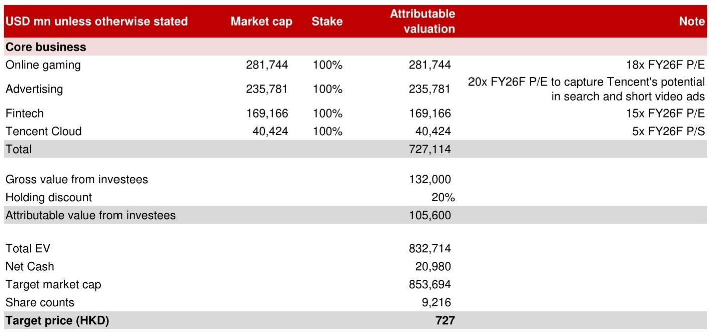
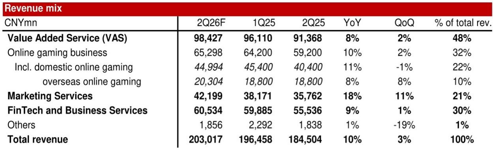
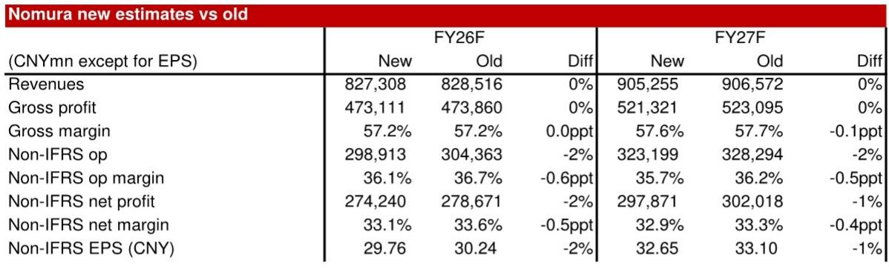

# NOM：腾讯2Q26F利润率受AI研究承压

腾讯在AI领域的布局正从“讲故事”进入“看效果”的阶段。NOM最新报告指出，公司AI产品已获得初步市场认可，但这一轮投入对利润表的影响才刚刚开始显现。2Q26F非IFRS经营利润率预计回落0.4个百分点至37.1%，低于市场共识的37.4%。收入端与预期基本持平，利润端的变化是这份报告值得关注的信号。

## 1. 混元3.0和WorkBuddy的初步成功，验证了腾讯追赶AI领先者的路径

NOM认为，腾讯在AI领域的进展比市场预期的更快。7月初发布的混元3.0正式版，相较于4月预览版有显著提升，已获得开发者群体的广泛认可。这支撑了报告的一个核心判断：腾讯有能力缩小与当前AI领先者的差距。

更值得关注的是桌面AI助手WorkBuddy的表现。第三方机构易观的数据显示，截至2026年3月，WorkBuddy月访问量达到885万，成为国内受欢迎的桌面AI产品之一。但报告同时指出，这个赛道参与者众多——阿里巴巴和字节跳动均已推出竞争产品。国内在线用户切换成本低、付费意愿弱，目前没有任何桌面产品在企业用户中建立决定性领先。

> **KC评论：** 混元3.0和WorkBuddy的初步数据，说明腾讯在AI产品化上找到了节奏。但“受欢迎”和“能赚钱”之间还有距离，尤其是当对手同样投入时。

## 2. 广告和云业务是短期增长引擎，但AI投入正在影响整体利润率

从业务结构看，2Q26F的营收增长依然由传统强势板块驱动。视频号广告推动广告收入同比增长18%，腾讯云带动企业服务板块收入增长22%，较1Q26的20%进一步加速。游戏业务保持稳健，国内和海外分别增长11%和8%。

但问题在于，这些增长带来的增量利润，正在被AI相关投入快速消耗。NOM将FY26和FY27的非IFRS净利润预测分别下调2%和1%，核心原因正是AI研究的持续加码。报告模型显示，SG&A费用从FY25的1431亿人民币跳升至FY26F的1794亿人民币，增幅达25%，远超收入增速。

## 3. 当前市场定价隐含的AI预期，可能低估了竞争烈度和利润变化速度

，而当前报价仅对应12.7倍。这个价差本身并不罕见，但值得推敲的是估值框架中的隐含假设。

NOM对游戏、广告、资金科技和云业务分别赋予18倍、20倍、15倍和5倍的不同估值倍数。这些倍数建立在各业务线独立盈利能力的假设之上。但AI投入是跨业务的——它同时影响游戏的内容生成成本、广告的算法迭代支出、云业务的算力资本开支。如果AI投入的规模效应不如预期，各业务线的实际利润率可能同时低于模型假设。

报告在观察提示中也明确列出了“高市场预期、激进的微信支付和海外营销支出、竞争对手的颠覆性产品”等关键不确定性。这些不确定性在AI竞争加速的背景下，可能比模型假设的更早到来。

> **KC评论：** 腾讯的AI故事正在从“有没有”转向“值不值”。当前市场报价已经反映了部分利润不确定性，但AI竞争格局的演变速度，可能比财务模型更新的更快。这是所有关注这家公司的人需要持续跟踪的变量。

For informational purposes only. Portions may be generated,translated,summarized,or edited with AI assistance based on source materials and may contain omissions or errors. Please verify independently. This is not investment,legal,tax,accounting,or other professional advice.

For informational purposes only. Portions may be generated,translated,summarized,or edited with AI assistance based on source materials and may contain omissions or errors. Please verify independently. This is not investment,legal,tax,accounting,or other professional advice.

