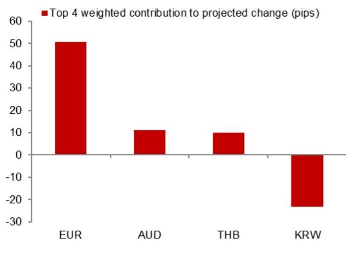
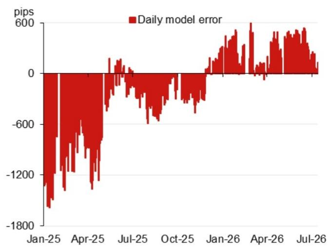
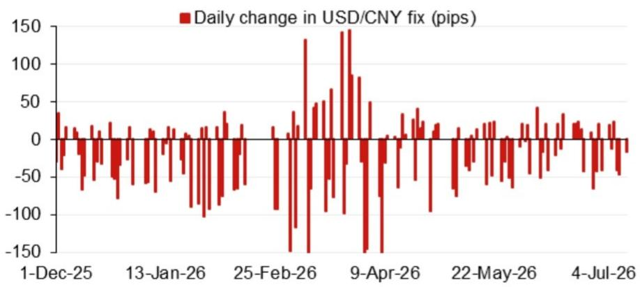

# 宏观观察 - 亚洲（除日本外）市场

**模型参考值：6.7914**

模型参考值：6.7914，对比此前参考值6.7972（较前次官方收盘价区间有所变化）。

含逆周期因子的模型参考值：6.7949（较前次参考值有所调整）。

## 研究团队

**亚洲外汇策略**
Craig Chan - NSL
craig.chan@NOM.com

Wee Choon Teo - NSL
weechoon.teo@NOM.com

Vicky Chen - NSL
vicky.chen1@NOM.com

Manthan Shingala - NSL
manthan.shingala1@NOM.com

**图1：对参考值变化贡献最大的前4个隔夜权重因素（不含逆周期因子）**

来源：NOM

**图2：近期模型误差情况（不含逆周期因子调整）**

来源：Bloomberg, NOM

**图3：美元/人民币参考值每日变动**

来源：Bloomberg, NOM

**图4：重要日程**

| 日期 | 事件 | 地点 | 备注 |
|------|------|------|------|
| 2026年7月17-20日 | 2026世界人工智能大会（WAIC） | 中国上海 | 据中国外交部消息，中国国家主席习近平将出席开幕式并发表主旨演讲 |
| 2026年7月下旬 | 政治局会议（经济工作相关） | 中国 | 政治局通常每月召开一次会议，7月会议内容通常包含经济工作安排 |
| 2026年8月中旬 | 中国人民银行2026年第二季度货币政策报告 | | |
| 2026年9月24日 | 中国国家主席习近平对美国的国事访问 | 美国华盛顿特区 | |
| 2026年9月下旬 | 中国人民银行货币政策委员会会议 | | |
| 2026年10月1-7日 | 国庆黄金周假期 | 中国 | |

来源：Bloomberg, NOM

## 附录A-1

本报告由NOM Singapore Ltd. (NSL) 编制。

关于NOM集团实体的免责声明，请参见相关章节。

## 分析师声明

我们，Craig Chan、Wee Choon Teo、Vicky Chen和Manthan Shingala，特此声明：(1) 本研究报告中所表达的观点准确反映了我们个人对相关标的的看法；(2) 我们的薪酬中没有任何部分直接或间接与本研究报告中表达的具体观点相关；(3) 我们的薪酬不与任何特定的交易活动挂钩。

## 重要披露

## 研究报告在线获取及利益冲突披露

NOM集团研究报告可通过www.NOMnow.com/research、Bloomberg、Capital IQ、Factset、LSEG等平台获取。

重要披露信息可访问 http://go.NOMnow.com/research/m/Disclosures 或向NOM Securities International, Inc.索取。

编制本报告的分析师的薪酬基于多种因素，包括公司总收入等。除非另有说明，本报告列出的非美国分析师未在FINRA规则下注册/取得研究分析师资格。

NOM Global Financial Products Inc. (NGFP)、NOM Derivative Products Inc. (NDP) 和 NOM International plc. (NIplc) 已在美国商品期货交易委员会和国家期货协会注册为掉期交易商。

## 美国市场额外披露要求

**自营交易：** NOM Securities International, Inc及其关联公司通常会以自营方式交易本研究报告所涉及的相关产品。

**分析师与其他人员的互动：** NOM Securities International, Inc及其关联公司的固定收益研究分析师定期与销售和交易部门人员互动，以获取流动性和定价信息。

## 估值方法 - 固定收益

NOM的固定收益策略师通过提供交易观点来表达对证券价格和市场的看法。这些观点可以是相对价值建议、方向性交易建议、资产配置建议或三者的结合。

交易观点所包含的分析包括但不限于：
- 基本面分析：判断证券价格是否偏离其宏观或微观基本面
- 价格变动的量化分析
- 技术因素：如监管变化、市场风险偏好变化、评级行动、一级市场活动及供需因素

交易观点的时间框架可变。战术性观点时间框架较短，通常少于三个月。战略性观点时间框架较长，通常超过三个月。

根据欧盟市场滥用监管法规，NOM全球固定收益研究发布的评级分布如下：
- 52%被给予买入（或同等）评级；其中50%的发行人曾接受NOM集团的重要服务*
- 0%被给予中性（或同等）评级
- 48%被给予卖出（或同等）评级；其中50%的发行人曾接受NOM集团的重要服务
截至2026年6月30日

*根据欧盟市场滥用监管法规定义
**NOM集团定义见本报告末尾的免责声明部分

## 免责声明

本出版物包含由第1页所列NOM集团实体编制的材料。术语"NOM集团"指NOM Holdings, Inc.及其关联公司和子公司。

本材料仅供您个人参考，我们不以此为基础征求任何行动。本材料不构成在任何司法管辖区出售或购买任何证券的要约或邀请。除与NOM集团相关的披露外，本材料基于我们认为可靠的来源信息，但未经NOM集团独立核实。

除与NOM集团相关的披露外，NOM集团不对本文件的公平性、准确性、完整性、正确性、可靠性或适用于任何特定目的作出任何明示或暗示的保证，并且在适用法律允许的最大范围内，不承担因使用本文件而产生的任何责任。

本材料中表达的意见或估计为原始出版日期的当前意见，信息（包括其中包含的意见和估计）如有变更，恕不另行通知。NOM集团明确表示没有义务更新或修订本文件。

NOM集团及其高级管理人员、董事、员工和关联公司，在适用法律允许的范围内，可能以自营、代理或其他方式交易本报告提及的证券、商品或工具。

本文件可能包含从第三方获得的信息。NOM集团特此明确否认对第三方信息的原创性、公平性、准确性、完整性、正确性、适销性或适用于特定目的的所有陈述、保证或承诺。

信用评级是意见陈述，而非事实陈述或购买、持有或出售证券的建议。它们不涉及证券的适合性或证券用于投资目的的适合性，不应作为研究建议依赖。

读者应将本文件视为做出研究决策的单一因素，本报告不应被视为识别或暗示与任何研究决策相关的所有直接或间接风险。

本文中呈现的数字可能涉及过往表现或基于过往表现的模拟，这些并非未来或可能表现的可靠指标。

对于固定收益研究：建议分为两类：战术性（通常持续最多三个月）或战略性（通常持续6-12个月）。然而，交易建议可能随时根据情况变化进行审查。

本文所述的证券可能未根据美国1933年证券法注册，在此情况下，除非已注册或符合注册要求的豁免条件，不得在美国或向美国人士发售或出售。

本文件已获批准在英国作为投资研究由NIplc分发。NIplc由审慎监管局授权，并受金融行为监管局和审慎监管局监管。

本文件已获批准在欧盟经济区作为投资研究由NOM Financial Products Europe GmbH ("NFPE")分发。

本文件已获NIHK批准在香港分发。本文件仅适用于符合香港适用法规定义的"专业读者"。

本文件已获批准在澳大利亚由NAL分发。

本文件已获批准在马来西亚由NSM分发。

在新加坡，本文件由NSL分发。NSL是《财务顾问法》定义的豁免财务顾问，受新加坡金融管理局监管。

本文件未获批准分发给沙特阿拉伯、阿联酋或卡塔尔的非授权人士。

对于涉及台湾上市公司或由台湾研究分析师撰写的报告：本文件仅供参考。您应独立评估研究风险，并对您的研究决策全权负责。

本材料不得在印度尼西亚分发或传递给印度尼西亚共和国境内的个人。

本材料不得（i）以任何形式复制、影印、复制或复印；或（ii）未经NOM集团成员事先书面同意而重新分发、重新发布或再分发。

如果本文件通过电子传输方式分发，则无法保证传输安全无误。

NOM集团通过其合规政策和程序管理研究报告制作过程中的利益冲突。

如需获取本文件中所含任何研究建议所使用的方法或模型的更多信息，请联系第1页所列的NOM研究分析师。

版权 © 2026 NOM Singapore Ltd., Singapore。保留所有权利。
