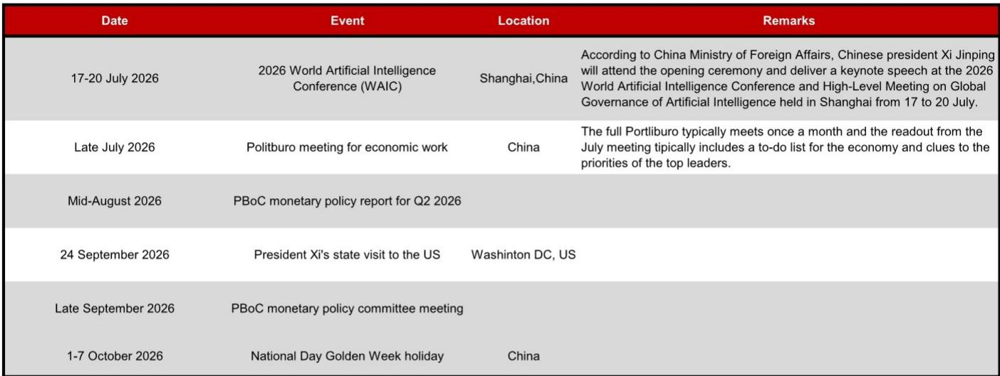

# NOM：美元兑人民币中间价模型预测6.7914

一份来自NOM亚洲外汇策略团队的每日模型更新，表面看只是数字微调，但其中隐含的机制变化值得关注。该团队将美元兑人民币中间价的预测值从6.7972下调至6.7914，调整幅度约58个基点。更值得留意的，是模型在加入逆周期因子后的预测值为6.7949，与不含该因子的结果仅相差23个基点。这个差距正在收窄。

过去一段时间，逆周期因子作为调节工具，其使用力度和方向一直是市场观察政策意图的关键窗口。当模型预测与最终定价之间的偏差扩大，往往意味着政策层在主动引导汇率预期。而当前偏差收窄，可能暗示官方对市场定价的干预意愿正在减弱，或者认为当前汇率水平已接近合意区间。

这份报告没有长篇论述宏观逻辑，而是聚焦于每日定价的技术细节。但正是这种高频、微观的跟踪，能比季度报告更早捕捉到政策节奏的微妙变化。对于关注人民币市场定价的读者而言，理解中间价的形成机制，比猜测具体点位更有意义。

## 1. 模型预测与逆周期因子的差距缩小，指向定价机制回归市场化

NOM模型给出了两组关键数字：不含逆周期因子的预测值为6.7914，含逆周期因子的预测值为6.7949。两者之差仅为23个基点，远低于历史波动区间。这组数据表明，当前逆周期因子对中间价的修正力度处于较低水平。

从机制上看，逆周期因子本质上是对市场供求之外的非理性波动进行对冲。当该因子使用力度下降，意味着政策层认为市场定价本身已经能够反映基本面，无需额外干预。这不一定代表汇率将单向波动，而是说明定价权的天平正在向市场端倾斜。

> **KC评论：** 逆周期因子不是神秘工具，它本质上是央行在每日中间价定价中，对模型结果进行微调的参数。当这个参数接近零，说明央行认为市场自己给出的价格已经合理。读者可以把它理解为一个“干预温度计”——读数越低，市场自主定价的空间越大。

## 2. 模型误差的收敛趋势，验证了当前定价框架的有效性

报告附带了近期模型误差图表（不含逆周期因子调整）。从历史数据看，模型预测与实际中间价之间的偏差在近期呈现收敛态势。这意味着NOM所使用的定价模型——基于隔夜市场贡献、利率差异、不确定性偏好等变量——正在更准确地捕捉到影响中间价的核心因素。

误差收敛本身是一个积极信号。它说明市场定价逻辑趋于稳定，而非受到偶发性冲击的干扰。对于需要做汇率不确定性管理的企业或配置人民币资产的机构而言，模型误差收窄意味着预测的可信度提高，对冲成本可以更精确地计算。

## 3. 未来几周的关键事件，将检验当前定价机制的稳定性

报告列出了2026年7月至10月的重要事件日历，包括7月17日至20日的世界人工智能大会、7月底的宏观环境工作会议、9月24日中国国家主席对美国的国事访问等。这些事件都可能对汇率预期产生阶段性影响。

其中，9月的访美行程尤其值得关注。作为高层外交活动，其成果将直接影响市场对贸易与地缘不确定性的定价。如果在此期间逆周期因子使用力度重新加大，可能意味着政策层希望在关键窗口期维持汇率稳定；反之，若因子保持低位，则说明政策层对市场自主定价的信心进一步增强。

对于读者而言，与其猜测汇率的具体方向，不如跟踪逆周期因子的使用力度和模型误差的变化趋势。这两个指标比任何点位预测都更能反映政策意图和市场定价效率的真实状态。

For informational purposes only. Portions may be generated,translated,summarized,or edited with AI assistance based on source materials and may contain omissions or errors. Please verify independently. This is not investment,legal,tax,accounting,or other professional advice.

For informational purposes only. Portions may be generated,translated,summarized,or edited with AI assistance based on source materials and may contain omissions or errors. Please verify independently. This is not investment,legal,tax,accounting,or other professional advice.

