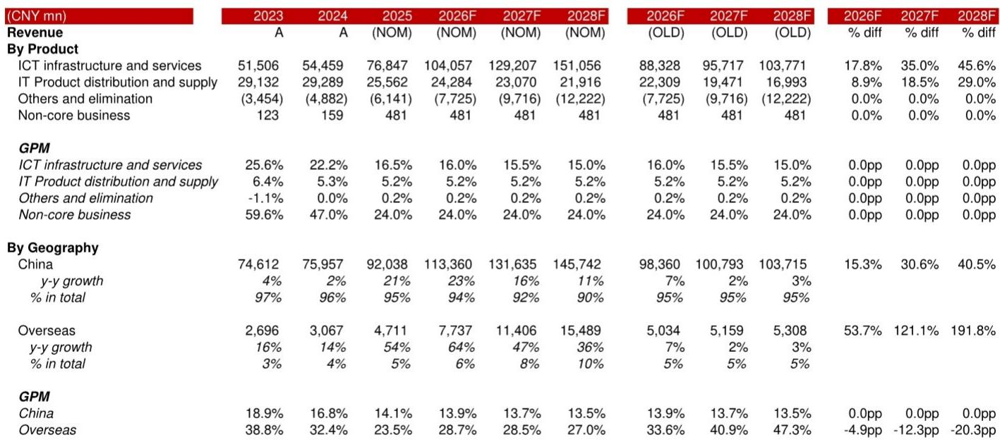
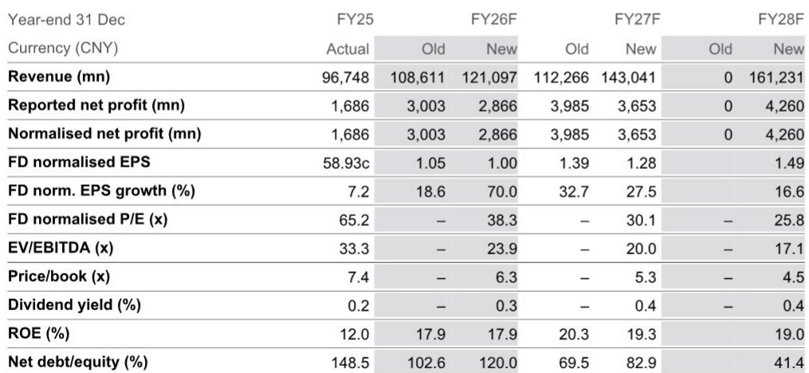
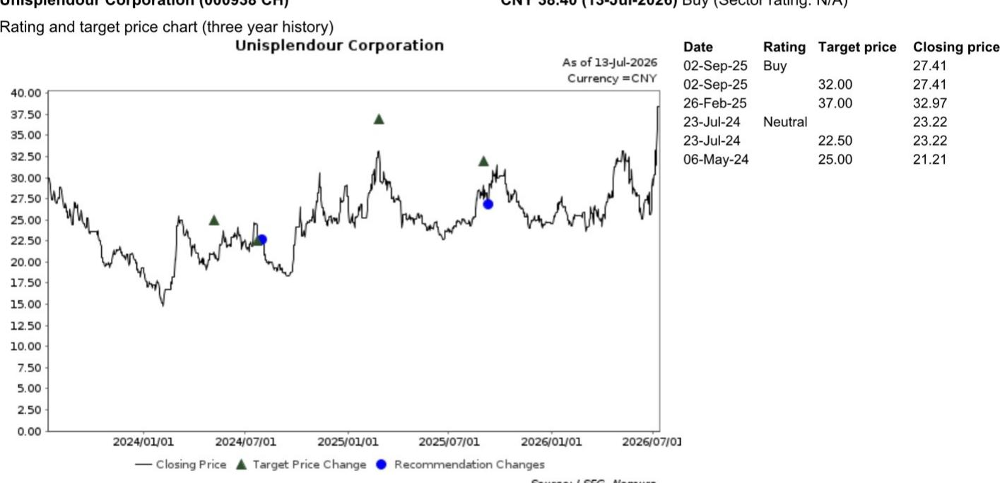

# NOM：紫光股份，是时候重新审视中国AI价值链赢家

7月10日收盘后，紫光股份发布了一份超出市场预期的上半年业绩预告。公司预计1H26归母净利润同比增长83.5%至122.9%，区间在19.1亿至23.2亿元人民币。即便扣除收购新华三剩余股权带来的2.5亿至3.5亿元非经常性损益，其经常性净利润仍录得44%至81%的同比增幅。NOM在最新报告中指出，这一表现的核心驱动力来自中国AIDC资本开支加速和国产替代趋势的共振。

这份报告的关键判断是：紫光股份正站在中国AI基础设施研究从“概念验证”转向“规模部署”的节点上。与市场普遍关注的服务器出货量不同，NOM认为真正决定公司未来三年盈利弹性的，是网络交换机环节的技术升级和海外市场突破。

## 1. 中国AI研究正在追赶全球节奏，但受益者结构不同

NOM援引近期彭博报道称，相关方面计划投入约2万亿元人民币以强化本土AI供应链竞争力。这一规模如果落地，将显著改变国内AI服务器和网络设备的需求曲线。紫光股份作为国内AI服务器和网络交换机的双寡头之一，直接受益于这一趋势。

报告测算，公司网络设备业务在FY26F可实现27%的同比增长，服务器业务增速更高，达到40%。两者在FY26-28F的复合年增长率分别为15%和25%，到FY28F合计贡献公司总收入的84%。值得注意的是，NOM认为高端产品升级足以抵消“白牌”产品对利润率的稀释——这是市场此前对紫光股份毛利率持续承压的核心担忧之一。

> **KC评论：** NOM对利润率的判断基于一个隐含假设：中国云厂商对SuperNode等超节点架构的升级，将拉动高端交换机和光模块需求，而紫光股份在这一细分市场拥有定价权。如果这一假设成立，公司毛利率可能不会像市场担心的那样持续走低。

## 2. 新华三股权整合是海外扩张的前提条件

紫光股份对新华三剩余股权的收购，其意义不止于并表增厚利润。NOM认为，这一交易解决了公司与原合资方HPE之间的业务冲突问题，为紫光股份的全球化扫清了障碍。

报告预计，公司海外收入在FY26-28F的复合年增长率可达41%，远超中国业务的13%增速。到FY28F，海外收入将贡献总销售额的10%。这一判断的支撑逻辑是：新华三品牌在海外市场已有一定认知度，股权整合完成后，紫光可以更灵活地制定全球渠道策略，而不受制于合资协议中的竞业限制。

## 3. 估值框架切换背后是市场对AI资产的重定价

估值倍数从30.5倍FY27F EPS提升至40倍。这一调整并非简单的盈利预测上修，而是反映了市场对AI基础设施类资产的重新定价——从传统ICT硬件制造商转向AI算力产业链核心节点。

报告上调FY26-28F收入预测17.1%至47.9%，盈利预测上调32.1%至51.3%。但需要留意的是，服务器业务增速快于网络交换机，将导致产品结构变化，NOM因此小幅下调了FY27-28F的毛利率预测0.1至0.4个百分点。这意味着，收入加速增长的同时，利润率的改善节奏可能慢于收入增速。

> **KC评论：** 40倍PE对应的是相关市场服务器和交换机板块的中位数估值。这个倍数本身并不激进，但隐含了一个前提：紫光股份能够持续证明自己是AI研究加速的核心受益者，而非只是周期性的硬件供应商。海外业务能否兑现41%的复合增长，将是验证这一逻辑的关键变量。

## 4. 一个可复用的观察框架：从资本开支到设备采购的传导链

这份报告提供了一个分析AI基础设施研究机会的简洁框架：先看政策信号和资本开支计划（如2万亿AI研究计划），再看技术升级路径（如SuperNode架构），最后落到具体设备供应商的份额和利润率变化。

对于紫光股份，需要跟踪的三个关键指标是：国内云厂商的资本开支指引、高端交换机出货均价变化、以及海外收入占比的季度爬坡速度。这三个变量分别对应报告中的核心假设——AIDC研究加速、产品结构升级、全球化突破。任何一个变量的偏离，都可能改变当前盈利预测的置信度。

For informational purposes only. Portions may be generated,translated,summarized,or edited with AI assistance based on source materials and may contain omissions or errors. Please verify independently. This is not investment,legal,tax,accounting,or other professional advice.

For informational purposes only. Portions may be generated,translated,summarized,or edited with AI assistance based on source materials and may contain omissions or errors. Please verify independently. This is not investment,legal,tax,accounting,or other professional advice.

