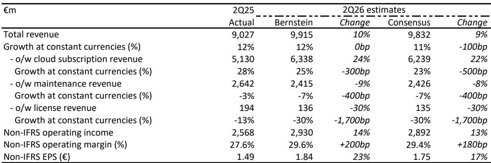
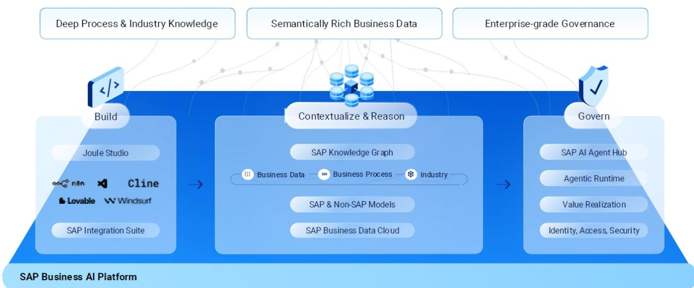
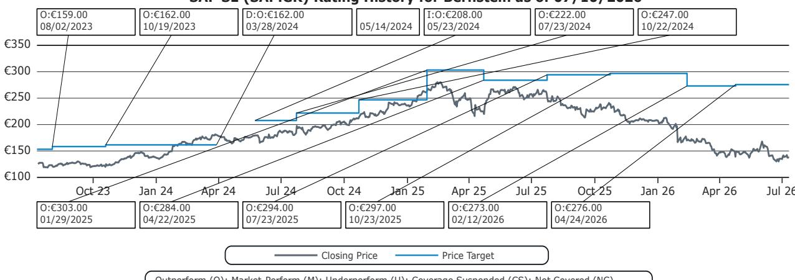

# SAP's Cloud Migration Runway Is Half Complete: Why the S/4 Transition, Not AI Hype, Will Drive the Next Two Years of Growth

Only 55% of SAP's ECC installed base has migrated to S/4HANA. That single statistic, derived from proprietary analysis, reframes the entire discussion about SAP's growth trajectory. The market has fixated on whether AI monetization will materialize or whether macro headwinds will slow cloud demand. Both questions miss the structural reality: the largest ERP migration cycle in enterprise software history is barely past its midpoint. With end-of-support deadlines approaching and ERP modernization becoming mission-critical infrastructure rather than discretionary IT spending, SAP's remaining conversion opportunity is large enough to sustain mid-20s current cloud backlog growth into fiscal 2027, regardless of how quickly AI revenue scales.

The 2Q26 results, scheduled for 23 July, will test this thesis. Consensus expects CCB growth to decelerate modestly from 25% in 1Q26 to 24%. A stable mid-20s print would strengthen confidence in full-year guidance and signal that the migration cycle, not quarter-specific deal timing, remains the dominant growth driver. The stock's 33% year-to-date decline through early July reflects deep skepticism about growth sustainability. That skepticism is understandable given the 4Q25 backlog disappointment and rising macro uncertainty. But it also creates an asymmetry: the downside case assumes the migration cycle is maturing, while the data suggests it is still in its expansion phase.

The implications are straightforward. SAP enters 2Q26 with a comfortable starting position against its full-year targets. Cloud revenue guidance of 23-25% constant-currency growth, operating income targets of 14-18% constant-currency growth, and a free cash flow target of approximately EUR 10 billion all remain achievable if CCB growth holds in the low-to-mid 20s. The key question is not whether SAP can beat consensus by a few basis points. It is whether the market will reprice the stock to reflect the remaining migration opportunity rather than the AI narrative that has dominated headlines and disappointed.

## Only 55% of the ECC Base Has Migrated, Creating a Multi-Year Conversion Opportunity That Most Observers Underestimate

The most consequential data point in the current debate is the migration penetration rate. Based on analysis of SAP's installed base, only approximately 55% of ECC customers have transitioned to S/4HANA. This means nearly half of the legacy base remains unconverted, representing a contractual revenue backlog that will convert to cloud subscriptions over the next two to three years. These are not speculative pipeline opportunities. They are existing customer relationships with known support deadlines, making the migration a matter of operational continuity rather than discretionary investment.

The end-of-support deadlines for ECC create a hard catalyst. Customers cannot indefinitely postpone the transition without risking compliance, security, and operational integrity. Unlike other enterprise software categories where budget cuts can delay upgrades, ERP systems are the central nervous system of corporate operations. A factory cannot stop production because the CFO decided to defer a software migration. This structural necessity gives SAP's cloud backlog a resilience that other software companies lack during periods of macro uncertainty.

The 45% unconverted base also explains why SAP's cloud growth can remain in the mid-20s even as the absolute cloud revenue base expands. Each percentage point of migration converts a large pool of maintenance revenue into higher-value cloud subscriptions. The arithmetic is favorable: as long as the migration cycle continues, cloud revenue growth will be supported by both new customer conversions and the natural expansion of existing cloud contracts. The risk of a sudden deceleration is low because the conversion process is multi-year by nature, not quarter-to-quarter.

## Stable Mid-20s CCB Growth Would Confirm That the Migration Cycle, Not AI Hype, Is the Primary Growth Engine

The current cloud backlog is the single most important metric for understanding SAP's future revenue visibility. It represents contracted revenue that has not yet been recognized, providing a forward-looking signal that is more reliable than quarterly revenue beats or margin improvements. Consensus expects CCB growth to slow from 25% in 1Q26 to 24% in 2Q26. A result at or above 25% would be a strong signal that demand momentum is accelerating. A result at 24% would confirm a modest deceleration but still support the full-year guidance framework. A result below 23% would revive concerns that the migration cycle is peaking.

The positive case rests on the argument that 1Q26 was not a one-off driven by exceptional deal timing but rather a confirmation of structural demand. Management has indicated that only modest backlog deceleration should occur during fiscal 2026 compared to fiscal 2025. Several large contracts signed in late 2025 are still ramping and will contribute more meaningfully in fiscal 2027. This means the current backlog growth rate is not being artificially inflated by front-loaded deals. It reflects genuine conversion activity that will continue to generate revenue visibility for the next 18 to 24 months.

The cautious case contends that 1Q26 strength reflected quarter-end deal closures and exceptional execution that cannot be sustained. Skeptics point to the 4Q25 backlog disappointment, when strong reported cloud revenue was accompanied by weaker-than-expected backlog growth. They argue that large public-sector and sovereign cloud deals have longer sales cycles and that quarterly backlog growth can be heavily influenced by a few mega-deals. If one or two large transactions slip by a quarter, the reported growth rate can decline sharply even if underlying demand remains healthy.

The resolution of this debate will come from the 2Q26 print and management commentary. Observers should focus on whether Cloud ERP Suite revenue growth, which reached 30% in 1Q26, remains near that level. They should also watch for any evidence of elongating sales cycles or delayed large deals. A CCB growth rate at or above 24% would strengthen the positive case. A decline toward 22% or below would shift the narrative toward normalization.

## AI Is a Migration Accelerator, Not a Standalone Revenue Story, and That Distinction Matters for Valuation

The market has struggled to value SAP's AI strategy because it does not fit the standalone product monetization model that observers expect from companies like Microsoft or Salesforce. SAP is not selling AI as a separate SKU with per-seat pricing. Instead, it is embedding AI capabilities across S/4HANA, Business Data Cloud, and the Joule copilot to accelerate ERP migration and increase customer retention. This approach makes AI a growth enabler rather than a direct revenue line item, which creates confusion about how to measure its impact.

The strategic logic is sound. Customers' most critical operational data resides within SAP systems. Embedding AI into end-to-end business processes creates switching costs that are far higher than those created by standalone AI tools. A customer that has integrated Joule into its procurement, supply chain, and finance workflows is unlikely to migrate to a competitor's ERP system, even if that competitor offers a cheaper alternative. This retention effect is difficult to quantify but strategically valuable.

The near-term financial impact of AI will be indirect. It will show up in larger transformation project sizes, higher cloud adoption rates among existing customers, and stronger renewal rates. Observers looking for direct AI revenue contributions in fiscal 2026 or 2027 will likely be disappointed. But that disappointment is already priced into the stock's year-to-date decline. The more important question is whether AI is accelerating the migration cycle. If customers are choosing to migrate to S/4HANA because they want access to embedded AI capabilities, then the AI strategy is working even if it does not appear as a separate line item in the income statement.

## The Decision Framework: How to Evaluate SAP's 2Q26 Results and Position for the Next 18 Months

Observers should approach the 2Q26 print with a clear decision framework that separates signal from noise. The framework rests on three primary indicators and two secondary indicators.

The primary indicators are CCB growth rate, Cloud ERP Suite revenue growth, and management commentary on large-deal pipeline. A CCB growth rate at or above 24% is consistent with the positive case. Cloud ERP Suite growth near 30% confirms that the migration cycle is intact. Management commentary that expresses confidence in the second-half pipeline, without caveats about macro uncertainty, would reinforce the outlook.

The secondary indicators are operating margin trajectory and free cash flow performance. Non-IFRS operating margins are expected to expand approximately 200 basis points year-over-year to 29.6%. Any significant deviation from this trajectory would raise questions about cost discipline. Free cash flow of approximately EUR 10 billion for the full year is a key target that supports the company's ability to invest in growth while returning capital to shareholders.

The cautious case triggers are a CCB growth rate below 23%, evidence of elongating sales cycles, or cautious management commentary about second-half bookings. A decline toward 22% or below would suggest that the growth trajectory is normalizing toward high teens, which would compress the valuation multiple further. The stock's current adjusted P/E of 18.4 times fiscal 2026 estimates already reflects significant skepticism. A further derating would require evidence that the migration cycle is structurally slowing rather than merely experiencing quarterly volatility.

The most important insight from this framework is that the risk-reward is asymmetric. The positive case does not require AI monetization to succeed or macro conditions to improve. It only requires the migration cycle to continue at its current pace. The cautious case requires the migration cycle to be peaking, which contradicts the data showing that only 55% of the base has converted. Observers who focus on the structural backlog rather than the quarterly noise are better positioned to capture the upside that the market is currently discounting.

## The Remaining Migration Opportunity Supports Revenue Growth Into Fiscal 2027, Making Current Valuation Levels Compelling

The valuation argument is straightforward but requires looking beyond near-term earnings volatility. SAP's adjusted P/E of 18.4 times fiscal 2026 estimates and 15.3 times fiscal 2027 estimates represents a significant discount to its historical multiple and to the growth-adjusted PEG ratio of 0.8 times. For a company with double-digit revenue growth, expanding margins, and a multi-year conversion backlog, this valuation implies that the market is pricing in a significant growth deceleration that the data does not support.

The free cash flow story reinforces the valuation case. SAP targets approximately EUR 10 billion in free cash flow for fiscal 2026, which implies a free cash flow yield of approximately 6% at the current market capitalization. This yield is attractive relative to both enterprise software peers and the broader market, particularly given the visibility provided by the cloud backlog. The company's ability to generate cash while investing in the migration cycle and AI capabilities suggests that the current share price weakness reflects sentiment rather than fundamentals.

The risk that could undermine this thesis is execution failure on the migration itself. Large-scale ERP migrations are complex and can face delays due to customer readiness, regulatory requirements, or competitive pressures from alternatives such as Workday or Oracle. The 45% unconverted base includes customers that may be more difficult to convert, either because they are smaller and less strategic or because they operate in highly regulated industries with longer compliance timelines. If the conversion rate slows materially, the backlog growth trajectory would decline even if the total addressable market remains large.

But the evidence from the first half of fiscal 2026 does not support the execution failure thesis. Cloud revenue growth of 27% in 1Q26 and Cloud ERP Suite growth of 30% suggest that the migration engine is operating at full capacity. The 2Q26 results will provide the next data point. If the migration cycle remains on track, the current valuation will prove to have been a compelling entry point for observers willing to look through the near-term noise.

*For informational purposes only. Portions may be generated, translated, summarized, or edited with AI assistance based on source materials and may contain omissions or errors. Please verify independently. This is not professional advice.*

For informational purposes only. Portions may be generated, translated, summarized, or edited with AI assistance based on source materials and may contain omissions or errors. Please verify independently. This is not professional advice.

