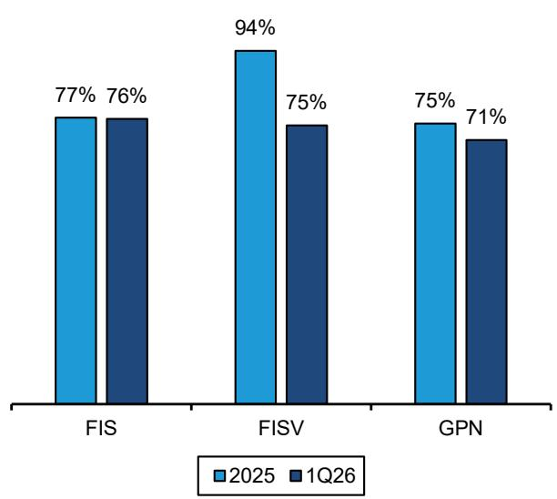
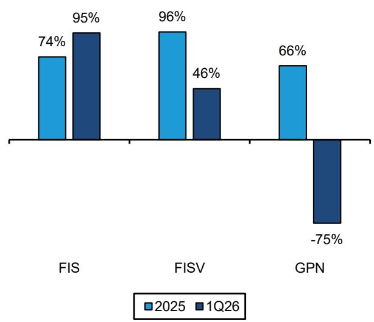
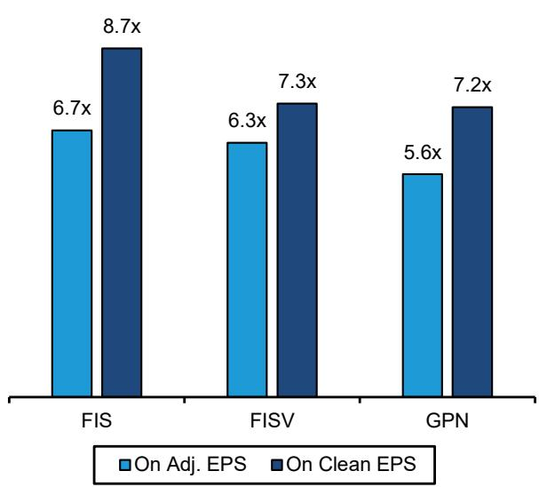
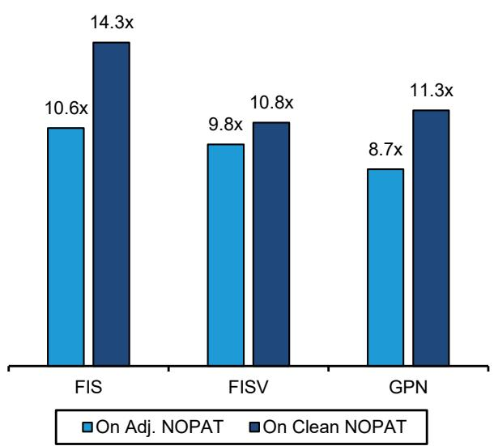
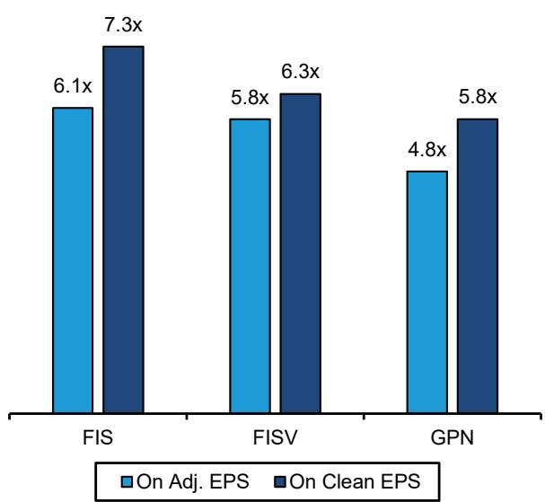
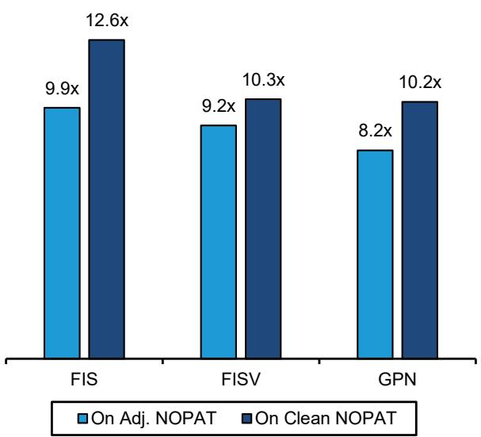
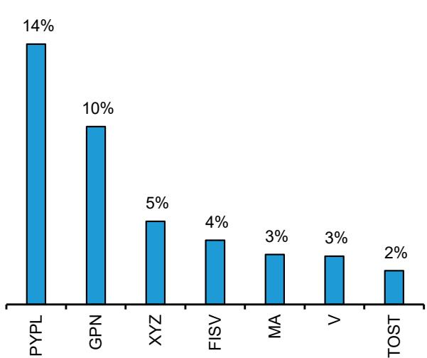
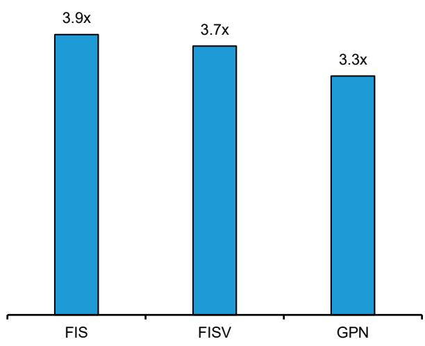
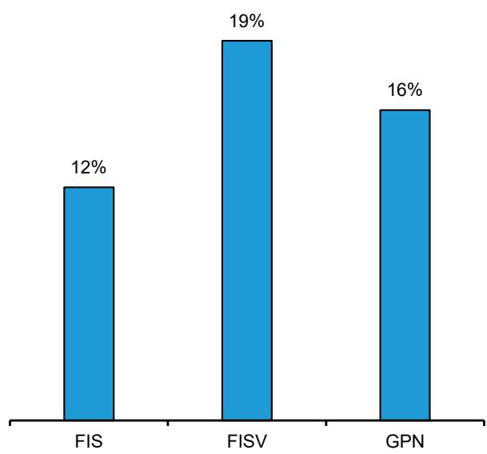
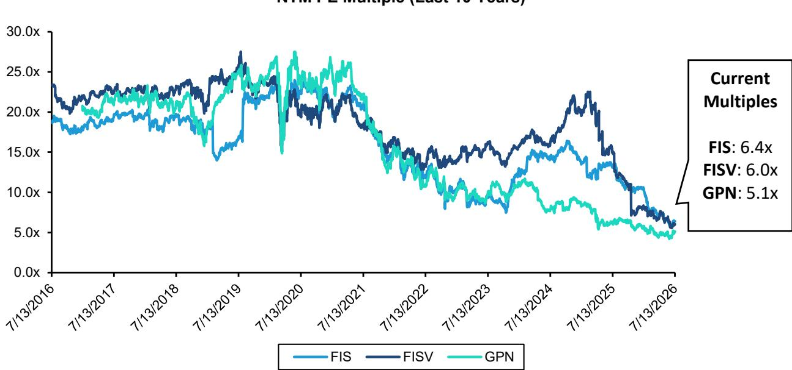

# Payments, Processors & IT Services

# FISV, FIS, GPN: What is the 'true' multiple?

Harshita Rawat, CFA

+1 917 344 8485

harshita.rawat@bernsteinsg.com

Viola Chen

+1 917 344 8614

viola.chen@bernsteinsg.com

Simran Ratani

+1 917 344 8329

simran.ratani@bernsteinsg.com

FIS, FISV and GPN are currently trading at 6.4x/6.0x/5.1x NTM PE multiple, near their lowest levels in history (also see our note). As such, investors appear to be taking a fresh look at the names. It is, however, a bit challenging to assess the 'true' multiples for the stocks given the earnings adjustments (which have historically been more recurring in nature), lower FCF conversion, high leverage and very low 'adj' tax rates. In this note, we present our updated earnings quality analysis, and present what we believe are clean EV/NOPAT multiples (we find EV/NOPAT a better metric vs. P/E given the leverage) across the 3 names. We also discuss potential for buybacks and capital returns.

## When adjusted for earnings quality and tax rates, we see several turns of differences between clean and reported multiples.

While the multiples are low on non-GAAP 2026 EPS (FIS 6.7x, FISV 6.3x, GPN 5.6x), they are several turns higher on clean EV/NOPAT (FIS 14.3x, FISV 10.8x, GPN 11.3x). We note that 2027 analysis gets a bit trickier because we have to make a fair bit of assumptions on 'adjustments'. Our estimates for 2027 clean EV/NOPAT multiples include ~13x for FIS, ~10x for FISV and ~10x for GPN vs. non-GAAP PE (on consensus adj. numbers) of ~6x for FIS, ~6x for FISV and ~5x for GPN.

We see clean earnings as a % of non-GAAP earnings at 77%/76% for FIS, 94%/75% for FISV, and 75%/71% for GPN in 2025/1Q26, respectively. On Clean FCF conversion, we estimate 53%/64% conversion for FIS, 90%/12% for FISV and 67%/-50% for GPN in FY2025 and 1Q26, respectively. We do note that FIS started reporting a cleaner version of FCF since late 2025, which is calculated as Cash From Operating Activities - CapEx - true one-time cash outflows.

In our clean earnings definition, we give companies the benefit of adding back the somewhat understandable purchase accounting amortization and true one-offs, but include other expenses e.g. 'transformation costs', often-vague restructuring costs, M&A integration expenses which can continue for several years post a deal (also M&A has been recurring for the companies and not truly one-time). In our clean FCF definition, we similarly exclude true one-offs but add back recurring cash expenses. We also wonder to what extent a low 'adj.' tax rate (e.g., FIS at ~12%/13% in 2026/2027) is sustainable.

Sometimes companies adjust M&A integration expenses far beyond what is typically acceptable (several years after a deal closes). Transformation has become a major adjustment recently too - e.g. FISV added back >$140mn of transformation expense related to the One Fiserv initiative to adj. net income in 1Q26; GPN added back $96mn in 1Q26 related to the more recent Genius build-out reorg, but we note this is a longer-running add-back covering ongoing internal transformation and GTM realignment initiatives. FIS has been adding back enterprise transformation and platform modernization expenses of $262mn in 2024, $157mn in 2025 and $93m in 1Q26.

More buybacks at these valuation levels? GPN is already doing this. By year-end 2027, GPN (and PayPal) could buy back ~30% of their existing market cap (investors may have to wait longer for FIS and FISV). The complication for FIS and FISV is that they are in the midst of de-leveraging post recent acquisitions. We will do more work on potential for unlocking shareholder value through asset sales (e.g., for FISV). See our recent note on STAR/Accel.

## INVESTMENT IMPLICATIONS

Overall, while we acknowledge rock bottom valuation levels across the fintech space (including for FIS, GPN, FISV), we continue to prefer V, MA and Adyen as our favorite ideas.

We rate V, MA, Adyen, Block and Toast OP. We rate Klarna, FISV, FIS, GPN and PYPL OP.

## OUR METHODOLOGY AND EXHIBITS

## A note on Earnings adjustment methodology:

\- We calculate FY25/1Q26 Clean Net Income by taking company reported Non-GAAP Net Income and subtracting adjustments that we deem valid (e.g. merger, integration costs, severance costs, and reorg/transformation costs).

\- For calculating clean FCF, we took company reported adj. FCF for FY25 and 1Q26, and removed acquisition and integration expenses and other company specific-adjustments we view as not adjustable.

\- For Clean NOPAT calculation, we took Clean Operating Income calculated in a similar way as Clean Net Income, subtracting normalized tax expense assuming 20% tax rate. Adj. NOPAT is calculated as Adjusted Operating Income as reported by companies minus Adjusted Taxes.

EXHIBIT 1: We see clean earnings as a % of non-GAAP earnings as 77%/76% for FIS, 94%/75% for FISV, and 75%/71% for GPN in 2025/1Q26, respectively

<table><tr><td rowspan="2"></td><td colspan="2">FIS</td><td colspan="2">FISV</td><td colspan="2">GPN</td></tr><tr><td>2025</td><td>1Q26</td><td>2025</td><td>1Q26</td><td>2025</td><td>1Q26</td></tr><tr><td>GAAP Net Income</td><td>908</td><td>152</td><td>3,480</td><td>571</td><td>1,400</td><td>(1,800)</td></tr><tr><td>Merger, integration costs</td><td>708</td><td>167</td><td>59</td><td>29</td><td>332</td><td>291</td></tr><tr><td>Severance costs</td><td>-</td><td>-</td><td>79</td><td>73</td><td>-</td><td>-</td></tr><tr><td>Amortization of acquisition-related intangible assets</td><td>669</td><td>290</td><td>1,304</td><td>311</td><td>1,367</td><td>747</td></tr><tr><td>Tax impact of adjustments</td><td>(40)</td><td>14</td><td>(275)</td><td>(94)</td><td>(97)</td><td>1,454</td></tr><tr><td>Gain on sale of businesses</td><td>18</td><td>104</td><td>(68)</td><td>(83)</td><td>(572)</td><td>(22)</td></tr><tr><td>Unconsolidated affiliate activities</td><td>561</td><td>11</td><td>(11)</td><td>9</td><td>(69)</td><td>5</td></tr><tr><td>Transformation</td><td>-</td><td>-</td><td>125</td><td>142</td><td>406</td><td>96</td></tr><tr><td>Other</td><td>199</td><td>(33)</td><td>52</td><td>-</td><td>190</td><td>39</td></tr><tr><td>Adj. Net Income, reported</td><td>3,023</td><td>705</td><td>4,745</td><td>958</td><td>2,957</td><td>809</td></tr><tr><td>(-) Merger, integration costs</td><td>708</td><td>167</td><td>59</td><td>29</td><td>332</td><td>141</td></tr><tr><td>(-) Severance costs</td><td>-</td><td>-</td><td>79</td><td>73</td><td>-</td><td>-</td></tr><tr><td>(-) Transformation</td><td>-</td><td>-</td><td>125</td><td>142</td><td>406</td><td>96</td></tr><tr><td>Clean Net Income</td><td>2,315</td><td>538</td><td>4,482</td><td>714</td><td>2,219</td><td>572</td></tr><tr><td>Clean Net Income as % of adj. Net Income</td><td>77%</td><td>76%</td><td>94%</td><td>75%</td><td>75%</td><td>71%</td></tr><tr><td>Adj. EPS</td><td>$5.76</td><td>$1.36</td><td>$8.64</td><td>$1.79</td><td>$12.22</td><td>$2.96</td></tr><tr><td>Clean EPS</td><td>$4.41</td><td>$1.04</td><td>$8.16</td><td>$1.33</td><td>$9.17</td><td>$2.09</td></tr></table>

FISV/FIS/GPN: We remove merger, integration and other costs, severance costs and reorganization/traformation costs from non-GAAP earnings/NOPAT to arrive at clean earnings/NOPAT. For GPN: we add back one-time transaction-related costs due to the WP deal closing to clean earnings/NOPAT.
Source: Company reports, Bernstein estimates and analysis

EXHIBIT 2: FCF conversion has also been weak even as a % of adj. earnings

<table><tr><td rowspan="2"></td><td colspan="2">FIS</td><td colspan="2">FISV</td><td colspan="2">GPN</td></tr><tr><td>2025</td><td>1Q26</td><td>2025</td><td>1Q26</td><td>2025</td><td>1Q26</td></tr><tr><td>Adj. FCF</td><td>2,166</td><td>474</td><td>4,435</td><td>259</td><td>3,001</td><td>544</td></tr><tr><td>(-) Acquisition, integration expenses</td><td>563</td><td>22</td><td>158</td><td>46</td><td>332</td><td>141</td></tr><tr><td>(-) Other acqui. and separation adjustments</td><td>0</td><td>0</td><td>-</td><td>-</td><td>308</td><td>719</td></tr><tr><td>(-) Transformation</td><td>0</td><td>0</td><td>9</td><td>95</td><td>382</td><td>90</td></tr><tr><td>Clean FCF</td><td>1,603</td><td>452</td><td>4,268</td><td>118</td><td>1,980</td><td>(406)</td></tr><tr><td>Clean FCF conversion (as % of Adj. NI)</td><td>53%</td><td>64%</td><td>90%</td><td>12%</td><td>67%</td><td>-50%</td></tr><tr><td>Adj. FCF conversion (as % of Adj. NI)</td><td>72%</td><td>67%</td><td>93%</td><td>27%</td><td>101%</td><td>67%</td></tr></table>

Adjustment calculations: we subtract from Adj. FCF acquisition, integration and other expenses, severance and other seperation expenses, and reorg/ transformation expenses to to arrive at clean FCF. For GPN: we add back one-time transaction-related costs due to the WP deal closing to clean FCF. Source: Company reports, Bernstein estimates and analysis  
EXHIBIT 3: For FIS and GPN - clean earnings are consistently 20-30% below adjusted numbers  
'Clean' Net Income as % of Adj. Net Income

  
For GPN: we add back one-time transaction-related costs due to the WP deal closing to clean earnings  
Source: Company reports, Bernstein estimates and analysis  
EXHIBIT 4: We have been closely watching 'clean' FCF as % of reported adj. FCF  
Clean FCF Conversion (as % of Adj. FCF)

  
For GPN: we added back one-time transaction-related costs due to the WP deal closing to clean FCF  
Source: Company reports, Bernstein estimates and analysis

EXHIBIT 5: While the multiples are low on non-GAAP 2026 EPS (FIS 6.7x, FISV 6.3x, GPN 5.6x)...

P/E Multiple (2026E)  
  
Market data as of 7/13/2026  
Source: Company reports, Bernstein estimates and analysis  
EXHIBIT 6: ...they are several turns higher on clean EV/NOPAT (FIS 14.3x, FISV 10.8x, GPN 11.3x)  
EV/NOPAT Multiple (2026E)

  
EXHIBIT 7: We note that 2027 analysis gets a bit trickier because we have to make a fair bit of assumptions on 'adjustments'. Our estimates for 2027 PE multiples include 7.3x for FIS, 6.3x for FISV, and 5.8x for GPN

P/E Multiple (2027E)  
  
Market data as of 7/13/2026  
Source: Company reports, Bernstein estimates and analysis  
Adj NOPAT is calculated using reported Adj. Operating Income - reported Adj. tax expenses; Clean NOPAT is calculated using Clean Operating Income - Taxes assuming normalized 20% tax rate; Market data as of 7/13/2026
Source: Company reports, Bernstein estimates and analysis  
EXHIBIT 8: ...and clean EV/NOPAT multiples include ~13x for FIS, ~10x for FISV and ~10x for GPN  
EV/NOPAT Multiple (2027E)

  
Adj NOPAT is calculated using reported Adj. Operating Income - reported Adj. tax expenses; Clean NOPAT is calculated using Clean Operating Income - Taxes assuming normalized 20% tax rate; Market data as of 7/13/2026
Source: Company reports, Bernstein estimates and analysis

EXHIBIT 9: Many companies (e.g., PYPL and GPN) are already doing aggressive buybacks; FIS and FISV are leverage constrained.

Buybacks as a % of Market Cap (FY26E)

  
Market data as of 7/13/2026
Source: Company reports, Bernstein estimates and analysis  
EXHIBIT 10: FIS, FISV are in the midst of de-leveraging post recent acquisitions (important for their banking business) - and meaningful buybacks can't happen in the near-term

Net Debt / EBITDA (1Q26)  
  
Net Debt = Current portion of long-term debt + long term debt - cash and cash equivalents; EBITDA = 1Q26 Annualized
Source: Company reports, Bernstein analysis  
EXHIBIT 11: We also wonder to what extent a low 'adj' tax rate (e.g., FIS at ~12% in 2026/13% in 2027) is sustainable

Adjusted Tax Rates (2026E)  
  
Source: Company reports, Bernstein estimates and analysis

NTM PE Multiple (Last 10 Years)

EXHIBIT 12: FIS, FISV and GPN are currently trading at 6.4x/6.0x/5.1x NTM PE multiple, near their lowest levels in history  
  
market data as of 7/13/20206

Source: Bloomberg, Bernstein analysis

## PLEASE SEE LINKS TO OUR RECENT RESEARCH:

• Payments: WSJ Reports Large Banks Explore Fiserv Debit Network Deal; Implications for V/MA, Fiserv, Fintechs (July 2026)

\- Payments/Fintech: Stocks near 10yr lows – is it time for bold actions? (June 2026)

• US Long View: 2026 Edition (May 2026)

• The Age of Agents: Insights from our Inaugural Agentic Commerce Day (April 2026)

• Payments/Fintech 2026: A year to remember? Top themes and stock ideas (January 2025)

• Payments: Stripe-Stablecoins, Walmart-Open AI, Visa Agent Protocol, Spending Trends. Our perspectives. (October 2025)

• Payments: Ripe for stock-picking? (September 2025)

• Payments: Debit Interchange Ruling; Our thoughts (August 2025)

• Global Payments-Elliott: What can an activist do? (July 2025)

• Payments Primer: Our Slide Deck (June 2025)

• GPN-FIS-Worldpay: The weekend after; does the deal go through? (April 2025)

\- Quick Take: GPN-Worldpay - why now (vs. buybacks) and why this price? FIS-Issuer - likely synergistic at an decent price (April 2025)

• Payments: What happens in a recession? (Mar 2025)

• Payments 2025: Key Themes to Watch and Stock Cheatsheets (Jan 2025)

• Payments: A look at earnings quality and our 'clean' comps table (Jan 2024)

BERNSTEIN TICKER TABLE

<table><tr><td rowspan="2">Ticker</td><td rowspan="2">Rating</td><td colspan="3">13 Jul 2026</td><td rowspan="2">TTMRel.</td><td colspan="4">Adjusted EPS</td><td colspan="3">Adjusted P/E (x)</td></tr><tr><td>Cur</td><td>Closing Price</td><td>Price Target</td><td>Cur</td><td>2025A</td><td>2026E</td><td>2027E</td><td>2025A</td><td>2026E</td><td>2027E</td></tr><tr><td>FIS (FIS)</td><td>M</td><td>USD</td><td>41.93</td><td>73.00</td><td>(67.3)%</td><td>USD</td><td>5.76</td><td>6.30</td><td>6.91</td><td>7.3</td><td>6.7</td><td>6.1</td></tr><tr><td>FISV(Fiserv)</td><td>M</td><td>USD</td><td>51.18</td><td>76.00</td><td>(89.7)%</td><td>USD</td><td>8.64</td><td>8.06</td><td>8.76</td><td>5.9</td><td>6.3</td><td>5.8</td></tr><tr><td>GPN (Global Payments)</td><td>M</td><td>USD</td><td>76.85</td><td>86.00</td><td>(23.1)%</td><td>USD</td><td>12.22</td><td>13.89</td><td>16.13</td><td>6.3</td><td>5.5</td><td>4.8</td></tr><tr><td>XYZ (Block Inc)</td><td>O</td><td>USD</td><td>78.72</td><td>85.00</td><td>0.2%</td><td>USD</td><td>2,084</td><td>3,347</td><td>4,700</td><td>44.2%</td><td>50.2%</td><td>32.0%</td></tr><tr><td>PYPL (PayPal)</td><td>M</td><td>USD</td><td>47.65</td><td>45.00</td><td>(53.8)%</td><td>USD</td><td>5.31</td><td>5.23</td><td>5.30</td><td>9.0</td><td>9.1</td><td>9.0</td></tr><tr><td>MA (Mastercard)</td><td>O</td><td>USD</td><td>537.70</td><td>710.00</td><td>(22.9)%</td><td>USD</td><td>17.01</td><td>19.82</td><td>22.82</td><td>31.6</td><td>27.1</td><td>23.6</td></tr><tr><td>TOST (Toast)</td><td>O</td><td>USD</td><td>29.96</td><td>39.00</td><td>(51.6)%</td><td>USD</td><td>633.00</td><td>802.78</td><td>990.80</td><td>24.7</td><td>19.5</td><td>15.8</td></tr><tr><td>ADYEN.NA (Adyen)</td><td>O</td><td>EUR</td><td>843.70</td><td>1,600.00</td><td>(62.0)%</td><td>EUR</td><td>33.62</td><td>42.83</td><td>51.05</td><td>25.1</td><td>19.7</td><td>16.5</td></tr><tr><td>ADYEY (Adyen)</td><td>O</td><td>USD</td><td>9.44</td><td>18.63</td><td>(67.1)%</td><td>USD</td><td>0.39</td><td>0.50</td><td>0.60</td><td>24.1</td><td>18.8</td><td>15.8</td></tr><tr><td>KLAR (Klarna)</td><td>M</td><td>USD</td><td>19.27</td><td>20.00</td><td>NA</td><td>USD</td><td>65.1</td><td>305.3</td><td>461.7</td><td>60.4</td><td>12.9</td><td>8.5</td></tr><tr><td>V (Visa)</td><td>O</td><td>USD</td><td>357.75</td><td>450.00</td><td>(17.8)%</td><td>USD</td><td>11.47</td><td>13.17</td><td>15.16</td><td>31.2</td><td>27.2</td><td>23.6</td></tr><tr><td>SPX</td><td></td><td></td><td>7,575.39</td><td></td><td></td><td></td><td></td><td></td><td></td><td></td><td></td><td></td></tr><tr><td>EDME</td><td></td><td></td><td>1,593.41</td><td></td><td></td><td></td><td></td><td></td><td></td><td></td><td></td><td></td></tr></table>

O - Outperform, M - Market-Perform, U - Underperform, NR - Not Rated, CS - Coverage Suspended  
XYZ estimate is EBIT (M); TOST estimate is EBITDA (M); KLAR estimate is Adjusted EBIT; XYZ valuation is EBIT CAGR; TOST valuation is EV/EBITDA (x); KLAR valuation is EV/Adj EBIT (x);  
Source: Bloomberg, Bernstein estimates and analysis.

## I. REQUIRED DISCLOSURES

References to "Bernstein" or the "Firm" in these disclosures relate to the following entities: Bernstein Institutional Services LLC (April 1, 2024 onwards), Bernstein & Co., LLC (pre April 1, 2024), Bernstein Autonomous LLP, BSG France S.A. (April 1, 2024 onwards), Bernstein (Hong Kong) Limited 盛博香港有限公司, Bernstein (Canada) Limited, Bernstein (India) Private Limited (SEBI registration no. INH000006378), Bernstein (Singapore) Private Limited, Bernstein Japan KK (サンフォード・C・バーンスタイン株式会社) and analysts employed by SG Africa Technologies & Services to produce Bernstein under a Global Services Agreement in place between Bernstein and SG.

Bernstein is part of a joint venture between SG (SG) and AllianceBernstein, L.P. (AB). Unless specifically noted otherwise, for purposes of these disclosures, references to Bernstein's "affiliates" relate to both SG and AB and their respective affiliates.

## VALUATION METHODOLOGY

This research publication covers six or more companies. For valuation methodology and other company disclosures: Please visit: https://bernstein-autonomous.bluematrix.com/sellside/Disclosures.action.

Or, you can also write to the Director of Compliance, Bernstein Institutional Services LLC, 245 Park Avenue, New York, NY 10167.

## RISKS

This research publication covers six or more companies. For risks and other company disclosures:

Please visit: https://bernstein-autonomous.bluematrix.com/sellside/Disclosures.action.

Or, you can also write to the Director of Compliance, Bernstein Institutional Services LLC, 245 Park Avenue, New York, NY 10167.

RATINGS DEFINITIONS, BENCHMARKS AND DISTRIBUTION

## EQUITY RATINGS DEFINITIONS

## Bernstein brand

The Bernstein brand rates stocks based on forecasts of relative performance for the next 12 months versus the S&P 500 for stocks listed on the U.S. and Canadian exchanges, versus the Bloomberg Europe Developed Markets Large and Mid Cap Price Return Index EUR (EDME) for stocks listed on the European exchanges and emerging markets exchanges outside of the Asia Pacific region, versus the Bloomberg Japan Large and Mid Cap Price Return Index USD (JPL) for stocks listed on the Japanese exchanges, and versus the Bloomberg Asia ex-Japan Large and Mid Cap Price Return Index (ASIAX) for stocks listed on the Asian (ex-Japan) exchanges -unless otherwise specified.

The Bernstein brand has three categories of ratings:

\- Outperform: Stock will outpace the market index by more than 15 pp

• Market-Perform: Stock will perform in line with the market index to within +/-15 pp

• Underperform: Stock will trail the performance of the market index by more than 15 pp

Coverage Suspended: Coverage of a company under the Bernstein brand has been suspended. Ratings and price targets are suspended temporarily, are no longer current, and should therefore not be relied upon.

Not Rated: A rating assigned when the stock cannot be accurately valued, or the performance of the company accurately predicted, at the present time. The covering analyst may continue to publish research reports on the company to update investors on events and developments.

Not Covered (NC) denotes companies that are not under coverage.

Bernstein brand stock ratings are based on a 12-month time horizon.

Autonomous brand – common stocks

The Autonomous brand rates common stocks as indicated below. As our benchmarks we use the Bloomberg Europe 600 Financials Price Return Index (E600BK) and Bloomberg Europe Dev Mkt Financials Large and Mid Cap Price Ret Index EUR (EDMFI) index for developed European banks and Payments, the Bloomberg Europe 600 Insurance Price Return Index (E600IN) for European insurers, the S&P 500 and S&P Financials for US banks and Payments coverage, S5LIFE for US Insurance, the S&P Insurance Select Industry (SPSIINS) for US Non-Life Insurers coverage, and the Bloomberg Emerging Markets Financials Large, Mid and Small Cap Price Return Index (EMLSF) for emerging market banks and insurers and Payments. Ratings are stated relative to the sector (not the market).

The Autonomous brand has three categories of common stock ratings:

\- Outperform (OP): Stock will outpace the relevant index by more than 10 pp

\- Neutral (N): Stock will perform in line with the market index to within +/-10 pp

\- Underperform (UP): Stock will trail the performance of the relevant index by more than 10 pp

Coverage Suspended: Coverage of a company under the Autonomous research brand has been suspended. Ratings and price targets are suspended temporarily, are no longer current, and should therefore not be relied upon.

Not Rated: A rating assigned when the stock cannot be accurately valued, or the performance of the company accurately predicted, at the present time. The covering analyst may continue to publish research reports on the company to update investors on events and developments.

Those denoted as 'Feature' (e.g., Feature Outperform FOP, Feature Under Outperform FUP) are our core ideas.

Not Covered (NC) denotes companies that are not under coverage.

Autonomous brand common stock ratings are based on a 12-month time horizon.

## Autonomous brand – preferred stocks

The Autonomous brand has three categories of preferred stock ratings:

\- Outperform (OP): The total return of the preferred instrument is expected to outperform preferred securities of other issuers operating in similar sectors or rating categories over the next six months.

\- Neutral (N): The total return of the preferred instrument is expected to perform in line with preferred securities of other issuers operating in similar sectors or rating categories over the next six months.

\- Underperform (UP): The total return of the preferred instrument is expected to underperform preferred securities of other issuers operating in similar sectors or rating categories over the next six months.

Autonomous preferred stock ratings are based on a 6-month time horizon.

## AUTONOMOUS CREDIT RESEARCH

Where this report contains investment recommendations for credit instruments, as defined in article 3(1)(35) of the Market Abuse Regulation, the information below is presented to comply with its disclosure requirements.

The report may also include reference(s) to published opinions by other Autonomous or Bernstein analysts covering the equity securities of the issuer(s) referenced herein. Please note an investment recommendation for credit instruments published by the author(s) of this report may differ from the published view of the analyst covering equity securities for the issuer(s) contained in this report and vice versa.

## CREDIT RATINGS DEFINITIONS

The Autonomous brand has three categories of credit ratings:

\- Credit Outperform (C-OP): The total return of the Reference Credit Instrument is expected to outperform the credit spread of bonds of other issuers operating in similar sectors or rating categories over the next six months.

\- Credit Neutral (C-N): The total return of the Reference Credit Instrument is expected to perform in line with the credit spread of bonds of other issuers operating in similar sectors or rating categories over the next six months.

\- Credit Underperform (C-UP): The total return of the Reference Credit Instrument is expected to underperform the credit spread of bonds of other issuers operating in similar sectors or rating categories over the next six months.

Autonomous credit ratings are based on a 6-month time horizon.

A list of all investment recommendations produced by the author(s) of this report alongside credit ratings history are available upon request.

It is at the sole discretion of the Firm as to when to initiate, update and cease research coverage. The Firm has established, maintains and relies on information barriers to control the flow of information contained in one or more areas (i.e. the private side) within the Firm, and into other areas, units, groups or affiliates (i.e. public side) of the Firm

## DISTRIBUTION OF EQUITY RATINGS/INVESTMENT BANKING SERVICES

<table><tr><td>Equity Rating</td><td>Market Abuse Regulation (MAR) and FINRA Rating Category</td><td>Global Rating Distribution</td><td>Investment Banking Relationships*</td></tr><tr><td>Outperform</td><td>BUY</td><td>51.2%</td><td>15.3%</td></tr><tr><td>Market-Perform (Bernstein Brand) Neutral (Autonomous Brand)</td><td>HOLD</td><td>35.8%</td><td>16.2%</td></tr><tr><td>Underperform</td><td>SELL</td><td>13.1%</td><td>13.6%</td></tr></table>

\* These figures represent the percentage of companies within each equity rating category for which affiliates of Bernstein have provided investment banking services within the previous 12 months.
As of June 30, 2026. All figures are updated quarterly.

Prior to April 1, 2024, Bernstein & Co., LLC. issued the ratings and price target information in the graph(s) below for the following companies: FIS, Global Payments Inc, PayPal Holdings Inc, Mastercard Inc, Toast Inc, Adyen NV and Visa Inc.

## PRICE CHARTS/ RATINGS AND PRICE TARGET HISTORY

This research publication covers six or more companies. For price chart and other company disclosures, please visit https://bernstein-aut
