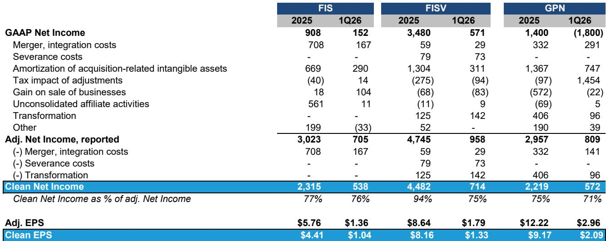
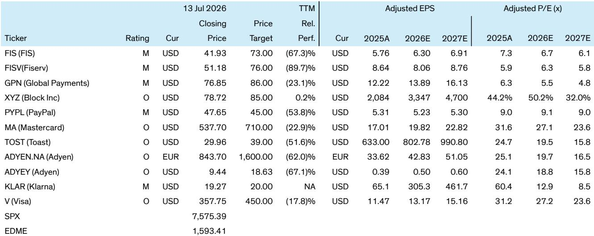

# Bernstein：支付处理商FISV-FIS-GPN的真实倍数

市场正在重新审视FIS、Fiserv和Global Payments这三家支付处理商。它们目前的NTM市盈率分别只有6.4倍、6.0倍和5.1倍，接近历史最低水平。但Bernstein最新发布的研报指出，读者看到的低市盈率数字，可能低估了这些公司真实的估值水平——当剥离掉那些被反复调整的“非经常性”项目后，差距可达数倍。

问题的核心在于，这些公司长期依赖大量会计调整来呈现非GAAP盈利，而这些调整的可持续性正在被质疑。Bernstein的分析师团队通过构建一套“清洁盈利”框架，重新计算了这些公司的真实估值。

## 1. 清洁盈利与非GAAP盈利的差距，揭示出估值被系统性低估

Bernstein发现，三家公司2025年的清洁盈利占非GAAP盈利的比例分别为：FIS 77%、Fiserv 94%、Global Payments 75%。到了2026年第一季度，这一比例进一步下滑至76%、75%和71%。这意味着，读者习惯参考的非GAAP每股收益，实际上高估了这些公司的真实盈利能力20%至30%。

差距的来源主要是那些被公司归类为“一次性”但实际持续发生的支出：重组费用、转型成本、并购整合费用。例如，Fiserv在2026年第一季度将超过1.4亿美元的“One Fiserv”转型费用加回调整后净利润；Global Payments同期也因Genius项目重组加回了9600万美元。这些费用并非真正的一次性支出，而是公司运营中的常态成本。

> **KC评论：** 当一家公司连续多年将“转型”或“整合”费用从盈利中剔除，读者就应该质疑这些项目是否真的“非经常性”。Bernstein的框架提供了一个实用的检验方法：将过去3-5年所有被调整的项目加总，看其是否呈现逐年下降趋势。

## 2. 自由现金流转化率比盈利数字更能反映真实财务健康

Bernstein的清洁自由现金流分析显示，这些公司的现金生成能力远弱于盈利数字所暗示的水平。2025年，FIS的清洁自由现金流转化率仅为53%，Global Payments为67%，Fiserv表现较好达到90%。但到了2026年第一季度，情况出现变化：Fiserv的转化率骤降至12%，Global Payments更是转为负值（-50%）。

低转化率意味着，公司报告的盈利中有相当一部分并未转化为可支配现金。这直接影响到这些公司能否在低估值水平下进行大规模公司回购——这是读者当前最关注的动态之一。

## 3. 杠杆约束和低税率可持续性，构成回购能力的双重限制

Bernstein指出，FIS和Fiserv在完成近期收购后正处于去杠杆阶段，净债务/EBITDA比率较高，这限制了它们在短期内进行有意义的公司回购。相比之下，Global Payments和PayPal到2027年底可能回购约30%的现有市值。

另一个被市场忽视的不确定性是极低的调整后税率。FIS在2026年和2027年的调整后税率分别仅为12%和13%，远低于正常水平。Bernstein质疑这种低税率的可持续性——如果税率回归正常化，即使经营利润不变，每股收益也将面临显著不确定性。

综合来看，Bernstein认为，虽然这些支付处理商的估值确实处于历史低位，但清洁EV/NOPAT倍数（FIS 14.3倍、Fiserv 10.8倍、Global Payments 11.3倍）远高于非GAAP市盈率所显示的水平。对于试图在低估值中寻找机会的读者而言，区分“报告倍数”和“真实倍数”的能力，可能比判断市场底部本身更为关键。

For informational purposes only. Portions may be generated,translated,summarized,or edited with AI assistance based on source materials and may contain omissions or errors. Please verify independently. This is not investment,legal,tax,accounting,or other professional advice.

For informational purposes only. Portions may be generated,translated,summarized,or edited with AI assistance based on source materials and may contain omissions or errors. Please verify independently. This is not investment,legal,tax,accounting,or other professional advice.

