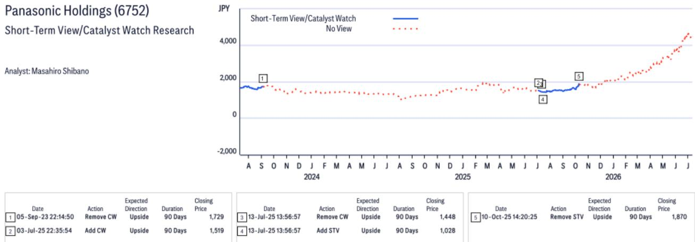
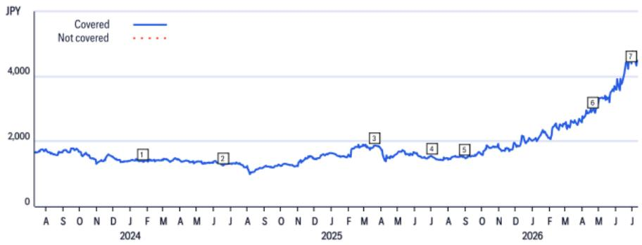

# Citi：台湾电子元器件与设备

AI机柜功率密度持续攀升，机柜级备电电池（BBU）正在从可选项变成必选项。Citi在近期发布的台湾电子元器件与设备行业报告中，重点讨论了BBU主题及核心标的Dynapack的研究逻辑。读者普遍关注BBU的成长空间，但报告中最值得注意的判断并非市场规模，而是供应链格局：BBU的技术壁垒和认证门槛，决定了电源供应商（PSU）难以垂直整合进入这一市场，台湾供应商有机会从松下手中夺取份额。

这份报告的核心主张是：BBU的竞争壁垒正在变高，而非变低。随着功率等级从3kW/5kW向8kW/12kW乃至25kW演进，电池包设计、BMS集成、热管理、安全认证和定制化制造的能力要求同步提升。Citi认为，PSU供应商不太可能自行整合BBU业务，因为所需技术栈完全不同。更现实的路径是继续与合格的电池包制造商合作。这意味着，Dynapack这类具备专业能力的供应商，其与PSU厂商的绑定关系本身就是一种结构性优势。

## 1. HVDC商业化推迟不会破坏BBU研究逻辑，但会改变时间窗口

读者担心高压直流（HVDC）机柜商业化或下一代GPU平台延迟会冲击BBU主题。Citi的回应是：近端需求主要来自现有架构下AI机柜功率密度提升，以及3kW/5kW产品的持续放量。8kW/12kW BBU预计在2026年第四季度开始贡献收入。HVDC应被视为长期增量价值驱动因素，而非BBU采用的必要条件。

Dynapack正在开发包括25kW模块在内的更高功率产品，产品验证预计在2027年上半年进行，2H27可能有有限出货，有意义的销售贡献更可能从2028年下半年开始。这意味着2026-2027年的营收预测仍主要由现有3kW/5kW BBU和8kW/12kW模块的爬坡支撑。时间窗口清晰，但读者需要对节奏有合理预期。

> **KC评论：** 市场容易把HVDC当作BBU的“开关”，但报告指出它只是“加速器”。当前BBU需求的核心驱动力是现有架构下的功率密度提升，这个逻辑不依赖HVDC。读者应区分“近端确定性”和“远端期权”。

## 2. 台湾供应商对松下的份额侵蚀，核心驱动力是客户偏好而非技术替代

松下在电芯技术、规模和与云服务商（CSP）的直接关系上仍是强势玩家。但Citi认为，随着市场规模化，其主导地位可能面临不确定性。CSP通常偏好供应商多元化，以保障供应安全、获得定价杠杆和认证冗余。台湾供应商如AES和Dynapack目前各自市场份额不到10%，意味着有明确的扩张空间。

Dynapack的PSU合作模式提供了一个有效的份额获取路径——通过PSU合作伙伴接入CSP平台。这不是简单的技术替代，而是供应链结构变化带来的机会。CSP的采购逻辑正在从“单一最优”转向“安全冗余”，这对具备专业能力的二线供应商是结构性利好。

## 3. Dynapack上半年报价跑输，反映的是催化剂真空而非基本面出现变化

尽管Dynapack是AI电源架构演进的直接受益者，但其报价在2026年上半年表现落后。Citi认为，这主要反映了2025年大幅重估后缺乏催化剂。上半年BBU占集团营收仍不超过50%，整体销售动能被传统IT业务（预计同比下滑）部分稀释。此外，资金轮动至其他高动能科技板块也加剧了相对弱势。

但报告预期从2026年下半年开始，营收将显著增长，驱动力来自3kW/5kW BBU的持续强劲需求和8kW/12kW产品的初步爬坡。随着BBU成为更大的营收和利润贡献者，市场有望重新聚焦于Dynapack的盈利拐点。上半年的跑输，本质上是一个时间错配问题，而非趋势逆转。

这份报告提供了一个可复用的观察框架：在AI基础设施的细分供应链中，判断一家公司的竞争地位，不能只看终端需求增速，更要看技术壁垒是否在提高、客户结构是否在优化、以及盈利拐点是否可预期。BBU赛道目前处于“需求确定、格局变化、节奏可控”的阶段，真正的变量在于谁能把规模转化为议价权。

For informational purposes only. Portions may be generated,translated,summarized,or edited with AI assistance based on source materials and may contain omissions or errors. Please verify independently. This is not investment,legal,tax,accounting,or other professional advice.

For informational purposes only. Portions may be generated,translated,summarized,or edited with AI assistance based on source materials and may contain omissions or errors. Please verify independently. This is not investment,legal,tax,accounting,or other professional advice.

