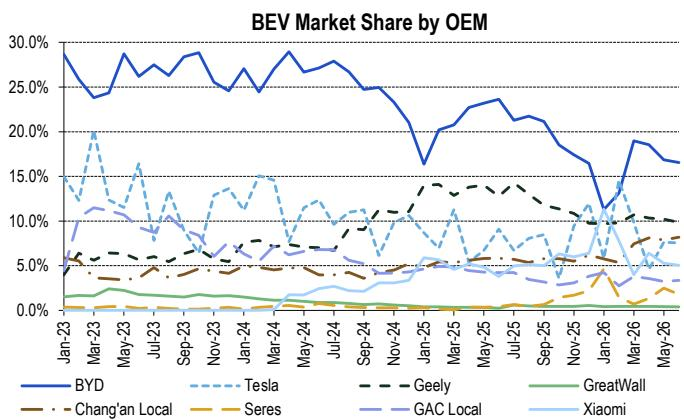
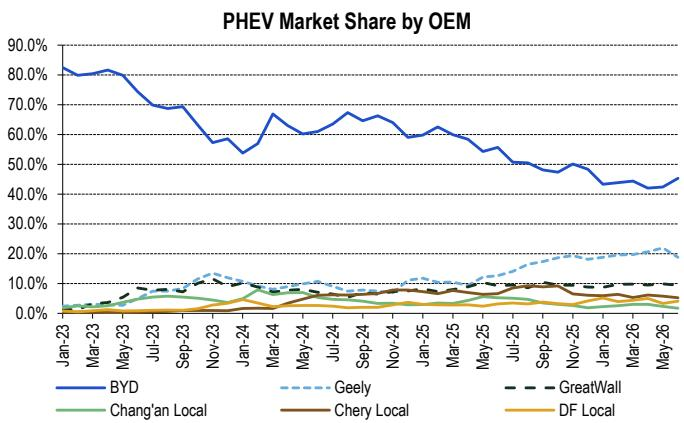
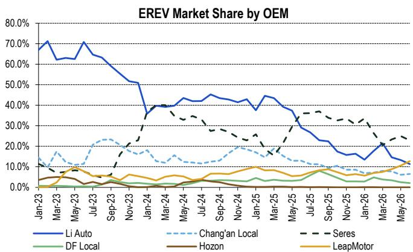
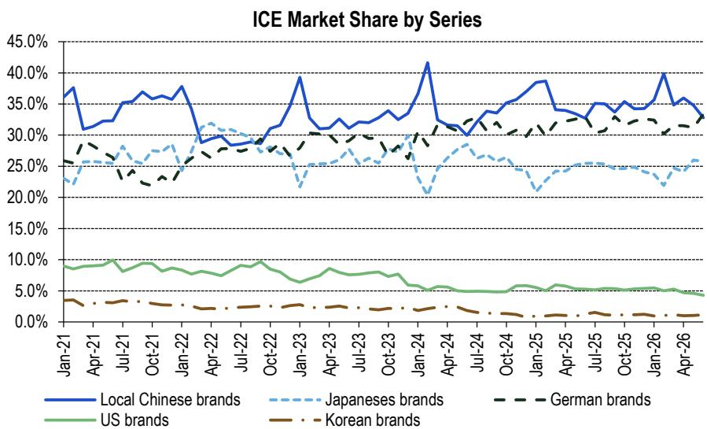
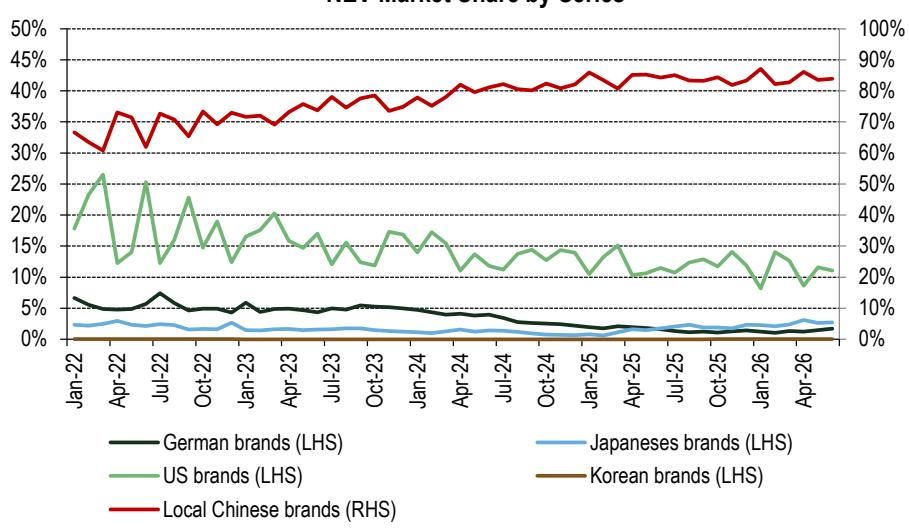

# 中国汽车制造商

## 10组数据；10个趋势（6月26日总结）

## 研究观点

以下为6月26日保险零售数据趋势总结。

图1：新能源车市场份额变化——比亚迪、上汽集团、小鹏、蔚来等企业在6月26日新能源车市场份额环比提升；保险零售数据显示，6月26日国产新能源乘用车销量环比增长9%（同比下降10%），略高于乘联会零售环比增速。延伸阅读：(1) 中国汽车制造商 - 乘联会6月更新；出口强劲，新能源批发略低于预期；(2) 中国汽车制造商 - 汽车政策与下半年需求展望

图2：6月燃油车渗透率环比上升——6月乘用车保险数据显示燃油车销售渗透率升至39.7%（环比上升2.0个百分点），原油价格下降可能促进燃油车购买，而纯电/插混/增程分别环比下降1.0/0.3/0.7个百分点。

图3：蔚来/长安/小鹏6月纯电市场份额环比提升——蔚来/长安/小鹏/广汽纯电市场份额环比分别提升0.3/0.3/0.1/0.1个百分点，赛力斯/吉利/比亚迪纯电市场份额环比分别下降0.7/0.4/0.3个百分点。

图4：比亚迪/东风/广汽6月插混市场份额环比提升——比亚迪/东风/广汽6月插混市场份额环比分别提升2.9/0.8/0.4个百分点，吉利/长安/长城市场份额环比分别下降3.1/0.7/0.5个百分点。

图5：赛力斯/理想6月增程市场份额环比下降——零跑/长安6月增程市场份额环比分别提升2.2/0.4个百分点，赛力斯/理想市场份额环比分别下降2.1/1.9个百分点。

图6：6月中国品牌燃油车市场份额环比下降——中国品牌燃油车市场份额6月环比下降2.0个百分点至32.8%，德系/日系/美系品牌分别环比变动+2.2/-0.2/-0.3个百分点。

图7：吉利6月领跑中国品牌燃油车市场——中国品牌（燃油车）中，奇瑞/长城/一汽6月燃油车市场份额环比分别提升2.0/0.7/0.7个百分点，上汽集团/吉利/长安市场份额环比分别下降1.3/1.3/1.2个百分点。吉利当月以30.3%的市场份额领跑中国品牌燃油车市场。

图8：特斯拉概要——特斯拉保险零售（国产）同比下降15%，环比增长9%至52,078辆。其6月批发量达89,091辆（同比增长24%，环比增长4%），出口量达36,171辆（同比增长258%，环比下降7%）。

图9：6月乘用车库存环比下降——据我们估算，6月底乘用车库存环比减少0.5个月至2.7个月；新能源车库存6月底环比减少0.2个月至1.9个月；燃油车库存6月底环比减少1.0个月至4.0个月。

图10：中国本土品牌新能源车市场份额——中国品牌新能源车市场份额6月维持83.9%的高位（环比提升0.3个百分点），美系品牌为11.1%（环比下降0.5个百分点）。

Jeff Chung $^{AC}$ +852-2501-2787
jeff.m.chung@citi.com

Kyle Wu

+852-2501-8483

kyle.wu@citi.com

参见附录A-1了解分析师认证、重要披露及研究分析师关联信息。不适用于中华人民共和国境内分发，香港特别行政区和合格境外机构读者除外。

图1. 各车企新能源车保险零售数据

<table><tr><td rowspan="2"></td><td colspan="6">2026年6月</td><td colspan="4">2026年上半年</td></tr><tr><td>销量</td><td>同比</td><td>环比</td><td>市场份额</td><td>同比</td><td>环比</td><td>销量</td><td>同比</td><td>市场份额</td><td>同比</td></tr><tr><td>比亚迪</td><td>220,837</td><td>-35%</td><td>13%</td><td>22.1%</td><td>-8.3ppt</td><td>0.7ppt</td><td>974,385</td><td>-38%</td><td>21.5%</td><td>-8.1ppt</td></tr><tr><td>吉利</td><td>112,970</td><td>-11%</td><td>2%</td><td>11.3%</td><td>-0.1ppt</td><td>-0.8ppt</td><td>527,667</td><td>-13%</td><td>11.7%</td><td>0.2ppt</td></tr><tr><td>零跑</td><td>70,207</td><td>73%</td><td>11%</td><td>7.0%</td><td>3.4ppt</td><td>0.1ppt</td><td>258,758</td><td>45%</td><td>5.7%</td><td>2.3ppt</td></tr><tr><td>长安（本土）</td><td>65,209</td><td>-8%</td><td>11%</td><td>6.5%</td><td>0.1ppt</td><td>0.1ppt</td><td>281,086</td><td>-13%</td><td>6.2%</td><td>0.1ppt</td></tr><tr><td>上汽通用五菱</td><td>47,377</td><td>-18%</td><td>2%</td><td>4.7%</td><td>-0.5ppt</td><td>-0.3ppt</td><td>205,896</td><td>-37%</td><td>4.6%</td><td>-1.7ppt</td></tr><tr><td>特斯拉</td><td>52,078</td><td>-15%</td><td>9%</td><td>5.2%</td><td>-0.3ppt</td><td>0.0ppt</td><td>238,885</td><td>-10%</td><td>5.3%</td><td>0.3ppt</td></tr><tr><td>赛力斯</td><td>29,524</td><td>-34%</td><td>-15%</td><td>3.0%</td><td>-1.0ppt</td><td>-0.9ppt</td><td>159,488</td><td>8%</td><td>3.5%</td><td>0.7ppt</td></tr><tr><td>理想</td><td>31,139</td><td>-13%</td><td>-6%</td><td>3.1%</td><td>-0.1ppt</td><td>-0.5ppt</td><td>191,488</td><td>-8%</td><td>4.2%</td><td>0.3ppt</td></tr><tr><td>广汽（本土）</td><td>27,334</td><td>-15%</td><td>18%</td><td>2.7%</td><td>-0.1ppt</td><td>0.2ppt</td><td>125,397</td><td>-24%</td><td>2.8%</td><td>-0.3ppt</td></tr><tr><td>长城</td><td>24,942</td><td>-20%</td><td>5%</td><td>2.5%</td><td>-0.3ppt</td><td>-0.1ppt</td><td>115,596</td><td>-18%</td><td>2.6%</td><td>-0.1ppt</td></tr><tr><td>东风（本土）</td><td>21,179</td><td>-33%</td><td>5%</td><td>2.1%</td><td>-0.7ppt</td><td>-0.1ppt</td><td>115,190</td><td>-12%</td><td>2.5%</td><td>0.1ppt</td></tr><tr><td>上汽集团</td><td>36,159</td><td>206%</td><td>32%</td><td>3.6%</td><td>2.5ppt</td><td>0.6ppt</td><td>142,048</td><td>146%</td><td>3.1%</td><td>2.0ppt</td></tr><tr><td>蔚来</td><td>41,457</td><td>89%</td><td>16%</td><td>4.1%</td><td>2.2ppt</td><td>0.2ppt</td><td>195,835</td><td>68%</td><td>4.3%</td><td>2.1ppt</td></tr><tr><td>奇瑞（本土）</td><td>37,726</td><td>-8%</td><td>9%</td><td>3.8%</td><td>0.1ppt</td><td>0.0ppt</td><td>161,749</td><td>-30%</td><td>3.6%</td><td>-0.8ppt</td></tr><tr><td>小米</td><td>34,818</td><td>36%</td><td>6%</td><td>3.5%</td><td>1.2ppt</td><td>-0.1ppt</td><td>186,131</td><td>18%</td><td>4.1%</td><td>1.1ppt</td></tr><tr><td>小鹏</td><td>32,133</td><td>-1%</td><td>24%</td><td>3.2%</td><td>0.3ppt</td><td>0.4ppt</td><td>133,568</td><td>-26%</td><td>3.0%</td><td>-0.5ppt</td></tr><tr><td>上汽大众</td><td>8,450</td><td>29%</td><td>16%</td><td>0.8%</td><td>0.3ppt</td><td>0.1ppt</td><td>28,690</td><td>-25%</td><td>0.6%</td><td>-0.1ppt</td></tr><tr><td>华晨宝马</td><td>2,216</td><td>-56%</td><td>-6%</td><td>0.2%</td><td>-0.2ppt</td><td>0.0ppt</td><td>11,945</td><td>-59%</td><td>0.3%</td><td>-0.3ppt</td></tr><tr><td>其他</td><td>115,395</td><td>8%</td><td>14%</td><td>11.5%</td><td>1.9ppt</td><td>0.5ppt</td><td>511,705</td><td>8%</td><td>11.3%</td><td>2.3ppt</td></tr><tr><td>国产新能源乘用车合计</td><td>1,000,484</td><td>-10%</td><td>9%</td><td></td><td></td><td></td><td>4,524,872</td><td>-14%</td><td></td><td></td></tr></table>

© 2026 Citi Inc. 未经Citi书面许可不得转载。  
来源：Citi, Thinkercar

图2. 按燃料类型划分的行业销量与渗透率（国产）  
  
© 2026 Citi Inc. 未经Citi书面许可不得转载。  
来源：Citi, Thinkercar

图3. 各车企纯电保险零售市场份额（国产）  
  
© 2026 Citi Inc. 未经Citi书面许可不得转载。
来源：Citi, Thinkercar

图4. 各车企插混保险零售市场份额（国产）  
  
© 2026 Citi Inc. 未经Citi书面许可不得转载。
来源：Citi, Thinkercar

图5. 各车企增程保险零售市场份额（国产）  
  
© 2026 Citi Inc. 未经Citi书面许可不得转载。

图6. 各系列燃油车保险零售市场份额（国产）  
  
© 2026 Citi Inc. 未经Citi书面许可不得转载。

来源：Citi, Thinkercar

图7. 各品牌燃油车保险零售市场份额（国产）  
  
© 2026 Citi Inc. 未经Citi书面许可不得转载。  
来源：Citi, Thinkercar

图8. 特斯拉中国保险零售概要

<table><tr><td></td><td>2026年6月</td><td>2025年6月</td><td>同比</td><td>环比</td><td>2026年上半年</td><td>2025年上半年</td><td>同比</td></tr><tr><td>国产</td><td>52,078</td><td>61,406</td><td>-15%</td><td>9%</td><td>238,885</td><td>264,651</td><td>-10%</td></tr><tr><td>Model 3</td><td>13,993</td><td>17,308</td><td>-19%</td><td>-25%</td><td>66,326</td><td>92,836</td><td>-29%</td></tr><tr><td>Model Y</td><td>30,442</td><td>44,098</td><td>-31%</td><td>21%</td><td>140,821</td><td>171,815</td><td>-18%</td></tr><tr><td>Model Y L EV</td><td>7,643</td><td>-</td><td>na</td><td>86%</td><td>31,738</td><td>-</td><td>na</td></tr></table>

© 2026 Citi Inc. 未经Citi书面许可不得转载。  
来源：Citi, Thinkercar

图9. 乘用车/新能源车/燃油车库存

<table><tr><td>乘用车</td><td>2025年6月</td><td>2025年7月</td><td>2025年8月</td><td>2025年9月</td><td>2025年10月</td><td>2025年11月</td><td>2025年12月</td><td>2026年1月</td><td>2026年2月</td><td>2026年3月</td><td>2026年4月</td><td>2026年5月</td><td>2026年6月</td></tr><tr><td>批发量（乘联会）</td><td>2,490,237</td><td>2,243,361</td><td>2,481,169</td><td>2,796,051</td><td>2,935,761</td><td>2,998,113</td><td>2,789,139</td><td>1,972,882</td><td>1,518,264</td><td>2,378,062</td><td>2,110,049</td><td>2,212,337</td><td>2,358,247</td></tr><tr><td>乘用车保险零售（Thinkercar）</td><td>2,093,395</td><td>1,799,515</td><td>1,942,913</td><td>2,204,735</td><td>2,064,746</td><td>1,989,610</td><td>2,268,881</td><td>1,509,640</td><td>1,115,794</td><td>1,435,144</td><td>1,340,343</td><td>1,468,652</td><td>1,660,019</td></tr><tr><td>出口量（乘联会）</td><td>480,964</td><td>484,150</td><td>499,341</td><td>528,082</td><td>550,544</td><td>600,768</td><td>587,930</td><td>580,690</td><td>554,644</td><td>688,049</td><td>766,497</td><td>786,547</td><td>876,742</td></tr><tr><td>库存水平（辆）</td><td>4,334,897</td><td>4,294,593</td><td>4,133,508</td><td>4,196,742</td><td>4,417,213</td><td>4,824,948</td><td>4,757,276</td><td>4,639,828</td><td>4,487,654</td><td>4,742,523</td><td>4,745,732</td><td>4,702,870</td><td>4,524,356</td></tr><tr><td>库存水平（月）</td><td>2.1</td><td>2.4</td><td>2.1</td><td>1.9</td><td>2.1</td><td>2.4</td><td>2.1</td><td>3.1</td><td>4.0</td><td>3.3</td><td>3.5</td><td>3.2</td><td>2.7</td></tr></table>

<table><tr><td>乘用车（乘联会报告数据）</td><td>2025年6月</td><td>2025年7月</td><td>2025年8月</td><td>2025年9月</td><td>2025年10月</td><td>2025年11月</td><td>2025年12月</td><td>2026年1月</td><td>2026年2月</td><td>2026年3月</td><td>2026年4月</td><td>2026年5月</td></tr><tr><td>库存水平（辆）</td><td>3,320,000</td><td>3,290,000</td><td>3,160,000</td><td>3,280,000</td><td>3,410,000</td><td>3,790,000</td><td>3,650,000</td><td>3,570,000</td><td>3,330,000</td><td>3,450,000</td><td>3,540,000</td><td>3,480,000</td></tr><tr><td>库存水平（天）</td><td>49</td><td>47</td><td>42</td><td>39</td><td>44</td><td>61</td><td>66</td><td>70</td><td>60</td><td>61</td><td>62</td><td>66</td></tr></table>

<table><tr><td>新能源乘用车</td><td>2025年6月</td><td>2025年7月</td><td>2025年8月</td><td>2025年9月</td><td>2025年10月</td><td>2025年11月</td><td>2025年12月</td><td>2026年1月</td><td>2026年2月</td><td>2026年3月</td><td>2026年4月</td><td>2026年5月</td><td>2026年6月</td></tr><tr><td>批发量（乘联会）</td><td>1,241,055</td><td>1,188,602</td><td>1,294,166</td><td>1,493,767</td><td>1,612,213</td><td>1,706,921</td><td>1,563,915</td><td>864,732</td><td>720,290</td><td>1,144,085</td><td>1,225,232</td><td>1,352,027</td><td>1,481,452</td></tr><tr><td>新能源保险零售（Thinkercar）</td><td>1,110,664</td><td>976,537</td><td>1,096,600</td><td>1,287,271</td><td>1,189,321</td><td>1,218,266</td><td>1,331,320</td><td>563,958</td><td>429,534</td><td>797,810</td><td>818,301</td><td>914,785</td><td>1,000,484</td></tr><tr><td>新能源出口量（乘联会）</td><td>197,511</td><td>217,814</td><td>203,560</td><td>211,806</td><td>238,030</td><td>284,094</td><td>272,663</td><td>289,543</td><td>269,229</td><td>342,884</td><td>406,743</td><td>424,464</td><td>499,120</td></tr><tr><td>库存水平（辆）</td><td>1,842,449</td><td>1,836,700</td><td>1,630,706</td><td>1,625,396</td><td>1,710,258</td><td>1,914,819</td><td>1,874,751</td><td>1,885,982</td><td>1,907,509</td><td>1,910,900</td><td>1,911,088</td><td>1,923,866</td><td>1,905,714</td></tr><tr><td>库存水平（月）</td><td>1.7</td><td>1.9</td><td>1.5</td><td>1.3</td><td>1.4</td><td>1.6</td><td>1.4</td><td>3.3</td><td>4.4</td><td>2.4</td><td>2.3</td><td>2.1</td><td>1.9</td></tr></table>

<table><tr><td>燃油乘用车</td><td>2025年6月</td><td>2025年7月</td><td>2025年8月</td><td>2025年9月</td><td>2025年10月</td><td>2025年11月</td><td>2025年12月</td><td>2026年1月</td><td>2026年2月</td><td>2026年3月</td><td>2026年4月</td><td>2026年5月</td><td>2026年6月</td></tr><tr><td>批发量（乘联会）</td><td>1,249,182</td><td>1,054,759</td><td>1,187,003</td><td>1,302,284</td><td>1,323,548</td><td>1,291,192</td><td>1,225,224</td><td>1,108,150</td><td>797,974</td><td>1,233,977</td><td>884,817</td><td>860,310</td><td>876,795</td></tr><tr><td>保险零售（Thinkercar）</td><td>982,731</td><td>822,978</td><td>846,313</td><td>917,464</td><td>875,425</td><td>771,344</td><td>937,561</td><td>945,682</td><td>686,260</td><td>637,334</td><td>522,042</td><td>553,867</td><td>659,535</td></tr><tr><td>出口量（乘联会）</td><td>283,453</td><td>266,336</td><td>295,781</td><td>316,276</td><td>312,514</td><td>316,674</td><td>315,267</td><td>291,147</td><td>285,415</td><td>345,165</td><td>359,754</td><td>362,083</td><td>377,622</td></tr><tr><td>库存水平（辆）</td><td>2,492,448</td><td>2,457,893</td><td>2,502,802</td><td>2,571,346</td><td>2,706,955</td><td>2,910,129</td><td>2,882,525</td><td>2,753,846</td><td>2,580,145</td><td>2,831,623</td><td>2,834,644</td><td>2,779,004</td><td>2,618,642</td></tr><tr><td>库存水平（月）</td><td>2.5</td><td>3.0</td><td>3.0</td><td>2.8</td><td>3.1</td><td>3.8</td><td>3.1</td><td>2.9</td><td>3.8</td><td>4.4</td><td>5.4</td><td>5.0</td><td>4.0</td></tr></table>

来源：Citi估算, Thinkercar, 乘联会

图10. 各品牌新能源车保险零售市场份额（国产）
新能源车市场份额按系列划分  
  
© 2026 Citi Inc. 未经Citi书面许可不得转载。  
来源：Citi, Thinkercar

## 提及公司：

北京汽车 (1958.HK; HK\$0.79; 2; 2026年7月10日; 16:10) | 华晨中国 (1114.HK; HK\$1.99; 1H; 2026年7月10日; 16:10) | 比亚迪 (1211.HK; HK\$84.9; 1; 2026年7月10日; 16:10) | 比亚迪 (002594.SZ; Rmb90.0; 1; 2026年7月10日; 15:00) | 奇瑞 (9973.HK; HK\$26.76; 1; 2026年7月10日; 16:10) | 重庆长安汽车 (000625.SZ; Rmb7.11; 2; 2026年7月10日; 15:00) |

东风汽车股份有限公司 (600006.SS; Rmb5.27; 未评级; 2026年7月10日; 15:00) | 吉利汽车 (0175.HK; HK\$18.64; 1; 2026年7月10日; 16:10) | 长城汽车 (2333.HK; HK\$8.64; 1; 2026年7月10日; 16:10) | 长城汽车 (601633.SS; Rmb15.26; 3; 2026年7月10日; 15:00) | 广汽集团 (2238.HK; HK\$2.19; 2; 2026年7月10日; 16:10) | 广汽集团 (601238.SS; Rmb5.19; 2; 2026年7月10日; 15:00) | 零跑汽车 (9863.HK; HK\$37.74; 1; 2026年7月10日; 16:10) | 理想汽车 (LI.O; US\$12.1; 2; 2026年7月10日; 16:00) | 理想汽车 (2015.HK; HK\$47.42; 2; 2026年7月10日; 16:10) | 蔚来 (NIO.N; US\$4.78; 1; 2026年7月10日; 16:00) | 蔚来 (9866.HK; HK\$38.66; 1; 2026年7月10日; 16:10) | 上汽集团 (600104.SS; Rmb10.12; 2; 2026年7月10日; 15:00) | 赛力斯集团 (601127.SS; Rmb59.9; 3; 2026年7月10日; 15:00) | 赛力斯集团 (9927.HK; HK\$47.8; 2; 2026年7月10日; 16:10) | 特斯拉 (TSLA.O; US\$407.76; 未评级; 2026年7月10日; 16:00) | 小米 (1810.HK; HK\$25.84; 1; 2026年7月10日; 16:10) | 小鹏汽车 (XPEV.N; US\$13.03; 1; 2026年7月10日; 16:00) | 小鹏汽车 (9868.HK; HK\$51.25; 1; 2026年7月10日; 16:10)

如果您有视觉障碍并希望与Citi代表就本文件中图表的细节进行沟通，请致电美国1-888-500-5008（TTY: 711），或从美国境外拨打+1-210-677-3788

## 附录A-1

## 分析师认证

主要负责本研究报告编制和内容的研究分析师要么在作者栏中以"AC"标识，要么在可归因于该分析师的内容旁以粗体列出。如果作者栏中指定了多位AC分析师，每位分析师仅就整个研究报告进行认证，但以下情况除外：(a) 可归因于另一位以粗体列出的AC认证分析师的内容，以及(b) 仅针对特定发行人的观点，这些观点可归因于该发行人下方价格图表或评级历史表中标识的另一位AC认证分析师。每位分析师就其负责的报告部分认证：(1) 其中表达的观点准确反映了其个人对每个提及的发行人和证券的看法，并以独立方式编制，包括对Citi Global Markets Inc.及其关联方；(2) 研究分析师的薪酬的任何部分过去、现在或将来都不直接或间接与该研究分析师在本报告中表达的具体建议或观点相关。

## 重要披露

<table><tr><td>自2025年1月1日起，该公司至少有一次在长城汽车股份有限公司公开交易股权证券中做市。</td></tr><tr><td>自2025年1月1日起，该公司至少有一次在理想汽车公开交易股权证券中做市。</td></tr><tr><td>自2025年1月1日起，该公司至少有一次在吉利汽车控股有限公司公开交易股权证券中做市。</td></tr><tr><td>自2025年1月1日起，该公司至少有一次在蔚来公开交易股权证券中做市。</td></tr><tr><td>自2025年1月1日起，该公司至少有一次在比亚迪股份有限公司公开交易股权证券中做市。</td></tr><tr><td>自2025年1月1日起，该公司至少有一次在浙江零跑科技股份有限公司公开交易股权证券中做市。</td></tr><tr><td>自2025年1月1日起，该公司至少有一次在小米集团公开交易股权证券中做市。</td></tr><tr><td>Citi Global Markets Inc.或其关联方在理想汽车、蔚来的任何类别普通股证券中持有0.5%或以上的净空头头寸。</td></tr><tr><td>Citi Global Markets Inc.或其关联方在过去12个月内已从奇瑞、重庆长安汽车、吉利汽车、广汽集团、上汽集团、特斯拉、小米获得投资银行服务报酬。</td></tr><tr><td>Citi Global Markets Inc.或其关联方预计在未来三个月内将从奇瑞、重庆长安汽车、广汽集团、上汽集团、特斯拉寻求或收到投资银行服务报酬。</td></tr><tr><td>Citi Global Markets Inc.或其关联方在过去12个月内从比亚迪、奇瑞、重庆长安汽车、吉利汽车、长城汽车、广汽集团、理想汽车、蔚来、上汽集团、赛力斯集团、特斯拉、小鹏汽车、小米获得了投资银行服务以外的产品和服务报酬。</td></tr><tr><td>Citi Global Markets Inc.或其关联方目前拥有或过去12个月内拥有以下投资银行客户：奇瑞、重庆长安汽车、吉利汽车、广汽集团、上汽集团、特斯拉、小米。</td></tr><tr><td>Citi Global Markets Inc.或其关联方目前拥有或过去12个月内拥有以下客户，且提供的服务为非投资银行、证券相关：比亚迪、奇瑞、重庆长安汽车、吉利汽车、长城汽车、广汽集团、理想汽车、蔚来、上汽集团、赛力斯集团、特斯拉、小鹏汽车、小米。</td></tr><tr><td>Citi Global Markets Inc.或其关联方目前拥有或过去12个月内
