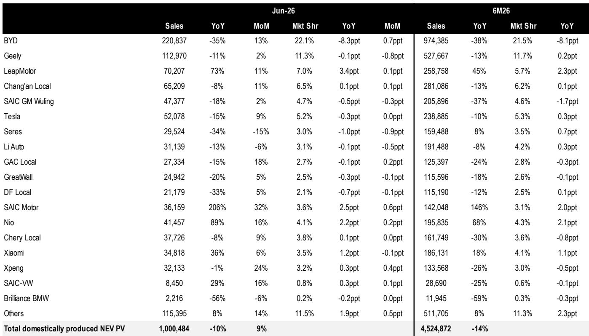
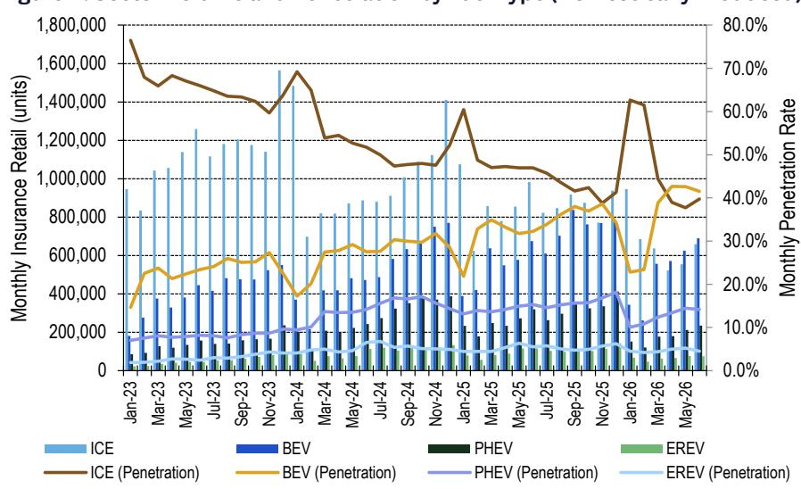
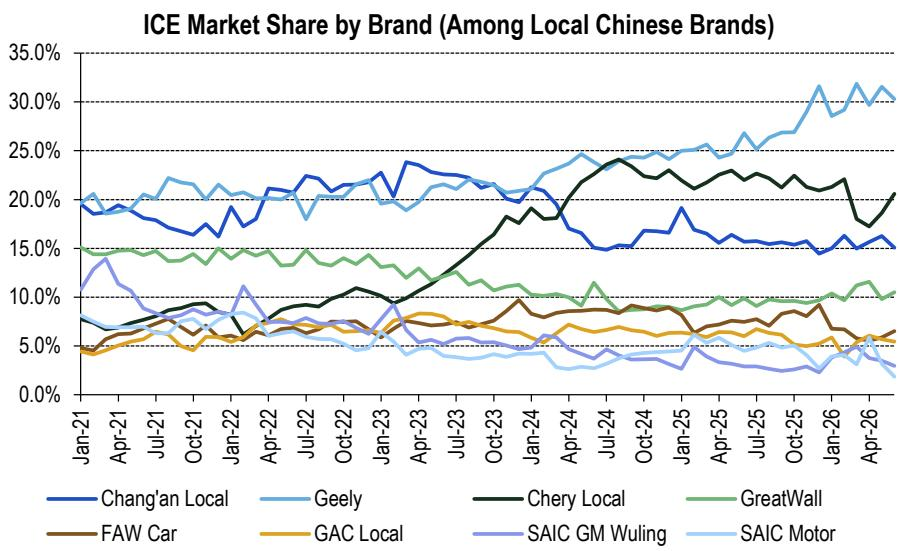

# 中国汽车市场正分化为三大战场，单一车企难以全面制胜

2026年6月，中国国内新能源乘用车保险零售量达到1,000,484辆，环比增长9%，但同比仍下降10%。这种环比增长与同比收缩的分化，揭示了全球最大汽车市场的核心张力：新能源转型已不再是单一、整体性的从内燃机向电动化的转变。它已根据动力技术类型，裂变为三个独立的竞争领域，每个领域的市场份额变动所揭示的赢家与输家格局，远比简单的“电动车对燃油车”叙事更为复杂。

总体数字掩盖了真正的战略洞察。6月，燃油车渗透率实际上环比上升了2.0个百分点，达到39.7%，这得益于原油价格下跌暂时提振了对汽油车的需求。这并非长期趋势的逆转，而是提醒人们转型是非线性的且对价格敏感。与此同时，新能源市场本身也并非单一池子：纯电动汽车、插电式混合动力汽车和增程式电动汽车正展现出截然不同的竞争动态，不同车企在不同类别中各有胜负。关于“中国品牌占据新能源市场83.9%份额”的总体叙事，掩盖了一个现实：在一个动力技术领域的领先地位，并不能转移到另一个领域。

对于观察者和策略制定者而言，其含义是明确的：以总新能源市场份额来评估车企的旧框架已经过时。关键问题不在于某家车企是否在电动车上获胜，而在于它在哪个具体的动力技术领域获胜，以及该领域是在结构性扩张还是收缩。2026年6月的数据为此种碎片化格局提供了一个罕见的高分辨率快照。

## 油价下跌暂时提振燃油车销售，暴露新能源需求基础的脆弱性

6月报告中最反直觉的数据点是燃油车销售渗透率环比上升至39.7%，增加了2.0个百分点。这发生在乘用车总保险零售量环比增长13%至166万辆的背景下，表明6月的增量需求不成比例地流向了汽油车。其机制很简单：较低的原油价格削弱了新能源车在过去两年建立的总拥有成本优势。当燃料成本下降时，电动车较高前期价格的回收期变长，对价格敏感的买家便回归熟悉的燃油车选项。

这并非结构性转变，而是战术性调整，对新能源车企具有发人深省的战略意义。6月数据显示，新能源车需求部分依赖于一种可能被外部商品价格波动所干扰的拥有成本计算。那些围绕激进的新能源定价建立销量策略的车企，如果油价保持低位或进一步下跌，可能会发现其可寻址市场正在缩小。燃油车库存环比下降1.0个月至4.0个月——是所有动力类型中降幅最大的——证实经销商在6月能够更快地清出汽油车，这一动态是新能源车企在规划2026年下半年生产计划时不能忽视的。

## 纯电市场份额变动揭示高端守成者与大众市场捍卫者之间的两极分化

在纯电领域，6月的市场份额变动揭示了一个清晰的模式：专注于高端的车企份额上升，而销量领先者则份额下降。蔚来、长安和小鹏的纯电市场份额分别环比增加了0.3、0.3和0.1个百分点。与此同时，赛力斯下降了0.7个百分点，吉利下降了0.4，比亚迪下降了0.3。这种对比并非偶然。蔚来和小鹏都在品牌定位和技术差异化方面投入巨资——蔚来的换电、小鹏的自动驾驶软件——这使它们免受纯粹的价格竞争。长安虽然是大众市场参与者，但其纯电策略集中于特定的车型细分市场，而非试图覆盖整个价格区间。

比亚迪纯电份额的下降是最重要的信号。比亚迪在相对数量上仍是主导者，但其6月22.1%的新能源市场份额同比下滑了8.3个百分点。该公司在插混领域的实力——其份额环比增加了2.9个百分点——表明它正在用混动产品蚕食自己的纯电销量。这是一种深思熟虑的策略：比亚迪垂直整合的供应链使其能够同时盈利地提供两种动力类型，而插混领域目前增长更快。但纯电份额的下降带有警示意味。如果比亚迪的品牌日益与混动而非纯电关联，它可能难以维持纯电领导地位通常赋予的溢价能力。

## 插混与增程领域正成为决胜战场，领先者并非寻常面孔

6月最具决定性的竞争动态发生在插混和增程领域，它们共同代表了新能源市场中增长最快的部分。比亚迪的插混市场份额环比增加2.9个百分点，是任何车企在任何动力类别中最大的单月变动。东风和广汽的插混份额也分别增加了0.8和0.4个百分点。在下降一方，吉利的插混份额下降了3.1个百分点，长安下降了0.7，长城汽车下降了0.5。

插混数据讲述了一个产品周期时机的故事。比亚迪的增长反映了其第五代混动系统的实力，该系统提供的油耗低到足以在运营成本上与纯电动车竞争，同时消除了里程焦虑。相比之下，吉利的份额下降表明其当前的插混产品线处于产品周期更迭之间，正在失去相关性。对于观察者而言，其含义是插混市场份额比纯电份额更不稳定，因为它依赖于特定车型的推出而非品牌忠诚度。一个在插混技术上哪怕只落后一个产品周期的车企，也可能在一个月内损失几个百分点的份额。

在增程领域，内燃机仅作为发电机为电池充电，其得失集中度更高。零跑的增程市场份额环比增加了2.2个百分点，而长安增加了0.4。赛力斯下降了2.1个百分点，理想汽车下降了1.9。这是整个报告中最具揭示性的数据点。赛力斯和理想汽车一直是中国增程领域的主导者，理想汽车实际上开创了高端增程品类。它们同时将份额输给零跑——一家规模较小、更注重价值的车企——表明增程领域的商品化速度比许多人预期的要快。

零跑的增长尤其具有战略意义。该公司将其增程车型的定价显著低于理想汽车，瞄准那些希望拥有增程车灵活性但负担不起高端品牌的买家。如果零跑继续夺取份额，它将迫使理想汽车和赛力斯在降价（这会压缩其利润率）和失去销量之间做出选择。增程领域可能正在进入已经重塑纯电市场的同样价格战动态。

## 库存数据为哪些车企定价低于需求提供早期预警

报告中的库存数据为市场份额变动提供了交叉验证。6月，乘用车总库存环比下降0.5个月至2.7个月，其中燃油车库存下降整整1.0个月至4.0个月，新能源车库存下降0.2个月至1.9个月。燃油车库存下降与油价下跌推动的汽油车需求复苏一致。但新能源车库存数字虽然有所改善，仍高于行业分析人士通常认为最优的1.5个月水平。

更细化的含义关乎定价纪律。一家在库存保持稳定时获得市场份额的车企，是通过真实需求获胜。一家在库存上升时获得份额的车企，实际上是通过向经销商压货或未公开的折扣来购买份额。报告未提供车企层面的库存数据，但批发与零售之间的差异——6月新能源批发量为148万辆，零售为100万辆——意味着大约48万辆被出口或加入了库存。考虑到出口量为49.9万辆，国内库存情况基本持平。这表明6月观察到的市场份额变动，更多反映了真实的消费者偏好，而非激进的渠道压货。

## 在碎片化市场中评估中国车企的决策框架

6月数据使得构建一个评估任何中国车企竞争地位的决策框架成为可能。该框架包含三个维度，每个维度对应一个现在作为独立市场运作的动力技术领域。

第一个维度是纯电定位。应评估一家车企是否拥有可防御的技术差异化优势——换电、自动驾驶软件或专有电池化学——使其能够维持定价能力。蔚来和小鹏在此得分较高；比亚迪和吉利易受商品化影响。

第二个维度是插混产品周期时机。由于插混市场份额由特定车型推出而非品牌忠诚度驱动，一家车企的竞争地位可通过其当前混动平台的“年龄”来评估。比亚迪的第五代系统赋予其明显优势；吉利和长安处于较弱地位，因为它们当前的插混产品正在失去相关性。

第三个维度是增程定价策略。增程领域正在快速商品化，获胜策略似乎是价值定位而非高端品牌化。零跑以牺牲理想汽车和赛力斯为代价的增长表明，市场正在奖励那些以大众市场价格提供增程技术的车企。一家拥有高增程价格且无明显差异化的车企，很可能会继续失去份额。

将这一框架应用于6月数据，可得出一个清晰的排序。比亚迪仍是整体实力较强的参与者，因其在插混领域的主导地位以及跨动力类型交叉补贴的能力，但其纯电份额下降是一个警示信号。零跑是最有趣的挑战者，因为它正从低基数在纯电和增程两个领域同时获得份额。蔚来和小鹏在纯电领域定位良好，但尚未证明它们能实现盈利性规模化。理想汽车和赛力斯面临最紧迫的战略挑战：它们必须要么降低增程价格以捍卫份额，要么接受其高端定位不再可持续。

## 中国品牌主导新能源，但面临国内燃油车份额被侵蚀的日益增长风险

最后一个值得战略关注的数据点是按品牌国籍划分的燃油车市场份额变动。6月，中国品牌的燃油车市场份额环比下降2.0个百分点至32.8%，而德系品牌增加了2.2个百分点。日系和美系品牌基本持平。这是新能源故事的镜像。中国车企过于专注于赢得电动化竞赛，可能忽视了其燃油车产品线，为德系车企捍卫其剩余汽油车利润创造了机会。

6月，吉利以30.3%的份额领跑中国品牌的燃油车市场，但即便如此，吉利也环比下降了1.3个百分点。奇瑞和长城汽车获得了燃油车份额，表明它们在投资电动化的同时，仍保持了汽油车的产品竞争力。其战略含义是，中国车企不能将燃油车视为一个可以榨取现金的遗留业务。如果德系品牌成功在中国稳定其燃油车销量，它们将产生所需的现金流来资助自己的新能源转型，这可能会将电动化竞赛的竞争时间线延长数年。

6月的保险零售数据描绘了一幅市场图景：没有任何单一战略方法能保证成功。比亚迪的销量主导地位与纯电份额侵蚀并存。理想汽车的高端增程定位正被一个注重价值的竞争对手所削弱。油价下跌短暂提振了燃油车需求，提醒每个新能源车企，它们的可寻址市场并非牢不可破。中国的汽车行业已进入一个阶段，竞争优势是特定于细分领域的、暂时的，并不断受到新进入者和消费者偏好变化的考验。赢家将是那些认识到自己无法在所有领域获胜，并将资源集中于自己拥有真正、可防御优势的动力技术领域的车企。

*仅供参考。部分内容可能基于源材料通过AI辅助生成、翻译、总结或编辑，可能存在遗漏或错误。请独立核实。本文不构成任何专业建议。*

仅供参考。部分内容可能基于源材料通过AI辅助生成、翻译、总结或编辑，可能存在遗漏或错误。请独立核实。本文不构成任何专业建议。

