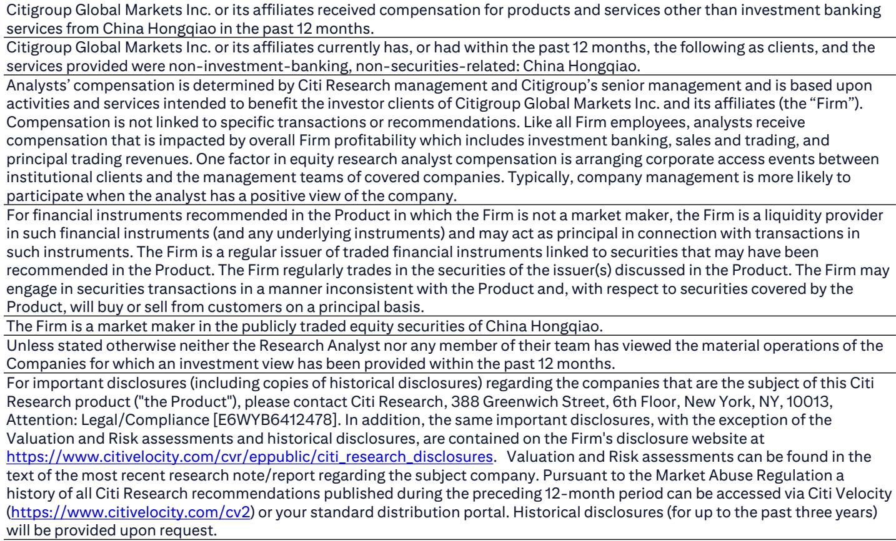

# 中国宏桥1H26利润增长：铝业结构性转折的信号，而非单纯周期上行

中国宏桥集团公布1H26初步税后利润为188亿元人民币，同比增长39%，略高于市场一致预期，并已覆盖全年彭博一致预期的49%。这并非商品上行周期中的又一次季度超预期。数据揭示了一个更重要的现象：中国铝业板块内部现金流配置方式正在发生根本性转变。公司利润从2H25到1H26环比加速61%，表明在市场仍在定价周期性风险之际，盈利轨迹正在陡峭化。当前股价与股息回报表现之间的差距，反映出读者需要审慎审视的脱节现象。

围绕中国铝业股的传统叙事一直是产能过剩、监管不确定性以及国内房地产市场放缓的影响。宏桥1H26的业绩直接挑战了这一叙事。如此规模的利润增长，主要源于铝价上涨而非产量扩张，表明供需格局已比市场共识所认知的更为紧张。公司将同比增长归因于铝价上涨，这指向一个供应约束开始显现的市场。这不仅仅是商品通胀的故事，更是结构性纪律最终重塑一个长期受困于过度投资的行业的故事。

这一时刻的战略重要性在于盈利动能与资本配置灵活性的结合。报告明确指出，强劲的盈利和现金流可在市场波动中支持股息和股份回购。对于将中国商品股视为股东回报有限的周期性交易的读者群体而言，这标志着潜在的制度性转变。在业务持续创造创纪录利润的同时向股东返还资本的能力，创造了大多数周期性股票从未实现的复利效应。11.5%的预期股息回报表现，结合目标价所隐含的显著价格升值，表明市场尚未为这一新均衡重新定价宏桥。

## 39%的利润增长由价格而非产量驱动，确认供应受限市场有利于现有企业

宏桥1H26的利润增长来自铝价上涨，而非产能增加。这一区别至关重要。在以往的周期中，中国铝业公司通过建设新冶炼厂和获取产量增长来扩大盈利，这往往以牺牲行业整体利润率为代价。当前的盈利轨迹讲述了一个不同的故事：公司正受益于反映真实供应紧张的价格上涨。1H26初步税后利润为188亿元人民币，按12%的少数股东权益调整后（与全年预测一致），预计净利润为166亿元人民币。这代表着同比增长34%，环比增长61%。

环比加速是最具说明力的指标。61%的环比利润增长意味着定价环境从2025年下半年到2026年上半年显著增强。这不是一个渐进的上升趋势，而是一个阶梯式的变化。作为背景，1H26净利润已覆盖全年预测的52%，意味着公司以显著幅度领先于预期。如果2026年下半年仅与上半年持平，全年盈利将比当前估计高出约4%。如果定价环境继续走强，上行空间可能更大。

对读者的启示很直接：宏桥不依赖产量增长来实现盈利扩张。在供应受限的市场中，拥有现有产能和低成本地位的现有企业将充分受益于价格上涨。新进入者面临监管障碍、更高的资本成本和更长的建设周期。这创造了一种很少被计入商品股的护城河。1H26的业绩提供了首个具体证据，表明这一结构性优势正在转化为财务上的优异表现。

## 强劲现金流创造了大多数周期性公司缺乏的资本配置选择权

报告中关于股息和股份回购的强调并非套话。这是一个战略信号。宏桥管理层明确将强劲的盈利和现金流与资本回报计划联系起来。对于一家以约13.0倍2026年预期市盈率交易（与中国同行平均水平一致）的公司而言，在股票以低于内在价值的价格交易时维持或增加股息的能力，创造了一个强大的总回报主张。

11.5%的预期股息回报表现本身已具有吸引力。但结构性洞见在于，这一回报表现得到了加速增长的盈利的支持。由增长中的盈利支撑的股息回报表现，与由稳定或下降的盈利基础维持的回报表现有根本不同。在前一种情况下，如果盈利增长快于股息，派息率实际上可能随时间下降，为特别股息或增加回购创造空间。在后一种情况下，回报表现是一个陷阱。

回购增加了另一个维度。当一家公司以低于内在价值的价格回购自身股份时，对每股盈利的增厚是显著的。如果宏桥将其自由现金流的一部分用于回购，对每股盈利的影响在多年期内可能相当可观。这不是假设；报告明确将这种可能性与市场波动挂钩，表明管理层准备在股票仍被低估时采取行动。

## 131%的隐含估值差距反映市场尚未定价结构性变化

这一倍数并非激进。它是行业常态。当前价格意味着较这一目标价有131%的上行空间，表明市场正在定价一个可能不再合理的显著风险溢价。目标价所隐含的2.7倍2026年预期市净率进一步强调了这一点：尽管盈利能力创纪录，宏桥的账面价值仍被折价。

报告中引用的关键风险因素——成本和资本支出超支、高于预期的产能增加以及中国经济显著放缓——是真实存在的，但市场正将其作为基准情形来定价。1H26的业绩则指向相反：成本得到控制，产能增加受到约束，而中国经济尽管放缓，但并未崩溃。市场正在为尚未实现的结果要求风险溢价，同时忽视了已经显现的盈利动能。

这种不对称性创造了一个清晰的研究主题。如果风险未能实现，股票应重新评级至同行平均倍数，产生131%的回报。如果风险确实实现，下行风险部分由11.5%的股息回报表现和公司强劲的资产负债表所保护。风险回报比偏向上行，而1H26的业绩为这种偏向提供了实证基础。

## 评估宏桥的决策框架：研究主题成立需满足的四个条件

对于考虑宏桥的研究者而言，盈利超预期是全部上行空间实现的必要条件，但非充分条件。一个严谨的方法需要在未来六到十二个月内，针对可观测数据检验四个具体条件。

第一，铝价必须维持在当前水平或以上。1H26盈利由价格而非产量驱动。如果价格下跌，盈利轨迹将逆转。研究者应关注LME铝价和国内现货价格，以及上海期货交易所仓库的库存水平。库存持续下降将确认供应约束依然存在。

第二，宏桥必须兑现其资本回报承诺。报告提到股息和回购是现金的潜在用途。研究者应追踪公司实际派息率和任何已公布的回购计划。如果管理层兑现承诺，将表明对盈利可持续性的信心。如果没有，股票的总回报状况将减弱。

第三，监管环境必须保持对供应纪律的支持。中国政府的产能置换政策和对新冶炼厂的环境限制是限制供应增长的关键结构性因素。任何对这些政策的放松都将消除铝价的主要支撑。研究者应关注工业和信息化部及国家发展和改革委员会的政策声明。

第四，中国经济必须避免硬着陆。报告将中国经济显著放缓列为关键风险。尽管宏桥的盈利更多受供应而非需求驱动，但严重的需求收缩将压倒供应约束。研究者应关注中国的GDP增长、工业生产和房地产投资数据。房地产行业的稳定将是铝需求最看涨的信号。

如果所有四个条件都成立，研究主题将得到有力支持。如果其中一两个条件被打破，回报将部分被股息回报表现和公司的成本优势所缓冲。如果所有四个条件都被打破，研究主题将失效。这一框架允许研究者根据自身条件评估研究案例，而非仅依赖价格动能或叙事。

*仅供参考。部分内容可能基于源材料通过AI辅助生成、翻译、总结或编辑，可能存在遗漏或错误。请独立核实。本文不构成专业建议。*

仅供参考。部分内容可能基于源材料通过AI辅助生成、翻译、总结或编辑，可能存在遗漏或错误。请独立核实。本文不构成专业建议。

