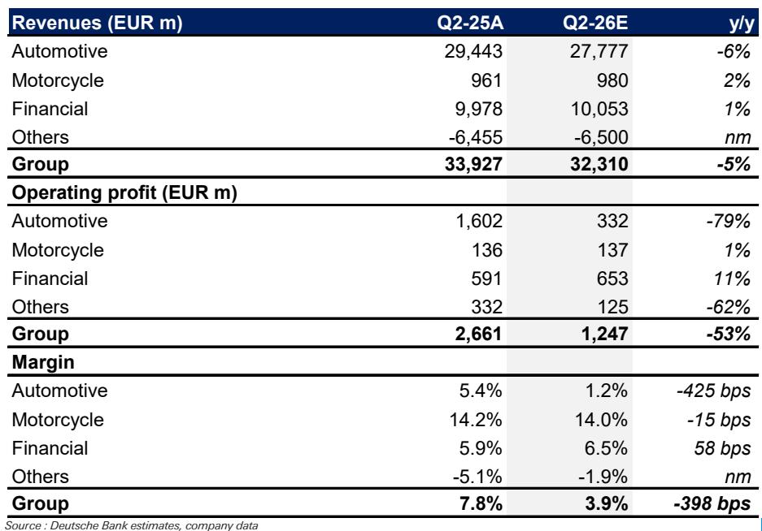
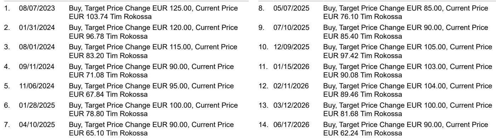

# BMW在中国市场的表现变化：不仅仅是周期性问题，更是市场尚未充分定价的结构性利润警示

宝马第二季度的表现所揭示的，远不止是一次简单的业绩未达预期。当公司于7月30日公布业绩时，汽车业务的息税前利润率仅为1.2%——较上年同期下降425个基点，且处于已下调的盈利区间下限。这一数字本身已足够引人关注。但真正的信息不在于这一个季度，而在于宝马盈利能力的永久性重塑，其驱动力来自一个单一地区的敞口——该地区已从增长引擎转变为结构性拖累。

数据是清晰的。集团营收预计同比下降5%至323亿欧元。汽车业务营业利润预计骤降79%至仅3.32亿欧元。与去年同期（该板块实现16亿欧元利润，利润率为5.4%）的对比再鲜明不过。虽然公司会将折旧、原材料成本和汇率列为影响因素，但主导力量显而易见：中国市场。该地区第二季度零售额同比下降30%，远远抵消了欧洲8%和美洲10%的增长。宝马全球销量为59.1万辆，下降5%，但若剔除中国，全球数据本应为正。

这不是需求的暂时停顿。这是对宝马地区利润结构的重新评估。

## 中国敞口已成为利润的下行放大器，而不仅仅是上行助力

在近二十年的时间里，中国是宝马最有利可图的市场——相较于成熟市场，销量更高、产品组合更优、定价更高。这种不对称性曾对公司有利。如今则反噬其身。中国30%的销量下滑不仅仅是销售问题，更是利润集中度问题。当一个单一地区贡献了不成比例的利润份额时，该地区的需求冲击所产生的利润率压缩，远比单纯的销量下滑所暗示的要严重得多。

数据说明了这一机制。2025年第二季度，宝马在294亿欧元的营收基础上实现了16亿欧元的汽车业务营业利润——利润率为5.4%。一年后，汽车业务营收仅下降6%，营业利润却骤降79%。这并非传统意义上的经营杠杆，而是利润池在地理上集中于一个目前处于调整中的地区的结果。425个基点的利润率压缩，正是高利润地区从利润组合中消失的直接算术结果。

这对观察者如何评估宝马的盈利轨迹具有启示意义。单纯的中国市场销量复苏，并不能恢复旧的利润率结构。销售组合需要重新转向高端车型和高端定价，而在一个本土电动汽车制造商竞争强度已永久改变定价动态的市场中，这远比等待周期性反弹要困难得多。

## Neue Klasse平台前景可期，但其所处的利润环境已与设计初衷不同

市场对Neue Klasse平台，特别是即将推出的iX3和i3车型，抱有真诚的期待。该架构代表了宝马最雄心勃勃的电动化努力，配备了下一代电池技术、全新设计语言以及旨在直接与特斯拉和中国制造商最佳产品竞争的软件栈。报告证实，Neue Klasse的势头依然强劲。

然而，此次发布的战略背景与平台最初构想时已截然不同。Neue Klasse最初的商业案例可能假设中国仍将是一个能够吸收高端定价电动汽车的高销量、高利润市场。这一假设如今存疑。中国消费者在电动汽车领域表现出对本土品牌的强烈偏好，价格竞争已加剧到令任何外国制造商都难以获得显著溢价的程度。

风险不在于Neue Klasse在技术上失败，而在于宝马在其最重要的产品周期推出之际，所处的利润环境无法支撑该平台所需的回报。iX3和i3在欧洲和美洲可能表现良好，但仅凭这些市场可能无法产生足够的规模来抵消来自中国的利润率压缩。Neue Klasse需要一个健康的中国市场来实现其全部利润潜力。而至少目前，该市场已不再健康。

## 自由现金流预计保持正值，但现金流质量正在变化

宝马的指引要求全年汽车业务自由现金流超过25亿欧元，报告预计第二季度自由现金流为正，但低于第一季度水平。表面上看，这提供了一定的支撑。公司没有在消耗现金，其金融服务板块继续表现良好，营业利润预计同比增长11%至6.53亿欧元。

但现金流的构成至关重要。较低的盈利是主要拖累，而营运资金预计将构成进一步阻力。这是经营承压的典型迹象：当销量下降、定价走软时，库存增加、应收账款周期拉长、现金转换周期延长。自由现金流保持正值证明了宝马的资产负债表纪律，但这掩盖了盈利引擎的潜在变化。一家主要通过削减成本和管理营运资金来产生现金的公司，与一家通过利润增长来产生现金的公司是不同的。

IEEPA退款——被描述为低三位数百万欧元的正面影响——提供了暂时的缓冲，但这是非经常性的。一旦该收益消退，汽车业务的基础现金生成能力将更加疲弱。观察者应关注剔除一次性项目后的自由现金流轨迹，以此作为衡量业务健康状况的更可靠指标。

## 指引不太可能调整，但缺乏修订并不代表稳定

报告明确指出，预计目前不会再次调整指引。当前展望预计汽车交付量略有下降，息税前利润率在1%至3%之间，自由现金流超过25亿欧元。鉴于近期已下调过指引，管理层很可能会维持现有立场，避免在情况显著恶化前进一步下调。

这是一个合理的战术决策，但不应与战略稳定性相混淆。1%至3%的利润率区间按宝马的历史标准已处于极低水平。即使取2%的中点，也仅约为公司在疫情前时期利润率的一半。在此水平维持指引并非信心的体现，而是承认底线已被降低。

更重要的问题是，1%至3%的区间是代表新常态还是暂时低谷。答案几乎完全取决于中国。如果30%的销量下滑企稳并逐步恢复，宝马可能回到其指引区间的上端甚至超出。如果下滑持续或加剧，利润率区间可能需要再次调整。报告维持指引的决定是合理的短期判断，但并未解决结构性不确定性。

## 观察框架：区分周期性复苏与结构性调整

思考宝马当前状况最有用的方式，是将周期性因素与结构性因素分开。在周期性方面，欧洲和美洲表现良好，零售额分别增长8%和10%。Neue Klasse的推出将带来产品周期动力。自由现金流保持正值。这些因素表明宝马并未陷入危机。公司拥有资产负债表、产品线和地区多元化来应对下行周期。

在结构性方面，中国已经改变。30%的销量下滑并非一次性事件。它反映了消费者信心减弱、本土电动汽车制造商竞争加剧以及中国买家品牌偏好的转变。即使销量企稳，中国的利润率结构也不太可能恢复到2024年之前的水平。这意味着宝马的整体利润率水平已被永久性降低，除非公司能够通过其他地区更高的利润率或快于预期的Neue Klasse爬坡来抵消中国的拖累。

观察框架应围绕三个问题构建。第一，未来四个季度中国销量的轨迹如何？在当前水平企稳将支撑利润率区间。进一步下滑将迫使再次调整。第二，Neue Klasse在其首个完整生产年度的利润率贡献如何？如果该平台仅在欧洲就能实现5%以上的利润率，则能部分抵消中国问题。如果需要中国销量来实现该利润率，则风险更高。第三，在利润率较低的环境下，宝马如何在股票回购、分红和投资之间分配资本？答案将表明管理层自身对当前盈利水平是暂时还是永久性的看法。

这些问题都无法从一个季度中得到答案。但第二季度的预览提供了构建这些问题所需的数据点。1.2%的利润率并非预测错误。它是一个信号，表明宝马的利润版图已经改变。将其视为周期性低谷的观察者，可能会因结构性较低的盈利基础而感到意外。而那些以此作为重新评估公司长期盈利能力的起点的观察者，将能更好地在Neue Klasse故事展开时对其进行评估。

*仅供参考。部分内容可能基于源材料通过AI辅助生成、翻译、总结或编辑，可能存在遗漏或错误。请独立核实。本文不构成专业建议。*

仅供参考。部分内容可能基于源材料通过AI辅助生成、翻译、总结或编辑，可能存在遗漏或错误。请独立核实。本文不构成专业建议。

