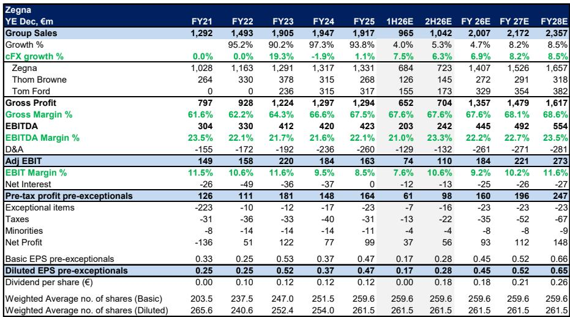
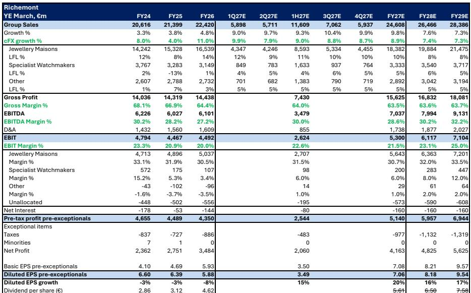
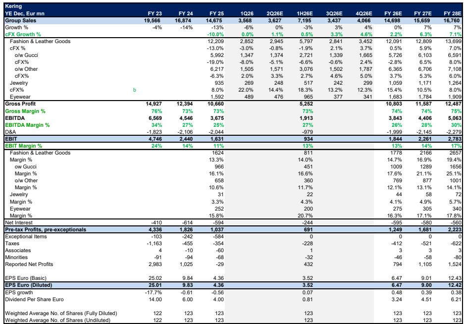

# DB：欧洲奢侈品2Q预览，预期反映市场平淡

欧洲奢侈品公司即将密集披露二季度业绩，但DB在最新行业更新中给出的判断是：市场预期已经充分定价了当前平淡的宏观环境，读者情绪处于近底部区域，真正的机会可能出现在下半年。这份覆盖八家核心公司的报告，核心信号不是“行业有多差”，而是“预期已经有多低”。

报告基于4-5月中国进口追踪数据、美国消费者信心指数、欧洲旅游流量等多维度指标，认为二季度很难看到比一季度更明显的环比改善。中东地缘因素仍在影响数字，中国没有实质性好转，游客流量处于低位。但报告同时指出，读者情绪已经接近历史估值底部，一旦出现边际改善，资金轮动就会重新进入这个板块。

## 1. 珠宝是相对少见亮点，但读者预期已经跑在了前面

历峰集团是今年欧洲奢侈品板块中表现最好的标的，其珠宝部门在4Q26实现了16%的同比增长。市场对1Q27珠宝部门增速的共识预期是+13%，但DB认为，读者实际隐含的预期可能高达+15%或更高。这意味着，即使业绩达到共识水平，报价也未必有额外上涨空间。

报告特别指出，历峰目前交易在约25倍2027年预期市盈率，短期上行空间已经有限。珠宝品类依然是整个板块中质量最高的细分赛道，但“好赛道”和“好买点”是两回事。

> **KC评论：** 历峰报价年初至今的涨幅，很大程度上已经定价了珠宝部门的强劲表现和金价下跌的利好。如果2Q业绩只是符合预期而非超预期，反而可能成为获利了结的触发点。这张图的关键不在于增速本身，而在于“预期差”的方向。

## 2. 中国仍是最大变量，但美国能否接棒是关键

报告引用的中国奢侈品进口数据显示，一季度环比改善的势头并未延续到4-5月。消费者信心同比虽有恢复，但低于一季度水平。这是整个板块面临的最核心宏观影响。

但报告也给出了一个值得关注的区域分化：北美市场保持强劲（尽管没有加速），韩国市场表现突出，而欧洲和旅游流依然仍在调整。中东地区对行业整体构成低个位数百分比的影响。对于读者而言，二季度业绩电话会上最需要关注的问题，是中国仍在调整的程度、美国能否弥补缺口，以及中东游客在6-7月是否有回补消费的迹象。

## 3. 板块估值已处历史低位，但轮动需要催化剂

报告中的估值图表显示，欧洲奢侈品板块当前12个月远期市盈率已经低于一季度报告期前的水平，多数公司交易在历史均值下方。DB认为，在这样的估值水平下，边际改善就足以引发资金轮动进入板块，而LVMH历来是这种复苏交易中表现最好的标的。

报告对LVMH维持首选判断，认为其时尚皮具部门是板块情绪的风向标。但同时也指出，市场对LVMH时尚皮具的隐含增速预期已经升至+2%左右，高于DB预测的+1%，这是一个需要警惕的不确定性点。

## 4. 二季度业绩的核心观察框架

报告给出了四个需要重点跟踪的维度：中国仍在调整程度与美国、韩国能否形成对冲；入门级消费者（aspirational customers）的状态及油价对奢侈品消费的影响；6-7月旅游流和中东逆风的变化；以及正在进行品牌转型的公司，其环比改善节奏是否在加速。

对于具体公司，报告认为历峰和LVMH是市场情绪的风向标，但历峰面临预期过高的不确定性，LVMH则是复苏交易中弹性最大的标的。博柏利、爱马仕、布鲁内罗·库奇内利等公司各有不同的增长驱动和估值逻辑，但整体而言，二季度业绩的核心看点不是相对增速，而是“是否好于已经很低的市场预期”。

> **KC评论：** 这份报告最有价值的部分不是对具体公司的预测，而是提供了一个“预期差”的观察框架。当前板块估值已经反映了大量谨慎信息，但读者需要区分“行业见底”和“公司业绩见底”之间的时间差。历峰和LVMH的业绩，将决定整个板块在2H能否迎来真正的情绪拐点。

For informational purposes only. Portions may be generated,translated,summarized,or edited with AI assistance based on source materials and may contain omissions or errors. Please verify independently. This is not investment,legal,tax,accounting,or other professional advice.

For informational purposes only. Portions may be generated,translated,summarized,or edited with AI assistance based on source materials and may contain omissions or errors. Please verify independently. This is not investment,legal,tax,accounting,or other professional advice.

