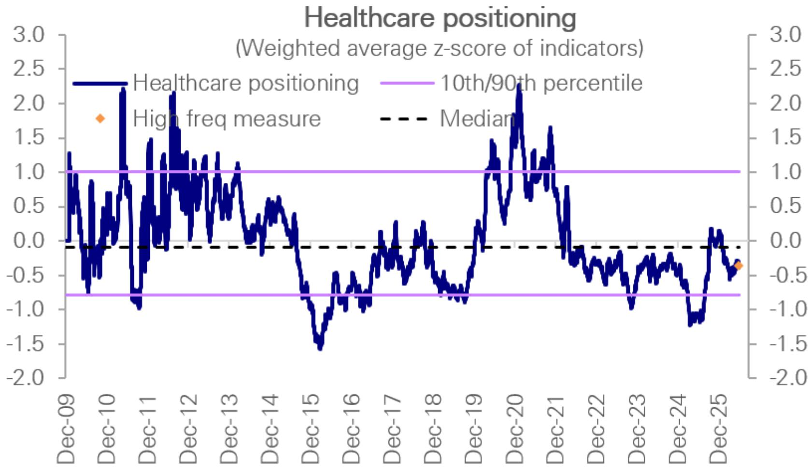
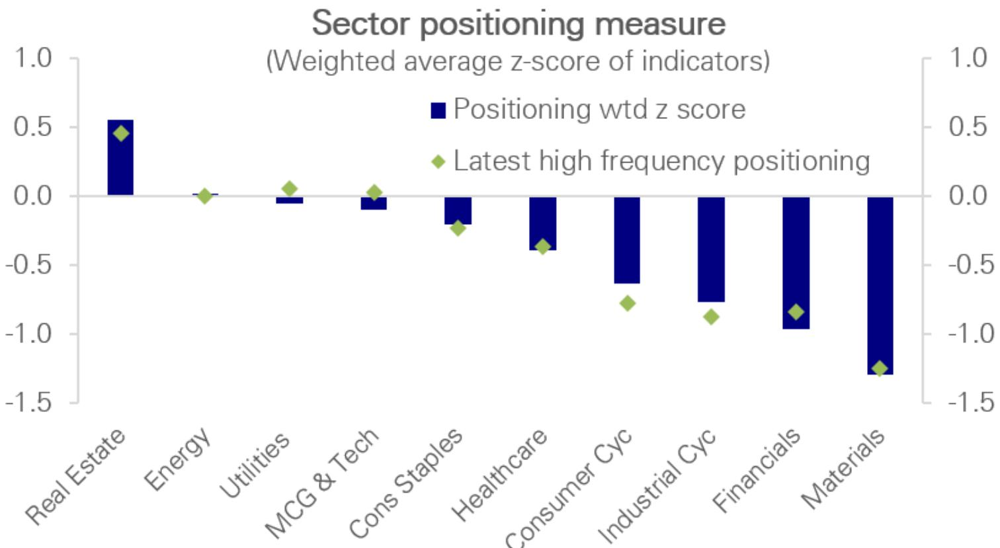

DB

## CRO in 2Q26 Green, Green, Green

July 2026, Justin Bowers, CFA
Justin.Bowers@db.com
+1.917.517.9836 (m)

IMPORTANT RESEARCH DISCLOSURES AND ANALYST CERTIFICATIONS LOCATED IN APPENDIX 1. DB does and seeks to do business with companies covered in its research reports. Thus, investors should be aware that the firm may have a conflict of interest that could affect the objectivity of this report. Investors should consider this report as only a single factor in making their investment decision.

## Portfolio Manager Summary We continue to expect QoQ improvement over the course of 2026

— 2Q26 Earnings Outlook: CRO stock performance entering 2Q26 is a much different story with the stocks +17% on average over the last month versus the group down (23%) on year-to-date basis entering the May earnings season. We remain constructive on CRO stocks and believe there is room to run from both positive estimate revisions into 2027 and recoupment of sector multiples compressed from AI / ML fears and lack of conviction in the cyclical recovery

— 1H26 Recap: We reviewed our 2026 CRO Outlook from December to keep ourselves honest and when we were: most constructive on Charles River (CRL: Buy) due to a variant view; and, called Iqvia (IQV: Buy) is easier to own in 1H26 and Icon's (Buy: ICLR) 2026 guidance as likely to serve as a clearing event. CRL is the best performing CRO at +17% ytd and IQV and ICLR both down (8%) but setting up as positive estimate revision stories for 2027 with valuation support.

— Buy Side Expectations: The CROs are still under-owned although the Buy Side is above Sell-Side 2Q26 Consensus Book-to-Bills by 0.05x on average with ICLR at 1.30x the high watermark and MEDP bulls looking for 1.05x at the low-end. The stock performance in 4Q25 was painful the last time the Buy Side was over its skis but the sector has had a few quarters of Biotech funding accelerating and post-MFN deals for an acceleration in trial spend. Icon and Charles River remain favored CROs while sentiment is most negative for lqvia (also screening as a consensus Long and Short in TMAC’s most recent survey)

— AI as a Tailwind or Headwind 2.0: We believe there is still multiple recovery from AI / ML fears alone amounting to 1-2x and our rationale for this only increases as we continue to channel work with large pharma and other industry participants. Our most recent check indicated a Top 5 Biopharma plans to maintain CRO outsourcing allocations longer term; is harvesting quality and speed-to-market from CRO AI / ML efforts without sacrificing cost; and, called out Iqvia as being the most progressive with tech deployment and business model changes: hence our recent Catalyst Call

— Focus Stocks: In CRO, we like IQV for upside to sentiment and an EPS beat and are also looking for beats and potentially modest positive revisions from CRL and ICLR

— Macro Indicators: Green, Green, Green: 2Q26 was the third greatest quarter on record for biotech equity funding; drug approvals tracking >2025; 2Q26 licensing levels +70% YoY; large pharma M&A on-track to exceed 2025 levels; increased preclinical / early-stage outsourcing to China / India (+5 – 10% vs. 2-3 years ago)

— We are increasing our PT for MEDP to \$480 (from \$425) based on a 28x 2026E EPS multiple (from 25x 2026E EPS); our target multiple is in-line with the 5YA forward multiple and reflective of recovering sector multiples / growth

— We are increasing our PT for CRL to \$260 (from \$230) based on a 13.5x 2027E EBITDA multiple (from 12.5x 2027E EBITDA); the target multiple is in line with the stock's 5-year historical average due to improving end-market conditions and sector multiples

— We are increasing our PT for FTRE to \$18 (from \$14) based of a 11x 2027E EBITDA multiple (from 8x 2027E EBITDA); our target multiple is a discount to the CRO peer group median, with greater margin expansion and EBITDA growth prospects offset by greater financial risk from elevated leverage and revenue growth headwinds this year.

## DB Estimate Changes Tweaking estimates to reflect intraquarter changes / 2027 estimates

<table><tr><td rowspan="3">Ticker</td><td rowspan="3">Mkt Cap ($mm)</td><td colspan="4">DB Estimates</td><td colspan="4">vs Prior Estimates</td><td rowspan="3">+ / - Earnings Related Implied Move</td><td rowspan="3">Notes</td></tr><tr><td colspan="2">Revenue</td><td colspan="2">Earnings</td><td colspan="2">Revenue</td><td colspan="2">Earnings</td></tr><tr><td>2026</td><td>2027</td><td>2026</td><td>2027</td><td>2026</td><td>2027</td><td>2026</td><td>2027</td></tr><tr><td>IQV</td><td>34,877</td><td>$17,158</td><td>$18,045</td><td>$12.62</td><td>$14.00</td><td>(0.3%)</td><td>(0.5%)</td><td>(1.8%)</td><td>(2.5%)</td><td>5.9%</td><td>Updated to reflect debt issued in 2Q26 and fx; no change to PT or multiple</td></tr><tr><td>MEDP</td><td>15,294</td><td>$2,794</td><td>$2,880</td><td>$17.05</td><td>$19.19</td><td>0.0%</td><td>0.0%</td><td>0.1%</td><td>0.6%</td><td>12.4%</td><td>2026 / 2027 EPS <+1.0%, updated book-to-bill; PT to $480 (from $425), multiple to 28x 2026E EPS (from 25x 2026E EPS)</td></tr><tr><td>ICLR</td><td>12,928</td><td>$7,996</td><td>$8,220</td><td>$10.46</td><td>$11.66</td><td>0.0%</td><td>0.0%</td><td>0.0%</td><td>0.0%</td><td>8.7%</td><td>No changes</td></tr><tr><td>CRL</td><td>11,252</td><td>$3,846</td><td>$3,889</td><td>$11.00</td><td>$12.50</td><td>0.0%</td><td>0.6%</td><td>0.0%</td><td>2.4%</td><td>9.4%</td><td>2027 EBITDA / EPS +2%; PT to $260 (from $230), based on a 13.5x 2027E EBITDA (from 12.5x 2027E EBITDA)</td></tr><tr><td>CON</td><td>4,018</td><td>$2,329</td><td>$2,465</td><td>$471.50</td><td>$507.22</td><td>0.0%</td><td>0.0%</td><td>0.0%</td><td>0.0%</td><td>2.2%</td><td>No changes</td></tr><tr><td>FTRE</td><td>1,672</td><td>$2,609</td><td>$2,668</td><td>$206.22</td><td>$219.51</td><td>0.0%</td><td>0.0%</td><td>0.0%</td><td>0.0%</td><td>13.4%</td><td>PT to $18 (from $14), multiple to 11x 2027E EBITDA (from 8x 2027E EBITDA)</td></tr><tr><td>MRVI</td><td>1,541</td><td>$211</td><td>$228</td><td>$30</td><td>$42</td><td>0.0%</td><td>0.0%</td><td>0.0%</td><td>0.0%</td><td>5.5%</td><td>No changes</td></tr></table>

Note: Data as of 7/10/2026; FTRE, SEM, CON, and MRVI earnings reflect EBITDA (\$mm)
Source: DB, Bloomberg Finance LP, Company Reports

## DB vs Consensus Street generally more aggressive on 2Q26 book-to-bill and bookings

<table><tr><td rowspan="2">Ticker</td><td rowspan="2">Mkt Cap ($mm)</td><td colspan="3">Consensus</td><td rowspan="2">DB 2Q26</td><td rowspan="2">DB vs Street</td><td rowspan="2">Buyside</td></tr><tr><td>1Q26</td><td>2Q26</td><td>QoQ</td></tr><tr><td colspan="8">Book-to-Bill</td></tr><tr><td>IQV</td><td>34,877</td><td>1.04x</td><td>1.11x</td><td>0.07x</td><td>1.10x</td><td>(0.01x)</td><td>1.10 - 1.15x</td></tr><tr><td>MEDP</td><td>15,294</td><td>0.88x</td><td>0.98x</td><td>0.10x</td><td>0.95x</td><td>(0.03x)</td><td>1.05x</td></tr><tr><td>ICLR</td><td>12,928</td><td>1.42x</td><td>1.28x</td><td>(0.14x)</td><td>1.25x</td><td>(0.03x)</td><td>1.30x</td></tr><tr><td>CRL</td><td>11,252</td><td>1.04x</td><td>1.06x</td><td>0.02x</td><td>1.00x</td><td>(0.06x)</td><td>1.05 - 1.10x</td></tr><tr><td>FTRE</td><td>1,672</td><td>1.15x</td><td>1.06x</td><td>(0.09x)</td><td>1.10x</td><td>0.04x</td><td>1.15x</td></tr><tr><td colspan="8">Bookings</td></tr><tr><td>IQV</td><td>34,877</td><td>$2,500</td><td>$2,675</td><td>7.0%</td><td>$2,720</td><td>1.7%</td><td></td></tr><tr><td>MEDP</td><td>15,294</td><td>$618</td><td>$658</td><td>6.4%</td><td>$665</td><td>1.1%</td><td></td></tr><tr><td>ICLR</td><td>12,928</td><td>$2,880</td><td>$2,563</td><td>(11.0%)</td><td>$2,493</td><td>(2.7%)</td><td></td></tr><tr><td>CRL</td><td>11,252</td><td>$622</td><td>$625</td><td>0.4%</td><td>$585</td><td>(6.4%)</td><td></td></tr><tr><td>FTRE</td><td>1,672</td><td>$732</td><td>$686</td><td>(6.3%)</td><td>$711</td><td>3.7%</td><td></td></tr></table>

Source: DB, Bloomberg Finance LP, Company Reports

## More cautious than the Street on 2027 top line, relatively in-line on 2026 revenue

<table><tr><td rowspan="2">Ticker</td><td rowspan="2">Mkt Cap ($mm)</td><td colspan="2">Consensus Revenue</td><td colspan="2">Consensus Earnings</td><td colspan="4">DB vs Consensus</td></tr><tr><td>2026</td><td>2027</td><td>2026</td><td>2027</td><td>2026</td><td>2027</td><td>2026</td><td>2027</td></tr><tr><td>IQV</td><td>34,877</td><td>$17,286</td><td>$18,276</td><td>$12.81</td><td>$14.17</td><td>(0.7%)</td><td>(1.3%)</td><td>(1.5%)</td><td>(1.2%)</td></tr><tr><td>MEDP</td><td>15,294</td><td>$2,779</td><td>$2,958</td><td>$17.02</td><td>$18.47</td><td>0.5%</td><td>(2.6%)</td><td>0.2%</td><td>3.9%</td></tr><tr><td>ICLR</td><td>12,928</td><td>$8,062</td><td>$8,310</td><td>$10.64</td><td>$11.86</td><td>(0.8%)</td><td>(1.1%)</td><td>(1.7%)</td><td>(1.6%)</td></tr><tr><td>CRL</td><td>11,252</td><td>$3,848</td><td>$3,923</td><td>$11.12</td><td>$12.32</td><td>(0.0%)</td><td>(0.9%)</td><td>(1.0%)</td><td>1.4%</td></tr><tr><td>CON</td><td>4,018</td><td>$2,334</td><td>$2,471</td><td>$471.88</td><td>$502.67</td><td>(0.2%)</td><td>(0.2%)</td><td>(0.1%)</td><td>0.9%</td></tr><tr><td>FTRE</td><td>1,672</td><td>$2,607</td><td>$2,689</td><td>$210.00</td><td>$234.83</td><td>0.1%</td><td>(0.8%)</td><td>(1.8%)</td><td>(6.5%)</td></tr><tr><td>MRVI</td><td>1,541</td><td>$211</td><td>$226</td><td>$31</td><td>$39</td><td>(0.0%)</td><td>0.8%</td><td>(3.9%)</td><td>7.7%</td></tr></table>

Note: Data as of 07/10/2026; FTRE, SEM, CON, and MRVI earnings reflect EBITDA (\$mm)
Source: DB, Bloomberg Finance LP, Company Reports

## Key Industry Debates Durability of the recovery; 4Q26 into 2027; EBP; pricing; and margin headwinds

— Durability / Momentum of Improvements: 1Q26 CRO results / commentary were broadly supportive of improved demand; debate is around whether it represents just further stabilization or a real inflection

— 4Q26 Exit Rates: Investors are sizing the range of QoQ improvements before hitting 4Q26 and whether 2027 will represent a return to more LRP-type CRO growth

— Continued EBP Improvement: Indications are that large / mid-sized pharma remain stable; EBP RFPs and bookings improving but multiple quarters of improvement likely to be required as proof

— FSO / FSP and Pricing: FSP penetration still strong with large pharma, more FSO to enter the mix as EBP returns; pricing stabilizing but still hasn’t flipped back to CRO’s favor

— Margin Headwinds: Mix / pricing / quality of bookings all driving margin headwinds in 2026; higher quality bookings achieved in late-2025, with the potential to positively impact margins in 4Q26

— Trial Concentration: Cardiometabolic studies remain in-vogue; uncertainty around whether over-indexing to certain trial types could flip to a headwind

## Recent Industry Checks: CROs Biotech / preclinical observations; company – specific observations from Field Work

— Biotech: Optimism remains elevated across sector while RFP TaT and decision making improves; cycle time shortening from \~9 months to sub-6 months referenced by a private CRO

— RFP Flow / Awards Improvement: Private CRO indicated 1H26 RFP flow +33% YoY with awards improving YoY as well; both metrics also improved QoQ in 2Q26, VC capital flowing to biotech companies much easier

— Higher-Quality RFPs Available: 2 $^{nd}$ private CRO noted total RFP \$’s were stable YoY, but quality of RFPs significantly improved with better funding / quality of data and less ballparks

— CRO Bid Process Narrowing: Less CROs invited to bid process, now 3 – 4 similar-sized CROs vs. 7 – 8 last year; large pharma still inviting larger numbers of CRO to bid

\- Pricing: Pricing environment is stabilizing after a couple years of price pressure; expect flattish to low-SD price for functional service provider (FSP) and full-service outsourcing (FSO); CRO's force-ranked from most to least expensive as: Iqvia; Fortrea; Icon = Parexel; PPD; and Medpace

— China / India Commanding More Early-Stage Work: +5 – 10% more preclinical / early-stage work in China / India vs. 2 – 3 years prior at (35 – 20%) cheaper / +40% faster; expectations for volume ex-U.S. to increase over time

— Biotech CRO Share Changes: Icon taking share from Fortrea; Fortrea among the more expensive biotech-focused CROs

— Top 10 Biopharma: Referenced using AI for 7 years including a home-based program to draft reports. Is seeing savings in translation and using the savings to spend more with CRO partner

— Top 10 Biopharma: Potential savings could eventually deliver a (20%) reduction in clinical monitoring costs, maybe a (10%) reduction in CRAs. Plans to reinvest in more programs vs . reduce R&D spend.

— Top 10 Biopharma: Still anticipates the work needs to get done manually, leading to no layoffs; more focused on efficiency

— Top 10 Biopharma: AI used in early stage and discovery; think there's a scenario to use AI and go from 10mm to 20mm targets with less manual screening

— Top 10 Biopharma: Sees opportunities for savings in areas like biostatistics, documentation, clinical monitoring - maybe 10% savings. AI is likely be to impactful over the next 3-5 years, will reinvest savings

— Midsized Biopharma: There is a cost for the CRO to validate and implement the technology so it's important not to nickel and dime the sites and CROs. Still five years out from cost savings and it requires investment

## Recent Industry Checks: AI Cont. Leveraged across CROs to drive efficiencies, human element still necessary

— Precommercial Biopharma: Will not turn away a vendor or a CRO if it has it, but lacks the scale or the number of clinical programs to justify the investment in AI.

— Industry Trade Group: Thinks AI will augment, not replace clinical monitoring

— Private CRO: Transparency on AI-use is important in relationship with sponsors; pricing rates are the same but there will be less time utilized and there is room for budget efficiency with AI

— Private CRO: Clients haven't changed RFP processes due to AI; its still a 10-day response. What has changed is that its now 10 CROs versus 3 CROs at the table

— Private CRO: AI / ML will be margin accretive to the company in the interim, will have to give back some of the savings to sponsors over time

— Private CRO: Sector margins will be pressured over the next few years due to pricing, the industry might be able to maintain margins with offsets from AI and productivity

— Large Pharma Outsourcing Specialist: AI unlikely to fully remove the human element from tasks it replaces; protocol writing; medical writing; statistical analysis; data management, review, and quality; and systems programming were all mentioned as at-risk

  
Note: Most recent percentile of 33%ile as of 7/7/26  
Source: DB Asset Allocation

  
MCG is Mega-cap Growth; Financials excludes MA & V which are under MCG; Industrial cyc: Industrials ex pandemic-hit cos; Cons cyc: Cons Disc & Media ex MCG ex Restaurants ex pandemic-hit cos.

Source: DB Asset Allocation

## Comp Sheet Multiples re-rating upward over the course of 2Q26 across Tools / Pharma Services

<table><tr><td colspan="3">($ Millions, except p/s and multiples)</td><td colspan="2">Price</td><td>% to</td><td>Mkt Cap</td><td>EV</td></tr><tr><td>Company</td><td>Ticker</td><td>Rating</td><td>7/9/26</td><td>Price Tgt</td><td>Price Tgt</td><td>(US$ mm)</td><td>(US$ mm)</td></tr><tr><td>AVANTOR</td><td>AVTR</td><td>Hold</td><td>10.51</td><td>11.0</td><td>5%</td><td>7,094</td><td>10,631</td></tr><tr><td>CHARLES RIVER</td><td>CRL</td><td>Buy</td><td>233.60</td><td>260</td><td>11%</td><td>11,243</td><td>14,155</td></tr><tr><td>DANAHER</td><td>DHR</td><td>Buy</td><td>195.98</td><td>250</td><td>28%</td><td>140,882</td><td>154,873</td></tr><tr><td>FORTREA</td><td>FTRE</td><td>Hold</td><td>17.67</td><td>18</td><td>2%</td><td>1,680</td><td>2,651</td></tr><tr><td>ICON PLC</td><td>ICLR</td><td>Buy</td><td>168.77</td><td>188</td><td>11%</td><td>12,848</td><td>15,590</td></tr><tr><td>IQVIA</td><td>IQV</td><td>Buy</td><td>208.97</td><td>240</td><td>15%</td><td>34,690</td><td>48,780</td></tr><tr><td>MARAVAI</td><td>MRVI</td><td>Buy</td><td>5.97</td><td>6.00</td><td>1%</td><td>1,572</td><td>1,677</td></tr><tr><td>MEDPACE</td><td>MEDP</td><td>Hold</td><td>535.50</td><td>480</td><td>(10%)</td><td>15,372</td><td>14,865</td></tr><tr><td>REPLIGEN</td><td>RGEN</td><td>Buy</td><td>143.94</td><td>180</td><td>25%</td><td>8,136</td><td>8,039</td></tr><tr><td>BIO-TECHNE</td><td>TECH</td><td>Hold</td><td>71.15</td><td>73</td><td>3%</td><td>11,163</td><td>11,244</td></tr><tr><td>THERMO FISHER</td><td>TMO</td><td>Buy</td><td>524.71</td><td>630</td><td>20%</td><td>195,863</td><td>235,896</td></tr><tr><td>10X GENOMICS</td><td>TXG</td><td>Hold</td><td>43.10</td><td>40</td><td>(7%)</td><td>5,425</td><td>4,966</td></tr><tr><td>WATERS</td><td>WAT</td><td>Hold</td><td>377.13</td><td>380</td><td>1%</td><td>36,960</td><td>42,068</td></tr><tr><td>WEST</td><td>WST</td><td>Buy</td><td>357.66</td><td>405</td><td>13%</td><td>24,989</td><td>24,784</td></tr><tr><td>CONCENTRA</td><td>CON</td><td>Buy</td><td>31.40</td><td>32</td><td>2%</td><td>4,037</td><td>6,127</td></tr></table>

<table><tr><td colspan="3">CY SALES*</td></tr><tr><td>2025</td><td>2026e</td><td>2027e</td></tr><tr><td>6,552</td><td>6,501</td><td>6,635</td></tr><tr><td>4,015</td><td>3,848</td><td>3,923</td></tr><tr><td>24,568</td><td>25,596</td><td>27,217</td></tr><tr><td>2,723</td><td>2,607</td><td>2,689</td></tr><tr><td>8,251</td><td>8,062</td><td>8,310</td></tr><tr><td>16,310</td><td>17,287</td><td>18,278</td></tr><tr><td>186</td><td>211</td><td>226</td></tr><tr><td>2,530</td><td>2,779</td><td>2,958</td></tr><tr><td>738</td><td>823</td><td>942</td></tr><tr><td>1,219</td><td>1,224</td><td>1,299</td></tr><tr><td>44,556</td><td>47,754</td><td>50,319</td></tr><tr><td>643</td><td>614</td><td>668</td></tr><tr><td>3,165</td><td>6,440</td><td>7,104</td></tr><tr><td>3,074</td><td>3,333</td><td>3,536</td></tr><tr><td>2,163</td><td>2,334</td><td>2,471</td></tr></table>

<table><tr><td colspan="2"></td><td>YTD</td><td>D&#x27;ly lqid</td><td>Short Int</td><td>Short Int</td><td>PEG Ratio</td></tr><tr><td>Company</td><td>Ticker</td><td>Price Chg</td><td>(&#x27;000s)</td><td>(days)</td><td>Float (%)</td><td>2 Yr EPS CAGR</td></tr><tr><td>AVANTOR</td><td>AVTR</td><td>(9%)</td><td>83,835</td><td>6</td><td>8%</td><td>nm</td></tr><tr><td>CHARLES RIVER</td><td>CRL</td><td>17%</td><td>160,097</td><td>4</td><td>9%</td><td>2.2</td></tr><tr><td>DANAHER</td><td>DHR</td><td>(13%)</td><td>840,204</td><td>2</td><td>2%</td><td>2.9</td></tr><tr><td>FORTREA</td><td>FTRE</td><td>3%</td><td>20,641</td><td>5</td><td>10%</td><td>0.3</td></tr><tr><td>ICON PLC</td><td>ICLR</td><td>(8%)</td><td>156,977</td><td>2</td><td>4%</td><td>nm</td></tr><tr><td>IQVIA</td><td>IQV</td><td>(8%)</td><td>290,988</td><td>3</td><td>3%</td><td>1.7</td></tr><tr><td>MARAVAI</td><td>MRVI</td><td>87%</td><td>13,387</td><td>2</td><td>8%</td><td>nm</td></tr><tr><td>MEDPACE</td><td>MEDP</td><td>(4%)</td><td>171,471</td><td>6</td><td>9%</td><td>1.6</td></tr><tr><td>REPLIGEN</td><td>RGEN</td><td>(12%)</td><td>141,867</td><td>5</td><td>11%</td><td>3.3</td></tr><tr><td>BIO-TECHNE</td><td>TECH</td><td>21%</td><td>280,329</td><td>1</td><td>10%</td><td>6.1</td></tr><tr><td>THERMO FISHER</td><td>TMO</td><td>(9%)</td><td>1,117,304</td><td>2</td><td>1%</td><td>2.3</td></tr><tr><td>10X GENOMICS</td><td>TXG</td><td>162%</td><td>87,852</td><td>4</td><td>14%</td><td>nm</td></tr><tr><td>WATERS</td><td>WAT</td><td>(1%)</td><td>356,381</td><td>3</td><td>4%</td><td>2.1</td></tr><tr><td>WEST</td><td>WST</td><td>29%</td><td>267,568</td><td>2</td><td>3%</td><td>2.8</td></tr><tr><td>CONCENTRA</td><td>CON</td><td>60%</td><td>23,890</td><td>3</td><td>2%</td><td>1.8</td></tr><tr><td colspan="2">Median</td><td>(1%)</td><td></td><td>3</td><td>8%</td><td>2.2</td></tr></table>

Note: Data as of 7/9/2026

<table><tr><td colspan="3">EV/SALES*</td></tr><tr><td>2025</td><td>2026e</td><td>2027e</td></tr><tr><td>1.6x</td><td>1.6x</td><td>1.6x</td></tr><tr><td>3.5x</td><td>3.7x</td><td>3.6x</td></tr><tr><td>6.3x</td><td>6.1x</td><td>5.7x</td></tr><tr><td>1.0x</td><td>1.0x</td><td>1.0x</td></tr><tr><td>1.9x</td><td>1.9x</td><td>1.9x</td></tr><tr><td>3.0x</td><td>2.8x</td><td>2.7x</td></tr><tr><td>9.0x</td><td>8.0x</td><td>7.4x</td></tr><tr><td>5.9x</td><td>5.3x</td><td>5.0x</td></tr><tr><td>10.9x</td><td>9.8x</td><td>8.5x</td></tr><tr><td>9.2x</td><td>9.3x</td><td>8.9x</td></tr><tr><td>5.3x</td><td>4.9x</td><td>4.7x</td></tr><tr><td>7.7x</td><td>8.1x</td><td>7.4x</td></tr><tr><td>13.3x</td><td>6.5x</td><td>5.9x</td></tr><tr><td>8.1x</td><td>7.4x</td><td>7.0x</td></tr><tr><td>2.8x</td><td>2.6x</td><td>2.5x</td></tr><tr><td>5.9x</td><td>5.3x</td><td>5.0x</td></tr></table>

<table><tr><td colspan="3">CY EBITDA*</td></tr><tr><td>2025</td><td>2026e</td><td>2027e</td></tr><tr><td>1,181</td><td>972</td><td>1,015</td></tr
