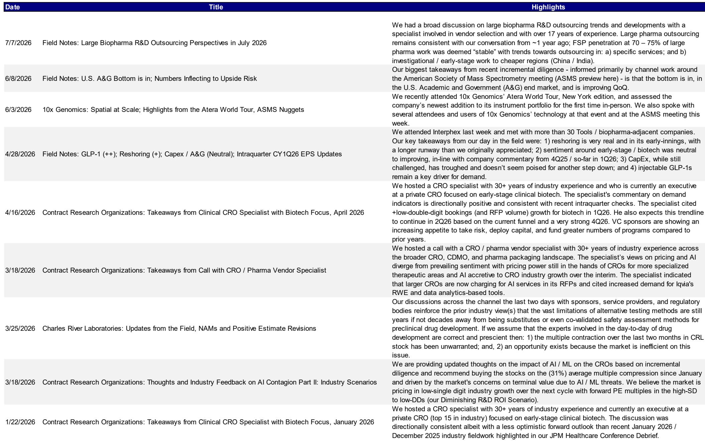
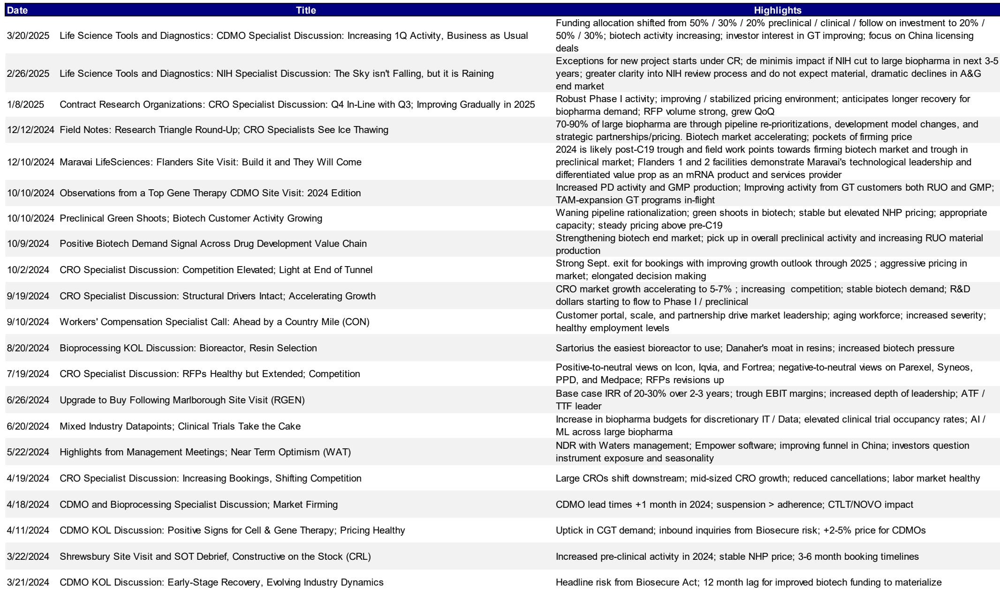
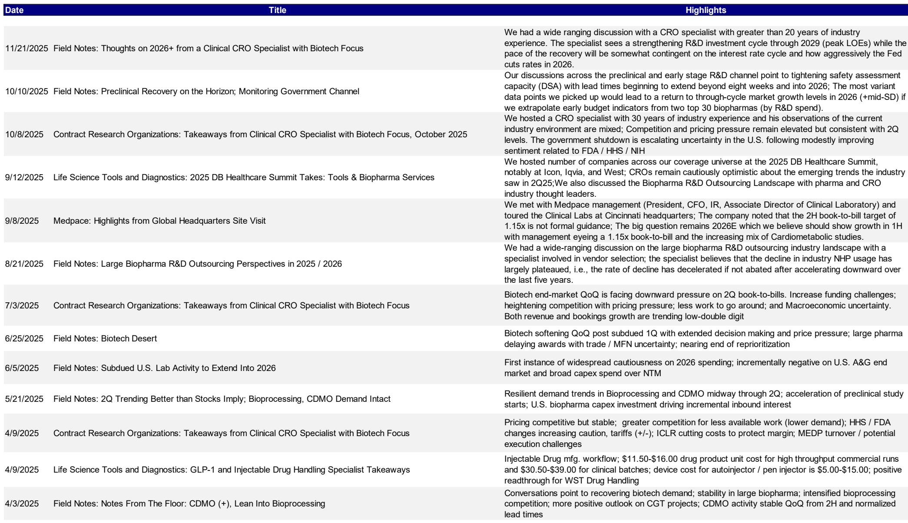

# 研究笔记：全球临床CRO行业观察（2026年中期）

进入2026年下半年，全球临床CRO领域的关注点正在发生变化。近期一份行业报告用“Green, Green, Green”概括了当前宏观环境。报告的核心判断是，CRO领域的复苏已从“是否发生”进入“能持续多久”的阶段，而市场对AI替代的担忧正在被真实的订单和资金流数据所修正。

报告发布前一个月，CRO公司平均上涨了17%，与此前截至5月财报季年内平均下跌23%的局面形成鲜明对比。报告认为，这一轮上涨并非简单的超跌反弹，而是有行业基本面改善作为支撑。2026年第二季度成为生物技术股权融资历史上第三高的季度；药物批准数量有望超过2025年全年；2026年第二季度许可交易金额同比增长70%；大型制药公司的并购活动也处于超越2025年水平的轨道上。这些宏观指标共同指向一个结论：下游客户的资金面正在显著改善，临床试验的支出意愿正在恢复。

## 1. 买方对订单的预期已经高于卖方，但持仓仍偏低

报告中最值得关注的信号来自买方预期与持仓之间的错位。渠道调研显示，买方对2026年第二季度的book-to-bill（订单出货比）平均比卖方共识高出0.05倍。以Icon为例，买方预期高达1.30倍，而卖方共识仅为1.28倍；Medpace的买方预期为1.05倍，卖方共识只有0.98倍。这种差异意味着，买方正在用更乐观的订单数据来定价，但他们的实际持仓却并未充分反映这种乐观——CRO板块仍然处于“低配”状态。

> **观察：** 买方预期高于卖方，但持仓却偏低，这通常是一个值得关注的信号。如果2026年第二季度实际订单数据落在买方预期区间，而不是卖方共识区间，那么当前报价可能尚未完全定价这一改善。Icon和Charles River是报告中被明确提及的买方偏好标的，而Iqvia则同时出现在多空双方的名单中，分歧最大。

这种错位在历史上曾带来不确定性。报告提醒，2025年第四季度的报价下跌正是在买方预期“过度超前”之后发生的。但这一次的不同之处在于，生物技术融资已经连续几个季度加速，且行业正在消化相关政策调整后的临床试验支出反弹。报告认为，当前的环境比2025年第四季度更具可持续性。

## 2. AI的威胁正在被重新定价，头部CRO反而受益

市场对AI/机器学习替代CRO的担忧，在过去一年中压缩了板块估值。报告估算，仅这一因素就导致CRO板块估值被压低了1-2倍市盈率。但经过持续的行业调研，该机构认为这种担忧正在被修正。

报告引用了一家全球前十大生物制药公司的内部实践：该公司已使用AI长达7年，包括自建项目来起草报告，但节省下来的成本并未用于削减CRO支出，而是重新投入到更多项目中。另一家前十大药企预计，AI最终可能将临床监控成本降低20%，减少约10%的CRA（临床研究助理）需求，但公司计划将节省的资金用于增加项目数量，而非减少研发总支出。还有一家中型生物制药公司明确表示，CRO验证和实施AI技术本身需要成本，因此“不应该对试验基地和CRO斤斤计较”。

这些调研结果指向一个反直觉的结论：AI在短期内不会成为CRO的替代者，反而可能成为订单增长的催化剂。因为大型药企将AI节省的成本重新投入研发，意味着外包给CRO的试验数量可能增加，而非减少。报告特别指出，Iqvia在技术部署和商业模式变革方面被认为是最为积极的一家，这也是该机构近期将其列为关注对象的原因之一。

## 3. 订单质量在改善，但利润率不确定性尚未完全解除

报告对行业供需两侧的观察也值得关注。一家私人CRO透露，2026年上半年的RFP（需求建议书）流量同比增长33%，且中标率也在同比改善。另一家私人CRO则指出，虽然RFP总金额同比持平，但订单质量显著提升——资金来源更可靠、数据质量更高、模糊报价更少。同时，CRO的竞标流程正在收窄：过去通常有7-8家CRO参与竞标，现在已缩减至3-4家规模相近的对手。这意味着竞争格局正在优化，头部CRO的议价能力有望回升。

但利润率方面仍存在不确定性。报告指出，2026年的利润率面临来自业务组合、定价和订单质量的综合不确定性。不过，2025年下半年获得的高质量订单，有可能在2026年第四季度开始对利润率产生正面影响。此外，定价环境正在企稳——功能性服务提供商（FSP）和全服务外包（FSO）的价格预计将持平或仅有低个位数增长。CRO的价格排序从高到低依次为：Iqvia、Fortrea、Icon与Parexel并列、PPD、Medpace。

> **观察：** 订单质量改善和竞标流程收窄，是CRO行业周期复苏中两个最容易被忽视的先行指标。它们不直接反映在收入中，但预示着未来几个季度的毛利率和项目执行效率。如果这一趋势持续，2027年的利润率修复可能比市场预期的更早到来。

## 4. 中国和印度正在承接更多早期工作，但这不是零和博弈

报告还揭示了一个结构性变化：与2-3年前相比，中国和印度承接的临床前/早期阶段工作增加了5-10%，成本低35-20%，速度快40%。市场对此的担忧是，这可能会分流北美CRO的订单。但调研显示，大型药企并未计划减少对CRO的外包分配，而是将中国和印度的产能视为补充，而非替代。

这一判断与报告中的宏观数据相呼应：生物技术融资、药物批准、许可交易和并购活动均在同步改善，意味着全球临床试验的总盘子正在扩大。中国和印度分走的份额，可能更多来自新增的试验需求，而非存量转移。对于专注于北美市场的CRO而言，关键在于能否在核心治疗领域（如心血管代谢研究）维持竞争力，而非试图在所有价格段与中国和印度竞争。

---

这份报告的核心价值不在于预测具体公司的季度业绩，而在于提供了一个完整的观察框架：宏观资金面（融资、批准、许可、并购）、买方预期差、AI影响的重新定价、订单质量与竞争格局的变化，以及全球产能再分配。这四个维度共同指向一个判断——CRO领域的复苏不是线性修复，而是由多个结构性因素叠加驱动的。对于关注这一领域的读者而言，2026年第二季度的订单数据将是验证这一框架的第一个关键节点。

For informational purposes only. Portions may be generated, translated, summarized, or edited with AI assistance based on source materials and may contain omissions or errors. Please verify independently. This is not investment, legal, tax, accounting, or other professional advice.

For informational purposes only. Portions may be generated, translated, summarized, or edited with AI assistance based on source materials and may contain omissions or errors. Please verify independently. This is not investment, legal, tax, accounting, or other professional advice.

