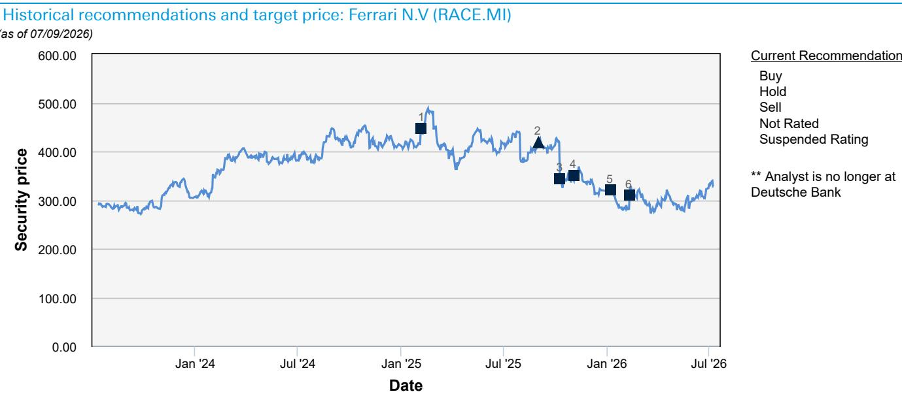

# Ferrari的稀缺性不是策略——它是一种结构性护城河，电动化只会使其更深

2026年7月，Ferrari的报价为327.45欧元，较52周高点440.90欧元下跌近30%。市场正在对这家标志性跑车制造商如何应对电动化转型的不确定性进行定价。这种不确定性是站不住脚的。根据与Ferrari前动力总成及电动力总成采购主管Antonio Trotta（2021-2025年）的深度专家访谈，该公司的定位在结构上免疫于重塑汽车行业其他领域的力量。那次访谈的核心见解直白而深刻：Ferrari的客户不会将其车辆与其他电动车在续航或加速等指标上进行比较。他们是将Ferrari与其他Ferrari进行比较，与收藏品资产进行比较。这种区别改变了一切。

传统的汽车行业逻辑——规模、平台共享、成本效率和大规模电动化——并不适用于Ferrari。该公司在一个独立的经济宇宙中运营，价格是买家最后考虑的因素，主要的竞争风险不是来自其他汽车制造商，而是建立品牌所需的时间。Trotta的评估是明确的：从当前角度看，看不到重大的竞争风险。进入跑车和豪华车领域需要巨大的财务资源，而建立像Ferrari这样的品牌需要数十年。对观察者而言，这意味着Ferrari的高估值并非投机溢价；它反映了电动化将强化而非侵蚀的持久竞争结构。

以下论述并非报告的摘要。它是对Ferrari商业模式为何包含大多数汽车行业叙事所忽视的自我强化机制的战略解读。报告提供了证据；本文提供了据此行动的框架。

## Ferrari的定价权不是周期性的——它是结构性的，由视价格为最后变量的客户群驱动

专家访谈中最关键的数据点不是财务指标，而是行为指标：对于Ferrari的超高净值客户群来说，价格往往是最后考虑的因素。这句话包含了该公司利润率结构的全部逻辑。当客户群体将价格视为剩余变量时，制造商就获得了基于感知价值而非生产成本或竞争对手基准来定价的能力。这不是传统意义上的提价而不失去市场份额的定价权。这是一种更强意义上的定价权：提价本身可以通过强化稀缺性来增强产品的吸引力。

Trotta确认，没有明显理由让Ferrari放慢提价步伐。这一机制并非随意。Ferrari通过增加个性化来支撑更高的定价。每个个性化功能都可以在二手市场上修改或移除，这意味着定制化不会破坏转售价值。一些高度个性化的车辆会被车主永久收藏。这创造了一个良性循环：个性化推动更高的初始交易价格，更高的价格强化品牌的稀缺性，稀缺性又为进一步的个性化提供理由。二手车市场不是一个风险因素，因为车主会持续升级到最新车型，即使在宏观环境不确定的时期也能创造稳定的新车需求。

战略意义在于，在可预见的未来，Ferrari的每单位收入增速可以超过通胀，超过其核心市场的GDP增速。该公司不需要销售更多车辆来增加收入。它需要维持那种让价格成为次要考虑因素的吸引力。这种吸引力锚定在两项竞争对手无法快速复制的资产上：数十年积累的公路车传统，以及由F1成功提供的持续营销平台。Trotta将这种组合描述为无与伦比，是对竞争对手的护盾。它也是对抗困扰汽车行业其他领域的商品化压力的护盾。

## Ferrari的电动化战略不会稀释其品牌，因为其电动车被定位为收藏品资产，而非性能车型

Ferrari首款纯电动车型Luce的推出引发了相当多的市场讨论。担忧很直接：一个建立在内燃机情感体验基础上的品牌，能否在不失去灵魂的情况下成功电动化？专家访谈提供了明确的答案。Trotta强调，Ferrari的电动化战略并非始于Luce。该公司通过SF90等混动车型已经开始了电动化之旅。Luce并非偏离这一轨迹；它是下一个合乎逻辑的步骤。

更重要的是，不应将Luce与Tesla、Xiaomi或其他电动车制造商进行比较，因为它面向的是不同的受众。Ferrari客户很可能不会在加速或续航等指标上比较该车型。他们会首先将其作为Ferrari来评估，其次才是电动车。Trotta将Luce描述为更像收藏品资产而非传统的纯电动车购买。这一框架具有战略关键性。如果Luce被定位为在续航和充电速度上竞争的高性能电动车，Ferrari将被迫陷入一场它无法与规模迥异的公司竞争的规格战。但通过将Luce定位为收藏品资产，Ferrari完全避开了这种竞争。

情感驾驶体验仍然是一个关键差异化因素。这种体验不仅仅是动力总成类型的函数。它是底盘调校、转向手感、声音工程、内饰工艺以及Ferrari数十年打磨的难以言喻的仪式感的函数。电动化改变了声音和扭矩输出，但它不会抹去驾驶体验的其他组成部分。事实上，电动车平台的瞬时扭矩和更低重心可以增强Ferrari客户所重视的某些性能方面。风险不在于Luce会成为一辆糟糕的Ferrari。风险在于它会被拿来与其他电动车而非其他Ferrari进行比较。Trotta的评论表明，Ferrari正在通过控制叙事和客户细分来管理这一风险。

## 超豪华跑车的进入壁垒不是技术——而是时间、品牌资产以及捷径的缺失

报告中最被低估的见解之一是Trotta的观察：进入跑车和豪华车领域需要巨大的财务资源，而建立像Ferrari这样的品牌需要数十年。这不是关于品牌价值的泛泛之谈。这是关于该细分市场竞争结构的特定论断。在大多数行业，资金充足的进入者可以在几年内复制竞争对手的产品。在超豪华汽车领域，复制是不可能的，因为产品与品牌历史密不可分。

Ferrari的品牌资产建立在两大支柱上：其公路车传统，包括数十年的设计语言、工程哲学和客户关系；以及其F1成功，提供持续的全球可见性和技术光环效应。再多的资金也无法压缩积累这种传统所需的时间。新进入者可以制造更快的车、更豪华的内饰或更先进的电动动力总成。但它无法建立75年在勒芒和F1获胜的历史。它无法制造出作为几代人梦想之车的品牌的情感共鸣。

这一结构性壁垒对Ferrari的估值有直接影响。该公司的竞争地位并非静止不变；它随时间推移而改善，因为每过一年都增加了Ferrari与任何潜在竞争对手之间的传统差距。在位时间越长，护城河就越宽。这与大多数科技或汽车业务相反，在这些业务中，在位可能成为新进入者颠覆既有模式的负担。对Ferrari而言，在位是一种复利的资产。

## 观察者的决策框架：将Ferrari视为具有汽车生产约束的奢侈品公司，而非拥有高端品牌的汽车制造商

评估Ferrari最有用的思维模型不是对单位销量增长进行现金流折现分析。它是一个优先考虑定价权、稀缺性和客户终身价值而非销量的奢侈品牌框架。专家访谈支持这种重新分类。Trotta指出，Ferrari试图为每位潜在的Ferraristi提供一辆车。这种措辞具有启示性。它表明Ferrari将自己视为管理着与有限高净值人群的关系，而非最大化生产以满足需求。

决策框架包含三个组成部分。首先，收入增长应主要基于每单位价格和个性化收入建模，而非单位销量。Ferrari在不破坏需求的情况下提价的能力是任何估值模型中最重要的变量。其次，电动化转型应作为品牌风险而非技术风险来评估。技术已经存在。问题在于Ferrari能否在电动形式下维持其情感差异化。来自Luce定位的证据表明该公司正在有效管理这一风险。第三，竞争威胁应被大幅折扣。进入壁垒不是资本；而是时间。没有竞争对手能在不到一代人的时间内建立Ferrari级别的品牌。

对于观察者而言，这一框架意味着Ferrari当前报价（较52周高点低约30%）代表了业务基本轨迹所不支持的折扣。市场正在对一家奢侈品公司应用汽车行业的折扣。该公司的估值，以当前交易水平衡量，与市场尚未完全定价Ferrari护城河结构性本质的观点一致。风险是真实存在的——宏观冲击可能减少超高净值人群的可自由支配支出，执行不佳的电动车发布可能损害品牌资产——但它们与持续定价权和利润率扩张的上行空间是对称的。

## 最终的战略启示：Ferrari的稀缺性不是选择——它是电动化不会削弱的商业模式的必然要求

报告最有力的见解是，Ferrari的稀缺性不是营销策略。它是商业模式的结构性特征，使公司的激励与客户的偏好保持一致。Ferrari不能在不破坏使客户愿意支付高价的稀缺性的情况下增加销量。但它也不需要增加销量。它可以通过提高每辆售出车辆的价值、深化个性化以及维持品牌在动力总成转型中的吸引力来增加收入和利润。

电动化不会威胁这一模式。它强化了这一模式。Luce将被与其他Ferrari进行比较，而非其他电动车。其成功将通过它如何维持情感驾驶体验来衡量，而非充电速度或单次充电续航里程。Ferrari的客户不会在Tesla之间交叉比较。他们是在增加自己的收藏。只要Ferrari维持这种定位，其定价权、利润率和竞争护城河将保持完整。

市场对Ferrari电动化战略的怀疑可以理解，但站不住脚。它将大众市场汽车行业的逻辑应用于一家按奢侈品规则运营的公司。专家访谈的证据是明确的：Ferrari的客户思维方式与其他汽车买家不同。价格是最后考虑的因素。品牌是第一位的。而这个品牌，经过数十年建立并由F1强化，是任何竞争对手都无法复制的。这不是一种策略。这是一种随时间复利的结构性优势。

*仅供参考。部分内容可能基于源材料通过AI辅助生成、翻译、摘要或编辑，可能存在遗漏或错误。请独立核实。这不构成任何专业建议。*

仅供参考。部分内容可能基于源材料通过AI辅助生成、翻译、摘要或编辑，可能存在遗漏或错误。请独立核实。这不构成任何专业建议。

