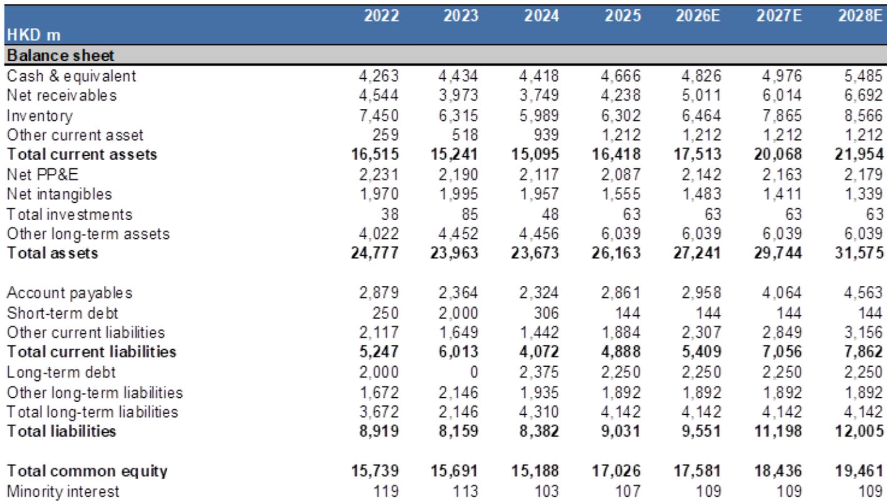
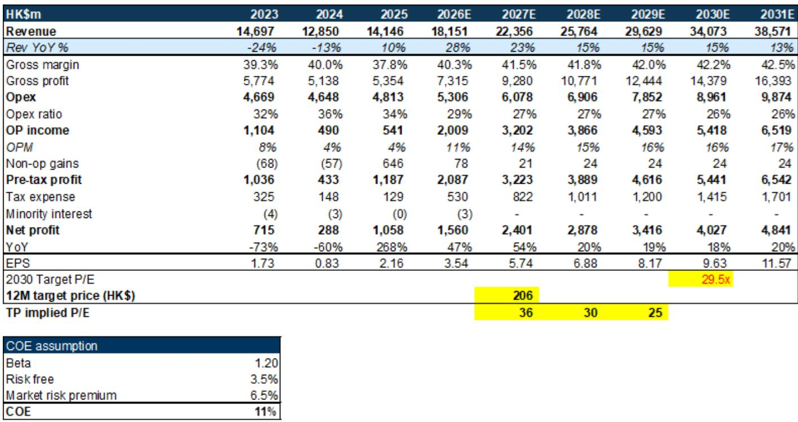
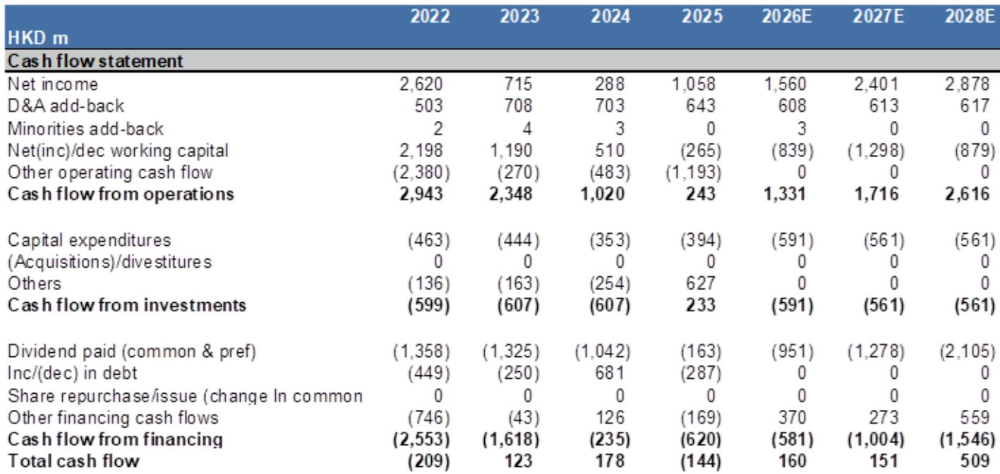

# GS：ASMPT的TCB设备受益于AI基建与先进封装趋势，中性

AI基础设施的研究浪潮，正在从GPU和服务器，向更上游的封装设备环节传导。GS在最新的一份研报中，核心逻辑并非简单的行业景气度回暖，而是其TCB（热压键合）设备在先进封装领域的结构性需求正在被AI算力扩张所验证。报告认为，ASMPT未来三年的净利润复合年增长率可达36%，这个增速的驱动力，主要来自全球云服务商资本开支的上修和先进封装产能的持续扩张。

## 1. 资本开支上修是ASMPT最直接的“需求信号”

GS在6月底更新了全球服务器TAM（潜在市场规模）模型，并据此大幅上调了对云服务商资本开支的预测。具体来看，2026至2028年，美国云服务商（微软、亚马逊、Meta、谷歌、甲骨文）的资本开支分别被上调了8%、27%和25%；而中国云服务商（字节跳动、腾讯、阿里、百度）的上修幅度更为显著，分别达到37%、44%和55%。这些数字背后，是AI芯片出货量的同步上修——2026至2028年分别被上调了14%、22%和14%。

> **KC评论：** 资本开支的上修并非均匀分布。GS对中国云服务商的预测上修幅度远超美国，这提示ASMPT的增长可能对国内CSP的扩张节奏更为敏感。报告没有完全展开的是，这种地域性差异是否会带来客户结构的进一步变化。

## 2. TCB设备是AI先进封装中“最稀缺”的环节

ASMPT的TCB设备，主要用于芯片到晶圆的先进封装工艺。GS指出，台积电CoWoS产能的持续扩张，以及ASMPT近期宣布从一家全球领先的IDM获得8台TCB设备的重复订单，都强化了对其未来增长的信心。从产品收入拆分看，先进封装业务在2027和2028年的收入预测分别被上调了22%和26%，是本次上调幅度最大的产品线。相比之下，传统IC封装和LED封装等业务的预测几乎没有变化。

## 3. 盈利上调的弹性，更多来自产品组合改善

GS将2026至2028年的净利润预测分别上调了0%、16%和22%。收入上调是直接原因，但更值得关注的是毛利率和运营利润率的改善。报告认为，TCB设备本身拥有更好的毛利率，随着其在收入结构中占比提升，整体毛利率将从2026年的40.3%提升至2028年的41.8%。同时，运营利润率从11.1%提升至15.0%，净利率从8.6%提升至11.2%。这种“量价齐升”的利润结构，意味着ASMPT的增长并非单纯依靠出货量，而是产品组合向高附加值方向迁移的结果。

> **KC评论：** 利润率的改善幅度，很大程度上取决于TCB设备的出货节奏能否持续超预期。报告将估值方法从2027年市盈率切换至2030年折现市盈率，本质上是在用更长的时间窗口来消化当前较高的估值倍数。

## 4. 估值已部分反映预期，但长期框架提供了新视角

GS更新公司观点，当前报价对应2027年预期市盈率约33倍。报告认为，积极因素已大部分被市场定价。但估值方法的变更——从2027年市盈率切换至2030年折现市盈率——是一个值得关注的信号。这意味著，对于ASMPT这类处于AI基础设施长周期中的公司，传统的短期估值框架可能低估了其远期增长潜力。GS将其纳入中国半导体覆盖体系，也暗示了对其长期增长属性的认可。

For informational purposes only. Portions may be generated,translated,summarized,or edited with AI assistance based on source materials and may contain omissions or errors. Please verify independently. This is not investment,legal,tax,accounting,or other professional advice.

For informational purposes only. Portions may be generated,translated,summarized,or edited with AI assistance based on source materials and may contain omissions or errors. Please verify independently. This is not investment,legal,tax,accounting,or other professional advice.

