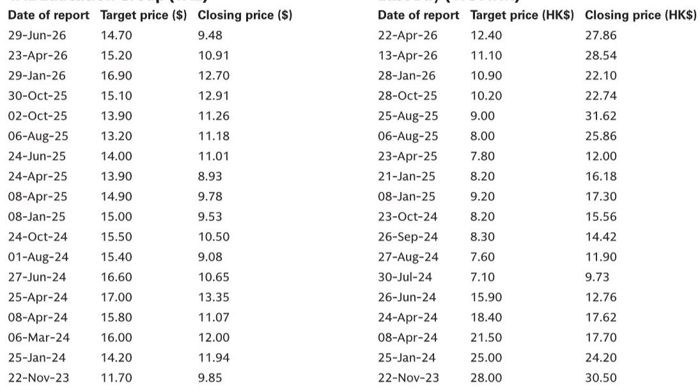
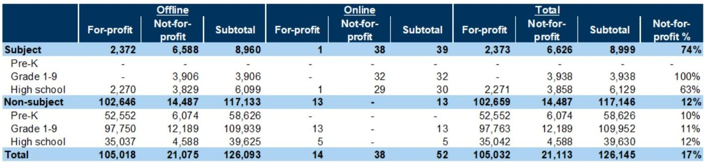
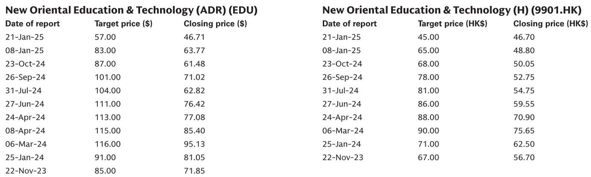

# 中国教育行业正呈现两个市场分化：高端硬件与AI驱动规模，而人口核心在收缩

今年6月中国教育行业最值得关注的信号并非单一数据点，而是一种结构性分化。K-12学生人数已达峰值，目前正以每年-2%的速度缩减，2025年小学入学人数同比下降10%。然而，在这个收缩的可触达市场中，好未来于6月30日推出了一款定价在6900元至12000元之间的高端平板产品线，当月其学习平板平均售价同比上涨26%。人口收缩与高端化之间的张力，定义了该领域每个参与者的战略格局。

这并非周期性疲软。教育部数据证实，2025年K-12学生人数连续第三年下降，预计到2030年复合年降幅为-4%。与此同时，供给端也在收紧：6月非学科类培训许可证数量同比下降1%至11.71万张，1-9年级学科类培训许可证仍为零营利性注册，完全局限于非营利性结构。监管架构稳定但具有约束性。

在此背景下，出现了两个不依赖学生人数增长的增长方向。第一个是高端硬件，平均售价的提升正在抵消销量下降。第二个是AI原生教育应用，豆包爱学日活跃用户增速加快至同比增长161%，Gauth则凭借每用户变现能力的提升保持全球领先地位。这些并非边缘机会，而是可预见未来的主要增长引擎。

战略含义很明确：继续在辅导课时量或通用内容分发上竞争的公司，将面临人口和监管两方面的阻力。而那些能够通过集成硬件AI产品获得溢价，或通过AI原生产品实现全球规模用户获取的公司，正在构建人口趋势无法侵蚀的结构性护城河。

## 人口收缩已是多年确定性，而非预测

教育部《2025年全国教育事业发展统计公报》确认，中国K-12学生人数在2022年达到峰值后，2025年同比下降2%，与2024年降幅持平。下降的构成揭示了其结构性特征：小学生人数同比下降4%，小学新生入学人数下降10%。学前教育学生人数同比下降10%，但较2024年12%的降幅略有改善。初中和高中阶段仍分别同比增长2%和4%，但这只是早期出生队列的滞后效应。2025年至2030年-4%复合年降幅的前瞻性估计意味着，整个K-12生态系统将在五年内失去约六分之一的学生基础。

这不仅仅是数量问题。它重塑了整个价值链的单位经济模型。对于辅导平台，课程开发、教师培训和技术基础设施等固定成本必须分摊到更少的在读学生身上。对于硬件制造商，换机周期和新用户获取变得更加竞争激烈，因为总装机量正在缩小。对于内容提供商，随着潜在用户池的收缩，用户获取的边际成本上升。

许可证数据强化了供给侧的约束。6月非学科类培训机构数量环比下降0.2%，同比下降1%至11.71万家。1-9年级非学科类培训许可证也环比下降0.2%。学科类培训许可证环比下降0.2%至8999张，下降集中在非营利性1-9年级机构，环比下降0.3%。监管框架并未进一步收紧，但也没有放松。人口收缩与许可证稳定的综合效应意味着，辅导服务的总可触达市场在学生人数和机构容量两方面都在缩小。

战略应对不能是等待反弹。人口数据是回溯至2025年的，但驱动2025-2030年估计的出生率数据已经已知。收缩是确定的。公司必须要么找到提高每学生收入的方法，扩展到相邻年龄段或地区，要么转向不依赖学生人数的产品模式。

## 高端硬件是相对少见平均售价增长抵消销量下降的细分市场

6月AI学习平板的数据显示，市场正在高端和大众细分之间分化。六大学习设备品牌在抖音、淘宝、天猫和京东上的合计GMV同比下降15%，但较5月35%的同比降幅有所改善，这得益于618促销活动推动GMV环比增长137%。在这一总量中，分化十分明显。猿辅导GMV同比增长33%，而好未来GMV同比下降22%，小度下降56%，步步高下降62%。

关键洞察并非GMV下降，而是平均售价的走势。好未来销售约17.3万台，GMV约7.04亿元，出货量同比下降38%，但平均售价同比上涨26%至约4100元。这与5月平均售价同比下降5%的情况形成鲜明对比。平均售价上涨是由6月30日推出的T6系列驱动的，该系列三款机型定价分别为6900元、8700元和12000元。T6系列集成了专有的AI诊断系统与AI双师互动课堂，与科大讯飞T90系列（起售价7800元）和步步高S10系列（起售价4900元）一同定位市场高端。

战略逻辑很直接。当学生总数下降，且监管限制限制了扩展辅导课时或科目的能力时，收入增长的相对少见杠杆就是单位价格。好未来正在做出一个深思熟虑的押注：家长愿意为集成了硬件AI解决方案、承诺诊断准确性和个性化指导的产品支付显著溢价，而不是购买低价平板并依赖单独的辅导服务。

这一押注得到了用户参与数据的支持。为好未来学习平板提供动力的学而思智能应用，6月月活跃用户达到390万，同比增长73%，尽管整体教育设备应用月活跃用户增速从5月的42%放缓至32%。应用参与度表明，硬件并非一次性购买，而是重复接触点，这支撑了溢价定价模式。

风险在于，高端硬件创造了一个更小的总可触达市场。定价在6900元至12000元之间的平板，只有一部分城市高收入家庭能够负担。但在一个收缩的市场中，一个更小但更有利可图的细分市场，可能优于一个更大但无利可图的市场。对于竞争对手而言，问题在于他们能否匹配支撑溢价的集成AI诊断能力，或者是否会被迫进入量价压缩最为严峻的大众细分市场。

## AI原生教育应用正在颠覆用户获取模式，尤其在中国以外

教育领域最具活力的增长并非来自辅导或硬件，而是AI原生应用。截至6月底，豆包爱学的日活跃用户增速加快至同比增长161%，使其成为中国第六大AI原生应用（按日活跃用户计）。这并非渐进式增长，而是一个规模化事件。豆包爱学在主要K-12学习工具和学伴应用中的使用时长份额有所扩大，表明它不仅在获取用户，还在留住用户并提高参与度。

全球维度同样重要。AI驱动的作业帮手Gauth在月活跃用户方面保持全球AI教育应用领先地位。其6月月度账单收入约74.1万美元，同比增长8%，过去12个月账单收入达1320万美元。更重要的是，Gauth每平均日活跃用户的月度账单收入同比增长39%至0.6美元，表明该平台在无需大规模用户增长的情况下，正更有效地变现其用户基础。

这是一种与传统辅导截然不同的商业模式。Gauth不依赖任何单一国家的K-12学生人数。它服务于全球用户，其成本结构主要由AI推理和开发主导，而非教师薪资或物理基础设施。每日活跃用户收入增长39%表明，产品正在提升其价值主张，可能是通过更好的答案准确性、更快的响应时间，或用户愿意付费的附加功能。

与国内辅导平台的对比具有启发性。好未来培优6月月活跃用户同比增长13%，优于竞争对手如新东方在线（下降6%）和学而思网校（下降7%）。但增速已从4月和5月的19%放缓，反映了6月的季节性疲软。纯在线辅导平台既受季节性影响，也面临人口阻力，而AI原生应用则具有不同的增长轨迹。

对于观察者和策略师而言，含义在于，最具可扩展性的教育企业可能不再是服务中国学生的中国辅导公司。它们可能是服务全球受众的AI教育应用，而中国公司是开发者。豆包爱学和Gauth的成功表明，中国在教育领域的AI能力是世界级的，竞争优势在于算法质量，而非市场准入。

## 应对人口与生产力权衡的决策框架

6月数据为教育领域战略构建了一个简单但有力的决策框架。每个参与者都面临两条路径的选择，由其对中国K-12学生群体的依赖程度决定。

路径一是高端化与集成战略。这条路径假设国内市场将继续收缩，但每学生收入增长可以快于学生人数下降。关键指标是平均售价走势、硬件附加率以及装机量内的应用参与度。好未来6月平均售价上涨26%，加上其配套应用月活跃用户增长73%，表明对于能够提供真正卓越集成产品的公司而言，这条路径是可行的。风险在于，溢价定价限制了市场规模，且具有类似AI能力的竞争对手会侵蚀差异化。

路径二是全球AI原生战略。这条路径假设国内市场是一个开发沙盒，但主要增长机会在全球。关键指标是日活跃用户增长率、每日活跃用户收入以及地理多元化。豆包爱学161%的日活跃用户增长和Gauth 39%的每日活跃用户收入增长表明，这条路径提供了更高的可扩展性和对任何单一人口趋势的更低依赖。风险在于，全球竞争对手，尤其是来自美国的，可能在英语内容和分发方面具有优势。

对于无法走任何一条路径的公司而言，前景充满挑战。纯国内辅导平台面临学生人数下降、许可证数量稳定或下降，以及来自AI原生替代品的竞争加剧。6月非营利性学科辅导平台月活跃用户同比下降24%，即使总使用时长同比增长1%，这表明剩余用户参与度更高但数量更少。这是一种整合动态，而非增长动态。

该框架也适用于海外留学等相邻领域。2026年至今，加拿Daiwa澳大利亚联合签发给中国学生的学生签证数量同比下降7%，较第一季度9%的降幅和2025年16%的降幅有所收窄。这是周期性改善，但结构性趋势很明确：中国出国留学并未恢复到2020年前水平。依赖海外留学咨询或考试准备的公司面临更小的可触达市场，这强化了向AI产品或高端国内服务多元化的需求。

6月数据并未解决哪条路径将产生更优回报的不确定性。但它确实确立了一点：在增长市场中争夺学生份额的旧模式已不复存在。现在，每一项战略决策都必须对照到2030年K-12学生-4%复合年降幅的人口基线进行评估。承认这一现实并采取行动的公司，将比那些将其视为暂时阻力的公司拥有结构性优势。

---

*仅供参考。部分内容可能基于源材料通过AI辅助生成、翻译、总结或编辑，可能存在遗漏或错误。请独立核实。本文不构成专业建议。*

仅供参考。部分内容可能基于源材料通过AI辅助生成、翻译、总结或编辑，可能存在遗漏或错误。请独立核实。本文不构成专业建议。

