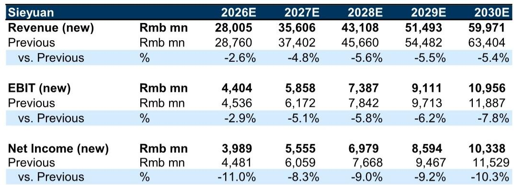
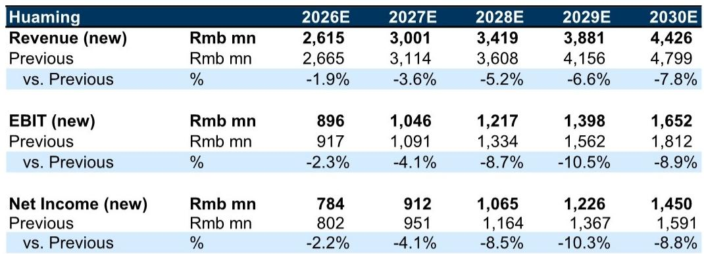
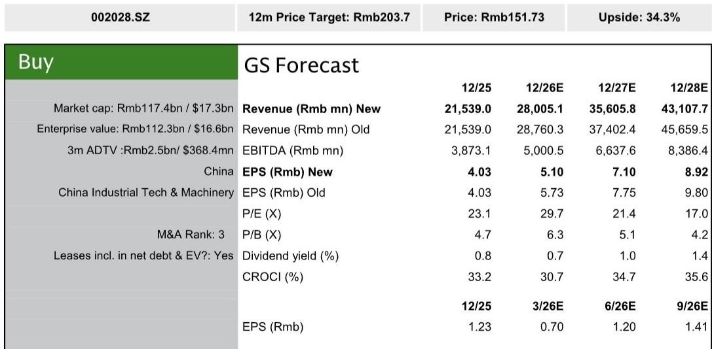

# 研究笔记：中国电网技术企业观察——思源电气二季度收入确认节奏与汇率影响

思源电气在7月10日盘后发布了2026年上半年业绩预告，结果低于此前预期。这家中国电网设备公司二季度营收同比增长18%，但比预期低了约8%。报告认为，问题出在收入确认节奏和外汇损失上，而非需求端出现了变化。

二季度营收6235百万元，同比增长18%，但低于公司自身新订单35%的增速。研究指出，部分海外合同因贸易条款变更，控制权转移节点从发货后推迟到现场安装或客户验收后，导致原计划在二季度确认的收入被推迟到三季度及以后。公司对美国的变压器出货量从之前的每月2-3台增加到7月的约10台，这批收入预计将在三季度确认。

外汇损失是另一个影响因素。公司上半年录得超过1亿元的外汇损失，而去年同期为外汇收益，这一同比反转对报告利润产生了显著影响。东芝增资合资公司至30%导致的少数股东权益增加，影响相对有限。

研究将2026-2030年每股盈利预测下调8-11%，其中约3-6%来自收入确认延迟，1-2%来自收入延迟后的经营杠杆下降，约3%来自2026年的外汇损失。基于25倍2028年市盈率以9.5%的权益成本折现回2026年，更新公司观点。

> **观察评论：** 这份报告的核心判断是，思源电气二季度业绩低于预期是时间差和汇率问题，不是订单流失或需求转弱。读者需要区分“收入确认节奏”和“需求基本面”——前者是会计时点问题，后者才是决定公司长期价值的关键。报告引用的美国海关数据（7月出货量从2-3台增至10台）和公司新订单增速（35%）是验证需求是否健康的两个锚点。

## 1. 毛利率已环比回升，下半年高毛利业务占比将提升

公司披露上半年毛利率约30%，其中约80%的收入来自毛利率约35%的业务，被毛利率约15%的EPC和储能业务抵消。二季度储能业务贡献环比下降，公司已调整储能策略从追求增长转向强调盈利。

研究预计，随着北美变压器出货增加以及特高压/超高压项目从三季度开始确认收入，毛利率将进一步环比改善。特高压和超高压GIS属于高毛利业务，思源电气在这些领域的中标量正在增加。

## 2. 北美变压器供应持续到2030年，思源电气供应链优势明显

报告认为，全球电力变压器供应持续至少到2030年，全球电网升级至少持续到2040-2050年。思源电气在北美市场的定位独特——其敏捷供应链和产能扩张计划可支撑每年90-100亿元的变压器产值。

研究预计思源电气在美国的收入将占2026-2028年海外收入的26-30%，且利润贡献更高，有助于提升整体利润率。公司已向Edge Wave、Wayli、Hitachi Energy和Max Tech等客户出货电力变压器。

## 3. 华明装备：市场地位稳固，估值已反映预期但缺乏催化剂

与思源电气不同，研究对华明装备更新公司观点。这家国内有载分接开关市场占有率约90%的公司，二季度营收预计同比增长仅4%，利润同比下降3%。

报告认为，华明装备面临三个结构性因素：国内电网市场份额已高，难以超越行业增速；非电网需求仍在调整；虽然有载分接开关的出口认证正在推进，但这一过程漫长，且该组件在全球并不短缺，出口增长将滞后于变压器出口。

华明装备报价从高点已回调54%，目前交易在21倍12个月远期市盈率，对应2026-2030年每股盈利复合年增长率17%。研究认为估值已相对合理，但缺乏收入加速和估值重估的催化剂，建议读者等待更有吸引力的估值水平。

> **观察评论：** 思源电气和华明装备的对比揭示了一个关键区别：产品是否处于全球供应状态。电力变压器供应是公认的行业事实，思源电气因此获得了北美数据中心客户的突破；而有载分接开关并不短缺，华明装备的海外扩张只能靠认证和信任积累缓慢推进。这个框架可以用于评估其他电网设备公司的海外增长潜力。

For informational purposes only. Portions may be generated,translated,summarized,or edited with AI assistance based on source materials and may contain omissions or errors. Please verify independently. This is not investment,legal,tax,accounting,or other professional advice.

For informational purposes only. Portions may be generated,translated,summarized,or edited with AI assistance based on source materials and may contain omissions or errors. Please verify independently. This is not investment,legal,tax,accounting,or other professional advice.

