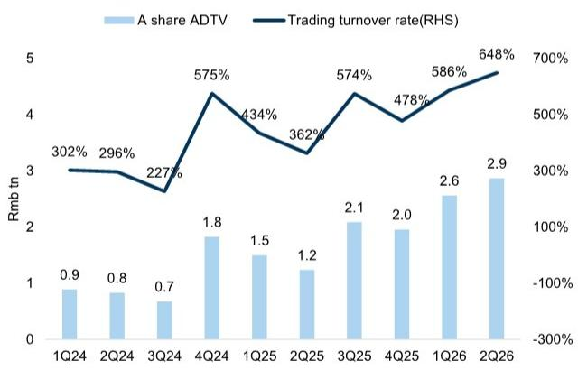
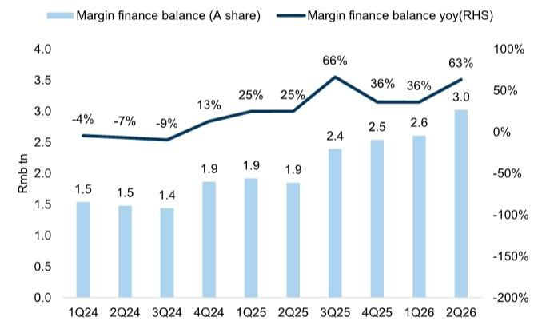
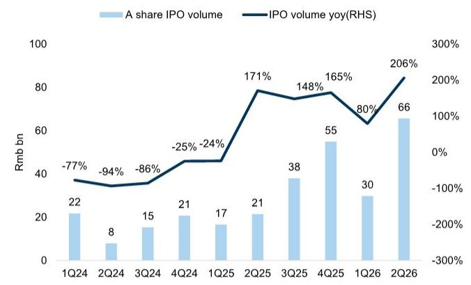
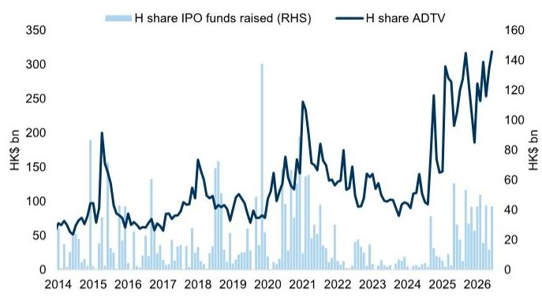
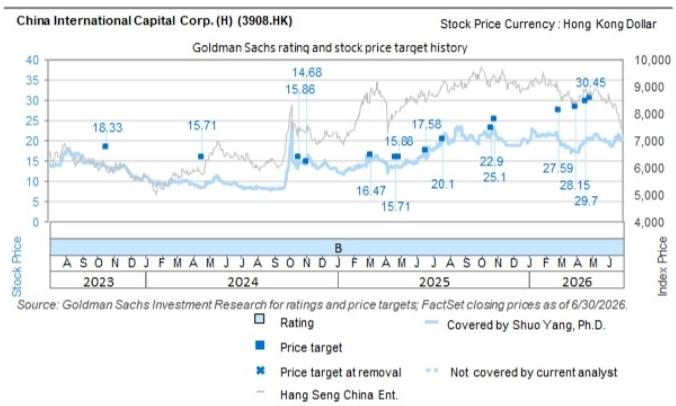
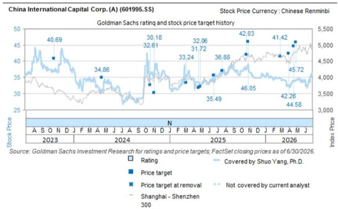
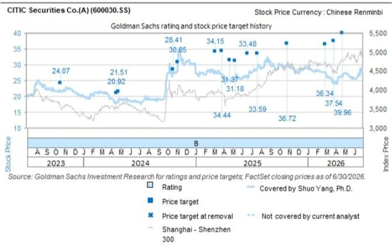
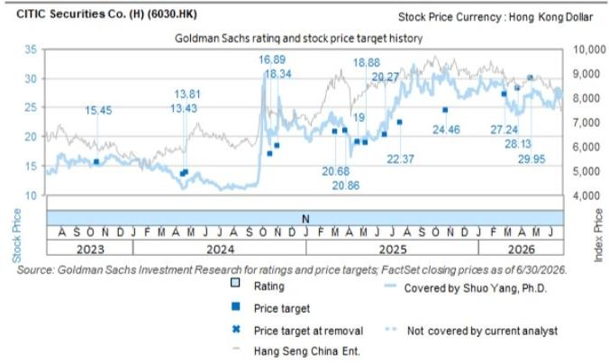

# 中国券商与资产管理公司：第二季度业绩符合预期，第三季度有望延续良好态势

近期，多家中国券商发布了2026年上半年业绩预告，显示第二季度表现持续强劲。在已披露业绩指引的九家券商中，平均净利润同比增长约155%，其中CICC和CITIC分别同比增长78%-90%和70%。

Shuo Yang, Ph.D. +852-2978-0701 | shuo.yang@gs.com GS (Asia) L.L.C.

Claire Ouyang  
+852-2978-6686 |  
claire.x.ouyang@gs.com  
GS (Asia) L.L.C.

业绩的强劲表现主要得益于一级和二级市场的持续活跃。2026年第二季度，A股市场日均成交额达到创纪录的2.9万亿元人民币，同时融资融券余额超过3万亿元人民币，反映出市场参与度持续提升，为经纪佣金和利息收入提供了支撑。与此同时，A股IPO发行规模达到660亿元人民币，为2024年以来的最高水平，而香港IPO市场因项目储备充足而保持活跃。

展望2026年第三季度，需要关注的关键领域包括交易活动和IPO发行的可持续性、向香港业务配置资本的进展，以及即将到来的科技公司上市可能带来的业绩贡献。CICC管理层表示，市场活动仍具韧性，同时多家券商正通过资本注入和战略交易继续拓展其国际平台。

我们持续关注CICCH股和CITICA股，因其在香港市场中的领先地位、不断增长的国际业务，以及通过资产负债表扩张和海外业务增长实现中期回报改善的潜力。CICC继续受益于其在香港投行和股票业务中的规模优势，而CITIC则通过额外的资本部署推进其国际扩张战略，为杠杆优化和业务增长提供了更大的灵活性。

近期，多家券商发布了积极的2026年上半年业绩预告，整体表现强劲。已披露业绩的九家券商报告的平均净利润同比增长约155%。其中，CICC预计同比增长78%-90%，CITIC预计同比增长70%。根据业绩预告区间计算，CICC隐含的2026年第二季度净利润约为41-46亿元人民币，同比增长81%-103%，环比增长15%-30%，较预期高出61%-81%。CITIC隐含的2026年第二季度净利润为131亿元人民币，同比增长82%，环比增长28%，较预期高出56%。

我们认为，券商板块2026年第二季度的强劲表现基本符合市场预期，主要得益于一级和二级市场的持续活跃：1）A股市场交易情绪保持高位，2026年第二季度日均成交额达到历史新高的2.9万亿元人民币，市场换手率上升至648%。同时，融资融券余额超过3万亿元人民币，同比增长63%，反映出市场参与者风险偏好持续改善，推动了经纪佣金和利息收入的增长。2）资本市场融资活动显著恢复。A股IPO募资规模达到660亿元人民币，同比增长206%，创下2024年以来的新高，表明IPO市场的恢复趋势仍在延续。同时，香港IPO市场在充足项目储备的支持下保持高度活跃，为投行收入增长提供了有力支撑。

展望2026年第三季度，我们认为行业的盈利能力有望延续第二季度的积极态势；然而，仍有几个因素需要密切关注：1）市场活动的可持续性。根据CICC管理层的反馈，目前市场交易量和IPO项目推进速度均未出现放缓迹象，下半年仍有大量项目储备待释放。2）国际业务的资本投入进展。CICC表示其并购交易预计在2026年第三季度完成。完成后，CICC预计资本基础将弹性较高，为进一步转向更高资本回报率的业务创造条件，公司认为这可能开启一个长期的回报提升周期。3）科技公司上市带来的投资收益机会。随着CXMT等科技领军企业推进上市进程，券商通过早期股权投资和科创板联合投资所获得的投资收益有望进一步实现。然而，我们认为这也可能同时导致业绩波动性增加。

我们重申对CICCH股和CITICA股的关注。CICC仍是中国券商中具有最显著国际优势的公司之一。据管理层介绍，公司香港业务的收入和利润贡献处于行业领先水平。值得注意的是，其在香港投行业务中的市场份额保持在25%-30%，股票业务具有显著的竞争优势，资产管理和财富管理业务也正在快速增长。年初至今，公司已向其香港业务注入约1000亿元人民币。并购完成后，管理层预计其资本实力将进一步增强，为长期回报提升释放潜力。同时，随着主要股东的定向增发逐步实施，CITIC表示其国际业务的资本投入也将加速，为资产负债表扩张、杠杆提升和回报改善提供更大空间。

图表1：已披露业绩的九家券商报告的平均净利润同比增长约155%。

| | 2026年上半年净利润 | 同比增长 |
|---|---|---|
| **头部券商** | | |
| 国泰海通 | Guotai Haitong | 164%-171%（扣除非经常性损益后） |
| CMS | CMS | 93%-112% |
| CICC | CICC | 78%-90% |
| CITIC | CITICS | 70% |
| **其他券商** | | |
| 天风证券 | TF Sec. | 429%-694% |
| 中泰证券 | Zhongtai Sec. | 146% |
| 财达证券 | Caida Sec. | 90%-116% |
| 长江证券 | Changjiang Sec. | 80%-90% |
| 财通证券 | Caitong Sec. | 70%-80% |
| **平均** | | **155%** |

来源：公司数据，GS全球投资研究整理

图表2：其中，CICC预计同比增长78%-90%，CITIC预计同比增长70%。

| 归属于股东的净利润（亿元人民币） | 2025年第二季度 | 2026年第一季度 | 2026年第二季度预期 | 2026年第二季度隐含值 | 同比增长 | 环比增长 | 与预期对比 | 2026年上半年初步数据 | 同比增长 | 与预期对比 |
|---|---|---|---|---|---|---|---|---|---|---|
| CICC | 2.3 | 3.6 | 2.6 | 4.1~4.6 | 81%~103% | 15%~30% | 61%~81% | 7.7~8.2 | 78%~90% | 26%~34% |
| CITIC | 7.2 | 10.2 | 8.4 | 13.1 | 82% | 28% | 56% | 23.3 | 70% | 25% |

来源：公司数据，GS全球投资研究
图表3：A股市场交易情绪保持高位，2026年第二季度日均成交额达到历史新高的2.9万亿元人民币，市场换手率上升至648%。

来源：Wind
图表4：融资融券余额超过3万亿元人民币，同比增长63%，反映出市场参与者风险偏好持续改善。

来源：Wind

图表5：A股IPO募资规模达到660亿元人民币，同比增长206%，创下2024年以来的新高，表明IPO市场的恢复趋势仍在延续。

来源：Wind

图表6：香港IPO市场在充足项目储备的支持下保持高度活跃。

来源：港交所

## 目标价风险与方法论 - 中国国际金融股份有限公司

我们对CICCH股/CICCA股持关注/中性态度。我们的12个月目标价分别为30.45港元/45.72元人民币，基于2027年预期市盈率的11倍/18倍。

下行风险：1）中国资本市场表现不及预期，2）场外衍生品损失，3）资产管理规模和费率下降，4）成本收入比上升。

A股上行风险：1）经纪业务和投行收入改善，2）场外衍生品业务增长及收入增加，3）更多成本节约以支持回报提升。

## 目标价风险与方法论 - CITIC股份有限公司

我们对CITICA股/CITICH股持关注/中性态度。我们的12个月目标价分别为39.96元人民币/29.95港元，基于2027年预期市盈率的16倍/11倍。

下行风险：1）因资本市场表现不及预期导致收入增长进一步放缓，2）资产管理规模和费率下降，3）投资收益增长放缓，4）运营费用增加导致成本收入比维持高位。

H股上行风险：1）资本市场改善及日均成交额提升推动核心业务增长，2）成本节约超预期。

## 附录

## Reg AC

我们，Shuo Yang博士和Claire Ouyang，特此证明本报告中表达的所有观点均准确反映了我们个人对所涉公司及其证券的看法。我们还证明，我们的薪酬中没有任何部分直接或间接与本报告中表达的具体建议或观点相关。

除非另有说明，本报告封面所列人员为GS全球投资研究部门的分析师。

供稿作者：Shuo Yang博士 GS（亚洲）有限责任公司，Claire Ouyang GS（亚洲）有限责任公司。

除非另有说明，本报告供稿作者披露中列出的人员为GS全球投资研究部门的分析师。

## GS因子概况

GS因子概况通过将股票的关键属性与市场（即我们的评级股票池）及其行业同行进行比较，提供投资背景。所描绘的四个关键属性是：增长、财务回报、倍数（例如估值）和综合（增长、财务回报和倍数的复合）。增长、财务回报和倍数是通过对每只股票的特定指标使用标准化排名来计算的。然后将这些指标的标准化排名进行平均，并转换为相关属性的百分位数。每个指标的具体计算可能因财年、行业和地区而异，但标准方法如下：

增长基于股票的前瞻性销售增长、EBITDA增长和EPS增长（对于金融股，仅EPS和销售增长），较高的百分位数表示增长较高的公司。财务回报基于股票的前瞻性ROE、ROCE和CROCI（对于金融股，仅ROE），较高的百分位数表示财务回报较高的公司。倍数基于股票的前瞻性市盈率、市净率、价格/股息（P/D）、EV/EBITDA、EV/FCF和EV/债务调整后现金流（DACF）（对于金融股，仅市盈率、市净率和P/D），较高的百分位数表示以较高倍数交易的股票。综合百分位数计算为增长百分位数、财务回报百分位数和（100% - 倍数百分位数）的平均值。

财务回报和倍数使用GS分析师对未来至少三个季度后的财年末的预测。增长使用对未来至少七个季度后的财年与未来至少三个季度后的财年相比的输入（所有指标均基于每股）。

有关我们如何计算GS因子概况的更详细说明，请联系您的GS代表。

## 并购排名

在我们的全球覆盖范围内，我们使用并购框架审视股票，考虑定性因素和定量因素（可能因行业和地区而异），以纳入某些公司可能被收购的可能性。然后，我们将并购排名作为对我们评级覆盖范围内的公司从1到3进行评分的一种方式，其中1表示公司成为收购目标的可能性较高（30%-50%），2表示中等可能性（15%-30%），3表示较低可能性（0%-15%）。对于排名为1或2的公司，根据我们的标准部门指南，我们将并购组成部分纳入我们的目标价。并购排名为3被视为不重要，因此不计入我们的目标价，并且可能在研究中讨论或不讨论。

## Quantum

Quantum是GS的专有数据库，提供详细的财务报表历史、预测和比率。它可用于对单一公司进行深入分析，或在不同行业和市场的公司之间进行比较。

## 披露

CITIC（H股）、CITIC（A股）、中国国际金融股份有限公司（A股）和中国国际金融股份有限公司（H股）的评级相对于其覆盖范围内的其他公司：CITIC（H股）、CITIC（A股）、中国国际金融股份有限公司（A股）、中国国际金融股份有限公司（H股）、东方财富信息股份有限公司、富途控股、广发证券（A股）、广发证券（H股）、恒生电子、向上融科

## 公司特定监管披露

以下披露涉及GS集团及其关联公司与GS全球投资研究所涵盖的公司之间的关系。

截至本报告前一个月末，GS实益持有普通股1%或以上（不包括根据美国证券法无需汇总的关联公司和业务部门管理的头寸）：中国国际金融股份有限公司（A股）（35.37元人民币）和中国国际金融股份有限公司（H股）（21.12港元）

GS在过去12个月内因投资银行服务获得报酬：中国国际金融股份有限公司（A股）（35.37元人民币）和中国国际金融股份有限公司（H股）（21.12港元）

GS预计在未来3个月内将获得或打算寻求投资银行服务报酬：中国国际金融股份有限公司（A股）（35.37元人民币）、中国国际金融股份有限公司（H股）（21.12港元）、CITIC（H股）（26.72港元）和CITIC（A股）（28.12元人民币）

GS在过去12个月内因非投资银行服务获得报酬：中国国际金融股份有限公司（A股）（35.37元人民币）、中国国际金融股份有限公司（H股）（21.12港元）、CITIC（H股）（26.72港元）和CITIC（A股）（28.12元人民币）

GS在过去12个月内与以下公司存在投资银行服务客户关系：中国国际金融股份有限公司（A股）（35.37元人民币）、中国国际金融股份有限公司（H股）（21.12港元）、CITIC（H股）（26.72港元）和CITIC（A股）（28.12元人民币）

GS在过去12个月内与以下公司存在非投资银行证券相关服务客户关系：中国国际金融股份有限公司（A股）（35.37元人民币）、中国国际金融股份有限公司（H股）（21.12港元）、CITIC（H股）（26.72港元）和CITIC（A股）（28.12元人民币）

GS在过去12个月内与以下公司存在非证券服务客户关系：中国国际金融股份有限公司（A股）（35.37元人民币）、中国国际金融股份有限公司（H股）（21.12港元）、CITIC（H股）（26.72港元）和CITIC（A股）（28.12元人民币）

GS做市于以下证券或其衍生品：中国国际金融股份有限公司（A股）（35.37元人民币）、中国国际金融股份有限公司（H股）（21.12港元）、CITIC（H股）（26.72港元）和CITIC（A股）（28.12元人民币）

| | 评级分布 | | | 投资银行关系 | | |
|---|---|---|---|---|---|---|
| | 买入 | 持有 | 卖出 | 买入 | 持有 | 卖出 |
| 全球 | 50% | 34% | 16% | 65% | 59% | 43% |

## 评级/投资银行关系分布 GS投资研究全球股票覆盖范围

截至2026年7月1日，GS全球投资研究对3,104只股票进行了投资评级。GS将股票指定为买入和卖出，列入各个地区的投资清单；未如此指定的股票被视为中性。就FINRA规则要求的上述披露而言，此类指定等同于买入、持有和卖出。请参阅下面的“评级、覆盖范围和相关定义”。投资银行关系图表反映了每个评级类别中GS在过去十二个月内提供过投资银行服务的公司所占的百分比。

## 目标价和评级历史图表

所示目标价应结合所有先前发布的GS报告（可能包含或不包含目标价）以及公司、行业和金融市场的发展情况来考虑。

所示目标价应结合所有先前发布的GS报告（可能包含或不包含目标价）以及公司、行业和金融市场的发展情况来考虑。

所示目标价应结合所有先前发布的GS报告（可能包含或不包含目标价）以及公司、行业和金融市场的发展情况来考虑。

所示目标价应结合所有先前发布的GS报告（可能包含或不包含目标价）以及公司、行业和金融市场的发展情况来考虑。

## 目标价历史表格

## CITIC（H股）（6030.HK）

## 中国国际金融股份有限公司（A股）（601995.SS）

| 报告日期 | 目标价（港元） | 收盘价（港元） | 报告日期 | 目标价（人民币） | 收盘价（人民币） |
|---|---|---|---|---|---|
| 2026年4月24日 | 29.95 | 26.62 | 2026年4月30日 | 45.72 | 34.23 |
| 2026年3月27日 | 28.13 | 24.14 | 2026年4月21日 | 44.58 | 33.93 |
| 2026年2月27日 | 27.24 | 28.06 | 2026年4月1日 | 42.26 | 32.68 |
| 2025年10月26日 | 24.46 | 31.66 | 2026年2月27日 | 41.42 | 34.65 |
| 2025年7月21日 | 22.37 | 27.25 | 2025年10月29日 | 46.05 | 39.03 |
| 2025年6月19日 | 20.27 | 20.75 | 2025年10月22日 | 42.03 | 37.42 |
| 2025年5月9日 | 18.88 | 19.44 | 2025年7月21日 | 36.88 | 36.61 |
| 2025年4月22日 | 19.00 | 19.00 | 2025年6月19日 | 35.49 | 33.79 |
| 2025年3月27日 | 20.86 | 21.30 | 2025年4月28日 | 32.06 | 32.86 |
| 2025年3月6日 | 20.68 | 23.40 | 2025年4月22日 | 31.72 | 33.53 |
| 2024年11月4日 | 18.34 | 22.40 | 2025年3月6日 | 33.24 | 35.81 |
| | CITIC（H股）（6030.HK） | | | 中国国际金融股份有限公司（A股）（601995.SS） | |
| 报告日期 | 目标价（港元） | 收盘价（港元） | 报告日期 | 目标价（人民币） | 收盘价（人民币） |
| 2024年10月21日 | 16.89 | 20.80 | 2024年11月4日 | 30.18 | 35.77 |
| 2024年4月26日 | 13.81 | 12.32 | 2024年10月21日 | 32.61 | 35.86 |
| 2024年4月18日 | 13.43 | 11.18 | 2024年4月18日 | 34.86 | 31.34 |
| 2023年10月20日 | 15.45 | 15.08 | 2023年10月20日 | 40.69 | 37.23 |

| 报告日期 | 目标价（港元） | 收盘价（港元） | 报告日期 | 目标价（人民币） | 收盘价（人民币） |
|---|---|---|---|---|---|
| 2026年4月30日 | 30.45 | 20.22 | 2026年4月24日 | 39.96 | 26.23 |
| 2026年4月21日 | 29.70 | 19.94 | 2026年3月27日 | 37.54 | 24.26 |
| 2026年4月1日 | 28.15 | 17.20 | 2026年2月27日 | 36.34 | 27.37 |
| 2026年2月27日 | 27.59 | 20.26 | 2025年10月26日 | 36.72 | 29.87 |
| 2025年10月29日 | 25.10 | 22.74 | 2025年7月21日 | 33.59 | 28.90 |
| 2025年10月22日 | 22.90 | 21.34 | 2025年6月19日 | 33.48 | 25.91 |
| 2025年7月21日 | 20.10 | 20.55 | 2025年5月9日 | 31.18 | 25.55 |
| 2025年6月19日 | 17.58 | 15.64 | 2025年4月22日 | 31.37 | 25.08 |
| 2025年4月28日 | 15.88 | 13.28 | 2025年3月27日 | 34.44 | 26.90 |
| 2025年4月22日 | 15.71 | 13.80 | 2025年3月6日 | 34.15 | 28.00 |
| 2025年3月6日 | 16.47 | 15.86 | 2024年11月4日 | 30.85 | 29.06 |
| 2024年11月4日 | 14.68 | 14.72 | 2024年10月21日 | 28.41 | 27.46 |
| 2024年10月21日 | 15.86 | 14.22 | 2024年4月26日 | 21.51 | 19.16 |
| 2024年4月18日 | 15.71 | 8.60 | 2024年4月18日 | 20.92 | 18.21 |
| 2023年10月20日 | 18.33 | 13.36 | 2023年10月20日 | 24.07 | 21.53 |

表格中所示目标价未针对公司行为进行调整。

## 监管披露

## 美国法律法规要求的披露

请参阅上述公司特定监管披露，了解本报告所涉公司需要披露的任何以下信息：待定交易中的经理或联合经理；1%或以上的所有权；特定服务的报酬；客户关系类型；先前期间的公开募股管理/联合管理；董事职位；对于股票，做市和/或专家角色。GS可能作为本金交易本报告中讨论的发行人的债务证券（或相关衍生品）。

以下是额外要求的披露：所有权和重大利益冲突：GS政策禁止其分析师、向分析师报告的专业人员及其家庭成员持有分析师覆盖范围内任何公司的证券。分析师薪酬：分析师的薪酬部分基于GS的盈利能力，其中包括投资银行收入。分析师作为高管或董事：GS政策通常禁止其分析师、向分析师报告的人员或其家庭成员在分析师覆盖范围内的任何公司担任高管、董事或顾问。非美国分析师：非美国分析师可能不是GS & Co. LLC的关联人员，因此可能不受FINRA规则2241或FINRA规则2242关于与所涉公司沟通、公开露面以及交易分析师所覆盖证券的限制。

## 美国以外司法管辖区法律和法规要求的额外披露

以下披露是各司法管辖区要求的，除非已根据美国法律法规在上文作出。澳大利亚：GS Australia Pty Ltd及其关联公司不是澳大利亚的授权存款机构（如1959年银行法（联邦）所定义），在澳大利亚不提供银行服务，也不从事银行业务。除非GS另有约定，本研究及其访问权限仅适用于澳大利亚公司法意义上的“批发客户”。在编写研究报告时，GS Australia全球投资研究部门的成员可能会参加作为其研究报告对象的公司和其他实体主办或组织的实地考察和其他会议。在某些情况下，如果GS Australia认为在实地考察或会议的具体情况下是适当和合理的，此类实地考察或会议的部分或全部费用可能由相关发行人承担。如果本文件内容包含任何金融产品建议，则仅为一般性建议，由GS在未考虑客户的目标、财务状况或需求的情况下编制。客户在根据任何此类建议采取行动之前，应考虑该建议是否适合其自身的目标、财务状况和需求。GS Australia和New Zealand的利益披露声明以及GS的澳大利亚卖方研究独立性政策声明副本可在以下网址获取：https://www.goldmansachs.com/disclosures/australia-new-zealand/index.html。巴西：与CVM第20号决议相关的披露信息可在https://www.gs.com/worldwide/brazil/area/gir/index.html获取。在适用的情况下，根据CVM第20号决议第20条的定义，对本研究报告内容负主要责任的巴西注册分析师为本报告开头指定的第一作者，除非文末另有说明。加拿大：此信息仅供您参考，在任何情况下均不应被解释为GS & Co. LLC为在加拿大购买任何加拿大证券而进行的广告、要约或招揽。GS & Co. LLC未在加拿大任何司法管辖区根据适用的加拿大证券法注册为交易商，通常不允许交易加拿大证券，并且可能被禁止在加拿大某些司法管辖区销售某些证券和产品。如果您希望在加拿大交易任何加拿大证券或其他产品，请联系GS Canada Inc.（GS集团公司的关联公司）或其他注册的加拿大交易商。香港：可根据要求从GS（亚洲）有限责任公司获取本研究中涉及的被覆盖公司证券的进一步信息。印度：可从GS（印度）证券私人有限公司获取本研究中涉及的公司或公司的进一步信息，研究分析师 - SEBI注册号INH000001493，地址：10th Floor, Ascent-Worli, Sudam Kalu Ahire Marg, Worli, Mumbai-400 025, India，企业身份号U74140MH2006FTC160634，电话+91 22 6616 9000，传真+91 22 6616 9001。GS可能实益持有本研究报告所涉公司1%或以上的证券（如1956年印度证券合约（监管）法第2（h）条所定义）。SEBI的注册和NISM的认证绝不保证中介机构的业绩或向读者提供任何回报保证。GS（印度）证券私人有限公司的合规官和读者投诉联系方式、年度合规审计报告副本以及其他相关信息和披露可在以下链接找到：https://www.goldmansachs.com/worldwide/india/research-analyst。日本：见下文。韩国：除非GS另有约定，本研究及其访问权限仅适用于金融服务和资本市场法意义上的“专业读者”。可从GS（亚洲）有限责任公司首尔分行获取本研究中涉及的公司或公司的进一步信息。新西兰：GS New Zealand Limited及其关联公司不是新西兰的“注册银行”或“存款接受者”（如1989年新西兰储备银行法所定义）。除非GS另有约定，本研究及其访问权限适用于“批发客户”（如2008年金融顾问法所定义）。GS Australia和New Zealand的利益披露声明副本可在以下网址获取：https://www.goldmansachs.com/disclosures/australia-new-zealand/index.html。俄罗斯：在俄罗斯联邦分发的研究报告不是俄罗斯立法所定义的广告，而是信息和分析，其主要目的不是推广产品，并且不提供俄罗斯立法关于评估活动意义上的评估。研究报告不构成俄罗斯法律法规所定义的个性化研究交流，不针对特定客户，并且在未分析客户财务状况、投资概况或风险状况的情况下编制。GS不对客户或任何其他人基于本研究可能做出的任何投资决定承担责任。新加坡：GS（新加坡）私人有限公司（公司编号：198602165W），受新加坡金融管理局监管，接受对本研究的法律责任，如有任何与本研究的任何事项，应联系该公司。台湾：此材料仅供参考，未经许可不得转载。读者应仔细考虑自身的投资风险。投资结果由个人读者自行负责。英国：在英国可能被归类为零售客户的人士（如金融行为监管局规则所定义）应结合先前关于本研究所涉公司的GS报告阅读本研究，并应参考GS International已发送给他们的风险警告。这些风险警告的副本以及本报告中使用的某些金融术语的词汇表，可根据要求从GS International获取。

欧盟和英国：与欧洲委员会授权条例（EU）（2016/958）第6（2）条相关的披露信息（该条例补充了欧洲议会和理事会条例（EU）No 596/2014，包括该授权条例在英国脱离欧盟和欧洲经济区后转化为英国国内法律和法规的情况），关于研究交流或其他建议或暗示投资策略的信息的客观呈现的技术安排的技术监管标准，以及特定利益或利益冲突迹象的披露，可在https://www.gs.com/disclosures/europeanpolicy.html获取，其中说明了与投资研究相关的利益冲突管理的欧洲政策。

日本：GS Japan Co., Ltd.是在关东财务局注册的金融工具交易商，注册号为金商第69号，是日本证券业协会、日本金融期货协会、第二类金融工具交易商协会和日本投资管理协会的成员。股票买卖需支付与客户预先确定的佣金加上消费税。有关日本证券交易所、日本证券业协会或日本证券金融公司要求的任何适用披露，请参阅公司特定披露。

## 评级、覆盖范围和相关定义

买入（B）、中性（N）、卖出（S）分析师建议将股票作为买入或卖出纳入各个地区的投资清单。被指定为投资清单上的买入或卖出取决于股票相对于其覆盖范围的总回报潜力。任何未被指定为投资清单上的买入或卖出且具有有效评级（即，不是评级暂停、未评级、早期生物技术、覆盖暂停或未覆盖的股票）的股票被视为中性。每个地区管理区域信念清单，这些清单选自各自地区投资清单上的报告评级股票，代表侧重于总回报潜力大小和/或在其各自覆盖区域内实现回报的可能性的研究交流。此类股票在信念清单中的添加或移除由每个地区的投资审查委员会或其他指定委员会管理，并不代表分析师对此类股票的投资评级发生变化。

总回报潜力代表当前股价与目标价之间的上行或下行差异，包括所有已支付或预期股息，在目标价相关的时间范围内预期实现。所有被覆盖的股票都需要目标价。总回报潜力、目标价和相关时间范围在每份添加或重申投资清单成员资格的报告中有说明。

覆盖范围：每个覆盖范围内的所有股票列表可通过主要分析师、股票和覆盖范围在https://www.gs.com/research/hedge.html获取。

未评级（NR）。当GS在此公司的合并或战略交易中担任顾问角色时，当由于GS参与交易而存在法律、监管或政策限制时，以及在某些其他情况下，根据GS政策，投资评级、目标价和盈利预测（如相关）将被移除。早期生物技术（ES）。当此公司既没有已通过II期临床试验的药物、治疗或医疗设备，也没有分销后II期药物、治疗或医疗设备的许可时，根据GS政策，不分配投资评级和目标价。评级暂停（RS）。GS已暂停此股票的投资评级和目标价，因为没有足够的基本面基础来确定投资评级或目标价。先前的投资评级和目标价（如有）对此股票不再有效，不应依赖。覆盖暂停（CS）。GS已暂停对此公司的覆盖。未覆盖（NC）。GS不覆盖此公司。

## 全球产品；分发实体

GS全球投资研究为GS的客户在全球范围内制作和分发研究产品。位于GS全球各办事处的分析师对行业和公司以及宏观经济、货币、大宗商品和投资组合策略进行研究。本研究在澳大利亚由GS Australia Pty Ltd（ABN 21 006 797 897）分发；在巴西由GS do Brasil Corretora de Títulos e Valores Mobiliários S.A.分发；GS巴西公共沟通渠道：0800 727 5764和/或contatogoldmanbrasil@gs.com。工作日（节假日除外），上午9点至下午6点。GS巴西公众沟通渠道：0800 727 5764和/或contatogoldmanbrasil@gs.com。营业时间：周一至周五（节假日除外），上午9点至下午6点；在加拿大由GS & Co. LLC分发；在香港由GS（亚洲）有限责任公司分发；在印度由GS（印度）证券私人有限公司分发；在日本由GS Japan Co., Ltd.分发；在韩国由GS（亚洲）有限责任公司首尔分行分发；在新西兰由GS New Zealand Limited分发；在俄罗斯由OOO GS分发；在新加坡由GS（新加坡）私人有限公司（公司编号：198602165W）分发；在美国由GS & Co. LLC分发。GS International已批准本研究在英国的分发。

GS International（“GSI”），由审慎监管局（“PRA”）授权并由金融行为监管局（“FCA”）和PRA监管，已批准本研究在英国的分发。

欧洲经济区：GS Bank Europe SE（“GSBE”）是一家在德国注册的信贷机构，在单一监管机制内，受欧洲中央银行直接审慎监管，并在其他方面受德国联邦金融监管局（Bundesanstalt für Finanzdienstleistungsaufsicht, BaFin）和德意志联邦银行监管，并在欧洲经济区内分发研究。

## 一般披露

本研究仅适用于我们的客户。除与GS相关的披露外，本研究基于我们认为可靠的当前公开信息，但我们不声明其准确或完整，并且不应依赖于此。本文所含信息、意见、估计和预测截至本文日期，如有更改，恕不另行通知。我们力求适时更新我们的研究，但各种法规可能阻止我们这样做。除某些定期发布的行业报告外，大部分报告根据分析师的判断不定期发布。

GS开展全球全方位服务、综合投资银行、投资管理和经纪业务。我们与全球投资研究所覆盖的相当大比例的公司存在投资银行和其他业务关系。GS & Co. LLC，美国经纪交易商，是SIPC的成员（https://www.sipc.org）。

我们的销售人员、交易员和其他专业人士可能会向我们的客户和自营交易部门提供口头或书面的市场评论或交易策略，这些评论或策略反映了与本研究中表达的意见相反的意见。我们的资产管理业务、自营交易部门和投资业务可能做出与本研究中表达的建议或观点不一致的投资决策。

本报告中指定的分析师可能不时与我们的客户（包括GS销售人员和交易员）讨论，或可能在本报告中讨论，交易策略，这些策略涉及可能对本报告所讨论的股票的市场价格产生近期影响的催化剂或事件，这种影响可能在方向上与分析师对此类股票公布的预期目标价相反。任何此类交易策略都与分析师对此类股票的基本面评级不同，并且不影响该评级，该评级反映了股票相对于其覆盖范围的总回报潜力，如本文所述。

我们及我们的关联公司、高级职员、董事和员工将不时持有本研究中提及的证券或衍生品（如有）的多头或空头头寸，作为本金进行交易，并买卖这些证券或衍生品，除非法规或GS政策另有禁止。

在GS组织的会议上归因于第三方演讲者（包括来自GS其他部门的个人）的观点不一定反映全球投资研究的观点，也不是GS的官方观点。

本文引用的任何第三方，包括任何销售人员、交易员和其他专业人士或其家庭成员，可能持有本报告中提到的产品头寸，这些头寸与本报告指定分析师表达的观点不一致。

本研究不构成在任何司法管辖区出售或招揽购买任何证券的要约，如果此类要约或招揽在该司法管辖区是非法的。它不构成个人建议，也不考虑个别客户的具体投资目标、财务状况或需求。客户应考虑本研究中的任何建议或推荐是否适合其特定情况，并在适当的情况下寻求专业建议，包括税务建议。本研究中提及的投资的价值和价格以及从中获得的收入可能会波动。过往表现并非未来表现的指引，未来回报不保证，且可能损失原始资本。汇率波动可能对某些投资的价值或价格或从中获得的收入产生不利影响。

某些交易，包括涉及期货、期权和其他衍生品的交易，会带来重大风险，并不适合所有读者。读者应查阅当前的期权和期货披露文件，这些文件可从GS销售代表或https://www.theocc.com/about/publications/character-risks.jsp和https://www.goldmansachs.com/disclosures/cftc_fcm_disclosures获取。在涉及多次买卖期权的期权策略（如价差）中，交易成本可能很大。将根据要求提供支持文件。

全球投资研究提供的不同服务级别：GS全球投资研究向您提供的服务级别和类型可能与向GS内部和其他外部客户提供的服务级别和类型不同，具体取决于多种因素，包括您对沟通频率和方式的个人偏好、您的风险状况和投资重点及视角（例如，市场范围、行业特定、长期、短期）、您与GS整体客户关系的规模和范围，以及法律和监管限制。例如，某些客户可能要求在某些证券的研究发布时收到通知，某些客户可能要求将分析师基本面分析中可用的特定数据通过数据馈送或其他方式以电子方式交付给他们。分析师基本面研究观点的任何变化（例如，对股票的评级、目标价或盈利预测的重大变化）都不会在任何客户之前传达，而是会在通过电子方式广泛发布到我们的内部客户网站或通过其他必要方式向所有有权接收此类报告的客户发布后，才进行沟通。

所有研究报告均通过电子方式同时发布到我们的内部客户网站，并同时向所有客户提供。并非所有研究内容都会重新分发给我们的客户或提供给第三方聚合商，GS
