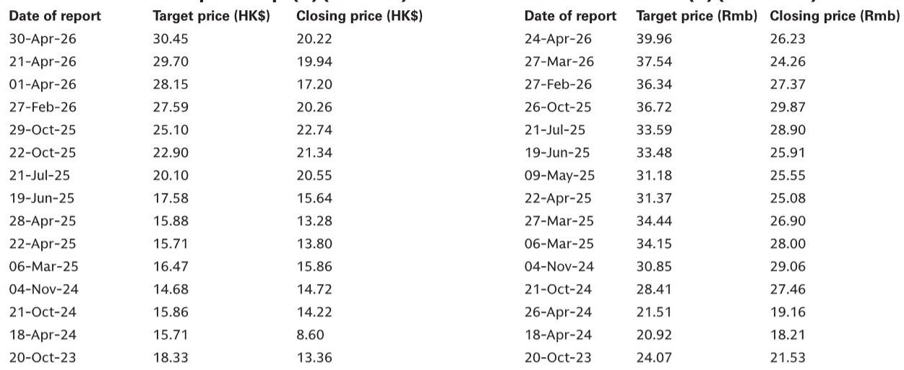
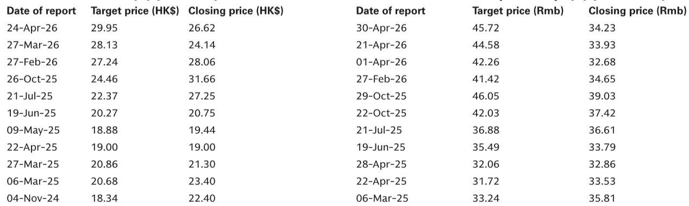
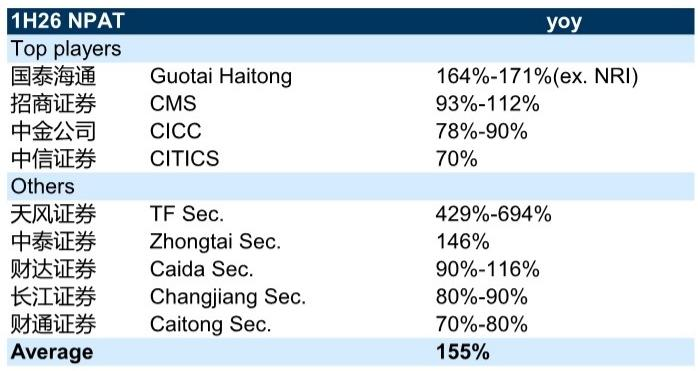

# GS：中国机构资管二季度盈利强劲，三季度ROE修复有望支撑动能

九家已披露业绩预告的中国机构，2026年上半年平均净利润同比增长约155%。其中，CICC预计增长78%-90%，中信标的预计增长70%。这份GS研报的核心判断是：二季度业绩强劲已在预期之内，市场真正需要关注的，是三季度能否将交易量和IPO的热度，转化为机构资产负债表扩张带来的ROE持续修复。

二季度相关市场日均成交额达到创纪录的2.9万亿元，两融余额突破3万亿元，同比增幅63%。相关市场IPO融资额660亿元，同比增长206%，创2024年以来新高。香港IPO市场同样活跃。这些数字共同指向一个事实：机构收入的两大引擎——经纪佣金和国际机构收入——在二季度均处于历史高位。

但报告并未停留在“业绩好”这个结论上。它把视线拉到了更关键的结构性变量上。

## 1. 交易量能否持续，取决于IPO项目储备而非情绪

市场最关心的问题往往是“成交额能维持多久”。GS给出的观察锚点，不是散户入市节奏，而是IPO项目储备。CICC管理层反馈显示，目前市场交易量和IPO项目推进速度均未见节奏变化迹象，下半年仍有大量项目待释放。

这意味着，二季度的业绩高峰并非一次性脉冲。IPO融资额的恢复，直接关联国际机构收入，而国际机构收入是机构利润结构中弹性最大、也最稳定的部分。报告特别指出，相关市场IPO融资额已回到2024年以来的最高水平，这一趋势若能延续，将为三季度业绩提供硬支撑。

> **KC评论：** 市场常常把机构股当作“交易量放大器”来定价，但这份报告提醒，IPO节奏才是更可追踪的前瞻指标。读者与其猜测日均成交额，不如关注交易所审核进度和项目储备清单。

## 2. 国际业务扩张，正在改写机构的ROE天花板

二季度业绩的数字固然亮眼，但报告真正想传递的信息是：中国机构正在经历一轮“资产负债表国际化”的质变。

CICC年内已向其香港业务注入约1000亿元资本，管理层预计并购交易将在三季度完成，完成后资本基础将弹性较高。中信标的也在通过大股东定向增发加速国际业务资本投入。这些动作的直接后果是：机构有了更大的资产负债表去承接更高回报率的业务，从而启动一个长期的ROE提升周期。

报告认为，CICC在香港国际机构市场的份额维持在25%-30%，其公司业务已形成显著竞争优势，资管和财富管理业务也在快速增长。这些国际业务的利润率，通常高于国内通道业务。

> **KC评论：** 过去几年，市场对中国机构的定价逻辑是“看天吃饭”——市场好，业绩就好。但国际业务扩张意味着，部分头部机构正在从“交易通道”转向“资本中介”。这个转变一旦完成，估值体系可能需要重新校准。

## 3. 科技公司上市，可能带来额外收益但也会增加波动

报告还提到了一个容易被忽视的变量：科技公司上市带来的回报表现。随着长鑫存储等科技龙头推进上市进程，机构通过早期股权研究和科创板跟投锁定的收益，有望在三季度进一步兑现。

但GS也谨慎地指出，这部分收益同时会增加盈利波动性。这意味着，三季度机构业绩可能比二季度更具“非线性”特征——既有交易量和IPO的持续贡献，又有回报表现的一次性释放，两者叠加可能带来超预期表现，但也让预测难度加大。

## 4. 两个可追踪的观察框架

综合报告逻辑，有三条线索值得持续跟踪

第一，IPO项目储备。这是判断国际机构收入可持续性的最直接指标。第二，国际业务资本注入进度。CICC的并购交易和中信的大股东定增，是观察两家公司资产负债表扩张节奏的关键节点。第三，科技公司上市节奏。这既是回报表现的来源，也是市场不确定性偏好的温度计。

报告维持对CICCH股和中信标的相关市场的偏好，核心逻辑并非短期业绩，而是它们在国际化布局和ROE修复潜力上的领先位置。

For informational purposes only. Portions may be generated,translated,summarized,or edited with AI assistance based on source materials and may contain omissions or errors. Please verify independently. This is not investment,legal,tax,accounting,or other professional advice.

For informational purposes only. Portions may be generated,translated,summarized,or edited with AI assistance based on source materials and may contain omissions or errors. Please verify independently. This is not investment,legal,tax,accounting,or other professional advice.

