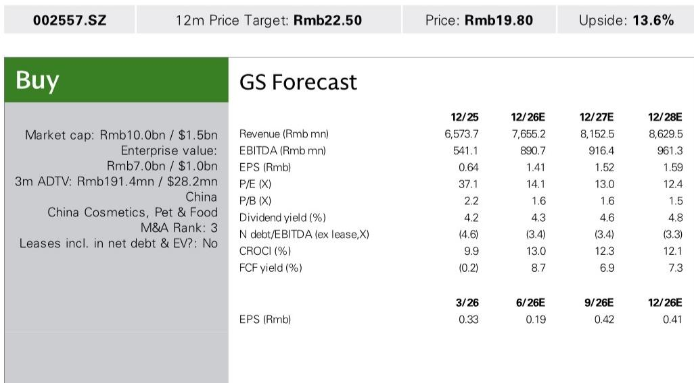
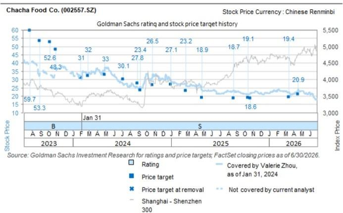

# 洽洽食品二季度业绩超预期，结构性利润率拐点显现

洽洽食品于7月13日公布了2026年上半年初步业绩，其中隐含的第二季度净利润中位数为8400万元人民币，超出市场一致预期的7600万元人民币约12%。第二季度隐含净利润率为6.4%，较预期的5.7%高出70个基点，这是连续第二个季度实现超预期表现。这并非单纯的季度性波动。利润超预期的背后是两大结构性变化：休闲食品品类竞争强度显著缓和，以及葵花籽成本动态持续改善，正在重塑公司的利润结构。

背景因素值得关注。过去两年的大部分时间里，洽洽在高度竞争的环境中运营，价格战和渠道碎片化压缩了整个行业的利润空间。公司上半年业绩——净利润中位数为2.53亿元人民币，而预期为2.44亿元人民币——表明这些不利因素消退的速度快于预期。收入估计已同比恢复29%，达到约35亿元人民币，这意味着在利润率扩张的同时，销量增长也在加速。这种组合——收入增长加速与利润率扩张——是公司走出竞争低谷的标志，而非仅仅受益于单季度的有利采购时机。

洽洽的研究叙事正从成本复苏转向盈利增长。当前公司估值约为2026年预期收益的14.1倍。对于观察者而言，关键问题是这一估值重估是否还有进一步空间，或者第二季度的超预期表现是否已被定价。报告中的证据表明，只要利润率改善背后的结构性力量被证明是持久的，前者更有可能。

## 竞争格局从价格战转向理性，释放利润率复苏空间

洽洽第二季度利润超预期的首要驱动因素是渠道策略的显著调整和竞争强度的降低。在整个2025年，休闲食品行业以激进的折扣为特征，尤其是在葵花籽品类中，小型参与者和自有品牌为争夺货架空间而激烈竞争。作为市场领导者，洽洽被迫跟进这些降价，从而压缩了毛利率，限制了其规模优势的发挥。

报告明确将第二季度好于预期的结果归因于“竞争缓和以及渠道策略的调整”。这并非模糊的定性观察。其机制是清晰的：随着竞争对手在价格竞争中的财务回报逐渐耗尽，行业已转向更理性的行为。缺乏规模优势以承受利润率压缩的小型参与者已减少促销活动。与此同时，洽洽重新调整了自身的渠道组合，在某些细分领域优先考虑盈利能力而非销量。

对于观察者而言，其含义是直接的。如果竞争强度保持温和，洽洽全年净利润率可维持在7-8%的区间，而第二季度隐含水平为6.4%。上半年净利润率中位数为7.1%，已高于2025年全年约6%的水平。这一轨迹表明盈利复苏仍处于早期阶段。风险在于下半年竞争可能重新激化，但报告的语气表明，向渠道理性化的结构性转变比暂时的休战更为广泛。

## 有利的葵花籽采购成本是结构性的，而非季节性，受供需动态改善驱动

利润超预期的第二个支柱是葵花籽（洽洽的核心原材料）的成本前景。报告提到“在有利的葵花籽成本前景和改善的供需动态下，利润率稳健”。这是一个关键的区别。许多观察者将农产品成本视为周期性和不可预测的。然而，报告将改善归因于供需基本面的转变，而非一次性的天气事件或短期供应过剩。

在过去两个种植周期中，葵花籽产量稳步增长，主要产区的单产提高。与此同时，随着竞争热潮降温，更广泛的休闲食品行业的需求增长有所放缓。这造成了供应过剩，这种状况可能至少持续到2026年收获季。对于以远期合约方式采购种子的洽洽而言，这意味着2026年下半年及2027年初的投入成本已锁定在有利水平。

利润率影响是显著的。葵花籽约占洽洽销售成本的40-50%。在其他条件不变的情况下，种子成本下降5%可转化为毛利率提高200-250个基点。报告隐含的第二季度净利润率为6.4%，表明这一利好因素已在显现。基于市场一致预期的收入76.6亿元人民币和约10.8亿元人民币的净利润，2026年全年净利润率预计将达到约7.5%。这将是2025年约3.7%净利润率的两倍。

这一判断的风险在于供应中断导致种子成本突然飙升，但报告的供需分析并未提示此类风险。改善的动态是广泛的，涉及种植面积增加和单产提高，短期内出现急剧逆转的可能性不大。

## 盈利轨迹暗示重估机会，当前估值低于历史盈利倍数

洽洽当前14.1倍的2026年预期收益估值，低于其三年平均约18倍的前瞻市盈率。这一折价反映了市场对利润率复苏能否持续的怀疑。然而，第二季度的超预期表现直接挑战了这种怀疑。如果公司实现全年净利润一致预期约10.8亿元人民币，按当前价格计算，该股将对应2026年收益的13倍——如果利润率正在结构性改善，这一水平将难以合理化。

这仍低于历史平均水平，但高于当前倍数。这表明分析师预期，随着市场将利润率改善纳入定价，至少会出现部分重估。这一重估的关键催化剂是即将发布的业绩公告，预计管理层将在三个关键领域提供更新：利润率轨迹和采购成本、价值零售商和会员重点客户的渠道发展，以及股东回报政策。

股东回报角度尤为重要。洽洽一直持续派发股息，2025年回报表现约为4.2%，预计2026年将升至4.3%。如果公司宣布提高派息率或派发特别股息，将表明管理层对盈利复苏可持续性的信心。这可能会加速重估。

## 观察者的决策框架：利润率复苏有三个支柱，各有不同风险特征

对于评估洽洽的观察者而言，利润率复苏的判断可分解为三个不同的驱动因素，每个都有其自身的风险特征和时间跨度。这一框架有助于更精确地评估当前估值是否提供了适当的风险回报平衡。

第一个驱动因素是竞争理性化。这是最脆弱的支柱。它依赖于竞争对手在定价和促销方面保持自律。风险在于新进入者或主要零售商的自有品牌推动重新点燃价格竞争。报告并未暗示这即将发生，但中国休闲食品行业的历史是周期性价格战的历史。观察者应监测季度促销数据和渠道检查，以寻找竞争重新激化的迹象。

第二个驱动因素是原材料成本利好。这是最持久的支柱。葵花籽供需动态的改善基于多年的生产趋势，不太可能迅速逆转。即使种子价格稳定而非进一步下跌，洽洽也将受益于已到位的有利采购合同。这里的风险较低，但并非为零——主要产区的严重天气事件可能扰乱供应。

第三个驱动因素是渠道组合优化。洽洽正在将其销售组合转向利润率更高的渠道，包括在线直销和会员制零售账户，同时减少对低利润率的传统批发和折扣渠道的依赖。这是一个管理层直接控制的自我改善故事。风险在于执行——如果向新渠道的过渡慢于预期，即使利润率前景向好，收入增长也可能令人失望。

综合来看，这三个驱动因素表明2026年净利润一致预期的中位数是可以实现的，如果竞争理性化持续，则存在上行风险；反之则存在下行风险。该股当前14.1倍收益的估值并未完全反映这种不对称性。基于14至18倍的历史倍数区间，公允价值范围约为人民币19.80元至人民币25.40元，这意味着在保守情景下，当前价格处于公允价值区间的低端。

## 即将发布的业绩公告将是研究判断的转折点

报告确定了即将发布的业绩公告中四个具体的关注领域：核心品类和新产品的举措、市场竞争动态的更新、利润率轨迹和采购成本趋势，以及渠道发展更新。从研究角度来看，其中最重要的是利润率轨迹。如果管理层提供的指引暗示全年净利润率高于7%，市场将被迫对该股进行重估。

第二个最重要的领域是渠道发展。洽洽在拓展价值零售商和会员重点客户方面的成功，将决定收入复苏是否可持续。报告指出，传统渠道仍然重要，但增长方向显然在新兴渠道。如果管理层报告在这些渠道中取得了强劲进展，将验证上半年收入估计所隐含的销量增长。

第三个领域是股东回报。股息增加或股份回购公告将作为管理层对盈利复苏信心的有力信号。鉴于公司强劲的自由现金流生成能力——预计2026年自由现金流占市值的8.7%——有充足的空间来增强回报。

风险在于业绩公告可能揭示出对竞争或成本的更为谨慎的前景，这可能会逆转近期的积极势头。然而，第二季度的超预期表现为建设性的叙事提供了坚实基础。举证责任已从公司转移到怀疑者身上。洽洽在竞争和成本动态改善的背景下，已连续两个季度实现利润率改善。第三季度将是检验这一趋势是否可持续的试金石，但迄今为止的证据指向一个方向。

*仅供参考。部分内容可能基于源材料通过AI辅助生成、翻译、总结或编辑，可能存在遗漏或错误。请独立核实。这不构成研究、法律、税务、会计或其他专业建议。*

仅供参考。部分内容可能基于源材料通过AI辅助生成、翻译、总结或编辑，可能存在遗漏或错误。请独立核实。这不构成研究、法律、税务、会计或其他专业建议。

