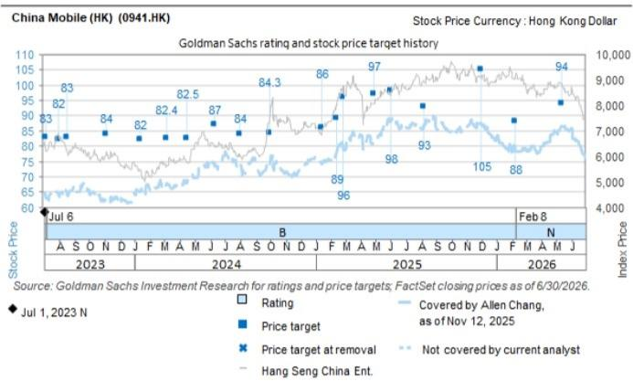

# 中国移动（香港）(0941.HK)：AI数据中心参访：AI赋能AIDC提升效率；算力需求增长驱动未来表现

我们近期参访了中国移动位于香港的全球智算中心。管理层介绍了其广泛的AI数据中心服务，涵盖算力、网络、电力、冷却、运维等多个方面，旨在支持客户在训练与推理、基础模型到AI应用等各环节的AI工作负载。AI应用的持续增长带动了本地及海外市场对算力的强劲需求，而中国移动在数据中心运营领域的领先地位使其能够受益于这一发展周期。公司AIDC业务收入在2025年同比增长35%（对比数据中心整体收入增长9%），我们预计这一强劲增长势头将持续，推动AI相关收入在未来几年中的贡献。

## 主要观察

1.  AIDC持续扩展：位于香港的全球智算中心于2026年3月启用（链接），是中国移动在香港的第二大数据中心。该中心为自建自营，提供AI算力及相关服务（如电力供应、冷却等），以支持客户的基础模型和AI应用。该中心体现了中国移动对生成式AI发展的长期规划，其数据中心设计也充分考虑了长期可持续性（例如，对算力、电力、冷却、运营效率等方面日益增长的需求）。

2.  AI赋能AIDC：全球智算中心运用AI技术来支持运营与维护，例如智能调度、使用机器人和无人机进行自主巡检，以及数字孪生技术，从而提升整体运营效率。管理层对AIDC业务保持积极看法，这得益于AI应用的兴起以及公司在数据中心运营方面的领先地位；其在中国内地以外的AIDC业务也有望受益于中国企业的全球业务拓展。

## 目标价风险与方法论 - 中国移动（香港）

估值：我们基于2027年预期EV/EBITDA的4.2倍，设定12个月目标价为94港元。主要上行/下行风险包括：1）行业竞争加剧/缓和影响移动ARPU；2）云产品拓展慢于/快于预期；3）税收压力加剧/缓和。

Allen Chang
+852-2978-2930 |
allen.k.chang@gs.com
GS (Asia) L.L.C.

Verena Jeng
+852-2978-1681 | verena.jeng@gs.com
GS (Asia) L.L.C.

Ting Song
+852-2978-6466 | ting.song@gs.com
GS (Asia) L.L.C.

Yifan Hu
+852-2978-0996 | yifan.hu@gs.com
GS (Asia) L.L.C.

<table><tr><td>0941.HK</td><td>12个月目标价：94.00港元</td><td>现价：79.25港元</td><td>潜在空间：18.6%</td></tr></table>

<table><tr><td rowspan="2">中性</td><td colspan="5">GS预测</td></tr><tr><td></td><td>12/24</td><td>12/25E</td><td>12/26E</td><td>12/27E</td></tr><tr><td>市值：1.6万亿港元 / 2070亿美元</td><td>收入（百万元人民币）</td><td>1,040,759.0</td><td>1,050,187.0</td><td>1,086,369.6</td><td>1,123,516.6</td></tr><tr><td rowspan="2">企业价值：1.5万亿港元 / 1856亿美元</td><td>EBITDA（百万元人民币）</td><td>331,792.0</td><td>337,011.6</td><td>382,579.7</td><td>378,327.5</td></tr><tr><td>每股收益（人民币）</td><td>6.45</td><td>6.35</td><td>7.27</td><td>7.30</td></tr><tr><td>3个月日均交易量：17亿港元 / 2.118亿美元</td><td>市盈率（倍）</td><td>10.2</td><td>10.8</td><td>9.4</td><td>9.4</td></tr><tr><td rowspan="3">中国大中华区科技并购排名：3</td><td>市净率（倍）</td><td>1.0</td><td>1.0</td><td>1.0</td><td>1.0</td></tr><tr><td>股息率（%）</td><td>7.1</td><td>6.7</td><td>7.5</td><td>7.5</td></tr><tr><td>净债务/EBITDA（不含租赁，倍）</td><td>(0.6)</td><td>(0.5)</td><td>(0.6)</td><td>(0.7)</td></tr><tr><td rowspan="4">租赁包含在净债务及企业价值中：是</td><td>CROCI（%）</td><td>8.3</td><td>8.2</td><td>9.7</td><td>9.1</td></tr><tr><td>自由现金流回报表现（%）</td><td>11.3</td><td>5.1</td><td>12.6</td><td>11.0</td></tr><tr><td></td><td>6/25</td><td>12/25E</td><td>6/26E</td><td>12/26E</td></tr><tr><td>每股收益（人民币）</td><td>-</td><td>-</td><td>-</td><td>-</td></tr></table>

来源：公司数据，GS预测，FactSet。价格截至2026年7月13日收盘。

## 披露附录

## Reg AC

我们，Allen Chang, Verena Jeng, Ting Song 和 Yifan Hu，特此证明本报告中表达的所有观点准确反映了我们对相关公司及其证券的个人观点。我们还证明，我们的薪酬中没有任何部分直接或间接地与报告中表达的具体建议或观点相关。

除非另有说明，本报告封面所列的个人均为GS全球投资研究部门的分析师。

撰稿作者：Allen Chang GS (Asia) L.L.C., Verena Jeng GS (Asia) L.L.C., Ting Song GS (Asia) L.L.C., Yifan Hu GS (Asia) L.L.C.。

除非另有说明，本报告撰稿作者披露中列出的个人均为GS全球投资研究部门的分析师。

## GS因子概况

GS因子概况通过将关键属性与市场（即我们的评级股票池）及其行业同行进行比较，为股票提供研究背景。所描绘的四个关键属性是：增长、财务回报、倍数（例如估值）和综合（增长、财务回报和倍数的复合）。增长、财务回报和倍数是通过计算每只股票特定指标的标准化排名得出的。然后将这些指标的标准化排名进行平均，并转换为相关属性的百分位数。每个指标的具体计算可能因财年、行业和地区而异，但标准方法如下：

增长基于股票的前瞻性销售增长、EBITDA增长和每股收益增长（对于金融股，仅基于每股收益和销售增长），较高的百分位数表示增长较高的公司。财务回报基于股票的前瞻性ROE、ROCE和CROCI（对于金融股，仅基于ROE），较高的百分位数表示财务回报较高的公司。倍数基于股票的前瞻性市盈率、市净率、价格/股息（P/D）、EV/EBITDA、EV/FCF和EV/债务调整后现金流（DACF）（对于金融股，仅基于市盈率、市净率和P/D），较高的百分位数表示交易倍数较高的股票。综合百分位数计算为增长百分位数、财务回报百分位数和（100% - 倍数百分位数）的平均值。

财务回报和倍数使用GS分析师对未来至少三个季度后的财年结束时的预测。增长使用对未来至少七个季度后的财年与未来至少三个季度后的财年相比的输入数据（所有指标均基于每股）。

有关我们如何计算GS因子概况的更详细说明，请联系您的GS代表。

## 并购排名

在我们的全球覆盖范围内，我们使用并购框架审视股票，同时考虑定性因素和定量因素（可能因行业和地区而异），以纳入某些公司可能被收购的可能性。然后，我们分配一个从1到3的并购排名，作为对我们评级覆盖范围内的公司进行评分的方法，其中1表示公司成为收购目标的可能性高（30%-50%），2表示可能性中等（15%-30%），3表示可能性低（0%-15%）。对于排名为1或2的公司，根据我们的标准部门指南，我们将并购组成部分纳入我们的目标价。并购排名为3被认为不重要，因此不计入我们的价格目标，并且可能在研究中讨论或不讨论。

## Quantum

Quantum是GS的专有数据库，提供详细的财务报表历史、预测和比率。它可用于对单个公司进行深入分析，或比较不同行业和市场的公司。

## 披露

## 披露

根据经修订的第13959号行政命令，美国对某些中国公司实施了制裁限制，通常禁止美国人投资于此类公司发行的证券。本研究并非也不应被解释为诱导违反美国制裁法律进行任何证券交易。

中国移动（香港）的评级是相对于其覆盖范围内的其他公司而言的：AAC, ACM Research, AMEC, ASMPT, AVC, AccoTest, Anji Micro, Asus, Auras, BOE, BYDE, Biren, CR Micro, Cambricon, Chenbro, China Mobile (HK), China Telecom, China Tower Corp., China Unicom, Chinasoft Intl, Compal, Desay SV, E Ink, E-Town Semis, EHang, Empyrean, Eoptolink, FOCI, Fositek, Foxconn Industrial Internet, Gigabyte, Gigadevice, Glodon Co., HTC Corp., Hikvision, Hon Hai, Horizon Robotics, Hua Hong, Huace Navigation, Huaqin Co.(A), Huaqin Co.(H), Hwatsing, InnoScience, Innolight, Inspur, Insta360, Inventec, JCET, Kematek, King Slide, Kingdee, Kingsoft Office, LandMark, Largan, Lenovo, Lingyi, Maxscend, Meitu, MetaX, Mitac, Montage (A), Montage (H), NAURA, NSIG, Nexchip, OmniVision, Pegatron, Pony AI Inc. (ADR), Pony AI Inc. (H), Quanta, RoboTechnik, Ruijie Networks, SG Micro, SICC, SMIC (A), SMIC (H), SZS, Sangfor, SenseTime, Shengyi Tech, Shennan Circuits, StarPower, Sunny Optical, TFC Optical, Thundersoft, Tongyu Communication, Transsion, UMT, UNIS, VPEC, Vanchip, VeriSilicon, Victory Giant, WNC, WUS, WeRide, Wistron, Wiwynn, YJ Semitech, YOFC, Yonyou, ZTE (A), ZTE (H), iFlytek

## 公司特定监管披露

以下披露涉及GS集团（及其附属公司，“GS”）与GS全球投资研究所涵盖的公司之间的关系，并在此研究中提及。

GS预计在未来3个月内将或寻求获得投资银行服务报酬：中国移动（香港）（79.25港元）和中国移动（香港）（ADR）（27.51美元）

GS在过去12个月内与以下公司存在投资银行服务客户关系：中国移动（香港）（79.25港元）和中国移动（香港）（ADR）（27.51美元）

GS做市于以下证券或其衍生品：中国移动（香港）（79.25港元）和中国移动（香港）（ADR）（27.51美元）

## 评级/投资银行关系分布

GS投资研究全球股票覆盖范围

<table><tr><td rowspan="2"></td><td colspan="3">评级分布</td><td colspan="3">投资银行关系</td></tr><tr><td>买入</td><td>持有</td><td>卖出</td><td>买入</td><td>持有</td><td>卖出</td></tr><tr><td>全球</td><td>50%</td><td>34%</td><td>16%</td><td>65%</td><td>59%</td><td>43%</td></tr></table>

截至2026年7月1日，GS全球投资研究对3,104只股票进行了评级。GS将股票分配为买入和卖出，列入各种区域投资名单；未如此分配的股票被视为中性。此类分配等同于FINRA规则要求的上述披露目的中的买入、持有和卖出。请参阅下面的“评级、覆盖范围和相关定义”。投资银行关系图表反映了在每个评级类别中，GS在过去十二个月内提供过投资银行服务的公司所占的百分比。

## 目标价和评级历史图表

  
所示目标价应结合所有先前发布的GS报告（可能包含或不包含目标价）以及公司、其行业和金融市场的发展情况来考虑。

## 目标价历史表格 中国移动（香港）(0941.HK)

<table><tr><td>报告日期</td><td>目标价（港元）</td><td>收盘价（港元）</td></tr><tr><td>2026年5月13日</td><td>94.00</td><td>86.55</td></tr><tr><td>2026年2月8日</td><td>88.00</td><td>80.20</td></tr><tr><td>2025年12月1日</td><td>105.00</td><td>87.75</td></tr><tr><td>2025年8月8日</td><td>93.00</td><td>86.90</td></tr><tr><td>2025年6月3日</td><td>98.00</td><td>89.10</td></tr><tr><td>2025年4月30日</td><td>97.00</td><td>81.05</td></tr><tr><td>2025年2月25日</td><td>96.00</td><td>80.15</td></tr><tr><td>2025年2月12日</td><td>89.00</td><td>77.90</td></tr><tr><td>2025年1月14日</td><td>86.00</td><td>74.30</td></tr><tr><td>2024年10月1日</td><td>84.30</td><td>73.45</td></tr><tr><td>2024年8月1日</td><td>84.00</td><td>73.65</td></tr><tr><td>2024年6月11日</td><td>87.00</td><td>73.90</td></tr><tr><td>2024年4月18日</td><td>82.50</td><td>68.75</td></tr><tr><td>2024年3月6日</td><td>82.40</td><td>68.05</td></tr><tr><td>2024年1月12日</td><td>82.00</td><td>65.10</td></tr><tr><td>2023年11月6日</td><td>84.00</td><td>62.35</td></tr><tr><td>2023年8月18日</td><td>83.00</td><td>64.20</td></tr><tr><td>2023年8月1日</td><td>82.00</td><td>64.70</td></tr></table>

表格中所示目标价未针对公司行动进行调整。

## 监管披露

## 美国法律法规要求的披露

请参阅上述公司特定监管披露，了解本报告中提及的公司所需的任何以下披露：待定交易中的主承销商或联合主承销商；1%或以上的所有权；特定服务的报酬；客户关系类型；前期管理/联合管理的公开发行；董事职位；对于股票，做市和/或专家角色。GS作为自营交易或可能作为自营交易本报告中讨论的发行人的债务证券（或相关衍生品）。

以下是额外要求的披露：所有权和重大利益冲突：GS政策禁止其分析师、向分析师报告的专业人员及其家庭成员持有分析师覆盖范围内的任何公司的证券。分析师薪酬：分析师的薪酬部分基于GS的盈利能力，其中包括投资银行收入。分析师作为高级职员或董事：GS政策通常禁止其分析师、向分析师报告的人员或其家庭成员担任分析师覆盖范围内的任何公司的高级职员、董事或顾问。非美国分析师：非美国分析师可能不是GS & Co. LLC的关联人士，因此可能不受FINRA规则2241或FINRA规则2242关于与主题公司沟通、公开露面以及交易分析师所覆盖证券的限制。

## 美国以外司法管辖区法律和法规要求的额外披露
以下披露是所指示司法管辖区要求的，除非已根据美国法律法规在上文作出。澳大利亚：GS Australia Pty Ltd及其附属公司不是澳大利亚的授权存款机构（该术语在1959年澳大利亚银行法中定义），不提供银行服务，也不在澳大利亚开展银行业务。除非GS另有约定，本研究及其任何访问权限仅适用于澳大利亚公司法意义上的“批发客户”。在编制研究报告时，GS Australia全球投资研究部门的成员可能会参加由研究报告主题公司和实体主办或组织的实地考察和其他会议。在某些情况下，如果GS Australia认为在特定情况下与实地考察或会议相关是适当和合理的，此类实地考察或会议的费用可能部分或全部由相关发行人承担。如果本文档内容包含任何金融产品建议，则仅为一般性建议，由GS在未考虑客户的目标、财务状况或需求的情况下编制。客户在根据任何此类建议采取行动之前，应考虑该建议是否适合其自身的目标、财务状况和需求。某些GS Australia和New Zealand的利益披露以及GS的澳大利亚卖方研究独立性政策声明的副本可在以下网址获取：https://www.goldmansachs.com/disclosures/australia-new-zealand/index.html。巴西：有关CVM第20号决议的披露信息可在https://www.gs.com/worldwide/brazil/area/gir/index.html获取。在适用的情况下，根据CVM第20号决议第20条的定义，本研究报告内容的主要巴西注册分析师是报告开头指定的第一作者，除非文本末尾另有说明。加拿大：此信息仅供您参考，在任何情况下均不应被解释为GS & Co. LLC为购买加拿大证券而在加拿大进行的广告、要约或招揽。GS & Co. LLC未在加拿大任何司法管辖区根据适用的加拿大证券法注册为交易商，通常不允许交易加拿大证券，并且可能被禁止在加拿大某些司法管辖区出售某些证券和产品。如果您希望在加拿大交易任何加拿大证券或其他产品，请联系GS Canada Inc.（GS集团公司的附属公司）或其他注册的加拿大交易商。香港：有关本研究中涵盖公司证券的进一步信息，可向GS (Asia) L.L.C.索取。印度：有关本研究中提及的主题公司的进一步信息，可从GS (India) Securities Private Limited获取，研究分析师 – SEBI注册号INH000001493，地址：10th Floor, Ascent-Worli, Sudam Kalu Ahire Marg, Worli, Mumbai-400 025, India，企业识别号U74140MH2006FTC160634，电话+91 22 6616 9000，传真+91 22 6616 9001。GS可能实益拥有本研究报告中所提及公司1%或以上的证券（该术语在1956年印度证券合约（监管）法第2(h)条中定义）。SEBI的注册和NISM的认证绝不保证中介机构的业绩或向读者提供任何回报保证。GS (India) Securities Private Limited的合规官和读者投诉联系详情、年度合规审计报告副本以及其他相关信息和披露可在此链接找到：https://www.goldmansachs.com/worldwide/india/research-analyst。日本：见下文。韩国：除非GS另有约定，本研究及其任何访问权限仅适用于金融服务和资本市场法意义上的“专业读者”。有关本研究中提及的主题公司的进一步信息，可从GS (Asia) L.L.C.首尔分行获取。新西兰：GS New Zealand Limited及其附属公司不是新西兰的“注册银行”或“存款接受者”（定义见1989年新西兰储备银行法）。除非GS另有约定，本研究及其任何访问权限适用于“批发客户”（定义见2008年金融顾问法）。某些GS Australia和New Zealand的利益披露副本可在以下网址获取：https://www.goldmansachs.com/disclosures/australia-new-zealand/index.html。俄罗斯：在俄罗斯联邦分发的研究报告不属于俄罗斯立法中定义的广告，而是信息和分析，其主要目的不是推广产品，并且不提供俄罗斯评估活动立法意义上的评估。研究报告不构成俄罗斯法律法规定义的个人化研究交流，不针对特定客户，并且在未分析客户财务状况、投资概况或风险状况的情况下编制。GS不对客户或任何其他人基于本研究报告可能做出的任何投资决策承担任何责任。新加坡：GS (Singapore) Pte.（公司编号：198602165W），受新加坡金融管理局监管，接受对本研究的法律责任，如有任何与本研究报告相关的事宜，应联系该公司。台湾：此材料仅供参考，未经许可不得转载。读者应仔细考虑自身的投资风险。投资结果由个人读者自行负责。英国：在英国被归类为零售客户（定义见金融行为监管局规则）的人士，应结合先前关于本研究所涵盖公司的GS报告阅读本研究，并应参考GS International已发送给他们的风险警告。这些风险警告的副本以及本报告中使用的某些金融术语的词汇表，可向GS International索取。

欧盟和英国：关于欧盟委员会授权条例（EU）（2016/958）第6(2)条的披露信息（包括该授权条例在英国脱离欧盟和欧洲经济区后转化为英国国内法律和法规的情况），涉及研究交流或其他建议或暗示投资策略的信息的客观呈现技术安排以及特定利益或利益冲突迹象的披露，可在https://www.gs.com/disclosures/europeanpolicy.html获取，其中说明了关于投资研究利益冲突管理的欧洲政策。

日本：GS Japan Co., Ltd. 是在关东财务局注册的金融工具交易商，注册号金商第69号，是日本证券业协会、日本金融期货协会、第二类金融工具交易商协会和日本投资管理协会的成员。股票买卖需支付与客户预先确定的佣金加上消费税。有关日本证券交易所、日本证券业协会或日本证券金融公司要求的任何适用披露，请参阅公司特定披露。

## 评级、覆盖范围和相关定义

买入（B），中性（N），卖出（S）分析师推荐股票作为买入或卖出，以纳入各种区域投资名单。被分配为买入或卖出列入投资名单取决于股票相对于其覆盖范围的总回报潜力。任何未被分配为买入或卖出且具有有效评级（即，非评级暂停、未评级、早期生物科技、覆盖暂停或未覆盖）的股票被视为中性。每个区域管理区域信念名单，这些名单选自各自区域投资名单中评为买入的股票，代表侧重于总回报潜力大小和/或在其各自覆盖区域内实现回报可能性的研究交流。此类信念名单中股票的添加或移除由每个相应区域的审查委员会或其他指定委员会管理，并不代表分析师对该等股票评级的变化。

总回报潜力代表当前股价与目标价之间的上行或下行差异，包括在目标价相关时间范围内预期支付或预期的所有股息。所有覆盖的股票都需要设定目标价。总回报潜力、目标价和相关时间范围在每份添加或重申投资名单成员的报告中均有说明。

覆盖范围：每个覆盖范围内的所有股票列表可通过主要分析师、股票和覆盖范围在https://www.gs.com/research/hedge.html获取。

未评级（NR）。当GS在此公司的合并或战略交易中担任顾问角色时，当由于GS参与交易而存在法律、监管或政策限制时，以及在某些其他情况下，根据GS政策，评级、目标价和盈利预测（如相关）将被移除。早期生物科技（ES）。当此公司既没有通过II期临床试验的药物、治疗或医疗设备，也没有分销后II期药物、治疗或医疗设备的许可时，根据GS政策，不分配评级和目标价。评级暂停（RS）。GS已暂停此股票的评级和目标价，因为没有足够的基本面基础来确定评级或目标价。先前的评级和目标价（如有）对此股票不再有效，不应依赖。覆盖暂停（CS）。GS已暂停对此公司的覆盖。未覆盖（NC）。GS不覆盖此公司。

## 全球产品；分发实体

GS全球投资研究为GS的客户在全球范围内制作和分发研究产品。位于GS全球各办事处的分析师对行业和公司以及宏观经济、货币、大宗商品和投资组合策略进行研究。本研究在澳大利亚由GS Australia Pty Ltd (ABN 21 006 797 897)分发；在巴西由GS do Brasil Corretora de Títulos e Valores Mobiliários S.A.分发；GS巴西公共沟通渠道：0800 727 5764 和/或 contatogoldmanbrasil@gs.com。工作日（节假日除外），上午9点至下午6点。GS巴西公众沟通渠道：0800 727 5764 和/或 contatogoldmanbrasil@gs.com。营业时间：周一至周五（节假日除外），上午9点至下午6点；在加拿大由GS & Co. LLC分发；在香港由GS (Asia) L.L.C.分发；在印度由GS (India) Securities Private Ltd.分发；在日本由GS Japan Co., Ltd.分发；在韩国由GS (Asia) L.L.C.首尔分行分发；在新西兰由GS New Zealand Limited分发；在俄罗斯由OOO GS分发；在新加坡由GS (Singapore) Pte.（公司编号：198602165W）分发；在美国由GS & Co. LLC分发。GS International已批准本研究在英国的分发。

GS International（“GSI”），由审慎监管局（“PRA”）授权并由金融行为监管局（“FCA”）和PRA监管，已批准本研究在英国的分发。

欧洲经济区：GS Bank Europe SE（“GSBE”）是一家在德国注册的信贷机构，在单一监管机制内，受欧洲中央银行直接审慎监管，并在其他方面受德国联邦金融监管局（BaFin）和德意志联邦银行监管，并在欧洲经济区内分发研究。

## 一般披露

本研究仅针对我们的客户。除与GS相关的披露外，本研究基于我们认为可靠的当前公开信息，但我们不保证其准确或完整，且不应依赖于此。本文所含信息、意见、估计和预测截至本文日期，如有更改，恕不另行通知。我们力求适时更新我们的研究，但各种法规可能阻止我们这样做。除某些定期发布的行业报告外，大部分报告根据分析师的判断不定期发布。

GS开展全球全方位、综合性的投资银行、投资管理和经纪业务。我们与全球投资研究所覆盖的相当大比例的公司存在投资银行和其他业务关系。GS & Co. LLC，美国经纪交易商，是SIPC的成员（https://www.sipc.org）。

我们的销售人员、交易员和其他专业人士可能会向我们的客户和自营交易部门提供口头或书面的市场评论或交易策略，这些评论或策略可能反映与本研究中表达的观点相反的意见。我们的资产管理业务、自营交易部门和投资业务可能做出与本研究中表达的建议或观点不一致的投资决策。

本报告中指定的分析师可能不时与我们的客户（包括GS销售人员和交易员）讨论，或在本报告中讨论，涉及可能对本报告中讨论的股票市场价格产生近期影响的催化剂或事件的交易策略，该影响可能在方向上与分析师的已发布目标价预期相反。任何此类交易策略均不同于且不影响分析师对该等股票的基本面评级，该评级反映了股票相对于其覆盖范围的总回报潜力，如本文所述。

我们及我们的关联公司、高级职员、董事和员工将不时持有本研究中提及的证券或衍生品（如有）的多头或空头头寸，作为自营交易商，并买卖这些证券或衍生品，除非法规或GS政策另有禁止。

在GS组织的会议上归因于第三方演讲者（包括来自GS其他部门的个人）的观点，不一定反映全球投资研究的观点，也不是GS的官方观点。

本文引用的任何第三方，包括任何销售人员、交易员和其他专业人士或其家庭成员，可能持有与本文指定分析师表达的观点不一致的上述产品的头寸。

本研究不构成在任何司法管辖区出售或购买任何证券的要约或招揽，如果此类要约或招揽在该司法管辖区是非法的。它不构成个人建议，也未考虑个别客户的具体投资目标、财务状况或需求。客户应考虑本研究中的任何建议或推荐是否适合其特定情况，并在适当的情况下寻求专业建议，包括税务建议。本研究中提及的投资的价格和价值以及从中获得的收入可能会波动。过往表现并非未来表现的指引，未来回报不保证，且可能损失原始资本。汇率波动可能对某些投资的价值或价格或从中获得的收入产生不利影响。

某些交易，包括涉及期货、期权和其他衍生品的交易，会带来重大风险，并不适合所有读者。读者应查阅当前的期权和期货披露文件，这些文件可从GS销售代表处或通过以下网址获取：https://www.theocc.com/about/publications/character-risks.jsp 和 https://www.goldmansachs.com/disclosures/cftc_fcm_disclosures。在涉及多次买卖期权（如价差）的期权策略中，交易成本可能很高。将应要求提供支持文件。

全球投资研究提供的不同服务水平：GS全球投资研究向您提供的服务水平和类型可能与向GS内部及其他外部客户提供的服务水平和类型有所不同，具体取决于多种因素，包括您个人对沟通频率和方式的偏好、您的风险状况和投资重点及视角（例如，市场范围、行业特定、长期、短期）、您与GS整体客户关系的规模和范围，以及法律和监管限制。例如，某些客户可能希望在特定证券的研究发布时收到通知，某些客户可能希望将分析师基本面分析中可在我们内部客户网站上获取的特定数据通过数据馈送或其他方式以电子方式传输给他们。对于分析师基本面研究观点的任何更改（例如，股票评级、目标价或盈利预测的重大变化），在通过电子方式广泛发布到我们内部客户网站的研究报告中包含此类信息之前，或通过其他必要方式，不会传达给任何有权接收此类报告的客户。

所有研究报告同时通过电子方式发布到我们的内部客户网站，供所有客户获取。并非所有研究内容都会重新分发给我们的客户或提供给第三方聚合商，GS也不对第三方聚合商重新分发我们的研究负责。对于与一只或多只证券、市场或资产类别（包括相关服务）相关的研究、模型或其他数据，请联系您的GS代表或访问https://research.gs.com。

披露信息也可在https://www.gs.com/research/hedge.html获取，或联系研究合规部，地址：200 West Street, New York, NY 10282。

## © 2026 GS.

您仅可为自己使用而存储、显示、分析、修改、重新格式化并打印通过此服务提供给您的信息。未经GS明确书面同意，您不得转售或逆向工程此信息以计算或开发任何用于披露和/或营销的指数，或创建任何其他衍生作品或商业产品、数据或产品。未经GS明确书面同意，您不得以任何格式向任何第三方发布、传输或以其他方式复制此信息的全部或部分内容。前述限制包括但不限于，使用、提取、下载或检索此信息的全部或部分内容，以训练或微调机器学习或人工智能系统，或作为任何此类系统的提示或输入来提供或复制此信息的全部或部分内容。
