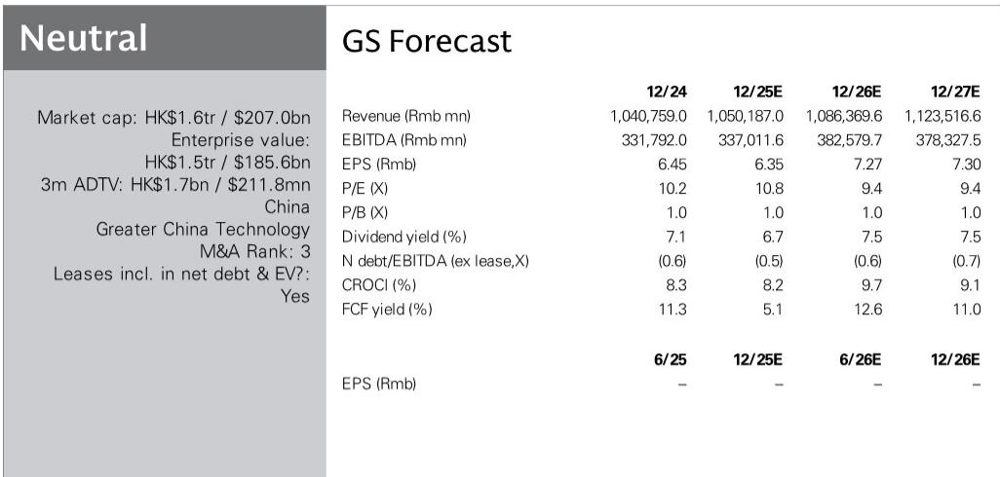

# GS：中国移动AI数据中心调研-AI提升效率，算力需求驱动增长

GS近期实地走访了中国移动位于香港的全球智算中心，并发布了一份调研纪要。这份报告的核心判断并非关于传统电信业务，而是指向一个正在加速的结构性变化：中国移动的AI数据中心（AIDC）业务，正在从概念走向实质性的收入贡献。2025年，其AIDC收入同比增长35%，而整体数据中心收入增速仅为9%。这一差距，揭示了运营商在AI基础设施浪潮中可能被低估的成长性。

## 1. 自建自营的智算中心，正在从“卖机柜”转向“卖算力服务”

GS参观的香港全球智算中心于2026年3月启用，是中国移动在香港的第二大数据中心。与许多运营商采用合作或租赁模式不同，该中心完全由公司自建自营。这意味着它提供的不仅仅是物理空间和电力，而是从算力、网络、供电、冷却到运维的一整套服务，直接服务于客户的大模型训练和推理工作负载。

报告特别指出，该中心的设计从一开始就考虑了长期可持续性，包括对算力需求增长、电力消耗和运营效率的预判。这种前瞻性设计，使得中国移动在服务AI客户时，能够提供比传统数据中心更适配的解决方案。这不再是简单的资源提供，而是深度参与客户的AI工作流。

> **KC观察：** 35%的AIDC收入增速与9%的整体数据中心增速之间的差距，是理解这份报告的关键。它说明AI相关需求正在从传统数据中心业务中独立出来，形成一条增速更快的细分赛道。中国移动在这条赛道上的自建自营能力，是其区别于其他运营商的核心优势。

## 2. “AI for AIDC”正在提升运营效率，但更大的故事是需求侧变化

报告提到，该智算中心自身也在使用AI技术来提升运营效率，包括智能调度、机器人和无人机自主巡检、数字孪生等。这可以被理解为“AI for AIDC”——用AI来管理AI基础设施。这有助于降低运营成本，但GS分析师显然更关注需求侧。

管理层在交流中明确表示，对AIDC业务前景保持乐观。驱动因素有两个：一是AI应用本身的持续发展，带来了对算力的强劲需求，无论是本地市场还是海外市场；二是中国移动在数据中心运营领域的领先市场地位，使其能够受益于这一上行周期。此外，其在中国内地以外的AIDC业务，也有望受益于中国企业的全球化扩张。

## 3. 一个可复用的观察框架：如何评估运营商在AI时代的价值

这份报告提供了一个简洁但有效的观察框架，用于评估类似中国移动这样的运营商在AI时代的价值。核心在于区分两类增长：

第一类是传统数据中心业务的自然增长，通常与云服务、企业IT支出挂钩，增速相对平稳。第二类是AIDC业务，直接服务于AI训练和推理，其增速与AI应用的渗透率、大模型的迭代节奏高度相关。中国移动2025年的数据清晰地展示了这两条曲线的分化。

对于决策者而言，判断运营商AI价值的关键，不再是看其拥有多少机柜，而是看其AIDC收入在整体数据中心收入中的占比，以及这一占比的变化趋势。当AIDC收入增速持续数倍于传统数据中心时，它就不再是边缘业务，而是可能重塑公司整体增长曲线的结构性力量。

For informational purposes only. Portions may be generated,translated,summarized,or edited with AI assistance based on source materials and may contain omissions or errors. Please verify independently. This is not investment,legal,tax,accounting,or other professional advice.

For informational purposes only. Portions may be generated,translated,summarized,or edited with AI assistance based on source materials and may contain omissions or errors. Please verify independently. This is not investment,legal,tax,accounting,or other professional advice.

