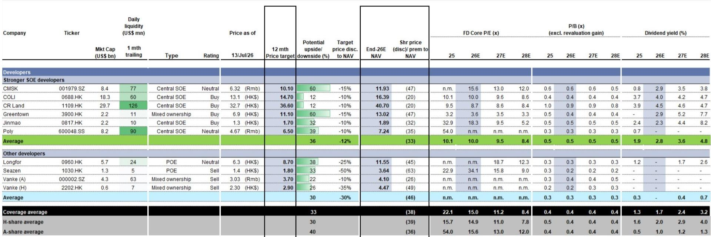
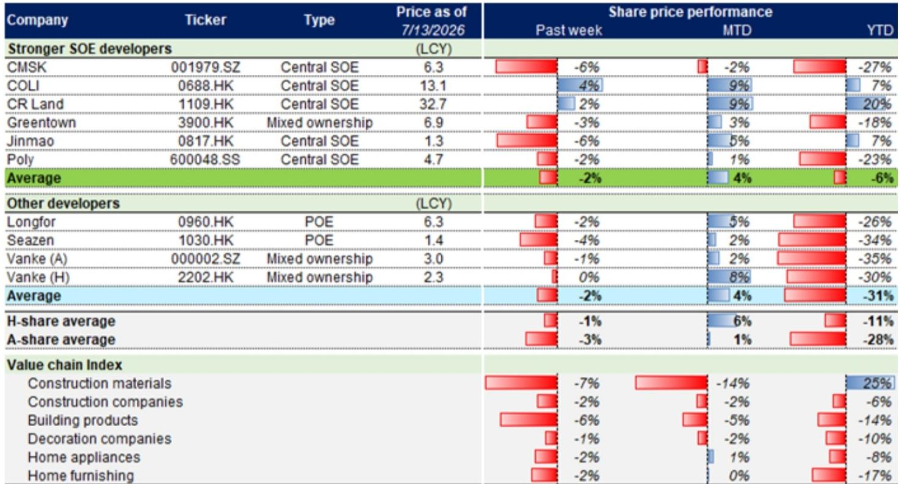
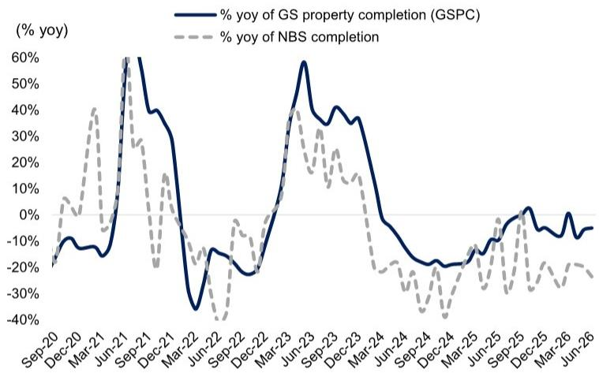

# 宏观环境观察周报：第28周——成交量环比变化，领先指标节奏调整

7月第三周，跟踪的约75城新房成交面积环比下降25%，同比也转为负6%。但截至7月第三周的月度累计数据，新房成交同比仍为正5%，二手房成交同比为正11%。这份周报的核心观察是：7月成交环比有所变化，但同比改善的趋势尚未中断，市场仍在消化6月冲量后的正常回落。

报告同时指出，近期发布的“十五五”扩大消费规划中，对房地产的表述出现了值得注意的调整。规划将“促进房地产市场平稳健康发展”纳入“增加居民财产性收入”的机制中，这与过去主要聚焦于稳定资金资产的提法有所不同。但3月“提振消费专项行动”中提及的用专项债支持收储存量房、房地产相关税费减免等短期支持措施，并未出现在本次规划中。

> **观察评论：** 规划层面的措辞变化，更多是长期制度框架的调整信号，而非短期政策加码。短期工具如专项债收储和税费减免的缺席，意味着政策节奏可能比市场此前预期的更平稳。

## 1. 二手房价格预期出现松动，领先指标同步变化

新房成交的环比变化并非孤立现象。跟踪的二手房带看量和认购量（领先网签1-2周）分别环比下降8%和6%。更值得关注的是，中介和卖方的价格预期均出现边际下调。这意味着，6月冲量后，市场情绪并未持续升温，买卖双方对价格的博弈重新变得谨慎。

新房端，虽然成交走弱，但新房搜索量环比持平，新增供应量环比下降9%，低于6月均值7%，也低于2025年7月水平18%。供应端的主动调整，在一定程度上缓解了库存不确定性。报告显示，20城库存环比微降0.4%，库存月数降至27.0个月，低于6月均值27.5个月。

## 2. 新开工与竣工仍在低位，但竣工降幅可能收窄

通过浮法玻璃供需模型推算的竣工跟踪指标显示，6月竣工面积同比降幅约为20%，与5月国家统计局及估算的高十位数降幅基本持平。该模型隐含的2026全年竣工面积同比降幅约为1%。

新开工方面，基于300城土地出让趋势和全国水泥出货率（周环比下降1.1个百分点至42%），预计6月新开工面积同比降幅为高二十位数，较5月国家统计局及估算的低二十位数降幅有所扩大。土地市场传导至新开工的链条仍在调整。

> **观察评论：** 竣工降幅收窄至个位数，意味着保交楼政策仍在产生实际效果。但新开工的持续大幅调整，将决定未来1-2年可售货源的规模，这是判断行业中期供给底部的关键变量。

## 3. 开发商估值处于历史低位，但分化依然显著

报告覆盖的央国企开发商报价周环比平均下跌2%，其中中国海外发展逆势上涨4%。其他开发商平均下跌2%。当前，覆盖的境外上市开发商平均交易价格较2026年末预期净资产价值折让39%，市净率0.4倍，已接近2008年下半年、2011年下半年和2014年上半年的周期底部水平。

但估值底部的参考意义需要结合企业个体差异来看。央国企与民营开发商的信用利差、拿地能力和销售韧性仍在拉大。报告覆盖的“更强央国企”组合与“其他开发商”组合在估值折让和财务指标上的差距，反映了市场对两类主体长期生存能力的定价分歧。

**这份周报提供的观察框架是：** 判断市场是否真正触底，不能只看月度同比数据的改善，更要关注二手房价格预期、新开工趋势和供应端调整这三个先行指标。7月的数据显示，环比变化是事实，但同比改善的基数效应和供应调整带来的库存消化，仍在为市场提供底部支撑。政策层面，长期制度框架的调整与短期工具的缺席并存，意味着市场修复将是一个更缓慢、更分化的过程。

For informational purposes only. Portions may be generated,translated,summarized,or edited with AI assistance based on source materials and may contain omissions or errors. Please verify independently. This is not investment,legal,tax,accounting,or other professional advice.

