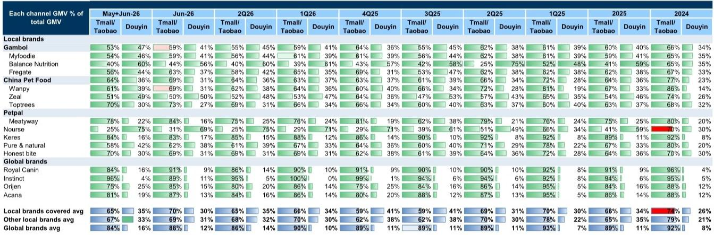
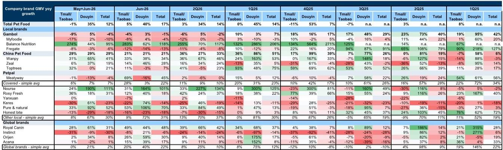
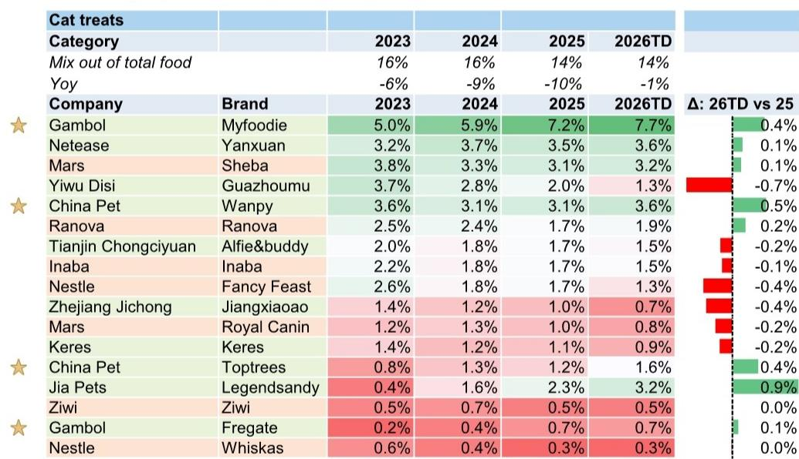

# GS：中国宠物食品月报-二季度销售仍在调整，格局分化加剧

618大促期间，宠物食品线上GMV同比增长12%，但这一增速几乎完全由抖音贡献——抖音增长35%，天猫淘宝反而下滑1%。GS最新月度追踪报告显示，这一结构性分化在二季度持续加深：抖音渠道GMV同比增长34%，天猫淘宝仅增3%。更值得关注的是，品牌之间的表现差距正在拉大，非上市本土品牌平均增长30%，而全球品牌仅增2%。这意味着，宠物食品市场的竞争逻辑正在从“渠道红利”转向“品牌运营能力”的较量。

## 1. 抖音撑起增长，但平台红利正在向头部集中

二季度宠物食品线上总GMV同比增长14%，与一季度持平，但内部结构已发生显著变化。抖音渠道贡献了绝大部分增量，其GMV增速从一季度的45%略降至34%，仍远高于天猫淘宝的3%。从618大促（5-6月合并）来看，抖音增长35%的拉动效应更为明显。

但抖音的红利并非均匀分布。报告数据显示，二季度抖音前十大品牌的GMV同比增长高达70%，而前300大品牌的增速约为40%。头部集中度在提升，新进入者获取流量的成本正在上升。同时，直播带货的销售占比也在提高，品牌在抖音上的运营重心正从短视频转向直播间和货架电商。

> **KC评论：** 抖音的增速仍然亮眼，但头部品牌增速远快于整体，说明平台流量分配机制正在向有内容能力和品牌力的玩家倾斜。对于中小品牌而言，抖音不再是“低门槛增量渠道”。

## 2. 本土品牌内部分化：上市公司承压，非上市品牌激进扩张

报告最核心的发现是本土品牌内部出现了显著分化。以5-6月合并数据看，非上市本土品牌（如Nourse、Rosy Fresh、Pure & Natural）平均GMV同比增长30%，而GS覆盖的上市公司品牌表现明显偏弱：Gambol下降4%，Myfoodie下降10%，Fregate下降6%。中国宠物食品（China Pet Food）整体增长29%，但旗下Wanpy增长41%，Zeal仅增19%，Toptrees增21%，内部同样分化。

这种分化背后是策略差异。非上市品牌在抖音上投入更激进，其抖音渠道GMV占比普遍高于上市公司品牌。例如Nourse的抖音占比高达75%，而Gambol为45%，Myfoodie为44%。上市公司品牌更依赖天猫淘宝，但该渠道整体增长仍在调整。

GS认为，这种分化可能持续。非上市品牌凭借更灵活的定价和营销策略，正在抢占市场份额；而上市公司品牌面临利润不确定性，在价格竞争和渠道投入上更为谨慎。

> **KC评论：** 非上市品牌的高增长是否可持续，取决于其盈利能力。报告没有给出这些品牌的利润数据，但高投入换增长的模式在宏观环境不确定性下可能难以长期维持。

## 3. 成本端不确定性未消，海外市场面临多重因素

尽管6月原材料成本环比下降1-3%，但PET和鸡肉价格仍比2025年均值高出31%和5%。同时，汇率变化可能给宠物食品代工企业带来汇兑影响。美国对中国宠物食品的进口需求在5月有所恢复（狗粮进口同比增长4%，猫粮增长50%），但整体仍处于低位。

GS在报告中指出，海外市场面临多重不确定性：关税分摊、汇兑影响和原材料成本高企。这些因素对代工业务占比高的企业影响更大。对于同时布局国内和海外市场的公司，国内市场的竞争正在影响利润，而海外市场的盈利改善尚需时日。

## 4. 食品安全讨论可能加速行业洗牌

报告提及近期社交媒体上关于猫粮安全问题的讨论。GS认为，虽然目前缺乏确凿证据，但这类讨论可能推动消费者对产品质量的关注提升，进而促使监管趋严。从历史经验看，食品安全事件往往加速行业集中度提升，具备品控能力和品牌信任度的企业可能受益。

这一判断与当前品牌分化的趋势形成呼应。在消费者对品质要求提高的背景下，单纯依靠渠道红利和价格竞争的模式可能面临更大挑战，而能够建立品牌信任和产品差异化的企业将获得结构性优势。

---

For informational purposes only. Portions may be generated,translated,summarized,or edited with AI assistance based on source materials and may contain omissions or errors. Please verify independently. This is not investment,legal,tax,accounting,or other professional advice.

For informational purposes only. Portions may be generated,translated,summarized,or edited with AI assistance based on source materials and may contain omissions or errors. Please verify independently. This is not investment,legal,tax,accounting,or other professional advice.

